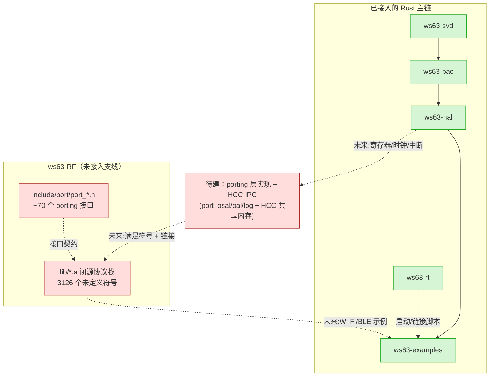

# ws63-RF 架构与评审

> 本文是 ws63-rs 架构文档的一部分。完整评审台账见 [架构评审 2026-05](../review/architecture-review-2026-05.md)，整改排期见 [ROADMAP](../../ROADMAP.md)。

## 职责与边界

`ws63-RF` 是 ws63-rs monorepo 的一个 git 子模块（`.gitmodules:10-12`，URL 指向独立仓库 `ws63-RF.git`），定位是**连接性（Wi-Fi/BT/BLE/SLE）的载体**。它负责两件事：

1. **重分发 vendor 闭源协议栈**——7 个从 HiSilicon WS63 SDK 抽取的预编译 RISC-V 静态库 `lib/*.a`（合计约 3.1 MB），包含完整的 Wi-Fi MAC 协议栈（HMAC + DMAC + RF 前端控制）与 BLE/SLE 主机协议栈（GAP/GATT/SMP/L2CAP、SLE/GLE）。
2. **提供 porting 接口契约**——`include/port/port_*.h` 共 8 个头文件，约 70 个 OS/IPC/缓冲管理抽象函数，外加 `include/api/`（公开 API 头）与 `include/internal/`（blob 内部依赖的类型头）。

它**不负责**：
- 不提供任何 Rust 绑定、链接胶水或可编译产物——目录中无 `.rs` / `build.rs` / `Cargo.toml` / bindgen（已 `find` 核实，0 结果）。
- **不是 Cargo workspace 成员**——根 `Cargo.toml` 的 `members` / `default-members` 与 `Cargo.lock` 均未引用 `ws63-RF`（已 grep 核实，0 结果）。因此当前它对 `cargo check --workspace` 完全不可见。
- 不实现 porting 层本身——`port_*.h` 只是接口声明，实现需由下游（最终的 ws63-rs 平台层）填充。
- 不提供链接脚本——`port_linker.h` 仅以 `extern` 声明 blob 期望的链接符号，实际的 `SECTIONS` / 内存区段需调用方在 linker script 中给出。

子模块内自带 `ARCHITECTURE.md`，其结论与本文一致：战略正确，但"尚无任何 Rust 绑定/链接，连接性交付为 0%"。

## 在依赖链中的位置

ws63-RF 游离于主依赖链（SVD → PAC → HAL → examples，rt 提供启动）之外，是一条**尚未接入的并行支线**：

- **上游**：blob 由 vendor SDK（`fbb_ws63`，参考实现位于其 `src/drivers/chips/ws63/porting/`）编译而来，本仓库只做重分发。
- **下游（目标）**：blob 暴露的 Wi-Fi/BLE 公开 API（`include/api/wifi/`、`include/api/bts/`）最终供 ws63-examples 中的连接性示例调用。但中间隔着两层尚不存在的桥：porting 层实现 + HCC IPC，以及 blob 链接本身。
- 架构上 WS63 是**单核 RISC-V**（一个自研应用核——核过 fbb_ws63：`ch2_system.md`「系统提供一个自研 RISC-V 处理器作为主控 CPU」、`platform_core.h` 标题 *Application Core*、`rom_config/` 仅 `acore`、全 SDK 无 `dcore`）。Wi-Fi 协议栈的 **HMAC（上层/host MAC）与 DMAC（下层/device MAC）是链接进同一应用镜像的软件库**（`libwifi_driver_hmac.a` / `libwifi_driver_dmac.a` 同在 `ws63-liteos-app/`），都跑在这一颗核上、驱动 Wi-Fi MAC/PHY 硬件。HCC 的 host/device-CPU 语义是 HiSilicon 跨产品线的**通用框架模型**——真正两颗 CPU 是「外接主控 MCU + WS63 模组」拓扑，**不是 WS63 片内有第二颗 RISC-V 核**。（更正：早期 README/本文曾写成「ACORE/DCORE 双核」，不准确。）

## 关键设计

### 三层产物：blob / 内部头 / porting 头
- **闭源 `.a`（`lib/`）**：`libwifi_driver_dmac.a`（629 KB，Wi-Fi device MAC + HAL + RF 前端）、`libwifi_rom_data.a`（3 KB）、`libbt_host.a`（1.1 MB，BLE host）、`libbt_app.a`、`libbth_gle.a`（821 KB，SLE/GLE）、`libbth_sdk.a`、`libbg_common.a`。README 的"Library Catalog"表与磁盘实际大小逐项吻合（`ls -la lib/` 核实）。
- **internal 头（`include/internal/`）**：blob 内部代码依赖的类型/消息定义（`osal_types.h`、`frw_msg_rom.h`、`wlan_msg.h`、`hcc_*.h` 等），porting 头里的不透明结构（如 `struct frw_msg`）正是在此定义。
- **porting 头（`include/port/`）**：调用方必须实现的 8 组接口（每个文件均以 `port_*.h` 命名）。

### porting 接口分解（README 的 "Dependencies Count" 表，与头文件逐一核对）
| 头文件 | 函数数 | 职责（file 证据） |
|---|---|---|
| `port_osal.h` | 24 | OS 抽象：中断 `osal_irq_*`、线程 `osal_kthread_*`、内存 `osal_kmalloc/kfree`、等待 `osal_wait_*`、`osal_udelay`、`osal_flush_cache`、`osal_printk`（`port_osal.h:44-160`） |
| `port_frw.h` | 15 | Wi-Fi 消息分发框架 + 定时器：`frw_main_init`、`frw_fetch_msg_node`、`frw_send_msg_to_device`、`frw_task_thread`、`frw_dmac_timer_*`（`port_frw.h:28-99`） |
| `port_wlan.h` | 11 | 共享内存 ring buffer + RF 时钟：`wlan_open/close_wifi_abb_rf_clk`、`wlan_msg_h2d_*`、`oal_ring_write/read`（`port_wlan.h:25-110`） |
| `port_hcc.h` | 6 | HCC IPC 传输：`hcc_dmac_config_bus_ini`、`hcc_dmac_service_adapt_start`、`hcc_wifi_msg_register/send`（`port_hcc.h:35-77`） |
| `port_oal.h` | 7 | 48 KB Wi-Fi packet 缓冲池：`oal_memory_init`、`oal_mem_rsv`、`oal_get_netbuf_pool_len`（`port_oal.h:39-79`） |
| `port_uapi.h` | 3 | 平台服务：`uapi_nv_read`（RF 校准/MAC）、`uapi_tsensor_get_current_temp`（热保护退避）、`uapi_systick_get_ms`（`port_uapi.h:30-72`） |
| `port_log.h` | 7 | 日志 + 安全 C 库：`log_event_wifi_print0/1/2/4`、`memset_s/memcpy_s/snprintf_s`（`port_log.h:30-50`） |
| `port_linker.h` | 20+ 符号 | 链接符号声明：`__wifi_pkt_ram_begin__/end__`、TCM/SRAM 区段、`__divdi3/__udivdi3`（`port_linker.h:38-77`） |

合计约 70 个外部符号——README 的 "Key insight"（"所有硬件寄存器访问 hal_*/fe_hal_*/hh503_* 自包含于 `libwifi_driver_dmac.a`，~70 个外部符号都是标准 OS 抽象/IPC/缓冲管理"）方向正确。

### HCC 共享内存 IPC（连接性的核心机制）
`port_hcc.h:8-22`：HCC 是 host（HMAC/BLE host）与 device（DMAC/BT controller）之间的传输抽象，是 HiSilicon 跨产品线的通用模型。**两种拓扑要分清**：(a) WS63 作为模组接在外部主控 MCU 后面时，host=外部 MCU、device=WS63，走 SDIO/SPI bus driver——这才是「两颗 CPU」；(b) WS63 独立运行（ws63-rs 的场景），HMAC 与 DMAC 都在这一颗应用核上，HCC 退化为片内软件层间 + 到 Wi-Fi MAC 硬件的消息通路，**没有第二颗核**。`port_wlan.h` 的 `oal_ring_ctrl`（`port_wlan.h:78-84`，带 `read_idx_addr`/`write_idx_addr`/`ring_depth`）是该 HCC 传输的无锁环形缓冲控制块。

### 与参考实现的关系
porting 层的语义对标 vendor SDK `fbb_ws63/src/drivers/chips/ws63/porting/`（README "References" 明确指向）。这与本仓库其余部分对标 esp-hal 的取向不同——RF 连接性不重写协议栈，而是复用 blob + 移植 OS/IPC 抽象，这一战略判断是正确的（数千行 MAC/BLE 状态机用 Rust 重写既无必要也不现实）。

## 评审发现

### 优点
- **战略方向正确**：复用经过现场验证的闭源协议栈、只移植 ~70 个 OS/IPC 抽象函数，而非用 Rust 重写 Wi-Fi MAC / BLE host，是务实且正确的判断。
- **依赖面识别准确**：README 准确指出"硬件寄存器访问自包含于 blob，外部符号都是 OS 抽象 / IPC / 缓冲管理"，并准确量化为约 70 个 porting 函数。（注：README 同时把 HMAC/DMAC 描述为「ACORE/DCORE 双核」——此点不准确，WS63 单核，见「在依赖链中的位置」；但「依赖面 = OS/IPC/缓冲抽象」这一核心判断方向正确。）
- **接口文档化完整**：8 个 `port_*.h` 每个函数都有 doc 注释、返回语义与移植难度评级，`port_linker.h` 给出了内存布局与区段符号清单，为后续移植提供了清晰契约。
- **文档与代码一致**：README 的库目录表、依赖计数表与磁盘实际 `.a` 大小、头文件函数数逐项吻合，无夸大。

### 问题
| 严重度 | 类别 | 问题 | 证据(file:line) | 状态 |
|---|---|---|---|---|
| 严重 | 方向 | 纯 blob + C 头，无任何 `.rs`/`build.rs`/`Cargo.toml`/bindgen/链接配置；不是 Cargo workspace 成员，`cargo check --workspace` 完全看不到本组件——连接性交付 0% | `find ws63-RF -name '*.rs' -o -name build.rs -o -name Cargo.toml` 返回空；`Cargo.toml`/`Cargo.lock` grep `ws63-RF` 返回空 | 已排期(ROADMAP 阶段 3-5) |
| 高 | 方向 | porting 层完全未实现：`port_log`/`osal`/`oal` + HCC IPC（连通 Wi-Fi/BT device-MAC）无一行实现，这是到产品最大、最高风险的缺口 | `include/port/port_osal.h:44-160`、`port_hcc.h:35-77`、`port_oal.h:39-79`、`port_log.h:30-50`（均为纯声明，仓库内无实现单元） | 已排期(ROADMAP 阶段 4) |
| 高 | 链接 | blob 的数千未定义符号无一被满足：全 7 个库合计 **3126 个唯一未定义符号**（`libwifi_driver_dmac.a` 1421、`libbt_host.a` 2042、`libbth_gle.a` 1438 …），且其中 `frw_*`/`osal_*`/`hcc_*`/`oal_*` 等正对应 porting 头 | `nm lib/*.a \| grep '^\s*U' \| sort -u \| wc -l` = 3126；样本含 `frw_main_init`、`frw_send_msg_to_device`、`frw_dmac_timer_init` 等 | 已排期(ROADMAP 阶段 3) |
| 高 | 工具链 | 链接 blob 需要带原子/浮点的目标（ilp32f rv32imfc）；本轮默认 target 已切到无原子 `riscv32imc`，blob 链接所需的自定义 JSON 目标已保留但尚未启用 | 根 `.cargo/config.toml` 默认 target + 保留的 ilp32f JSON（本轮工具链修复说明） | 已排期(ROADMAP 阶段 3) |
| 中 | 集成 | `port_linker.h` 仅声明 `extern` 符号（48 KB packet RAM、TCM/SRAM 区段），实际 `SECTIONS` 未提供，且与 ws63-rt 的 `layout.ld`/`memory.x` 尚无任何衔接 | `port_linker.h:38-77`（只有 `extern uint8_t __*__;`，无 linker script） | 已排期(ROADMAP 阶段 3) |

## 改进项与排期

本组件是 ws63-rs 通往"可用产品"的最大缺口，集中在 ROADMAP 后段，且依赖前置阶段先打通构建/链接基础：

- **阶段 0（本轮已完成）**：消除双 PAC、修复 ISA（无原子 `riscv32imc` + critical-section polyfill）、保留 ilp32f rv32imfc 自定义 JSON 供 phase 3 链接 blob 时启用。这些为后续链接 blob 扫清了工具链层面的前置障碍，但本组件自身尚无任何实现进展。
- **阶段 3（链接 blob 尖刺）**：启用 ilp32f 自定义 target；编写 `build.rs` / 链接参数把 `lib/*.a` 喂给链接器；提供满足 `port_linker.h` 的链接脚本（与 ws63-rt 的 `layout.ld`/`memory.x` 衔接），先验证 3126 个未定义符号能否在打桩后收敛。
- **阶段 4（porting + HCC）**：用 Rust（或最小 C 胶水）实现 `port_osal`/`port_oal`/`port_log`/`port_uapi`/`port_frw`/`port_wlan` 约 70 个函数，并实现 HCC IPC，打通到 Wi-Fi/BT device-MAC 的 host↔device 通路（WS63 单核上为片内层间消息 + MAC 硬件）——这是风险最高、工作量最大的一步。
- **阶段 5（连接性示例）**：在 ws63-examples 中给出 Wi-Fi STA 连接 / BLE 广播的端到端示例，按 README "Step 4" 的初始化序列驱动 blob 公开 API。
- **阶段 6（async）**：在连接性可用后，考虑 Embassy/RTIC 异步集成。

详见 [ROADMAP](../../ROADMAP.md) 阶段 3-5 条目。
