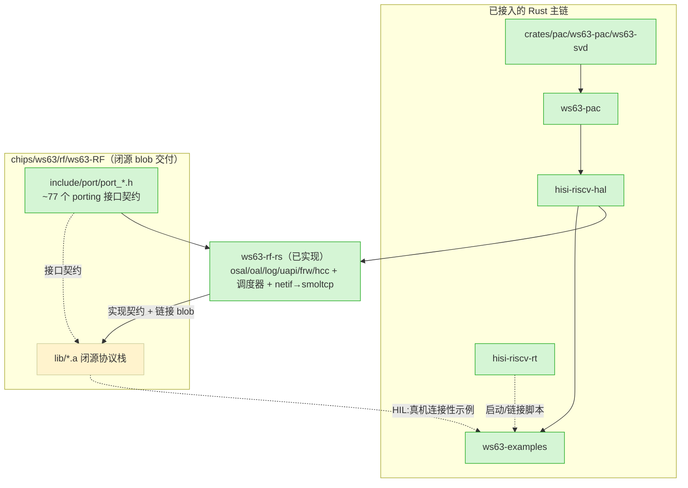

# ws63-RF 架构与评审

> 本文是 ws63-rs 架构文档的一部分。完整评审台账见 [架构评审 2026-05](../review/architecture-review-2026-05.md)，整改排期见 [ROADMAP](../../ROADMAP.md)。

## 职责与边界

`ws63-RF` 是 ws63-rs monorepo 的一个 git 子模块（`.gitmodules:10-12`，URL 指向独立仓库 `ws63-RF.git`），定位是**连接性（Wi-Fi/BT/BLE/SLE）的载体**。它负责两件事：

1. **重分发 vendor 闭源协议栈**——7 个从 HiSilicon WS63 SDK 抽取的预编译 RISC-V 静态库 `lib/*.a`（合计约 3.1 MB），包含完整的 Wi-Fi MAC 协议栈（HMAC + DMAC + RF 前端控制）与 BLE/SLE 主机协议栈（GAP/GATT/SMP/L2CAP、SLE/GLE）。
2. **提供 porting 接口契约**——`include/port/port_*.h` 共 8 个头文件，约 70 个 OS/IPC/缓冲管理抽象函数，外加 `include/api/`（公开 API 头）与 `include/internal/`（blob 内部依赖的类型头）。

它**不负责**：
- 不提供任何 Rust 绑定、链接胶水或可编译产物——目录中无 `.rs` / `build.rs` / `Cargo.toml` / bindgen（已 `find` 核实，0 结果）。
- **不是 Cargo workspace 成员**——根 `Cargo.toml` 的 `members` / `default-members` 与 `Cargo.lock` 均未引用 `ws63-RF`（已 grep 核实，0 结果）。因此当前它对 `cargo check --workspace` 完全不可见。
- 不实现 porting 层本身——`port_*.h` 只是接口声明，实现由下游 in-tree crate **`ws63-rf-rs`** 填充，**现已实现**（见下）。
- 不提供链接脚本——`port_linker.h` 仅以 `extern` 声明 blob 期望的链接符号，实际的 `SECTIONS` / 内存区段需调用方在 linker script 中给出。

子模块内自带 `ARCHITECTURE.md`。注意其"连接性 0% / 尚无 Rust 绑定"的旧结论**已过时**：in-tree crate **`ws63-rf-rs` 现已实现 porting 契约**（osal/oal/log/uapi/frw/hcc + 协作调度器 + 软件计时器 + netif→smoltcp 桥），且 **Wi-Fi-init 的符号闭合已达成**（whole-archive 0 重复符号，`--gc-sections` rooted at `uapi_wifi_init` 残留仅 2 个 `__wifi_pkt_ram_*` defsym）。剩余是真机 bring-up（掩膜 ROM 地址只在硅片上可执行 + 厂商自定义重定位）。

## 在依赖链中的位置

ws63-RF（blob）经 in-tree crate **`ws63-rf-rs`** 接入主链 —— rf-rs 实现 porting 契约、把 blob 链进镜像：

- **上游**：blob 由 vendor SDK（`fbb_ws63`，参考实现在 `src/drivers/chips/ws63/porting/`）编译而来，本仓库只做重分发。
- **下游**：blob 的 Wi-Fi/BLE 公开 API 最终供连接性示例调用。中间两层桥**已实现**（`ws63-rf-rs` 的 porting + FRW/HCC 数据路径）；真正剩下的是真机 HIL（ROM 地址 + 自定义重定位只在硅片上成立）。
- 架构上 WS63 是**单核 RISC-V**（一个自研应用核——核过 fbb_ws63：`ch2_system.md`「系统提供一个自研 RISC-V 处理器作为主控 CPU」、`platform_core.h` 标题 *Application Core*、`rom_config/` 仅 `acore`、全 SDK 无 `dcore`）。Wi-Fi 协议栈的 **HMAC（上层/host MAC）与 DMAC（下层/device MAC）是链接进同一应用镜像的软件库**（`libwifi_driver_hmac.a` / `libwifi_driver_dmac.a` 同在 `ws63-liteos-app/`），都跑在这一颗核上、驱动 Wi-Fi MAC/PHY 硬件。HCC 的 host/device-CPU 语义是 HiSilicon 跨产品线的**通用框架模型**——真正两颗 CPU 是「外接主控 MCU + WS63 模组」拓扑，**不是 WS63 片内有第二颗 RISC-V 核**。（更正：早期 README/本文曾写成「ACORE/DCORE 双核」，不准确。）

## 关键设计

### 三层产物：blob / 内部头 / porting 头
- **闭源 `.a`（`lib/`）**：`libwifi_driver_dmac.a`（629 KB，Wi-Fi device MAC + HAL + RF 前端）、`libwifi_rom_data.a`（3 KB）、`libbt_host.a`（1.1 MB，BLE host）、`libbt_app.a`、`libbth_gle.a`（821 KB，SLE/GLE）、`libbth_sdk.a`、`libbg_common.a`。README 的"Library Catalog"表与磁盘实际大小逐项吻合（`ls -la lib/` 核实）。
- **internal 头（`include/internal/`）**：blob 内部代码依赖的类型/消息定义（`osal_types.h`、`frw_msg_rom.h`、`wlan_msg.h`、`hcc_*.h` 等），porting 头里的不透明结构（如 `struct frw_msg`）正是在此定义。
- **porting 头（`include/port/`）**：调用方必须实现的 8 组接口（每个文件均以 `port_*.h` 命名）。

### porting 接口分解（README 的 "Dependencies Count" 表，与头文件逐一核对）
| 头文件 | 函数数 | 职责（file 证据） |
|---|---|---|
| `port_osal.h` | 24 | OS 抽象：中断 `osal_irq_*`、线程 `osal_kthread_*`、内存 `osal_kmalloc/kfree`、等待 `osal_wait_*`、`osal_udelay`、`osal_flush_cache`、`osal_printk`（`port_osal.h:44-160`） |
| `port_frw.h` | 15 | Wi-Fi 消息分发框架 + 定时器：`frw_main_init`、`frw_fetch_msg_node`、`frw_send_msg_to_device`、`frw_task_thread`、`frw_dmac_timer_*`（`port_frw.h:28-99`） |
| `port_wlan.h` | 11 | 共享内存 ring buffer + RF 时钟：`wlan_open/close_wifi_abb_rf_clk`、`wlan_msg_h2d_*`、`oal_ring_write/read`（`port_wlan.h:25-110`） |
| `port_hcc.h` | 6 | HCC IPC 传输：`hcc_dmac_config_bus_ini`、`hcc_dmac_service_adapt_start`、`hcc_wifi_msg_register/send`（`port_hcc.h:35-77`） |
| `port_oal.h` | 7 | 48 KB Wi-Fi packet 缓冲池：`oal_memory_init`、`oal_mem_rsv`、`oal_get_netbuf_pool_len`（`port_oal.h:39-79`） |
| `port_uapi.h` | 3 | 平台服务：`uapi_nv_read`（RF 校准/MAC）、`uapi_tsensor_get_current_temp`（热保护退避）、`uapi_systick_get_ms`（`port_uapi.h:30-72`） |
| `port_log.h` | 7 | 日志 + 安全 C 库：`log_event_wifi_print0/1/2/4`、`memset_s/memcpy_s/snprintf_s`（`port_log.h:30-50`） |
| `port_linker.h` | 20+ 符号 | 链接符号声明：`__wifi_pkt_ram_begin__/end__`、TCM/SRAM 区段、`__divdi3/__udivdi3`（`port_linker.h:38-77`） |

合计约 70 个外部符号——README 的 "Key insight"（"所有硬件寄存器访问 hal_*/fe_hal_*/hh503_* 自包含于 `libwifi_driver_dmac.a`，~70 个外部符号都是标准 OS 抽象/IPC/缓冲管理"）方向正确。

### HCC 共享内存 IPC（连接性的核心机制）
`port_hcc.h:8-22`：HCC 是 host（HMAC/BLE host）与 device（DMAC/BT controller）之间的传输抽象，是 HiSilicon 跨产品线的通用模型。**两种拓扑要分清**：(a) WS63 作为模组接在外部主控 MCU 后面时，host=外部 MCU、device=WS63，走 SDIO/SPI bus driver——这才是「两颗 CPU」；(b) WS63 独立运行（ws63-rs 的场景），HMAC 与 DMAC 都在这一颗应用核上，HCC 退化为片内软件层间 + 到 Wi-Fi MAC 硬件的消息通路，**没有第二颗核**。`port_wlan.h` 的 `oal_ring_ctrl`（`port_wlan.h:78-84`，带 `read_idx_addr`/`write_idx_addr`/`ring_depth`）是该 HCC 传输的无锁环形缓冲控制块。

### 与参考实现的关系
porting 层的语义对标 vendor SDK `fbb_ws63/src/drivers/chips/ws63/porting/`（README "References" 明确指向）。这与本仓库其余部分对标 esp-hal 的取向不同——RF 连接性不重写协议栈，而是复用 blob + 移植 OS/IPC 抽象，这一战略判断是正确的（数千行 MAC/BLE 状态机用 Rust 重写既无必要也不现实）。

## 评审发现

### 优点
- **战略方向正确**：复用经过现场验证的闭源协议栈、只移植 ~70 个 OS/IPC 抽象函数，而非用 Rust 重写 Wi-Fi MAC / BLE host，是务实且正确的判断。
- **依赖面识别准确**：README 准确指出"硬件寄存器访问自包含于 blob，外部符号都是 OS 抽象 / IPC / 缓冲管理"，并准确量化为约 70 个 porting 函数。（注：README 同时把 HMAC/DMAC 描述为「ACORE/DCORE 双核」——此点不准确，WS63 单核，见「在依赖链中的位置」；但「依赖面 = OS/IPC/缓冲抽象」这一核心判断方向正确。）
- **接口文档化完整**：8 个 `port_*.h` 每个函数都有 doc 注释、返回语义与移植难度评级，`port_linker.h` 给出了内存布局与区段符号清单，为后续移植提供了清晰契约。
- **文档与代码一致**：README 的库目录表、依赖计数表与磁盘实际 `.a` 大小、头文件函数数逐项吻合，无夸大。

### 问题
| 严重度 | 类别 | 问题 | 证据(file:line) | 状态 |
|---|---|---|---|---|
| 严重 | 方向 | （曾）纯 blob + C 头，无 Rust/链接配置，连接性 0% | — | ✅ 已修：in-tree crate **`ws63-rf-rs`** 提供完整 Rust porting + `build.rs` + 链接搜索；blob 经它链入镜像（`wifi_blob_link`/`rf_port_demo` 在 ws63-qemu 验证） |
| 高 | 方向 | （曾）porting 层完全未实现：`osal`/`oal`/`log`/HCC 无一行实现 | `chips/ws63/rf/src/*` | ✅ 已实现：`osal_adapt_*`(33 符号) + `oal`/`log`/`uapi` + 协作调度器 + FRW 工作线程 + HCC 传输 + 软件计时器 + netif→smoltcp 桥；`frw_hcc_selftest`/`sched_selftest`/`netif_smoltcp_selftest` 自测通过 |
| 高 | 链接 | （曾）blob 数千未定义符号无一被满足 | `mac-link-residual.sh` | ✅ **Wi-Fi-init 符号闭合达成**：whole-archive 0 重复符号；`--gc-sections` rooted at `uapi_wifi_init` 残留仅 **2** 个（`__wifi_pkt_ram_begin__/end__` defsym）。早先"~3126/~96 missing"是 whole-archive 上界，被 off-path BT/alt-OS 代码主导（可达路径 0 BT 符号） |
| 高 | 工具链 | 链接 blob 需 ilp32f rv32imfc 目标 | `.cargo/config.toml` | ✅ 已就位：默认 target **就是** builtin 的 `riscv32imfc-unknown-none-elf`（硬浮点 ilp32f），原子由 portable-atomic critical-section 垫片提供（之前文档误写 imc） |
| 中 | 集成 | `port_linker.h` 的 `extern` 符号与 hisi-riscv-rt 链接脚本的衔接 | `hisi-riscv-rt`/`ws63-rf-rs` | 🟡 hisi-riscv-rt 提供 `__wifi_pkt_ram_*` 的 scaffold `--defsym`；真机前需把 netif pbuf 布局 pin 到 WiFi 构建的 `lwipopts.h`、TX sink 指向 blob 真实发送符号（见 ws63-rf-rs README）|

## 改进项与排期

本组件是 ws63-rs 通往"可用产品"的最大缺口。多数前置已完成，现状如下：

- **阶段 0（已完成）**：消除双 PAC；默认 target = builtin **`riscv32imfc`**（硬浮点 ilp32f，blob 所需）+ critical-section polyfill。工具链前置已清。
- **阶段 3（链接 blob 尖刺）** ✅ 已完成：`chips/ws63/rf/build.rs` + 链接搜索把 `lib/*.a` 喂给链接器；hisi-riscv-rt 提供 `__wifi_pkt_ram_*` defsym；**Wi-Fi-init 符号闭合达成**（残留 2）。`wifi_blob_link`/`rf_port_demo` 验证。
- **阶段 4（porting + HCC）** ✅ 大部已实现：`osal_adapt_*`(33) + `oal`/`log`/`uapi` + 协作调度器 + FRW 工作线程 + HCC 传输 + 软件计时器 + netif→smoltcp 桥，均在 ws63-qemu 自测。剩余是把 pbuf 布局/TX sink pin 到真实 blob + 真机执行。
- **阶段 5（连接性示例）** 🔴 待真机：ROM 地址 + 厂商自定义重定位只在硅片上成立，故是 HIL（硬件在环）；QEMU 无法跑真 Wi-Fi 链路。
- **阶段 6（async）** ✅ 通用异步已就绪：hisi-riscv-hal 的 `async`/`embassy`（见 [async-embassy.md](async-embassy.md)）已实现并验证；连接性专属的异步包装待 blob 上板后再做。

详见 [ROADMAP](../../ROADMAP.md)。

## 注记：BS2X 多芯片支持（BS21/BS22/BS20）

WS63-RF 中的 blob + porting 层当前**专为 WS63 设计**（所有路径、符号、校准数据指向 WS63 HMAC/DMAC/RF 前端）。BS2X 系列（BS21/BS22/BS20 统称为 BS2X，含不同内核配置与外设集的变体）有**独立的 blob** (`bs2x-pac` + `chips/bs2x/` 目录结构)。

- **WS63 blob**：`chips/ws63/rf/ws63-RF/lib/libwifi_driver_dmac.a` 等 7 个库，Wi-Fi MAC/RF/BLE/SLE 完整堆栈。
- **BS2X blob**：QEMU `-M bs21/bs22/bs20` 及其上的 vendor LiteOS 栈（部分由 hisi-riscv-qemu 虚拟）。QEMU 侧已验证 SPI/GADC/I2C/KEYSCAN/QDEC/RTC/TRNG/WDT/DMA/PDM audio/USB enumeration 的完整功能外设覆盖；真机 BS2X 连接性与 WS63 路线并行，后续由 BS2X 团队跟进。
- **hisi-riscv-hal 多芯片**：`Cargo.toml` 有 `chip-ws63`（default）与 `chip-bs21` feature，运行时可选；porting 层（ws63-rf-rs）当前绑 WS63，BS2X 连接性交付另行规划。

详见 [ROADMAP 阶段 3-5](../../ROADMAP.md)（WS63 北极星）与 [overview.md](overview.md)。
