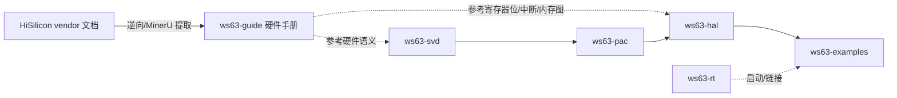

# ws63-guide 架构与评审

> 本文是 ws63-rs 架构文档的一部分。完整评审台账见 [架构评审 2026-05](../review/architecture-review-2026-05.md)，整改排期见 [ROADMAP](../../ROADMAP.md)。

## 职责与边界

`ws63-guide` 是 WS63 系列 SoC（Wi-Fi 6 / BLE / SLE 星闪 Combo 芯片）的**中文硬件手册**，使用 Sphinx + MyST 构建，逆向自 vendor（HiSilicon）文档。它以子模块形式挂在 ws63-rs monorepo 下。

**负责：**

- 用人类可读的中文描述芯片的硬件行为：系统/复位/时钟/低功耗、存储器地址空间映射、中断系统、QSPI（SFC）控制器、Wi-Fi/BLE/SLE 的 RF/ABB/PHY/MAC、安全子系统、外设寄存器（GPIO/UART/I2C/SPI/PWM/DMA/IOMUX/ADC/TSENSOR/I2S）、JTAG。
- 提供逆向得到的内存图、中断编号表、寄存器位描述等"原始 IP"，供 PAC/HAL 开发时核对硬件语义。
- 产出 HTML（GitHub Pages）与 PDF 两种交付物。

**不负责：**

- 不描述 Rust 代码架构。代码侧的设计与评审由 `docs/`（本架构文档体系）承担。
- 不参与 Cargo workspace 构建，不是 crate；它是独立的 Python/Sphinx 项目（`pyproject.toml` 中 `package = false`），有自己的 `uv.lock` 与 `.github/workflows/docs.yml`。

**关键边界判断**：本手册与 `docs/` **互补而非重复**——本手册讲**硬件**（寄存器、电气、协议层硬件块），`docs/` 讲 **Rust 代码架构**（crate 职责、依赖链、设计模式、评审）。两者受众不同、构建链不同，内容零重叠。

## 在依赖链中的位置

ws63-guide 不在 Rust crate 编译依赖链（SVD → PAC → HAL → examples，rt 提供启动）之内，而是横向的**知识来源**：

文字版：vendor 文档经逆向（手册自述基于 MinerU 提取的 Markdown 重建，见 `ws63-guide/index.rst:20-22`）形成本手册；本手册的内存图、中断表、寄存器描述是 SVD/PAC/HAL 实现的事实依据，但二者无编译期耦合，独立演进。

## 关键设计

- **独立 Sphinx + MyST 工程，配置不在仓库根**。Sphinx 配置位于 `ws63-guide/source/conf.py`，因此所有构建命令都需 `-c source` 标志（`ws63-guide/CLAUDE.md:30`，`ws63-guide/README.md:28`）。根目录另有一份 `ws63-guide/index.rst` 与 `ws63-guide/source/index.rst` 两个 toctree 入口（`root_doc = 'index'`，`conf.py:46`）。
- **9 章 + 附录的 toctree**。`source/index.rst:4-16` 定义章节顺序：preface、ch1_overview、ch2_system、ch3_qspi、ch4_wifi、ch5_security、ch6_peripherals、ch7_jtag、appendix。其中 ch3/ch4/ch6 是子目录（含各自 `index.md`），如 `ch4_wifi/{rf,abb,phy,mac,ble_sle,radar}.md`、`ch6_peripherals/{gpio,uart,i2c,spi,pwm,dma,iomux,adc,tsensor,i2s,qspi}.md`。
- **MyST 扩展与中文渲染**。`conf.py:23-38` 启用 `colon_fence`/`deflist`/`html_image`/`dollarmath`/`substitution`/`replacements`/`smartquotes`，并把 `mermaid`/`list-table`/`figure`/`danger` 等当作 directive 处理。主题为 `sphinx_book_theme`（`conf.py:55`，注意 README.md:118 仍写的是 sphinx-rtd-theme，已过时）；语言 `zh_CN`。
- **PDF 中文支持靠 xeCJK**。`conf.py:97-100` 用 `xeCJK` + `Droid Sans Fallback` 渲染中文，CI 安装完整 TeX Live（`ws63-guide/CLAUDE.md:32`）。`numfig` 中文编号格式见 `conf.py:158-165`（图 %s / 表 %s）。
- **构建后拷贝 Markdown 源**。`conf.py:179-194` 注册 `build-finished` 钩子，把 `source/**/*.md` 原样复制到 HTML 输出目录，便于 AI/爬虫访问原始 Markdown。
- **有价值的逆向 IP（与参考实现的关系）**：
  - **存储器地址空间映射**：`source/ch2_system.md:162` "表2-4 存储器地址空间映射"，逐段列出 `0x0010_0000`–`0x4000_3FFF` 等区间，是 ws63-rt 链接脚本/ws63-svd 基址的事实依据。
  - **中断系统模型**：`source/ch2_system.md:328-424` 描述真实硅片的中断模型——支持向量/直接模式、优先级配置寄存器共 3bit 可配 7 级（`ch2_system.md:332`）、1 个 nmi + 64 个非标准外部中断（`ch2_system.md:152`），并给出"表2-5 非标准中断编号列表"（Timer/RTC/I2C/GPIO 组合中断/SPI/WLAN PHY&MAC/BLE/SLE/TSENSOR 等，`ch2_system.md:339-424`）。**这正是 HAL 中断子系统建模错误（误用 PLIC，应为 LOCIPRI/LOCIEN）的正确参照系**。
  - **RF/ABB 逆向**：`source/ch4_wifi/rf.md` 描述 2.4G RX/TX/PLL、校准（RX DC、TX LO Leakage、TX Power、TRX IQ）等，对 undocumented 的 RF blob 极有价值。
  - **安全子系统寄存器**：`source/ch5_security.md` 描述对称（AES/SM4，ECB/CBC/CTR/CCM/GCM 等模式）、HASH（SHA1/SHA2/SM3）、PBKDF2、非对称、RNG 模块。
  - **QSPI/SFC**：`source/ch3_qspi/registers.md`（约 21KB）逆向了 SFC 寄存器，配 `images/fig-3-*` 读写时序流程图。
- **图片资产**：`source/images/` 共 18 张 JPEG（芯片框图、典型应用、SFC 框图与读写流程、RF/ABB 框图、UART 数据格式、I2C 收发时序、危险/提示图标）。

## 评审发现

### 优点

- **独特的逆向 IP**：RF/外设/安全寄存器描述、存储器地址映射、中断编号表，对一颗 undocumented 的芯片极具价值，是 PAC/HAL 核对硬件语义的权威中文参照（如中断模型、内存图）。
- **与代码文档清晰分工**：硬件手册（本组件）与 Rust 架构文档（`docs/`）受众不同、内容零重叠，互补关系明确（见 `ws63-guide/ARCHITECTURE.md:5-7`）。
- **工程化完善**：`uv.lock` 锁定依赖、`-c source` 配置隔离、HTML/PDF/linkcheck 三类构建、构建后拷贝 Markdown 源供机器读取，自带 CI/CD。
- **覆盖完整**：9 章 + 附录覆盖系统/QSPI/Wi-Fi&BLE&SLE/安全/外设/JTAG，子目录拆分粒度合理。

### 问题

| 严重度 | 类别 | 问题 | 证据(file:line) | 状态 |
|--------|------|------|-----------------|------|
| 低 | 方向 | 与 Rust 代码架构文档（`docs/`）零重叠、受众不同；独立 Sphinx 构建链与 workspace 分离，维护面双倍 | `ws63-guide/source/conf.py:30`(`-c source`)、`ws63-guide/pyproject.toml`(独立工程)、`ws63-guide/ARCHITECTURE.md:5-7` | 暂不修（这是互补关系而非缺陷，刻意分离） |
| 低（方向） | 范围 | 手册应**冻结扩张、聚焦连接性**：当前价值已确立，继续扩章节会分散到连接性里程碑的精力 | `ROADMAP.md:138`(CI/文档/SVD 持续扩张冻结)、`ROADMAP.md:140`(保留 ws63-guide 独特逆向 IP 但停止扩张) | 已排期（ROADMAP "冻结/降优先级"：保留、停止扩张） |
| 低 | 文档一致性 | README 技术栈列 `sphinx-rtd-theme`，实际 `conf.py` 用 `sphinx_book_theme`，记述过时 | `ws63-guide/README.md:118` vs `ws63-guide/source/conf.py:55` | 暂不修（不影响构建，留作小修；非本轮整改范围） |

说明：本组件无被驳回项，评审要点已对照 fbb_ws63 / esp-hal 与 file:line 验证。手册内容本身（中断模型、内存图、寄存器位）经核实与真实硅片一致，恰好是 HAL 侧若干正确性问题（中断 PLIC 误建模等）的纠偏依据。

## 改进项与排期

本组件**无本轮（阶段 0）整改项**——阶段 0 的构建完整性修复（双 PAC 消除、默认 target ISA 改 `riscv32imc`、flashboot 实验化、CI/release 修复、ws63-rt MIE 宏 typo）均落在 Rust crate 侧，不涉及本手册。

- **冻结扩张、聚焦连接性**（ROADMAP "冻结/降优先级"）：手册保留为独特逆向 IP，停止新增章节，把精力投向连接性北极星（在真实 EVB 上连上 AP 并 ping 通）。
- **作为下游纠偏的事实依据**：手册的中断编号表与优先级模型（`source/ch2_system.md:328-424`）应在 **ROADMAP 阶段 2** 用于修正 HAL 的中断子系统建模错误（PLIC → LOCIPRI/LOCIEN）；内存图（`ch2_system.md:162`）服务于 **阶段 1** 的链接脚本集成；RF/ABB 章节（`ch4_wifi/`）服务于 **阶段 3–5** 的 blob 链接与连接性。
- **小修（非阻断）**：将 README 技术栈中的 `sphinx-rtd-theme` 更正为 `sphinx_book_theme`，与 `conf.py:55` 对齐。
