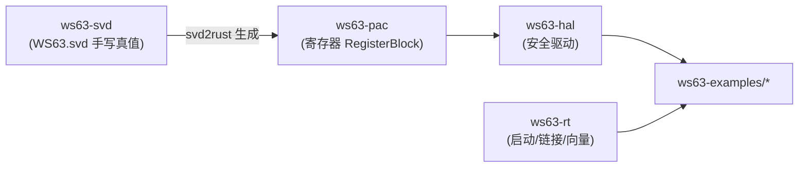

# ws63-svd 架构与评审

> 本文是 ws63-rs 架构文档的一部分。完整评审台账见 [架构评审 2026-05](../review/architecture-review-2026-05.md)，整改排期见 [ROADMAP](../../ROADMAP.md)。

## 职责与边界

`ws63-svd` 是整个 ws63-rs 寄存器抽象链的**上游真值（source of truth）**。它由一份手写的 CMSIS-SVD 描述文件 `WS63.svd` 加少量 Python 工具构成，负责：

- 用 CMSIS-SVD 1.3 schema 描述 WS63 SoC 的外设、寄存器、字段、枚举值与地址布局（`WS63.svd:2`，`schemaVersion="1.3"`）。
- 提供针对官方 CMSIS XSD 的格式校验脚本（`validate.py`）。
- 承载 svd2rust 的目标配置占位（`ws63-settings.yaml`，描述 RV32IMFC_Zicsr 等 RISC-V 目标参数）。

它**不负责**：

- 生成 Rust 代码（生成产物在下游的 `ws63-pac`；本组件目前并未实际驱动 svd2rust，见“评审发现”）。
- 任何运行时逻辑或驱动语义（那是 `ws63-hal` 的职责）。
- 中断控制器的运行时模型（SVD 仅声明 `<interrupt>` 编号，控制器建模问题归 HAL/RT 层）。

寄存器定义来源为公开的 ws63-guide 文档与 fbb_ws63 HAL 头文件转录（`WS63.svd:5-7` 的 `<licenseText>`），属于手工建模而非厂商官方 SVD。

## 在依赖链中的位置

ws63-svd 处于链条最上游：理论上 `WS63.svd` 经 svd2rust 生成 `ws63-pac` 的 `lib.rs`，再由 `ws63-hal` 封装为安全驱动，最终被 `ws63-examples` 使用。`ws63-rt` 提供启动代码与链接脚本，是与上述生成链平行的独立分支。

**当前断点**：从 `WS63.svd` 到 `ws63-pac` 的生成步骤并未自动化——`main.py` 仍是桩，且未安装 svd2rust（见下）。因此目前 SVD 与 PAC 之间是“人工对照”关系，而非可复现的生成关系。

## 关键设计

### SVD 文件结构与建模质量

`WS63.svd` 约 1.07 万行（`WS63.svd:1-10744`），device 头声明了 CPU 为 `other`、`fpuPresent=true`/`fpuDP=false`、`width/size=32`、`nvicPrioBits=3`（`WS63.svd:9-18`），description 中记录了 ISA `rv32i2p1_m2p0_f2p2_c2p0_zicsr2p0` 与 512KB ITCM / 288KB DTCM / 640KB 共享 SRAM 的内存规格（`WS63.svd:4`）。

建模规模与完整度（实测）：

- **36 个 `<peripheral>` 元素**（`grep -c "<peripheral"`），覆盖 SYS_CTL1、IO_CONFIG、GPIO0/1/2、UART0/1/2、I2C0/1、PWM、DMA、SFC_CFG、SPI0/1、I2S、LSADC、TSENSOR、TIMER、WDT、RTC、EFUSE、SYS_CTL0、GLB_CTL_M、SPACC、PKE、KM、TRNG、TCXO、CLDO_CRG、SDMA、ULP_GPIO、RF_WB_CTL、SHARE_MEM_CTL、FAMA_REMAP。
- **497 个非派生 `<register>` 定义**（`grep -c "<register>"`，与评审台账一致；含 `derivedFrom` 展开后逻辑实例更多）。
- **908 个 `<field>`、44 处 `<enumeratedValues>`、35 个 `<addressBlock>`、2 处 `<writeConstraint>`、183 处 `read-only` 访问限定**。
- **8 处 `derivedFrom`** 复用（`grep -c derivedFrom`），用于 GPIO1/GPIO2←GPIO0、UART1/UART2←UART0、I2C1←I2C0、SPI1←SPI0、SDMA←DMA 等同构外设（`WS63.svd:1906,1920,2692,2706,3172,6713,10430,10441`），避免重复展开、显著压缩了文件体积。

UART/GPIO/KM 等外设建模质量较高：字段拆分、枚举值与访问属性齐全。例如 KM（Key Management，`WS63.svd:9410`，baseAddress `0x44112000`）对 KLAD 派生、keyslot 锁定、RKP 根密钥保护建模到了字段级（`KL_KEY_CFG` 的 `port_sel`/`key_enc`/`key_dec` 等，`flush_hmac_kslot_ind` 字段亦已建模）。

### 校验工具

`validate.py`（`validate.py:1-29`）从 ARM CMSIS_5 仓库下载 `CMSIS-SVD.xsd` 缓存到 `/tmp`，用 `xmlschema` 对 `WS63.svd` 做 XSD 校验，PASS/FAIL 返回码区分。依赖在 `pyproject.toml` 声明为 `xmlschema>=4.3.1`，由 `uv.lock` 锁定。这是目前唯一真实可用的工具。

### 生成配置（占位）

`ws63-settings.yaml` 注释中记录了 svd2rust 的目标意图：RV32IMFC_Zicsr、自定义中断控制器（SYS_CTL1，无标准 CLINT/PLIC）、单 hart、240MHz、向量/直接中断模式（`ws63-settings.yaml:1-7`）。但其 YAML 主体在 `base_isa: rv32i` 处即截断（文件末尾无换行、无后续键），是一个**未完成的配置桩**，并未被任何脚本消费。

## 评审发现

### 优点

- 建模覆盖广：36 外设 / 497 寄存器，`enumeratedValues`、`derivedFrom`、`writeConstraint`、`addressBlock` 一应俱全，是一份结构完整、可被 svd2rust 直接消费的 1.3 版 SVD。
- 通过 `derivedFrom` 对同构外设（GPIO/UART/I2C/SPI/SDMA）做了正确复用，降低了维护面。
- 提供了针对官方 CMSIS XSD 的格式校验脚本，建模本身有质量门可依。
- UART/GPIO/KM 等关键外设建模到字段+枚举级，下游 HAL 可直接获得类型安全的位域访问。

### 问题

| 严重度 | 类别 | 问题 | 证据(file:line) | 状态 |
| --- | --- | --- | --- | --- |
| 高 | 维护性 | 缺失寄存器被手工补进**已格式化的 PAC 生成代码**，而非回填 SVD 后重生成。下次 clean regen 会丢失这些补丁或与 SVD 冲突。 | ws63-pac 提交 df35d69「add missing KM keyslot registers — KC_REE/PCPU/AIDSP_LOCK_CMD + KC_RD_SLOT_NUM」；这些寄存器在 `WS63.svd:9410` 的 KM 外设中确实存在但生成链未联动 | 已排期(ROADMAP 阶段 2) |
| 中 | 维护性 | 无可复现生成流水线：`main.py` 是 `print("Hello from ws63-svd!")` 桩，无 svd2rust 调用；环境未安装 svd2rust（`which svd2rust` 为空）；`ws63-settings.yaml` 在 `base_isa: rv32i` 截断；CI 工作流中无任何对 `WS63.svd`/`validate.py`/`svd2rust` 的引用，SVD 不被校验也不被消费 | `main.py:1-6`；`ws63-settings.yaml:1-7`（文件末尾截断）；`.github/workflows/` 无 SVD 引用；svd2rust 未安装 | 已排期(ROADMAP 阶段 2) |
| 中 | 正确性 | 覆盖不全：KM 的 `*_FLUSH_BUSY` 状态寄存器（地址偏移 0xB10–0xB1C）缺失——KM 寄存器偏移从 `0x1B0C` 直接跳到 `0x1B30`（相对 baseAddress），存在转录静默缺口；`flush_hmac_kslot_ind` 字段虽已建模，对应的 BUSY 查询寄存器未建 | `WS63.svd:9410` KM 外设；实测 addressOffset 序列 `0x1B0C → 0x1B30` 之间断档；全文 `grep FLUSH_BUSY` 无命中 | 已排期(ROADMAP 阶段 2) |
| 低 | 文档 | `README.md` 为空文件（0 字节），组件无任何使用/维护说明 | `README.md`（0 bytes） | 已排期(ROADMAP 阶段 2) |

> 说明：上述“双 PAC / ISA / flashboot / CI / rt”等本轮（2026-05-31）已修项均在下游组件落地，与 ws63-svd 自身无直接代码改动；ws63-pac 版本已由 0.1.0 bump 至 0.1.1（`ws63-pac/Cargo.toml`）。本组件自身的四项问题在本轮均**未**触及，故全部标注为“已排期”。

## 改进项与排期

ws63-svd 的整改集中在 ROADMAP 阶段 2（死代码清理 + 正确性修复），核心是把 SVD 重新确立为唯一真值：

1. **建立可复现生成流水线**（阶段 2，对应上表“无可复现生成流水线”）：把 `main.py` 桩替换为真实的 svd2rust 调用，补全 `ws63-settings.yaml`，将其纳入构建/CI；并在 CI 中加入 `validate.py` 的 XSD 校验门。
2. **以 SVD 为源重生成 PAC**（阶段 2，对应“手补进生成代码”）：将 df35d69 等手工补丁回填到 `WS63.svd`，确保 clean regen 不丢失，消除 SVD 与 PAC 的漂移。
3. **补全转录缺口**（阶段 2，对应“KM *_FLUSH_BUSY 缺失”）：补齐 KM 0xB10–0xB1C 区段及其它疑似断档；同阶段还需补 efuse/lsadc 寄存器（见 LSADC/EFUSE 外设建模）。
4. **补写 README**（阶段 2，对应空 README）：说明 SVD→PAC 生成步骤、校验命令与维护约定。

阶段编号参考：阶段 0 为本轮（2026-05-31）已完成的构建完整性修复；阶段 1 为硬件在环 bring-up 与链接脚本集成；阶段 2 为本组件主要落点。详见 [ROADMAP](../../ROADMAP.md)。
