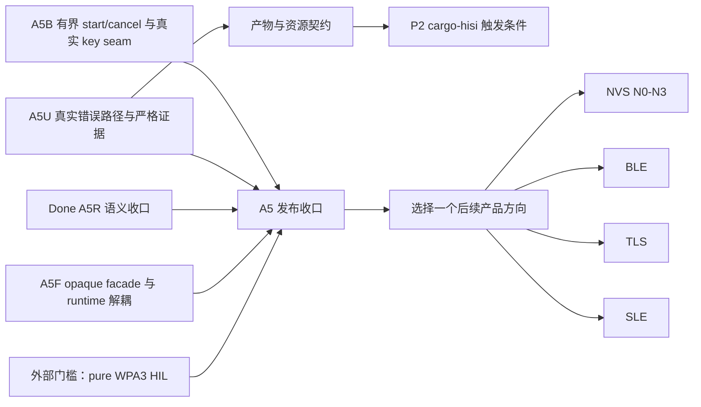

# 工程计划注册表

`docs/plan/` 用于保存工程执行计划和延期的架构展望。它不属于面向用户的 Diátaxis
手册，因此有意不加入 `docs/src/SUMMARY.md`。

本注册表是计划状态、生态优先级、启动条件和阻塞关系的唯一事实源。各计划文档负责记录
自身的详细需求和证据；[`ROADMAP.md`](../../ROADMAP.md) 只负责简短的
“当前 / 下一步 / 以后”视图。不要把详细检查清单复制到这两个索引中。

## 状态规则

- **执行中**：仓库 WIP 限制允许的唯一主要里程碑。
- **配套工作**：当前里程碑所需的有限正确性或兼容性工作，不开启第二条产品方向。
- **条件触发**：仅当注册表记录的产品条件成立时启动。
- **延期**：保留架构设计，但当前未分配执行槽位。
- **已完成**：作为历史门槛和证据保留；剩余工作必须登记为独立的条件触发项，不能静默
  重开已完成计划。

优先级作用于整个生态：`P0` 是当前 WIP，`P1` 是下一批收口工作，`P2`/`P3` 是条件触发
或未来工作。计划内部阶段必须使用自己的前缀（如 `A5U`、`IR0`、`N0`、`D0`），不能再
定义一套全局 `P0`。

## 计划登记

| 计划 | 状态 | 优先级 | 触发条件 / 前置阻塞 | 阻塞项 / 下一决策 |
|---|---|---:|---|---|
| [Connectivity 全栈](hisi-connectivity-stack.md) | 执行中 | P0 | A5 对抗式审计仍有可执行的 correctness/release-contract 项；pure WPA3 另为外部阻塞门槛 | 逐项关闭 A5B/A5F/A5U 复开项并保持现有回归和 oracle；全部门槛闭合前不切默认 backend |
| [RTOS 语义与验证](hisi-rtos-semantics-and-verification.md) | 配套工作 | P1 | A5R-F0-F5 已闭合；requirement/runtime/silicon mechanism 变化时重开 | 保持规范、模型、Rust proof 与 immutable HIL evidence 同步 |
| [WS63 RF runtime 兼容](ws63-rf-runtime-compatibility.md) | 配套工作 | P1 | archive/profile 变化或 A5R 暴露兼容缺口时重开 | 版本化 blob/runtime 兼容发布输入 |
| [`cargo-hisi` CLI](cargo-hisi-cli.md) | 延期 | P2 | A5U 的产物和报告契约稳定 | 可选的统一工作流 CLI；普通 Cargo 始终必须可用 |
| [中断处理整改](hisi-interrupt-handler-reform.md) | 延期 | P2 | 对照 RTOS F2 port 和当前 trap ABI 重新评审架构 | 稳定的类型化中断注册和 Embassy IRQ 体验 |
| [NVS 镜像工具链](hisi-nvs-image.md) | 条件触发 | P2 | 产品要求摆脱原厂 NV generator | 独立 Rust 发布镜像路径；N4/N5 还依赖 crypto/keystore 证据 |
| [RTOS 未来架构](hisi-rtos-future-architecture.md) | 延期 | P3 | A5 基线完成且出现明确的可移植性或保护需求 | 跨芯片 port、保护域和高级 runtime profile |
| [RTOS 调测 CLI](hisi-rtos-debugging-cli.md) | 延期 | P3 | RTOS snapshot/trace/build-id 协议稳定 | Host/QEMU/真机统一的观测和重放工具 |
| [WS63 调试内存诊断](ws63-debug-memory-access.md) | 已完成 | Done | AP1 产品集成由双 AP ownership contract 单独触发 | 只保留诊断证据；当前不改变下载路径 |
| [WS63 RF init/scan](ws63-rf-init-scan.md) | 已完成 | Done | 仅在纠正证据时重开 | RF0-RF5 bring-up 历史证据 |
| [HAL 0.6.0 发布](hal-0.6.0-release.md) | 已完成 | Done | 仅在纠正发布记录时重开 | 历史发布证据 |

## 阻塞关系图

这张图记录 A5 已交付的基础能力仍有对抗式审计复开的门槛；pure-WPA3 是另一条外部
门槛。任何一条未闭合时都不能把局部完成写成整个 A5 已验收，也不借此并行启动第二个
产品方向。

## 维护契约

1. 新增顶层计划时，必须在同一提交中增加注册表条目。
2. 开始或完成里程碑前，先更新注册表状态；只有“当前 / 下一步 / 以后”的顺序改变时才
   更新 `ROADMAP.md`。
3. 日期化证据放在 `docs/plan/evidence/`；证据文件不是计划，不在此登记，也不受中文
   规划正文约束。
4. 已完成计划不能继续声称某项工作“当前正在进行”，而应链接到新的执行中计划。
5. 提交计划变更前运行 `uv run --script scripts/check-plan-registry.py`。
