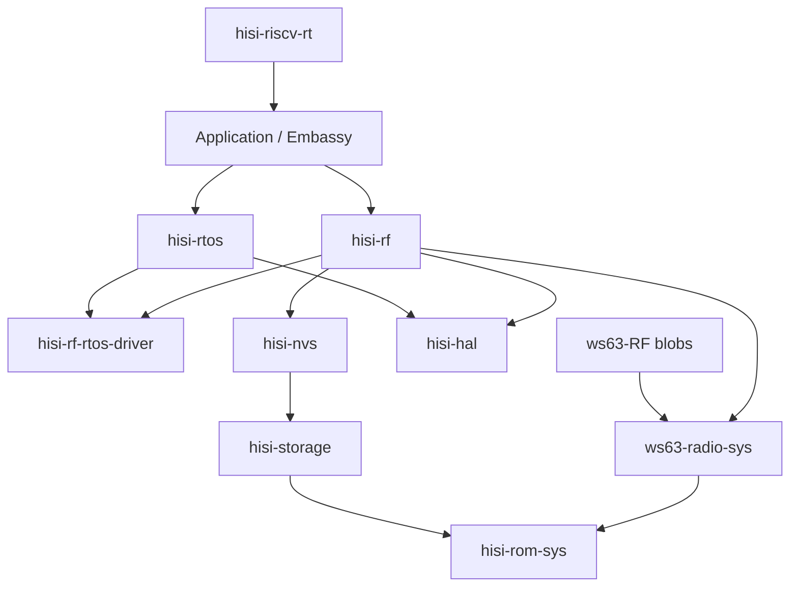

# RF5 之后的 HiSilicon Connectivity 全栈重构计划

## Summary

先沿当前 `ws63-rf-rs` 路径完成 **Wi-Fi connect → ping**，避免架构迁移打断
连接性北极星；ping 通过真机 HIL 后冻结行为基线，再拆成独立 release unit。

目标架构参考 esp-rs 的
`esp-radio → esp-radio-rtos-driver ← esp-rtos`、`esp-rom-sys` 和
`esp-storage` 分层，但增加 HiSilicon 特有的 vendor NVS、SLE 和 post-link
relocation 层。`hisi-rtos` 同时承载 radio blob 所需的线程/IPC 运行环境和
Embassy executor/time 运行环境。

本计划是 RF5 之后的完整执行事实源。Init/Scan 的历史、当前证据和 RF5A-C
入口仍记录在 [WS63 RF Init/Scan 计划](ws63-rf-init-scan.md)；根
[`ROADMAP.md`](../../ROADMAP.md) 只保留优先级和里程碑，不复制本文细节。

## Target Architecture



依赖方向必须保持单向：RTOS 不依赖 RF；NVS 不知道 RF key；ROM sys 不依赖
HAL；RF 不实现 IP stack；examples 不直接列 vendor archives 或 ROM 地址。

## Component Boundaries

| Component | Responsibility |
| --- | --- |
| `ws63-RF` | Language-neutral blobs、headers、ROM symbol/patch lists；不放 Rust 实现。 |
| `hisi-rom-sys` | 生成的 unsafe ROM symbols、固定 ROM state 和 patch metadata；只允许追加符号，不放 HAL/NVS/高层 API。 |
| `ws63-radio-sys` | WS63 Wi-Fi/BLE/SLE raw FFI、archive selection、ABI/layout assertions 和 relocation 规则。仓库同时发布 host CLI `hisi-rf-link`。 |
| `hisi-rf-rtos-driver` | runtime-neutral scheduler、semaphore、queue、timer、wait 和 ISR-wakeup contract；每个 firmware 只能注册一个实现。 |
| `hisi-rtos` | 默认单-hart、优先级抢占、tickless scheduler，以及 IPC、Embassy executor/time integration；不依赖 RF。 |
| `hisi-alloc` | 用户提供 SRAM arenas、对齐分配，以及可选 C/global allocator adapter；移出 RF heap 所有权。 |
| `hisi-storage` | runtime internal-flash access 和 `embedded-storage` traits；memory-mapped read 优先，erase/write 暂留 unstable。 |
| `hisi-nvs` | WS63 ACPU KV page parser、CRC、partition selection 和 typed read API；RF item IDs 由 RF crate 定义。 |
| `hisi-rf` | 用户入口和安全的 `wifi`/`ble`/`sle`/`coex` API；拥有 blob adapter，不拥有 scheduler、allocator、NVS format、ROM symbols 或 IP stack。 |
| `hisi-hal` | `hisi-riscv-hal` 在 0.6.0 stable 之后的新 package/repository 名；继续拥有多芯片 peripheral drivers，不吸收 RF/RTOS/storage policy。 |
| `hisi-riscv-rt` | startup/trap/linker mechanism；收集 memory-profile descriptor 和 init hooks，不知道 Wi-Fi/BLE/SLE policy。 |

所有新组件使用独立 Git 仓库、`Cargo.lock`、CI、版本和 release；父仓以 submodule
固定开发版本。`ws63-radio-sys` 与 `hisi-rf-link` 同仓同版本，因为 blob ABI 和
relocation 规则必须原子升级。闭源 archive 未确认 crates.io 重分发边界前，
`ws63-radio-sys` 只通过 GitHub release/submodule 交付。

## Public Contracts

### RTOS And Embassy

- `hisi-rtos::start(config, timer0, soft_interrupt0, resources)` 一次性启动
  tickless、priority-preemptive scheduler。重复启动返回 `AlreadyStarted`。
- 初始 context switch 保存全部整数寄存器、`tp`、`mstatus`、`fcsr` 和全部浮点
  寄存器；只有 HIL 证明 lazy FP save 正确后才允许优化。
- TIMER_INT0 负责最早 deadline/time slice，WS63 software interrupt 负责立即
  reschedule；ISR 只记录/唤醒，调度和用户代码在退出中断后执行。
- `hisi-rtos` 提供 thread-mode Embassy executor 和唯一的 Embassy time driver。
  HAL 现有 time driver 保留一个 minor 的 deprecated 迁移窗；外设 async traits
  继续属于 HAL。
- scheduler/IPC 对 blob 的入口只通过 `hisi-rf-rtos-driver` 注册宏导出的固定
  Rust ABI；链接到零个或多个实现都必须失败。

### Storage And NVS

- `hisi-storage` 稳定面只承诺 memory-mapped read 和边界检查。erase/write 必须在
  RAM/ROM 中执行，并处理 SFC、cache、interrupt 和 XIP 约束；在掉电 HIL 前保持
  `unstable-write`。
- 初始稳定 API 为
  `hisi_nvs::NvReader<S>::read(NvKey, &mut [u8]) -> Result<usize, NvError>`。
  它校验 page header、反码、record bounds、state、encryption flag 和 CRC。
- NVS 首版只读。GC、双页切换、磨损管理和中途掉电恢复全部完成后，才讨论稳定
  write API。RF calibration/MAC key newtype 留在 `hisi-rf`。

### Radio

- `hisi_rf::init(RadioConfig, RadioResources)` 返回独占
  `RadioController`；`split()` 只产生编译时启用的协议 handle。
- Wi-Fi 提供 L2 device；按 feature 实现 `smoltcp::phy::Device` 和
  `embassy-net-driver`。DHCP、ICMP、TCP/IP sockets 属于 smoltcp/Embassy Net。
- BLE 第一阶段封装 vendor GAP/GATT/SMP host。raw HCI/TrouBLE 仅在 controller-only
  边界被符号和 HIL 证明后进入 experimental feature。
- SLE 使用相同事件模型，提供 announce/seek/connect 和 SSAP client/server。
- 所有 blob callback 只把 bounded event 写入队列并 wake task；不得在 ISR、critical
  section 或 scheduler lock 中调用用户 callback。

### Runtime And Link

- `hisi-riscv-rt` 增加一个 pre-relocation memory-profile descriptor 和一个
  linker-collected post-relocation init registry；重复 memory profile 由 linker
  `ASSERT` 失败。
- `ws63-radio-sys` 贡献 packet-RAM NOBITS input section、BGLE/shared-memory profile、
  ROM patch payload 和 post-relocation hook；RT 只负责收集与执行机制。
- `hisi-rf-link` 负责 stock `rust-lld` layout pass、vendor relocation transform、
  final-layout fail-closed 校验和 ROM patch table。最终 ELF 再交给 `hisi-fwpkg`
  计算 header/hash/body；RF 工具不得复制镜像格式语义。

## Milestones

### RF5A -- TX/RX Closure

- 从 vendor headers 生成 pbuf offset/size assertions，覆盖当前已验证的 80-byte
  zero-copy reserve 以及 TX/RX 实际访问字段。
- 找到真实 transmit symbol，把 `netif_smoltcp` 测试 sink 替换为 blob adapter；
  `driverif_input` 把 RX frame 送入有界队列，并定义满队列 drop counter。
- HIL 先通过 ARP request/reply，证明双向 Ethernet frame 数据面。
- 2026-07-12 已完成：原厂 lwIP 配置/DWARF 驱动的 pbuf/netif ABI 检查、DHCP lease、
  gateway ARP reply 均在真机通过。MTU-sized smoltcp token 曾令 8 KiB 主栈下溢并覆盖
  FRW queue；现改为静态单占用 scratch，并以 token-size host test 防回归。

### RF5B -- Open AP Connect

- 在当前 `ws63-rf-rs` 中增加 typed station config、connection-state event 和
  `Wifi::connect`；第一目标是受控实验室 open AP，不宣称生产安全能力。
- UART marker 固定为 `RF5_CONNECT_BEGIN`、`RF5_CONNECT_OK` 或
  `RF5_CONNECT_ERR:<class>:<vendor-code>`；用户逻辑不在 vendor event callback 中执行。

### RF5C -- Ping And Baseline Freeze

- 第一轮使用静态 IPv4、gateway 和受控 peer，随后补 DHCP；ICMP 必须经过 Rust-visible
  L2 device，而不是 vendor lwIP 隐藏路径。
- HIL 固定 `RF5_PING_OK replies=N`，保存 UART log、ELF section/layout report、ROM
  patch manifest、image plan 和资源占用，作为迁移前 A0 baseline。
- 当前 ICMP request 已越过 ROM TX completion（含 `__ashldi3` callback bridge），但
  `HUAWEI-HLJ_Guest` 未返回 gateway/公网 Echo Reply；RF5C 保持进行中，待受控 ICMP
  peer 或确认该访客网络策略后再冻结 baseline。

### H0 -- Rename `hisi-riscv-hal` To `hisi-hal`

- H0 只在 `hisi-riscv-hal 0.6.0` 正式发布且 RF5C baseline 已冻结后开始，并在
  A1 新组件建仓前完成。重命名 release 不夹带 API、寄存器行为或 feature 重构。
- 先发布仅补迁移说明的 `hisi-riscv-hal 0.6.1`，保留 `release/0.6` 分支一个
  release train，只接收 critical correctness/security fixes；历史版本不 yank。
- GitHub repository 改名为 `hisi-hal`，父仓 submodule URL 和文档链接随迁；GitHub
  redirect 只作为辅助，CI 不依赖 redirect。
- Cargo 新 package 从 `hisi-hal 0.7.0-alpha.1` 开始，Rust crate path 是
  `hisi_hal`。chip features、stable/unstable policy 和默认公开面与 0.6.0 等价，
  用 rustdoc JSON/semver checks 证明重命名之外没有 surface 漂移。
- 官方模板、examples、HIL、docs、skills、CI 和后续 `hisi-*` crates 全部改用
  `hisi-hal` / `hisi_hal`。迁移期下游若暂时不改源码导入，可使用：

  ```toml
  hisi-riscv-hal = { package = "hisi-hal", version = "0.7.0-alpha.1", features = ["chip-ws63"] }
  ```

- 父仓下一条 `v0.7.0-alpha.1` release train 以 `hisi-hal 0.7.0-alpha.1` 为 anchor；
  `hisi-riscv-rs v0.6.x` 文档快照继续指向旧 package，不回写历史版本。

### A1-A4 -- Decomposition And Wi-Fi Migration

1. A1：在 H0 完成后抽取 `hisi-rom-sys`、`hisi-alloc`、`ws63-radio-sys`、
   `hisi-rf-link`；examples
   不再维护 ROM/link/archive 列表。
2. A2：抽取 `hisi-storage` 和 read-only `hisi-nvs`；移除 RF parser 与 RT 中的 NVS
   partition symbols。
3. A3：建立 `hisi-rf-rtos-driver`；把现 scheduler/IPC 迁到 `hisi-rtos`，再升级为
   抢占式实现并接管 Embassy time/executor。
4. A4：建立 `hisi-rf` 并迁移 Wi-Fi API/L2 device。每一步复跑 A0；全部等价后
   `ws63-rf-rs` 作为 re-export facade 保留一个 migration release，再删除。

### B0-B3 -- BLE Vendor Host First

1. B0：对 `libbg_common`、`libbt_host`、`libbt_app`、`libbth_sdk` 做 symbol closure、
   archive/version hash、ABI layout 和 memory-profile 清单。
2. B1：完成 controller/host init、transport、NVS identity/bonding 和 RTOS contract。
3. B2：实现 advertising/scanning、bounded event queue 和 HIL marker。
4. B3：实现 GATT client/server、notification/indication 和断连清理。Classic BR/EDR
   不在本轮范围。

### S0-S3 -- SLE

1. S0：对 `libbth_gle` 及共享 BT archives 做 closure，明确 BLE/SLE 共享 transport、
   heap、NVS 和 coex state。
2. S1：announce/seek；S2：connect/disconnect；S3：SSAP client/server。
3. 自动连接与数据收发 HIL 需要第二块 WS63；单板只能作为 init/announce 证据。

### X0 And R0 -- Coexistence And Release

- 先验证 Wi-Fi ping + BLE advertising/connection，再验证 Wi-Fi + SLE；只有并发 RF
  时序、shared RAM profile、heap watermark 和 IRQ latency 都有 HIL 后才公开 `coex`。
- R0 发布 compatibility matrix、RAM/flash/task budget、blob/ROM hashes、known issues、
  examples 和 HIL evidence；之后才把更高层 convenience API 作为稳定候选。

## Verification

- Host：NVS malformed pages/CRC、allocator alignment/ownership、scheduler state model、IPC
  timeout/cancellation、ABI sizes、relocation transforms 和 feature matrix。
- Link：ROM/blob hash、archive closure、唯一 memory profile、NOBITS regions、final/oracle
  layout、无 unresolved vendor relocation、`hisi-fwpkg` image plan。
- QEMU：RTOS priority/preemption、ISR wake、FP context、Embassy timers、stubbed radio adapter；
  QEMU 结果不得被描述为 RF 证据。
- WS63 HIL：scan/connect/ping、RTOS+Embassy、BLE advertising/scanning/GATT，以及 SLE
  two-board。增加 vendor tasks + Embassy tasks + timed semaphore + nested IRQ wake + repeated
  scan 的 scheduler stress。
- CI drift：禁止 ROM symbols、NVS constants、scheduler implementation 和 direct blob link
  args 出现在各自 owner 之外；检查依赖图无反向边和循环。

## Assumptions And Locked Decisions

- 先完成 Wi-Fi ping，再拆仓；不并行维护新旧两条主路径。
- `hisi-riscv-hal 0.6.0` 是旧名称的最后一个主 release；新名称从
  `hisi-hal 0.7.0-alpha.1` 开始，H0 在 A1 之前完成。
- 每个新底座是独立仓库和 release unit，父仓通过 submodule 集成。
- BLE vendor host 先行；TrouBLE/raw HCI 后置。
- NVS 稳定面只读；写入保持 experimental。
- `hisi-rtos` 只维护抢占式单-hart backend；现 cooperative scheduler 是迁移材料。
- 初期不创建 `hisi-sync` 或 `hisi-phy`：同步继续使用 `critical-section` / 
  `portable-atomic`，PHY policy 在出现可复用、非 blob-owned 行为前留在 radio adapter。
