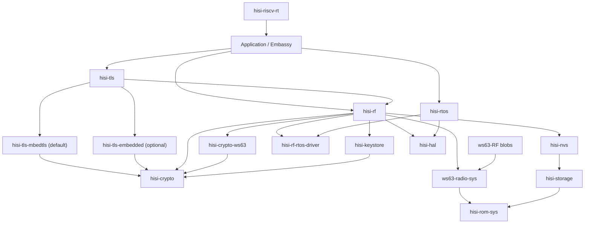

# RF5 之后的 HiSilicon Connectivity 全栈重构计划

## Summary

A0-A4 的 **Wi-Fi connect → ping** 基线已经冻结，独立 `hisi-rf` vertical slice
已经通过提交态真机 HIL。当前唯一 active milestone 是 W2 WPA3-Personal/SAE；每一步
都必须保留 A4 的真实硅片连接性证据，不能为了增加安全模式打断北极星。

目标架构参考 esp-rs 的
`esp-radio → esp-radio-rtos-driver ← esp-rtos`、`esp-rom-sys` 和
`esp-storage` 分层，但增加 HiSilicon 特有的 vendor NVS、SLE 和 post-link
relocation 层。`hisi-rtos` 同时承载 radio blob 所需的线程/IPC 运行环境和
Embassy executor/time 运行环境。

本计划是 RF5 之后的完整执行事实源。Init/Scan 的历史、当前证据和 RF5A-C
入口仍记录在 [WS63 RF Init/Scan 计划](ws63-rf-init-scan.md)；根
[`ROADMAP.md`](../../ROADMAP.md) 只保留优先级和里程碑，不复制本文细节。

更长期的 protection domain、跨芯片 port、host runtime 与 CLI-first observability
架构已作为 deferred outlook 记录在
[`hisi-rtos` 未来架构](hisi-rtos-future-architecture.md)；它不属于当前 A3/A4 gate。
通用 scheduler 语义、形式化模型与实现一致性 gate 另见
[RTOS 调度语义与验证计划](hisi-rtos-semantics-and-verification.md)；WS63 blob
兼容 profile 不得反向改写通用 RTOS 语义。

## Active Window: NOW W2 WPA3-Personal

本计划保留完整架构，但当前 WIP limit 是 **一个 major milestone**。A4 已冻结，
A4 product gate 按默认建议选择 W2 WPA3-Personal/SAE；BLE、SLE、TLS、SoftAP、
Enterprise 和其他架构抽取不与 W2 并行。

### Completed -- A3 Closeout

1. 已将每轮单次 ping 扩为每个目标 5 次；20 次 nRST 得到 WPA2/DHCP/ARP 20/20、
   公网 `88/100`、gateway `0/100`。后续 RF seam 矩阵证明 queue-full drop 为 0、
   high-water 为 1/4，应用收到的 Echo Reply 与 `driverif_input` 逐包一致。
   同一 Guest AP 上的 Mac 通过 `-b en0 -S 192.168.155.9` 强制 Wi-Fi 路径后，
   gateway 同样 `0/20`、公网同样 `88/100`，因此剩余现象已有量化环境边界，
   不回写成认证、RTOS 或 Rust RX queue 回归。
2. Q3 archive-bound task profile 已对当前 payload 闭合：只记录真实生成的 vendor task，
   以 archive hash、entry symbol、vendor priority、Q2 metrics 和
   `critical`/`worker`/`background`/`unknown` 角色绑定事实。角色未知时必须保持
   `unknown`；profile 第一阶段不改变 runtime policy。
3. Q4 已按 Q2 数据作出当前 payload 的显式决策：所有 vendor task 保持 Cooperative，
   不启用 per-thread `Budgeted` 或 group quota；没有 measured minimum-service demand，
   因此不实施 Reservation。payload/task-set 变化时必须重开 Q3/Q4。
4. reset matrix、调度不变量、版本、submodule pointer、profile revision、quota decision
   和网络归因已经冻结。完整收口见
   [A3 network attribution](evidence/ws63-rf-a3-network-attribution-2026-07-14.md)。

### Completed -- A4 Wi-Fi Vertical Slice

A4 的第一条完整 vertical slice 已在 WS63 上运行：`RadioController`/`RadioRunner`、
`WifiController`/`WifiDevice`、bounded event queue 和应用持有的长生命周期 smoltcp
runner 已完成 init/scan/WPA2 connect、DHCP、neighbor discovery、重复 ICMP 和 lease
renew。`hisi-rf 0.1.0-alpha.1` 已发布，迁移 facade 有明确删除窗口，提交态
`ws63-hil` workflow 已 PASS。冻结证据见
[A4 Wi-Fi vertical slice](evidence/ws63-rf-a4-vertical-slice-2026-07-14.md)。

### NOW -- W2 Upstream Supplicant And WPA3-Personal

W2 的当前状态、提交证据和完成门槛只维护在
[W2A-W2F 执行账本](#w2-upstream-supplicant-and-wpa3personal)；本 Active Window 不复制
逐阶段状态。当前硬约束是：W0B WPA2-only archive 和 A4 真机 gate 在整个迁移期间持续
回归，`HUAWEI-HLJ_Guest` 只作为 WPA2 parity AP，不能被写成 pure WPA3 证据。

W3-W4、B/S/X、NVS/RTOS future、ported switch ticket、group Reservation、AP1 fast
path、i18n、BSP 和 Hi3322 均为 deferred/triggered backlog，不是当前 TODO。

## Target Architecture



依赖方向必须保持单向：RTOS 不依赖 RF；NVS 不知道 RF key；ROM sys 不依赖
HAL；RF 不实现 IP stack；examples 不直接列 vendor archives 或 ROM 地址。

## Component Boundaries

| Component | Responsibility |
| --- | --- |
| `ws63-RF` | Language-neutral blobs、headers、ROM symbol/patch lists；不放 Rust 实现。 |
| `hisi-rom-sys` | 芯片中立的显式 chip-selection facade；统一 re-export ROM facts，并转发 backend Cargo metadata。 |
| `hisi-rom-sys-ws63` | WS63 固定 ROM 地址、生成 symbol/callback/patch metadata 与同步工具；位于 `crates/chips/ws63/`。 |
| `ws63-radio-sys` | WS63 Wi-Fi/BLE/SLE raw FFI、archive selection、ABI/layout assertions 和 relocation 规则；拥有 pinned hostap source metadata、最小 supplicant raw ABI 与 WS63 driver/L2 integration。仓库同时发布 host CLI `hisi-rf-link`。 |
| `hisi-rf-rtos-driver` | runtime-neutral scheduler、semaphore、queue、timer、wait 和 ISR-wakeup contract；每个 firmware 只能注册一个实现。 |
| `hisi-rtos` | 默认单-hart、优先级抢占、tickless scheduler，以及 IPC、Embassy executor/time integration；不依赖 RF。 |
| `hisi-alloc` | 用户提供 SRAM arenas、对齐分配，以及可选 C/global allocator adapter；移出 RF heap 所有权。 |
| `hisi-storage` | runtime internal-flash access 和 `embedded-storage` traits；memory-mapped read 优先，erase/write 暂留 unstable。 |
| `hisi-nvs` | WS63 ACPU KV page parser、CRC、partition selection 和 typed read API；RF item IDs 由 RF crate 定义。 |
| `hisi-crypto` | 芯片中立的小粒度密码能力契约、敏感类型和 RustCrypto 软件实现；不承载 TLS、网络状态机或芯片寄存器。 |
| `hisi-crypto-ws63` | WS63 cipher accelerator、ROM UAPI、TRNG、key slot、独占资源、超时和硬件错误；失败时禁止静默回退软件。 |
| `hisi-keystore` | `KeyHandle`、不可导出密钥、用途权限，以及 eFuse/OTP/受保护 Flash 策略；`hisi-nvs` 不拥有密钥策略。 |
| `hisi-tls` | 后端中立的 async TLS facade 和安全字节流入口；拥有 transport/BIO 与 `WANT_READ`/`WANT_WRITE` async 映射，不重写 TLS。 |
| `hisi-tls-mbedtls` | 默认 TLS backend；mbedTLS 作为无 OS 协议库，通过 `hisi-tls` BIO 对接 Rust 网络栈，不依赖 LiteOS socket。 |
| `hisi-tls-embedded` | 可选 `embedded-tls` backend，复用同一 transport、entropy、time 和 allocator contract。 |
| `hisi-rf` | 用户入口和安全的 `wifi`/`ble`/`sle`/`coex` API；拥有 blob adapter，不拥有 scheduler、allocator、NVS format、ROM symbols 或 IP stack。 |
| `hisi-hal` | `hisi-riscv-hal` 在 0.6.0 stable 之后的新 package/repository 名；继续拥有多芯片 peripheral drivers，不吸收 RF/RTOS/storage policy。 |
| `hisi-riscv-rt` | startup/trap/linker mechanism；收集 memory-profile descriptor 和 init hooks，不知道 Wi-Fi/BLE/SLE policy。 |

所有新组件使用独立 Git 仓库、`Cargo.lock`、CI、版本和 release；父仓以 submodule
固定开发版本。`ws63-radio-sys` 与 `hisi-rf-link` 同仓同版本，因为 blob ABI 和
relocation 规则必须原子升级。闭源 archive 未确认 crates.io 重分发边界前，
`ws63-radio-sys` 只通过 GitHub release/submodule 交付。

固定依赖方向为 `Application -> hisi-tls -> hisi-crypto`；WPA、BLE 与 SLE security
从 `hisi-rf` 依赖 `hisi-crypto`，firmware verification 也只依赖 `hisi-crypto`。
WPA supplicant 不属于 TLS；只有 Enterprise 的 EAP-TLS profile 可以依赖 `hisi-tls`。

## Public Contracts

### RTOS And Embassy

- `hisi-rtos::start(config, timer0, soft_interrupt0, resources)` 一次性启动
  tickless、priority-preemptive scheduler。重复启动返回 `AlreadyStarted`。
- 初始 context switch 保存全部整数寄存器、`tp`、`mstatus`、`fcsr` 和全部浮点
  寄存器；只有 HIL 证明 lazy FP save 正确后才允许优化。
- TIMER_INT0 负责最早 deadline/time slice，WS63 software interrupt 负责立即
  reschedule；ISR 只记录/唤醒，调度和用户代码在退出中断后执行。
- `hisi-rtos` 提供 thread-mode Embassy executor 和唯一的 Embassy time driver。
  HAL 现有 time driver 保留一个 minor 的 deprecated 迁移窗；外设 async traits
  继续属于 HAL。
- 原厂 WS63 LiteOS 只作为 task-context、调度和 IRQ 行为 oracle，不进入产品依赖图，
  也不建立或维护 LiteOS backend。`hisi-rtos` 是唯一 native backend；
  `ws63-radio-sys`/WS63 ABI shim 只把 blob 实际引用的 `LOS_`/`osal_` 符号映射到
  `hisi-rf-rtos-driver` 小能力契约。该符号集合由 `nm -u`/link manifest 固定，新增
  未满足符号必须使 CI 失败。
- scheduler/IPC 对 blob 的入口只通过 `hisi-rf-rtos-driver` 注册宏导出的固定
  Rust ABI；链接到零个或多个实现都必须失败。
- scheduler state、RunPolicy、IRQ epilogue、timeout race、priority inheritance
  和 budget replenishment 的通用 contract 以
  [RTOS 调度语义与验证](hisi-rtos-semantics-and-verification.md) 为唯一计划事实源；
  A3 evidence 只证明已列出的实现/真机场景。

### Storage And NVS

- `hisi-storage` 稳定面只承诺 memory-mapped read 和边界检查。erase/write 必须在
  RAM/ROM 中执行，并处理 SFC、cache、interrupt 和 XIP 约束；在掉电 HIL 前保持
  `unstable-write`。
- 初始稳定 API 为
  `hisi_nvs::NvReader<S>::read(NvKey, &mut [u8]) -> Result<usize, NvError>`。
  它校验 page header、反码、record bounds、state、encryption flag 和 CRC。

### Crypto, Keys And TLS

- `hisi-crypto` 是“芯片中立的密码能力契约 + RustCrypto 软件实现”，不是统一承包所有
  算法、硬件和协议的 provider。模块边界固定为 `error`、`hash`、`mac`、`cipher`、
  `aead`、`rng`、`kdf`、`signature`、`secret`、`key`、`software`；WS63 寄存器、ROM
  UAPI、key slot 和硬件资源只进入 `hisi-crypto-ws63`。
- `hisi-crypto` 优先直接采用生态 traits：`digest::{Digest, Update, FixedOutput, Mac}`、
  `cipher::{KeyInit, BlockEncrypt, BlockDecrypt}`、`aead::{AeadCore, AeadInPlace, KeyInit}`、
  `rand_core::{TryRng, TryCryptoRng}`、`signature::{Signer, Verifier}`，以及 `zeroize`、
  `subtle`、`pbkdf2`、`hkdf`。具体名称以锁定依赖版本为准；只有错误、阻塞和状态语义
  严格匹配时才直接实现标准 trait。
- 对 busy、clock、DMA/alignment、ROM UAPI、timeout、reset 等可失败能力，提供小粒度
  `TryHash`、`TryMac`、`TryBlockCipher`、`TryAeadInPlace`、`EntropySource`，不继续扩张
  当前单体 `CryptoProvider`。标准 trait 无法表达硬件失败时，不允许用 panic、无限等待或
  隐式状态掩盖错误；可在能力语义严格匹配后，从 `Try*` contract 提供标准 trait adapter。
- 协议层可定义窄的 `Wpa2Crypto`、`TlsCrypto`、`VerifyCrypto` profile，只表达协议最小
  能力集合，不取代底层通用 trait；具体 backend 由显式 `CryptoSuite<H, M, A, R>` 组合。
- 第一阶段硬件契约是有界超时的同步 API：通过独占 token 管理引擎，不在 critical
  section 中等待，不在 IRQ/锁中调用用户逻辑。DMA/IRQ 证据成熟后再增加独立
  `AsyncTry*` 接口。
- `EntropySource` 表示原始 TRNG；CSPRNG/DRBG 负责播种与重播种。TLS 随机请求不能每次
  直接同步读取慢速 TRNG。TRNG 优先实现 `rand_core` 的可失败接口。
- 可导出的 `SecretBytes` 必须 `ZeroizeOnDrop`；不可导出密钥使用包含 slot 与
  `KeyUsage` 的 `KeyHandle`/`KeyRef::Handle`，不提供读取字节的 API。
- backend 只能在构造、feature 或资源注入时显式选择。`hisi-crypto-ws63` 操作失败后
  禁止透明切到 RustCrypto；混合 hash/AES/RNG suite 也必须由类型显式组合。
- 推荐依赖链固定为 `protocol profile -> standard/fallible capability traits ->
  RustCryptoBackend 或 hisi-crypto-ws63 -> ROM/cipher accelerator/TRNG`。协议 crate
  不得越过 backend 直接调用 ROM UAPI，硬件 backend 也不得反向依赖 WPA/TLS。
- `hisi-tls::TlsStream<T>` 对外实现 `embedded_io_async::{Read, Write}`；默认
  `hisi-tls-mbedtls`，可选 `hisi-tls-embedded`。transport 可接 `embassy-net`、
  `smoltcp` 或任意 `embedded-io-async` 流。
- NVS 首版只读。GC、双页切换、磨损管理和中途掉电恢复全部完成后，才讨论稳定
  write API。RF calibration/MAC key newtype 留在 `hisi-rf`。

### Radio

- `hisi_rf::init(RadioConfig, RadioResources)` 返回独占 `RadioController`；所有协议共享
  RF、IRQ、blob、memory profile 和 coexistence resources，禁止分别以 `Wifi::new()`、
  `Ble::new()` 抢占同一硬件。`split()` 返回
  `RadioParts { wifi, ble, sle, runner }`，且只产生编译时启用的协议 handle。
- `RadioRunner` 是必须持续 poll 的长期后台任务，唯一负责推进 blob、处理控制命令、
  ack/wake 和投递事件；协议 handle 不在调用者 task 中直接驱动 vendor scheduler。
- 公共接口分四个平面，不能用一个“万能 Radio trait”抹平协议语义：
  - **配置面**：`RadioConfig`、`ScanConfig`、`StationConfig`、`AdvertisingConfig`、
    `SeekConfig`、`CoexistenceConfig`；使用 validated newtype、enum 与 secret type，
    不接受无约束裸 channel、interval、密码或 key bytes。
  - **控制面**：Wi-Fi、BLE、SLE 各自提供 inherent async API；状态机和错误保持协议语义。
  - **数据面**：只在存在成熟标准时实现 ecosystem trait，不发明自有通用 socket/IP 层。
  - **事件面**：有界队列 + `next_event().await`；后续可选
    `futures_core::Stream` adapter。ISR/blob callback 只复制 bounded event、更新小状态并 wake，
    绝不调用用户 callback。
- Wi-Fi 分离 `WifiController` 与 `WifiDevice`。前者以 `&mut self` 串行化
  `scan/connect/disconnect/wait_for_link`，明确 cancellation 与状态迁移；scan 使用调用者
  提供的固定结果 buffer，返回 `{ count, truncated }`。后者只提供 L2 RX/TX，主要实现
  `embassy_net_driver::Driver`，可选实现 `smoltcp::phy::Device`。
- Wi-Fi 提供 L2 device；按 feature 实现 `smoltcp::phy::Device` 和
  `embassy-net-driver`。DHCP、ICMP、TCP/IP sockets 属于 smoltcp/Embassy Net。
- `embedded-svc::wifi` 仅可作为兼容 adapter，不是核心 API 的事实源。
- BLE 第一阶段封装 vendor GAP/GATT/SMP host 并提供安全自有 API。只有 controller-only
  边界被符号、packet ownership 和 HIL 证明后，才增加实验性 `ble-hci` 并实现
  `bt_hci::controller::Controller` 供 Trouble 使用；不得在 vendor host 上伪造 HCI。
- SLE 使用相同事件模型，提供 announce/seek/connect 和 SSAP client/server。
  SLE 没有可用的通用 Rust 标准，API 必须保持真实 SLE 语义，不伪装成 BLE。
- `coex` 初始始终 unstable；只有 Wi-Fi traffic 与 BLE/SLE 并发 HIL 通过后才允许稳定。
- 所有 blob callback 只把 bounded event 写入队列并 wake task；不得在 ISR、critical
  section 或 scheduler lock 中调用用户 callback。
- Wi-Fi security 采用 `hisi-crypto` capability 边界。当前已验证组合是 WS63
  KM/RKP PBKDF2、TRNG、SPACC SHA/HMAC/AES；RustCrypto 保留为 host oracle 和显式软件
  profile，不作为硬件错误后的回退。RF 不公开密码实现 context，CCMP 数据面仍由 MAC/DMAC
  完成。
- 初始稳定候选仅为 WPA2-Personal/CCMP。WPA3-SAE、SoftAP authenticator 和 Enterprise
  分别使用独立 feature 与 HIL gate；编译进完整原厂 archive 不等于 API 已支持。
- `hisi-rf` 的依赖边界固定为 `hisi-rf-rtos-driver`、`hisi-crypto`、`hisi-nvs`、HAL
  和 chip backend（WS63 为 `ws63-radio-sys`）；它不拥有 scheduler、ROM symbols、NVS
  format、通用 crypto、TLS 或 IP stack。WPA supplicant 属于
  `hisi-rf::wifi::security` 并依赖 `hisi-crypto`，不经过 `hisi-tls`。
- `hisi-rf` 的公共概念保持芯片中立；WS63 FFI/blob/ABI 只存在于
  `ws63-radio-sys`。host/QEMU 使用 stub backend。闭源 payload 后续由自建 registry 的
  `ws63-radio-blob` 显式选择，通用 crates.io crate 不得强依赖私有 registry。
<a id="native-supplicant-dependency-contract"></a>

- 新 supplicant 路径固定为 `hostap 2.11 pinned source -> os_hisi_rtos /
  eloop_hisi_rtos -> driver_ws63 / l2_packet_ws63 -> versioned narrow C shim ->
  Rust FFI safety wrapper -> hisi-rf::wifi::security -> RadioController / RadioRunner /
  bounded event queue`。
  运行时只经 `hisi-rf-rtos-driver -> hisi-rtos`；不得新增 LiteOS backend、LOS shim
  daemon 或完整 POSIX 仿真。callback/IRQ 只复制有界事件并 wake `RadioRunner`，用户逻辑
  只能在普通任务上下文运行。

### TLS

- `hisi-tls` 默认使用 mbedTLS；`embedded-tls` 是显式 opt-in backend。backend 选择不改变
  上层 async stream contract，应用不得依赖 mbedTLS C context。
- mbedTLS 作为无 OS 协议库使用，不直接调用 LiteOS socket。自有 BIO adapter 接
  `embedded-io-async`/smoltcp/Embassy Net，把 `WANT_READ/WANT_WRITE` 转为 async 等待。
- 每个 TLS context 由单一 Embassy task 独占；跨 task 使用通过 channel/ownership 转移，
  不在 ISR、critical section 或 scheduler lock 内推进握手。
- 熵源来自 `hisi-crypto`，可信时间来自平台 time contract，内存来自 `hisi-alloc` 的
  Rust/C shared allocator 或专用 C arena。硬件加速只存在于 crypto backend，不散落在
  TLS 状态机、BIO 或证书策略中。

### Runtime And Link

- `hisi-riscv-rt` 增加一个 pre-relocation memory-profile descriptor 和一个
  linker-collected post-relocation init registry；重复 memory profile 由 linker
  `ASSERT` 失败。
- `ws63-radio-sys` 贡献 packet-RAM NOBITS input section、BGLE/shared-memory profile、
  ROM patch payload 和 post-relocation hook；RT 只负责收集与执行机制。
- `hisi-rf-link` 负责 stock `rust-lld` layout pass、vendor relocation transform、
  final-layout fail-closed 校验和 ROM patch table。最终 ELF 再交给 `hisi-fwpkg`
  计算 header/hash/body；RF 工具不得复制镜像格式语义。

## Milestones

### RF5A -- TX/RX Closure

- 从 vendor headers 生成 pbuf offset/size assertions，覆盖当前已验证的 80-byte
  zero-copy reserve 以及 TX/RX 实际访问字段。
- 找到真实 transmit symbol，把 `netif_smoltcp` 测试 sink 替换为 blob adapter；
  `driverif_input` 把 RX frame 送入有界队列，并定义满队列 drop counter。
- HIL 先通过 ARP request/reply，证明双向 Ethernet frame 数据面。
- 2026-07-12 已完成：原厂 lwIP 配置/DWARF 驱动的 pbuf/netif ABI 检查、DHCP lease、
  gateway ARP reply 均在真机通过。MTU-sized smoltcp token 曾令 8 KiB 主栈下溢并覆盖
  FRW queue；现改为静态单占用 scratch，并以 token-size host test 防回归。

### RF5B -- Open AP Connect

- 在当前 `ws63-rf-rs` 中增加 typed station config、connection-state event 和
  `Wifi::connect`；第一目标是受控实验室 open AP，不宣称生产安全能力。
- UART marker 固定为 `RF5_CONNECT_BEGIN`、`RF5_CONNECT_OK` 或
  `RF5_CONNECT_ERR:<class>:<vendor-code>`；用户逻辑不在 vendor event callback 中执行。

### RF5C -- Ping And Baseline Freeze

- 第一轮使用静态 IPv4、gateway 和受控 peer，随后补 DHCP；ICMP 必须经过 Rust-visible
  L2 device，而不是 vendor lwIP 隐藏路径。
- HIL 固定 `RF5C_PING_OK rx=N`，保存 UART log、ELF section/layout report、ROM
  patch manifest、image plan 和资源占用，作为迁移前 A0 baseline。
- 2026-07-12 已完成：修复 ICMP frame 实际长度与 IPv4 `total_length` 不一致后，
  `HUAWEI-HLJ_Guest` 上的 DHCP、gateway ARP 和 `1.1.1.1` Echo Reply 均通过
  Rust-visible L2 path；UART 输出 `RF5C_PING_OK rx=0x00000004`。迁移前 A0 已冻结在
  [WS63 RF A0 baseline](evidence/ws63-rf-a0-2026-07-12.md)。

### A0 -- Baseline Freeze

- [x] 固定 init/scan/connect/DHCP/ARP/ping UART marker。
- [x] 固定最终 ELF、rust-lld map、relocation manifest、ROM patch report、canonical image
  和 FlashPlan 的 SHA-256 与资源摘要。
- [x] 保留 `.wifi_pkt_ram` NOBITS、ROM symbol、patch count 与 image body/erase range 证据。
- A1-A4 的每个迁移阶段必须复现该 baseline；不能用仅构建或 QEMU 结果替代 RF 真机证据。

### W0-W4 -- Wi-Fi Security Closure

1. **W0A oracle（已完成）**：完整原厂 supplicant + mbedTLS/security archives 在真机完成
   WPA2-Personal connect、DHCP、ARP、ping；保留 marker、ABI probe 和资源基线。
2. **W0B WPA2-only（已完成）**：从原厂同版本源码/config 生成只含 STA WPA2-PSK/CCMP 的 archive，
   删除 SAE、AP、EAP/TLS/WPS/P2P/WAPI 对象。以 link closure 固定所需 crypto/libc ABI，
   对外 feature 命名为 `wifi-wpa2-personal`。机器可读边界由
   `chips/ws63/rf/tools/wpa2-personal-profile.toml` 定义，并由
   `check-wpa-profile.py` 对原厂 CMake source/define 集执行 fail-closed 检查。
   2026-07-12 真机复现 connect、DHCP、ARP、ping；构建闭包、SDK compatibility define
   陷阱和资源差异见 [WPA2 cropped evidence](evidence/ws63-wpa2-cropped-2026-07-12.md)。
3. **W1 crypto baseline（已完成，已由 W2E-H 演进）**：过渡 `CryptoProvider` 已覆盖 PBKDF2-HMAC-SHA1、
   SHA-1/SHA-256、HMAC-SHA1/HMAC-SHA256、AES 和 TRNG。WS63 当前使用已验证的
   unified-cipher PBKDF2/TRNG，最初 SHA/HMAC/AES 使用 RustCrypto；最终 ELF 无 `mbedtls_*`
   supplicant 符号，并在真机 KAT 后完成 WPA2 connect/DHCP/ARP/ping。SPACC HMAC/SYMC
   因 transitional runtime 下的 calc timeout 保持 experimental，待 `hisi-crypto` 独立
   clock/IRQ/wait HIL 后再启用。该单体 trait 只作为迁移基线，后续由小能力 traits、
   显式 `CryptoSuite` 和 `hisi-crypto-ws63` 取代。证据见
   [WPA2 cropped evidence](evidence/ws63-wpa2-cropped-2026-07-12.md)。
<a id="w2-upstream-supplicant-and-wpa3personal"></a>

4. **W2 upstream supplicant + WPA3/SAE（进行中）**：正式路径从固定 upstream hostap
   源码用标准跨平台 RISC-V 工具链可复现构建，不依赖原厂 compiler、预编译 supplicant
   archive 或 LiteOS backend。分阶段 gate 如下；WIP policy 由 Active Window 唯一维护：

   - **W2A Source pin and oracle（已完成）**：固定 upstream hostap 2.11 tag
     `hostap_2_11`、commit `d945ddd368085f255e68328f2d3b020ceea359af` 和 tarball
     SHA-256 `912ea06f74e30a8e36fbb68064d6cdff218d8d591db0fc5d75dee6c81ac7fc0a`；
     vendor 2.10 fork、原厂 compiler 和 WPA2/WPA3 archives 只用于差分、WS63 driver ABI
     与真机 HIL oracle。安全更新/CVE radar 必须能独立升级 hostap pin，而不迫使
     `hisi-rf` 公共 API 改版。
   - **W2B Narrow ABI（已完成）**：`ws63-radio-sys` 拥有窄、版本化 C shim 和预生成/手写
     Rust FFI，只暴露 create/init/configure/connect/disconnect、management/EAPOL 输入、
     poll/event 与 key-install hooks。CI 校验 source pin/hash、ABI size/offset、callback
     calling convention、required symbols 和 archive/profile drift；禁止 bindgen 暴露 hostap
     内部结构、全局状态或要求构建机安装 libclang。
   - **W2C Native OS and event loop（已完成）**：`ws63-radio-sys` commits `310db49`、
     `7ffd946`、`701b1c3`
     已实现 `os_hisi_rtos`、`eloop_hisi_rtos` 和版本化 OS hook table；host 行为测试与
     freestanding RV32 编译覆盖 allocator、sleep、单调/墙钟时间、entropy、timeout
     排序/取消/重设、runner wake/wait，以及重复/冲突注册。native C objects 显式使用
     `rv32imfc + ilp32f`，最终 ELF 不再混入 clang 默认的 soft-float `ilp32`。父仓 adapter
     将 allocator、WS63 time/entropy 和 wake semaphore 接到
     `hisi-rf-rtos-driver -> hisi-rtos`，未安装 runtime 时 fail closed。当前
     `hostap-2.11-personal-v1` profile 已将 42 个 upstream/port 源文件编译为真实
     RV32IMFC ILP32F 对象；私有 freestanding formatter/libc contract、受限 `sscanf`
     format 集和 18-symbol external ABI 均由 CI fail-closed 校验。父仓 commit
     `7e67f145d` 已让唯一 `RadioRunner` 在真机推进 event loop；实现没有新增 `LOS_*`、
     LiteOS daemon/backend、OS thread 或完整 POSIX 模拟。
   - **W2D WS63 driver and safe wrapper（已完成）**：实现最小 `driver_ws63` 与
     `l2_packet_ws63`，只覆盖 scan/auth/assoc、management/EAPOL、set-key 和事件桥接；
     allocator、clock、entropy/crypto、TX/RX/key install 分别走既定 `hisi-*` contract。
     `ws63-radio-sys` commits `a7cf71e`、`58c267a`、`e668776`、`701b1c3` 已完成
     EAPOL-only
     `l2_packet_ws63`、版本化 driver-hook 生命周期、upstream `wpa_driver_ops` 的
     init/deinit、MAC、management TX 与 key 参数归一化；host 行为测试、freestanding RV32
     编译和 exact object-symbol manifest 均通过。当前窄 C lifecycle 已真实调用 upstream
     `wpa_supplicant_init/add_iface/select_network/deauthenticate/event`，并显式报告 bounded
     event queue overflow；这证明 source/lifecycle closure，不证明 driver path 已可连接。
     `ws63-radio-sys` commit `59d5ce0` 进一步把 opaque context 的 size 与 alignment 都纳入
     C/Rust ABI；父仓 commit `b7fc6df4e` 增加 fail-closed RAII owner，保证 create/init
     失败和正常 Drop 都按 `destroy -> free` 顺序回收。`hisi-rf` commit `b357aff` 与父仓
     commit `6dd01ba43` 又增加默认兼容的 backend `poll` contract：WS63 upstream backend
     在 initialize 时创建 owner，并只由唯一 `RadioRunner::run_once` 推进 bounded work。
     父仓 commit `7e67f145d` 与 examples commit `0b8d3dc` 已让
     `wifi_init_smoke --features upstream-supplicant` 走真实 `hisi-rf` backend；真机完成
     context create/init、EAPOL receive registration、runner poll 与 17-AP scan，输出
     `W2D_NATIVE_RUNNER_RX_READY`。
     父仓 commit `35f706295` 已把 hook 注册接入
     scan-only `Wifi::initialize`，并以统一 WAL boundary 实现 live netif MAC（fallback command
     9）、EAPOL TX（command 5）、management TX（command 4）和 new/set/delete key
     （commands 1/3/2）；未知 cipher、PMK/MODIFY、歧义 key flags、错误 ABI 和越界 payload
     全部 fail closed。父仓 commit `7e67f145d` 又闭合 management RX 与 EAPOL RX：管理帧
     callback 深拷贝到 8 槽、768-byte 上限的 FIFO，EAPOL callback 只置 pending/wake，runner
     通过 commands 6/7/8 有预算地排空；queue overflow 作为明确 backend error 上报，任何
     callback/IRQ 都不直接调用 hostap 或用户逻辑。`hisi-crypto-ws63` commit `b8d11db`
     把 PBKDF2/TRNG 变成显式 capability；upstream profile 明确选择 RustCrypto PBKDF2 + WS63
     TRNG，不依赖 vendor WPA archive 导出的 PBKDF2 UAPI，也不在硬件失败后静默回退。
     该 profile 的两遍 link 验证 1157 个 layout sections、4127 个 patched relocations、37 个
     ROM patches，且 `drv_soc_hwal_wpa_ioctl` 由 HMAC/WAL archive 解析。父仓 commit
     `1028114da` 又按原厂 ABI 把 EAPOL receive 的正值 `0xffff` 识别为 skb queue 已排空，
     而不是把它误报为 feed failure；scan event queue 同时保留 terminal done slot，超出
     C cache 容量的 BSS 结果被记录为 bounded truncation。`ws63-radio-sys` commit
     `bd8069b` 为 null endpoint、invalid frame 和 uninitialized context 保留不同错误码；
     `hisi-rf` commit `fac1fe0` 与 examples commit `145727f` 明确每个 bounded runner batch
     后都要提供调度点。清理诊断代码后的同一镜像连续三次 nRST 均完成 upstream-native
     WPA2 connect、DHCP、ARP neighbor discovery、5/5 public ICMP、零 RX queue drop 和
     DHCP renew，因此 W2D 的 auth/assoc/event/key/L2/safe-wrapper vertical slice 已闭合。
     `hisi-rf::wifi::security` 已有 typed WPA3-Personal/PMF/SAE-PWE config，过渡 vendor
     candidate 已通过真实 link closure：1568 sections、5612 relocations、37 ROM patches，
     ELF SHA-256 `ed7cd91357ddb981d8fe599f8ebd8d4eed658d525ec72c60fc2b0745fe6dc024`；
     这不等于 WPA3 已完成。早期 native owner/RX/runner 证据见
     [W2D native runner and RX bridge](evidence/ws63-rf-w2d-native-runner-rx-2026-07-14.md)，
     WPA2 parity 收口见
     [W2E upstream WPA2 parity](evidence/ws63-rf-w2e-upstream-wpa2-parity-2026-07-14.md)。
   - **W2E Parity HIL（部分完成）**：upstream-native path 已重现 A4 WPA2 connect、DHCP、
     ARP、重复 ping 和 lease-renew marker。host gate 已在固定 hostap 2.11 上覆盖 WPA2
     PMK-to-PTK、EAPOL M2 MIC、WPA2/WPA3/transition RSNE 与 PMF、SAE group 19 HnP/H2E
     双端 roundtrip，并重放 upstream 的 5 个 SAE corpus fixtures；证据见
     [W2E host protocol vectors](evidence/ws63-rf-w2e-host-protocol-vectors-2026-07-15.md)。
     `personal-wpa3` profile 的 41 个 SAE bignum/P-256 ABI、1157-section 最终链接与
     fail-closed 真机探测见
     [W2E upstream WPA3 readiness](evidence/ws63-rf-w2e-upstream-wpa3-readiness-2026-07-15.md)：
     当前 Guest BSS 被 WS63 scan 判为 WPA2-only，因此没有发送 SAE Authentication frame；
     同一代码基线随后再次通过 upstream WPA2 connect、DHCP、5/5 public ping、零 RX drop
     和 DHCP renew。
     后续 vendor-oracle profile 已在受控 WPA2/WPA3 transition BSS 完成 SAE、PMF、四次
     握手、DHCP 与重复 ping；缺失的 mbedTLS harden provider 注册是此前 status 15 的根因，
     证据见 [W2 vendor WPA3 oracle](evidence/ws63-rf-w2-vendor-wpa3-oracle-2026-07-15.md)。
     该结果只建立迁移 oracle。随后 upstream-native hostap 2.11 路径修正了
     `ext_external_auth_stru` 的 WS63 short-enum ABI：原厂最终汇编传递 28-byte event 13，
     旧 Rust 结构按 32 bytes 建模并静默拒绝事件；回送 status 也存在同一布局错误。双向
     修复后，受控 transition BSS 已完成 SAE、required PMF、DHCP、网关/公网各 5/5 ping、
     零 RX drop 与 DHCP renew，完整 smoke PASS。证据见
     [W2E upstream WPA3 transition](evidence/ws63-rf-w2e-upstream-wpa3-transition-2026-07-15.md)。
     该单次通过闭合 transition capability proof。随后针对原先 `18/20` 的非确定性失败，
     将两条尾部路径分别定位为“status 30 后缺少 comeback 信息”和“association success 后
     首个 EAPOL 未进入 host”。最终修复让 firmware scan 同时填充 hostap BSS cache，并在
     首个 EAPOL 超时时执行 bounded asynchronous disconnect + cached-BSS reassociation；HAL
     TRNG 也改为由唯一 peripheral token 持有，消除全局发布竞态。同一已提交镜像连续
     20 次 nRST 得到 transition association `20/20`、`WLAN_AUTH_RSP2_TIMEOUT=0`，capture
     窗口内 gateway ICMP `70/70`。证据见
     [W2E WPA3 reset reliability](evidence/ws63-rf-w2e-wpa3-reset-reliability-2026-07-16.md)。
     transition reset gate 已闭合；受控 WPA3-only SAE+PMF 仍是开放 gate。Guest AP 仍只
     提供 WPA2 parity，不能替代 pure WPA3 HIL。
   - **W2E-H Handshake crypto acceleration（进行中，WPA3 stable gate）**：第一项
     PBKDF2-HMAC-SHA1 已由 `hisi-crypto-ws63` 直接驱动 PAC 建模的 WS63 KM/RKP，并通过
     唯一 `KM`/`TRNG` token、双层互斥、有界轮询、寄存器清零和 fail-closed 错误传播建立
     资源与失败契约。upstream WPA2 同一镜像 20 次 nRST 均完成 association/DHCP，40 次
     hardware PBKDF2 请求零失败；相对 RustCrypto 基线总 ELF 占用减少 732 bytes，观察到的
     PBKDF2 调用路径最大栈帧约减少 256 bytes。证据见
     [W2E-H RKP PBKDF2](evidence/ws63-rf-w2e-h-rkp-pbkdf2-2026-07-16.md)。
     第二项 SHA-1/SHA-256 与 HMAC-SHA1/HMAC-SHA256 已迁入 token-owned SPACC
     backend；同一 upstream WPA2 镜像 20 次 nRST 均完成 association/DHCP，40 次 hash
     与 160 次 MAC 请求零失败；diagnostic profile 的 bounded timeout 后恢复检查同样
     20/20 零失败，但不冒充真实跨 owner contention injection。证据见
     [W2E-H SPACC hash/HMAC](evidence/ws63-rf-w2e-h-spacc-hash-2026-07-16.md)。
     第三项 AES-128/192/256 单块加解密已迁入 SPACC symmetric channel 1 + KM/KLAD
     MCipher keyslot；hostap 的 RFC3394 key unwrap 与 AES-CMAC 继续复用其上游状态机，只通过
     窄 `aes_encrypt/decrypt` ABI 落到 `TryBlockCipher`，没有在 Rust 侧复制协议。标准 KAT
     覆盖三种 key length 的 encrypt/decrypt；同一 upstream WPA2 镜像 20 次 nRST 均完成
     association，每轮 36 次 AES 请求、0 失败，bounded timeout recovery 同样 20/20。
     证据见 [W2E-H SPACC AES](evidence/ws63-rf-w2e-h-spacc-aes-2026-07-16.md)。
     第四项 P-256 affine point multiplication 已迁入 WS63 PKE：hostap SAE 仍拥有协议和
     Dragonfly 状态机，只经 `TryP256PointMul` 调用硬件；标量、点坐标和临时输出均在返回前
     清零，PKE timeout/fault 直接使握手失败，不回退软件。首次真机运行还证明 stateful PKE
     ROM helper 会读取与 standalone Rust 镜像冲突的固定 ROM-RAM；实现因此只复用无状态
     ROM RAM-copy/curve-parameter entry，并以 PAC 明确完成 lock、work length、instruction、
     batch、finish、Montgomery parameter 和 DRAM clear。generator-by-one KAT 和 WPA3-SAE
     smoke 均通过。首轮同一镜像 20 次 nRST 中，PKE 请求全部零失败、无 exception，观察到
     的单次最大耗时 8 ms；association 19/20。失败轮证明 raw `8030`/IEEE status 30 后的
     全量重扫仍可能停滞，而不是 PKE 失败。父仓 commit `e7da74d62` 随后在唯一
     RadioRunner 中对 raw `8030` 执行一次有界、fail-closed 的 WS63 disconnect ioctl，清理
     nRST 后 AP/MAC 残留的 PMF/STA 状态，再按原厂 `driver_soc` 语义把 disconnect 事件交给
     hostap；first-EAPOL watchdog 则继续等待异步 disconnect 后直接复用 cached BSS，缓存
     缺失时才允许扫描。修复镜像 20 次 nRST 全部 association/DHCP/ping 通过：19 次 status 30
     清理均返回成功，20 次 cached-BSS retry、0 次 scan retry，PKE/TRNG 均零失败，且
     `WLAN_AUTH_RSP2_TIMEOUT=0`。证据见
     [W2E-H PKE P-256](evidence/ws63-rf-w2e-h-pke-p256-2026-07-17.md)。
     因此当前 production candidate 已是 KM/RKP + TRNG + SPACC SHA/HMAC/AES + PKE P-256
     point multiplication 的显式硬件 profile；RustCrypto 仍是 host oracle，不得被描述为硬件
     失败后的 fallback。transition-mode 的 status-30 与 association-success/no-first-EAPOL
     重复连接门槛已经闭合。同一已提交、未重烧镜像在整板断电上电后，UART 只读监听连续
     观察到 `A4_NET_RUNNER_ALIVE lease=up`，证明 cold start 最终进入持有 DHCP lease 的
     长生命周期 network runner；由于监听在启动后接入，该样本不包含逐阶段 cold-boot 时序。
     WPA3-SAE 进入 stable 前仍须补受控 WPA3-only SAE+PMF，以及剩余 Dragonfly 算术边界。
     不得把“point multiplication 已硬件化”
     扩大成“完整 SAE/Dragonfly 已硬件化”。依赖固定为
     `upstream supplicant -> hisi-crypto fallible traits -> hisi-crypto-ws63 -> WS63 cipher/TRNG`；
     supplicant 不得直接调用芯片 UAPI，也不得重新依赖 LiteOS 或 vendor supplicant。
     backend 必须在构造、feature 或资源注入时显式选择 software、hardware 或准确标注的
     mixed `CryptoSuite`，硬件失败后禁止静默回退 RustCrypto。硬件引擎由独占 token 管理，
     每次操作有有界 timeout，且不得在 IRQ、critical section 或 scheduler lock 中等待。
     CCMP 数据面继续由 MAC/DMAC 执行，禁止把逐包加解密搬到 CPU。每项迁移都必须具备
     标准向量、RustCrypto/原厂差分、timeout 与错误恢复、重复握手 HIL，以及性能、栈和
     代码尺寸对比；各项证据闭合前只能声明具体已加速能力，不能给出笼统硬件加速承诺。
     HAL 只拥有 `Spacc`/`Pke`/`Km`/`Trng` token 与 clock/reset/IRQ/cache/DMA 基础机制；
     算法、channel/descriptor、keyslot、清零和错误恢复只归 `hisi-crypto-ws63`。HAL 中原有
     无消费者的 SPACC/PKE no-op stub 已删除，不再形成第二套驱动事实源。当前 backend 内置
     scratch 是过渡实现，后续改为调用方注入的
     `StaticCell`/静态 storage；`Ws63Crypto::new` 也应收敛为 typed resources/builder，避免
     随能力增长形成巨大构造器。RF 外层 mutex 加内部 busy guard 同样是迁移边界，长期以
     `&mut self`/`CryptoSession` 表达独占，并保留 unsafe/FFI 防御。
     国密能力复用同一细粒度 fallible contract：SM3 对应 SPACC hash/HMAC，SM4 对应 SPACC
     symmetric 加 KM/keyslot，SM2 对应 PKE；算法必须由 typed algorithm/profile 区分，不能
     仅凭输出长度选择。当前没有 SM9 硬件支持证据。原厂 `security_unified` driver 只作为
     Apache-2.0 oracle，派生实现必须保留 attribution、修改说明和相应专利条款。
     发布顺序固定为：先将新增寄存器发布为 `ws63-pac 0.3.1`，再把
     `hisi-crypto-ws63` 的最低 PAC 依赖与 standalone lock 提升到 `0.3.1`；开发期由父仓
     `[patch]` 绑定当前 PAC checkout，禁止发布仍可解析到缺少 SPACC 字段的 `0.3.0` 组合。
   - **W2F Migration retirement（未完成）**：旧 vendor supplicant archive 与 LiteOS glue
     保留一个 migration release 作为 oracle；满足 WPA2/WPA3 parity 后移出默认路径并删除
     `litos.rs`/`wpa_compat.rs`。之后按既定兼容窗口退役 `ws63-rf-rs` facade，但不得因架构
     迁移破坏 A4 gate。

   **参考实现与取舍：**

   正式依赖链只在
   [Native supplicant dependency contract](#native-supplicant-dependency-contract) 定义；
   本节只记录参考实现的取舍，不复制依赖链。

   - Zephyr hostap 是 C port 的首要实现参考：研究
     [`os_zephyr.c`](https://github.com/zephyrproject-rtos/hostap/blob/main/src/utils/os_zephyr.c)、
     [`driver_zephyr.c`](https://github.com/zephyrproject-rtos/hostap/blob/main/src/drivers/driver_zephyr.c)、
     [`l2_packet_zephyr.c`](https://github.com/zephyrproject-rtos/hostap/blob/main/src/l2_packet/l2_packet_zephyr.c)
     和 [`supp_main.c`](https://github.com/zephyrproject-rtos/zephyr/blob/main/modules/hostap/src/supp_main.c)
     的 OS、driver、L2 与 lifecycle seam；不照搬其大而全 Wi-Fi management ABI，也不模拟
     完整 POSIX。当前 `l2_packet_ws63` 因此只承载 EAPOL，不承载 IP socket 或通用 packet
     filter；WS63 management frame 继续走窄 driver/event contract。
   - Embassy [`cyw43`](https://github.com/embassy-rs/embassy/tree/main/cyw43) 只用于校准 Rust 用户 API 与执行模型：controller/runner/device 分层、
     bounded event queue 和 async join/scan/leave；WS63 的 host-side supplicant 不能假定
     CYW43 那样由固件 offload WPA/SAE。
   - ESP bare-metal Rust 的 [`esp-radio`](https://github.com/esp-rs/esp-hal/tree/main/esp-radio)
     用于校准 `hisi-rf -> hisi-rf-rtos-driver -> hisi-rtos` 以及
     per-chip sys crate 边界；不采用预编译 `libwpa_supplicant.a` 作为长期默认。
   - [Fuchsia Rust WLAN](https://fuchsia.googlesource.com/fuchsia/+/refs/heads/main/src/connectivity/wlan/)
     只作为 RSNE/AKM/cipher/PMF/transition compatibility 的协议建模、
     golden-vector 与状态机性质 oracle；不移植其 FIDL、`std` 或 heap architecture。
   - 纯 Rust [`supplicant-rs`](https://github.com/structured-world/supplicant-rs) 当前不进入
     产品临界路径。未来 backend 可以替换，但不得为此发明
     巨大 provider trait；`hisi-rf` 公共 API 只依赖协议最小的内部 shim/capability contract。
5. **W3 SoftAP**：分别验证 open AP、WPA2-Personal authenticator、WPA3-SAE AP；覆盖
   beacon、STA join/leave、GTK rekey、多客户端和 Wi-Fi/BT coexistence。AP authenticator
   与 STA supplicant 使用独立 feature 和任务资源预算，不能为了 SoftAP 把 hostapd/EAP
   server 对象重新塞入默认 STA archive。
6. **W4 Enterprise**：最后接入 EAP/TLS、证书/私钥存储、可信时间和 server validation；
   WPA2-Enterprise 与 WPA3-Enterprise 分开 gate。TLS provider 独立于 WPA2/WPA3 personal
   crypto provider。默认 backend 固定为 mbedTLS，可选 `embedded-tls`；两者必须复用同一
   async BIO、entropy/time/allocator contract，不得把“能链接 TLS”当作认证证据。

W0-W4 可以在 A1-A4 拆分期间逐项迁移，但每一步必须保留上一阶段 HIL。测试 SSID 和
passphrase 只从 self-hosted runner secret 注入，不进入源码、日志或 evidence artifact。

### H0 -- Rename `hisi-riscv-hal` To `hisi-hal`

**Status: complete (2026-07-13).** Evidence:

- Published migration-only `hisi-riscv-hal 0.6.1` and preserved the
  `release/0.6` maintenance branch without yanking history.
- Renamed the GitHub repository and parent gitlink to `hisi-hal`, published
  `hisi-hal 0.7.0-alpha.1`, and passed the normalized stable API parity gate.
- Migrated and linked WS63/BS20/BS21 examples, RF, stable/unstable HIL ELFs,
  template `v0.7.0-alpha.1`, CI, skills, mdBook metadata, and WS63/BS21 rustdoc.
- The template's three-project GitHub CI matrix passes using the crates.io
  package, proving the happy path does not depend on the old repository redirect.

- H0 只在 `hisi-riscv-hal 0.6.0` 正式发布且 RF5C baseline 已冻结后开始，并在
  A1 新组件建仓前完成。重命名 release 不夹带 API、寄存器行为或 feature 重构。
- 先发布仅补迁移说明的 `hisi-riscv-hal 0.6.1`，保留 `release/0.6` 分支一个
  release train，只接收 critical correctness/security fixes；历史版本不 yank。
- GitHub repository 改名为 `hisi-hal`，父仓 submodule URL 和文档链接随迁；GitHub
  redirect 只作为辅助，CI 不依赖 redirect。
- Cargo 新 package 从 `hisi-hal 0.7.0-alpha.1` 开始，Rust crate path 是
  `hisi_hal`。chip features、stable/unstable policy 和默认公开面与 0.6.0 等价，
  用 rustdoc JSON/semver checks 证明重命名之外没有 surface 漂移。
- 官方模板、examples、HIL、docs、skills、CI 和后续 `hisi-*` crates 全部改用
  `hisi-hal` / `hisi_hal`。迁移期下游若暂时不改源码导入，可使用：

  ```toml
  hisi-riscv-hal = { package = "hisi-hal", version = "0.7.0-alpha.1", features = ["chip-ws63"] }
  ```

- 父仓下一条 `v0.7.0-alpha.1` release train 以 `hisi-hal 0.7.0-alpha.1` 为 anchor；
  `hisi-riscv-rs v0.6.x` 文档快照继续指向旧 package，不回写历史版本。

### A1-A4 -- Decomposition And Wi-Fi Migration

1. A1：在 H0 完成后抽取 `hisi-rom-sys`、`hisi-alloc`、`hisi-crypto`、
   `hisi-crypto-ws63`、`ws63-radio-sys`、`hisi-rf-link`；examples
   不再维护 ROM/link/archive 列表。
2. A2：抽取 `hisi-storage` 和 read-only `hisi-nvs`；移除 RF parser 与 RT 中的 NVS
   partition symbols。主机端 image builder/CLI 的 N0-N5 后续独立按
   [NVS 镜像工具链计划](hisi-nvs-image.md)推进，不阻塞 A2/connectivity。
3. A3：建立 `hisi-rf-rtos-driver`；把现 scheduler/IPC 迁到 `hisi-rtos`，再升级为
   抢占式实现并接管 Embassy time/executor。
4. A4：建立 `hisi-rf` 并迁移 Wi-Fi API/L2 device。每一步复跑 A0；全部等价后
   `ws63-rf-rs` 作为 re-export facade 保留一个 migration release，再删除。
5. W4 Enterprise 前建立 `hisi-tls`、默认 `hisi-tls-mbedtls` 与可选
   `hisi-tls-embedded`；TLS 不阻塞 A1-A4 的 Wi-Fi personal 迁移。密钥句柄策略随后
   独立到 `hisi-keystore`，不塞进 NVS 或 TLS backend。

#### A4 extraction gates

- 在 A2/A3 完成前不启动 `hisi-rf` 大规模迁移；现有 `ws63-rf-rs` 继续承载已经验证的
  init/scan/connect/ping，架构整洁不能中断 connectivity baseline。
- 第一条 A4 vertical slice 必须同时交付 `RadioController`、`RadioParts`、可运行的
  `RadioRunner`、Wi-Fi controller/device 分离和一个 bounded event queue；禁止只创建
  facade/空 trait 后长期双轨维护。
- 每次迁移必须在同一真机镜像复现 A0 marker 和 Rust-visible L2 ping；完成 parity 后
  才迁下一平面。兼容 facade 保留一个 release，并明确弃用窗口。
- `hisi-rf-link` 继续唯一拥有 radio relocation/layout；`hisi-fwpkg` 继续唯一拥有
  header/hash/body/image semantics。任何 backend 或私有 blob 分发都不得复制这两类事实。

#### A4 progress

- [x] 独立公开 `hisi-rf` repository 已建立；公共 crate 为 `no_std`，不依赖 WS63 PAC、
  blob、ROM、NVS format、scheduler 或 IP stack。host tests 覆盖 runner-only backend
  execution、bounded queue overflow、future cancellation 后的 sequence 隔离和 typed config。
- [x] 第一条 vertical slice 同时交付 `RadioController`/`RadioParts`、唯一
  `RadioRunner`、`WifiController`/`WifiDevice` 和 bounded `WifiEvent` queue；不是空 facade。
- [x] WS63 backend 隐藏 vendor auth/pairwise/scan cache，`ws63-rf-rs::radio` 仅作为迁移
  facade re-export chip-neutral API。只有 runner 调用 backend，用户逻辑不在 ISR、critical
  section 或 vendor callback 中运行。
- [x] `wifi_init_smoke` 已通过 ported runtime 运行 A4 控制面。首次 HIL 暴露
  `mstatus.MIE=0` 导致 ported yield 返回 `InvalidContext`；应用按 `start_with_port` contract
  显式启用 global MIE 后，init/scan/connect 全部恢复，未用优先级改动掩盖根因。
- [x] 应用层长生命周期 smoltcp runner 独占 `WifiDevice`、Interface、DHCP/ICMP sockets 和
  neighbor cache；首次租约后持续 poll，处理 deconfigure/renew，不把 TCP/IP 放入 `hisi-rf`。
- [x] 真机复现 A0/A3 marker，公共 ICMP 5/5、RX queue drop 0，并以首次租约后的 L2
  DHCP REQUEST/ACK 增量证明 renew。guarded link 仍为 1,486 sections、5,337 relocations、
  37 ROM patches。完整证据见
  [A4 Wi-Fi vertical slice](evidence/ws63-rf-a4-vertical-slice-2026-07-14.md)。
- [x] `hisi-rf 0.1.0-alpha.1` 已发布到 crates.io；tag-triggered publish、独立 lockfile、
  host tests、RV32 build-std、clippy 与 package gate 均通过。
- [x] `ws63-rf-rs::radio` 已标记 deprecated，并固定为父仓 0.7.x 的 migration facade，
  不早于父仓 v0.8.0 删除。
- [x] `hil/ws63-connectivity-smoke.sh` 固定 WPA2 archive hash，复用 guarded link、FlashPlan
  bin download、J-Link nRST 与 UART capture，并对 A4 control/L2/IP/renew markers 建立
  self-hosted HIL gate；该提交入口已在本地实板完整 PASS。
- [x] ephemeral `ws63-hil` runner 执行提交态 `wifi_init_smoke` gate；workflow
  [29328000891](https://github.com/hispark-rs/hisi-riscv-rs/actions/runs/29328000891)
  在 revision `3c2db43e971bb21d7565035179a7fee63d7861d1` 完整 PASS，A4 已冻结。

#### A1 progress

- [x] `hisi-alloc` 已抽为独立 repository/release unit。通用 crate 只拥有 caller-provided
  arena、对齐/ownership 校验和可选 C allocation mechanics；WS63 linker symbols、RF C ABI
  和诊断仍留在 adapter。
- [x] RF adapter 已移除对 `linked_list_allocator` 的直接依赖，并在 2026-07-13 真机复现
  init、scan、WPA2 connect、DHCP、ARP 和 ping。证据见
  [A1 allocator migration](evidence/ws63-rf-a1-alloc-2026-07-13.md)。
- [x] `hisi-rom-sys` 已进一步收窄为芯片中立 facade；WS63 固定地址、生成 ROM symbol、
  callback ABI、Wi-Fi patch metadata 和同步工具由独立 `hisi-rom-sys-ws63` backend
  拥有。facade 的 Cargo `links` contract 转发 backend metadata，父仓 drift check 保证
  生成 artifact 与语言中立源一致。
- [x] ROM artifact 迁移后再次通过 1,486 section、5,335 relocation、37 patch 的 guarded
  link，并在真机复现完整 connectivity marker。证据见
  [A1 ROM metadata migration](evidence/ws63-rf-a1-rom-sys-2026-07-13.md)。
- [x] `hisi-crypto` 已抽为独立 repository/release unit。当前过渡 trait 覆盖
  PBKDF2/SHA/HMAC/AES/entropy，RustCrypto backend 作为软件实现与 KAT oracle。
- [x] WS63 unified-cipher backend 已抽入独立 `hisi-crypto-ws63`；
  `hisi-crypto 0.1.0-alpha.3` 新增小能力 traits 与显式 suite。RF 已显式注入硬件
  PBKDF2/TRNG、SPACC SHA/HMAC/AES，禁止失败后静默回退。host、guarded link、标准 KAT、
  timeout recovery 与 WPA2 repeated-connect HIL 通过，证据链见
  [A1 WS63 crypto backend](evidence/ws63-rf-a1-crypto-ws63-2026-07-13.md)。
- [x] RF 已移除对 `aes`、`hmac`、`sha1`、`sha2`、`pbkdf2` 的直接依赖；迁移后的
  guarded link 与真机 WPA2/DHCP/ARP/ping 均通过。证据见
  [A1 crypto provider migration](evidence/ws63-rf-a1-crypto-2026-07-13.md)。
- [x] `ws63-radio-sys` 已抽为独立 repository，嵌套唯一的语言中立 `ws63-RF`
  payload，并通过 Cargo `links` 元数据拥有 archive order、root symbols、ABI/ROM 路径。
- [x] 同仓 `hisi-rf-link` 已拥有 relocation transform、layout verifier 和 mask-ROM
  patch 工具；父仓删除重复 Python 实现。迁移后 guarded link 与 WPA2/DHCP/ARP/ping
  真机 parity 通过，证据见
  [A1 radio sys/link migration](evidence/ws63-rf-a1-radio-sys-2026-07-13.md)。
- [x] 父仓 example/build/tool scripts 已统一读取 `ws63-radio-sys` machine profile；CI
  drift check 禁止 operational scripts 重新维护 archive 名称、顺序或旧 payload 路径。
- [x] A1 已完成：`hisi-crypto-ws63 0.1.0-alpha.1`、芯片中立
  `hisi-rom-sys 0.1.0-alpha.3` 与 WS63 backend `hisi-rom-sys-ws63 0.1.0-alpha.1`
  均已由 GitHub Actions 发布到 crates.io；父仓 workspace、machine profile 和 drift
  checks 只消费各自 owner 导出的契约。

#### Crypto migration gates

- [x] 通用 crate 已从“大 `CryptoProvider`”方向转为小能力 trait 与显式
  `CryptoSuite`；旧 provider 仅作为迁移兼容面，不再增加算法。
- [x] 当前 WS63 backend 已实现并验证 PBKDF2/TRNG、SPACC SHA/HMAC/AES；RustCrypto
  保持 host oracle 和显式 software profile，不因硬件 timeout 自动回退。
- [ ] 为 `SecretBytes`、`KeyUsage`、`KeyHandle` 和 `KeyRef` 固化 zeroize、不可导出和用途
  权限测试；在此之前不公开稳定硬件 key-slot API。
- [ ] 将 raw `EntropySource` 与 DRBG 分层，补重播种、连续健康检查和故障传播测试；TLS
  backend 不得把每次随机读取直接映射为同步 TRNG 调用。
- [x] SPACC hash/MAC/AES 已具备标准向量、bounded timeout recovery、独占 token 和重复
  真机 HIL；硬件错误通过 fallible trait 传播，没有静默 fallback。真实跨 owner contention
  injection 和调用方注入 DMA storage 仍是稳定化前 gate。
- [ ] WPA 握手的 PBKDF2-HMAC-SHA1、SHA/HMAC、AES key-wrap/CMAC 和 SAE P-256 point
  multiplication 已完成硬件迁移；剩余 Dragonfly 算术范围必须按实际 backend 能力逐项列出，
  不能由 point-mul 证明替代。每一步记录 RustCrypto/原厂差分、重复握手 HIL、性能、栈和代码
  尺寸。CCMP 数据面保持 MAC/DMAC offload。PKE 本身及 transition-mode association 的同镜像
  20 次 nRST 均已 20/20；status-30 清理和 first-EAPOL cached-BSS 恢复具有逐轮诊断证据。
  断电冷启动最终状态已由同一未重烧镜像的 `lease=up` marker 证明；WPA3-only 和剩余
  Dragonfly 算术仍阻塞 WPA3-SAE stable 声明。

#### A2 progress

- [x] `hisi-storage 0.1.0-alpha.1` 已作为独立 repository/release unit 发布，稳定候选面
  仅包含 bounded memory-mapped/read-only `embedded-storage` contract；erase/write 未暴露。
- [x] `hisi-nvs 0.1.0-alpha.1` 已建立独立 repository、tag、green CI，并发布到 crates.io；
  ACPU KV reader
  覆盖 page complement、duplicate sequence、record bounds/state/encryption length、CRC 与
  integrity-before-buffer-size，共 9/9 host tests。
- [x] RF 已删除内联 NVS format/constants/parser，`uapi_nv_read` 仅保留 vendor C ABI 与
  RF key IDs，通过 `NvReader<MemoryMappedStorage>` 读取。
- [x] `__nv_storage_*` 已从 `hisi-riscv-rt` 移到芯片专属
  `ws63-radio-sys/linker/ws63-nvs.x`；guarded link 的 1,486 section、5,335 relocation、
  37 ROM patch 不变，迁移前后 planned image 逐字节一致。
- [x] WS63 HIL 已复现 init/scan/WPA2 connect/DHCP/ARP/ping；证据见
  [A2 storage/NVS migration](evidence/ws63-rf-a2-nvs-2026-07-13.md)。
- [x] 发布 workflow 已统一使用生态事实源 secret `CARGO_REGISTRY_TOKEN`；crate 与 GitHub
  prerelease 均可从当前 tag 获取。A2 已完成，主机端 image builder/CLI 继续按独立 N0-N5
  计划推进，不反向阻塞只读 runtime reader。

#### A3 progress

- [x] 已建立独立公开 `hisi-rf-rtos-driver 0.1.0-alpha.6` release unit；其 contract
  包含可失败 task/semaphore、validated stack/timeout/wait 类型和 exactly-one runtime
  注册，不依赖 WS63、RF、scheduler、allocator 或网络栈。
- [x] 真实 vendor `osal_kthread_create`、`osal_msleep`、current-task、semaphore、mutex、
  wait/message queue 和 event-group 路径已穿过 driver contract；opaque handle 的销毁也由
  contract 显式完成，不是空 facade。
- [x] 已建立独立 `hisi-rtos 0.1.0-alpha.3` release unit；task slots、task stacks、context
  switch 和 cooperative scheduler ownership 已从 RF crate 移出。应用显式注入 allocator、
  deallocator 和 monotonic clock resources 后启动唯一 runtime。
- [x] 当前兼容基线恢复为 1 adopted main + 1 internal idle + 15 dynamic task slots；host
  回归、RV32 build 和 Cooperative/Budgeted/Preemptive/Embassy/RF HIL 已闭合，证据见
  [A3 task-capacity compatibility](evidence/ws63-rf-a3-task-capacity-2026-07-14.md)。
  17-slot 实现不是长期上限。`SchedulerStorage<N>`、profile、reservation/quota 与 TaskId
  编码演进只在 A3/RF parity 冻结后实施，唯一计划见
  [`hisi-rtos` Task Capacity And Static Storage Evolution](hisi-rtos-future-architecture.md#task-capacity-and-static-storage-evolution)。
- [x] scheduler 的 allocation/free 和 monotonic clock 读取已移出 critical section；临界区只
  更新 task state、ready/sleep metadata 和当前 task bookkeeping。
- [x] task priority 已穿过 driver/OSAL contract，退出栈由另一 task 延迟回收。所有
  `RunPolicy` 都按 effective priority + FIFO 选择下一个 eligible task；policy 只决定当前
  task 何时允许被强制切换。RF smoke 使用 `PortedConfig`，ISR wake 由统一 trap epilogue
  处理；portless 路径只能通过 `start_cooperative` 启动，不能表达 Budgeted/Preemptive。
- [x] scheduler lock/unlock 已穿过 driver/OSAL contract；`hisi-rtos` 按 task 跟踪嵌套深度，
  拒绝不平衡 unlock，host test 覆盖嵌套与错误路径。该能力不冒充抢占或优先级继承。
- [x] Guarded link 仍验证 1,486 section、5,335 relocation 和 37 ROM patch；WS63 HIL
  已复现 init/scan/WPA2 connect/DHCP/ARP/ping。driver contract 的首次证据见
  [A3 driver contract](evidence/ws63-rf-a3-driver-contract-2026-07-13.md)，scheduler ownership
  迁移证据见 [A3 hisi-rtos extraction](evidence/ws63-rf-a3-hisi-rtos-2026-07-13.md)，策略
  收窄与最新真机 parity 见
  [A3 scheduling policy](evidence/ws63-rf-a3-scheduling-policy-2026-07-13.md)。
- [x] `0x1451` 已按原厂定义确认为 `WLAN_AUTH_RSP2_TIMEOUT`，并通过 unchanged-image
  reset matrix 完成归因：同步 vendor UART 开启时 20 次中出现 3 次该超时；关闭 RF 热路径
  同步日志后 Rust 为 20/20、原厂 LiteOS 对照也为 20/20，均无 0x1451。该问题不是“AP
  瞬态”；`rf-vendor-log` 仅保留为显式诊断 feature，统计型连接回归继续作为 HIL gate。
  完整矩阵和 summary hash 见
  [A3 scheduling policy](evidence/ws63-rf-a3-scheduling-policy-2026-07-13.md)。
- [x] `hisi-riscv-rt` 已为 DIRECT/MIE/local IRQ 提供 linker-overridable epilogue hook；
  `hisi-rtos` 的 Priority backend 仅在 outermost IRQ、scheduler unlocked 且更高优先级 task
  ready 时切换。11/11 host tests 通过；真机 RF 全链路通过且
  `irq_preemptions=0x00000289`。证据见
  [A3 IRQ epilogue preemption](evidence/ws63-rf-a3-irq-preemption-2026-07-14.md)。
- [x] WS63 `SYS_CTL1.SOFT_INT0` 已按原厂定义和真机验证为 custom local IRQ 36，而非标准
  RISC-V MachineSoft。SVD/PAC `device.x`、默认与实验 runtime 向量表、命名 handler 均已
  对齐；两次 nRST 都得到 `mcause=0x80000024` 且清中断后状态归零。证据见
  [A3 software interrupt routing](evidence/ws63-rf-a3-software-interrupt-2026-07-14.md)。
- [x] TIMER_INT0 one-shot deadline/time slice 与 SOFT_INT0 deferred reschedule 已使用统一
  272-byte `TaskContext` ABI；interrupt 保存完整 GPR/FPR，cooperative 路径只刷新 ABI
  callee-saved 槽，所有 restore 统一走 `mret`。`rtos_preemption` 连续三次真机得到
  `timer_irqs=101`、`slice_preemptions=101`、`software_irqs=2`、`fp_failures=0`。
  证据见 [A3 unified task-context preemption](evidence/ws63-rf-a3-unified-context-2026-07-14.md)。
- [x] Recursive mutex 已从 WS63 ABI shim 下沉到 runtime-neutral contract；`hisi-rtos`
  实现 priority-ordered waiters、direct handoff、timeout cleanup 和 transitive priority
  inheritance。19/19 host tests 通过，经典 low/medium/high inversion HIL 连续三次输出
  `A3_PRIORITY_INHERITANCE_OK`；证据见
  [A3 priority inheritance](evidence/ws63-rf-a3-priority-inheritance-2026-07-14.md)。
- [x] TIMER timeout removal、nested runtime IRQ bracket 与 ISR semaphore wake 已由
  `rtos_scheduler_stress` 连续三次真机验证：任务只在 outermost IRQ exit 后运行，诊断为
  `timeout_count=1`、`wake_count=1`、`ran_in_handler=0`。WS63 trap 默认关闭 MIE 且当前
  使用单一 IRQ stack，因此不宣称物理 nested IRQ；证据见
  [A3 scheduler stress](evidence/ws63-rf-a3-scheduler-stress-2026-07-14.md)。
- [x] `hisi-rtos` 的可选 Embassy time driver 已与 scheduler sleep/time-slice 共享同一
  TIMER_INT0 port；`rtos_embassy_coexist` 连续三次真机得到
  `native_ticks=17`、`embassy_ticks=10`、`timer_irqs=26`、`context_switches=34`。
  持久 time-slice deadline 同时防止 Embassy timer re-arm 延后同优先级轮转；证据见
  [A3 Embassy coexistence](evidence/ws63-rf-a3-embassy-coexistence-2026-07-14.md)。
- [x] Q0-Q1 已闭合：`Budgeted` 实现周期 CPU quota 上限，timer 强制 throttle/replenish；
  typed `CooperativeOnly`/`Ported` capability、scheduler-lock fail-stop 上界、stale timer
  re-arm 线性化、MIE/SWI delivery guard 已有 host/UI/Kani/TLA+ 与真机 marker。
- [x] Q2 per-thread 低扰动 observability 已闭合：CPU/IRQ time、dispatch、budget
  exhaustion、最长连续运行、ready/lock/IRQ latency 均可按 task 快照。它捕获并修复了
  IRQ 已完成 handoff 后线程重放 stale switch request、造成多个 task 同时 `Running` 的
  竞态；20 次 unchanged-image nRST 得到 scan/connect/DHCP 20/20、`0x1451` 0/20、
  exception 0/20，且每轮都实际命中 6--16 次恢复路径。证据见
  [A3 switch-race and observability](evidence/ws63-rf-a3-switch-race-observability-2026-07-14.md)。
- [x] Q3 已按 archive hash 将当前四个 vendor task 分类为 critical/worker；application
  main、idle 和 Rust timer worker 因非 archive-owned 而保持 `unknown`。20 次 HIL 的
  exact-symbol/address join、Q2 指标和 final ELF hash 均一致。证据见
  [A3 task profile and multi-ping](evidence/ws63-rf-a3-task-profile-multiping-2026-07-14.md)。
- [x] Q4 已完成当前 payload 决策：20 轮中 vendor task 最大连续运行 37 ms、最大 ready
  latency 38 ms，没有证据要求 CPU cap；保持 Cooperative，不引入 per-thread Budgeted、
  group quota 或 Reservation。payload/task-set/Q2 证据变化时重开。
- [x] Q3 的机器事实源已落地：`ws63-radio-sys` 的
  `profiles/ws63-scheduling.toml` 以 payload revision、archive/ROM SHA-256、entry symbol
  和 vendor priority 记录 observed task role，未匹配 entry 必须为 `unknown`。当前 profile
  不改变 runtime policy；`hisi-rf-link task-profile` 已把 final ELF SHA/symbol 与可选 Q2
  UART metrics 合并为 versioned JSON，guarded link 自动生成报告。当前四个 vendor task
  已在 20/20 报告中精确匹配；profile 角色不自动映射为 policy。
- [x] A3 连接可靠性归因已闭合：20-reset baseline 的公网 `88/100`（12% loss）由同一
  Guest AP、强制 `en0` 的 Mac 精确复现，gateway silence 也由 Mac 复现；当前实现的
  RF seam/app Echo Reply 计数一致，RX queue drop 为 0、high-water 为 1/4。该结论是
  当前 AP/route/payload 的环境边界，不是跨环境零丢包承诺。证据见
  [A3 network attribution](evidence/ws63-rf-a3-network-attribution-2026-07-14.md)。
- WS63 blob 的 ABI、LiteOS-derived semantic profile 与真机证据采用三层 gate，唯一详细
  计划见 [WS63 RF runtime compatibility](ws63-rf-runtime-compatibility.md)。该 profile
  绑定具体 archive hash，只约束 compatibility adapter，不定义 `hisi-rtos` 公共语义。
- A3 baseline 冻结后，RF adapter 必须以观测数据把 vendor task 分为 critical、worker、
  background 和 unknown，并按 archive hash 维护 scheduling profile；不得把一个
  `radio_task_policy` 永久应用到所有 task。critical 候选可使用高优先级 Preemptive，
  worker/background 使用 per-thread quota，并在分类完成后评估 aggregate group quota。
  `Budgeted` 不提供最低 CPU 服务保证；是否引入独立 Reservation 只按
  [Quota Closure And Guaranteed Service Evolution](hisi-rtos-semantics-and-verification.md#quota-closure-and-guaranteed-service-evolution)
  的 G0 gate 决定，不阻塞当前 init/scan/connect/ping parity。
- ported switch 的长期 ticket/generation 强化是独立 deferred correctness 轨道，唯一排期见
  [Ported Switch Intent/Ticket Protocol](hisi-rtos-semantics-and-verification.md#ported-switch-intentticket-protocol-deferred)。
  当前已验证的 stale-request recovery 在该轨道完成 100-reset HIL 前不得删除；它不属于
  Q4 group quota 或 Reservation。

### B0-B3 -- BLE Vendor Host First

1. B0：对 `libbg_common`、`libbt_host`、`libbt_app`、`libbth_sdk` 做 symbol closure、
   archive/version hash、ABI layout 和 memory-profile 清单。
2. B1：完成 controller/host init、transport、NVS identity/bonding 和 RTOS contract。
3. B2：实现 advertising/scanning、bounded event queue 和 HIL marker。
4. B3：实现 GATT client/server、notification/indication 和断连清理。Classic BR/EDR
   不在本轮范围。

### S0-S3 -- SLE

1. S0：对 `libbth_gle` 及共享 BT archives 做 closure，明确 BLE/SLE 共享 transport、
   heap、NVS 和 coex state。
2. S1：announce/seek；S2：connect/disconnect；S3：SSAP client/server。
3. 自动连接与数据收发 HIL 需要第二块 WS63；单板只能作为 init/announce 证据。

### X0 And R0 -- Coexistence And Release

- 先验证 Wi-Fi ping + BLE advertising/connection，再验证 Wi-Fi + SLE；只有并发 RF
  时序、shared RAM profile、heap watermark 和 IRQ latency 都有 HIL 后才公开 `coex`。
- R0 发布 compatibility matrix、RAM/flash/task budget、blob/ROM hashes、known issues、
  examples 和 HIL evidence；之后才把更高层 convenience API 作为稳定候选。

## Verification

W2 的七个 security/migration gate 按顺序为：

1. upstream tag/commit/tarball hash 固定并通过 CVE/source radar；
2. C/Rust shim 的 size/offset/calling-convention/required-symbol drift gate；
3. host EAPOL/RSNE/SAE/PMF golden vectors 或 pcap replay；
4. upstream-native WPA2 connect/DHCP/ARP/repeated-ping/lease-renew parity HIL；
5. WPA3-only SAE+PMF 与 WPA2/WPA3 transition-mode HIL；
6. 按 W2E-H 顺序完成握手密码学硬件迁移；显式软件/mixed profile 可先用于行为验证，但
   WPA3-SAE stable 前必须闭合对应硬件证据；
7. old vendor archive/LiteOS glue 保留一个 migration release 后退出默认路径，且 hostap
   安全更新不要求修改 `hisi-rf` 公共 API。

通用组件验证继续分为：

- Host：NVS malformed pages/CRC、allocator alignment/ownership、scheduler state model、IPC
  timeout/cancellation、ABI sizes、relocation transforms、WPA crypto known-answer vectors 和
  security feature matrix。
- Link：ROM/blob hash、archive closure、唯一 memory profile、NOBITS regions、final/oracle
  layout、无 unresolved vendor relocation、`hisi-fwpkg` image plan。
- QEMU：RTOS priority/preemption、ISR wake、FP context、Embassy timers、stubbed radio adapter；
  QEMU 结果不得被描述为 RF 证据。
- WS63 HIL：scan/connect/ping、RTOS+Embassy、BLE advertising/scanning/GATT，以及 SLE
  two-board。增加 vendor tasks + Embassy tasks + timed semaphore + nested IRQ wake + repeated
  scan 的 scheduler stress。
- CI drift：禁止 ROM symbols、NVS constants、scheduler implementation 和 direct blob link
  args 出现在各自 owner 之外；检查依赖图无反向边和循环。

## Assumptions And Locked Decisions

- 先完成 Wi-Fi ping，再拆仓；不并行维护新旧两条主路径。
- `hisi-riscv-hal 0.6.0` 是旧名称的最后一个主 release；新名称从
  `hisi-hal 0.7.0-alpha.1` 开始，H0 在 A1 之前完成。
- 每个新底座是独立仓库和 release unit，父仓通过 submodule 集成。
- BLE vendor host 先行；TrouBLE/raw HCI 后置。
- NVS 稳定面只读；写入保持 experimental。
- `hisi-rtos` 只维护一个统一的 single-hart scheduler backend，不分叉维护
  “协作式内核”和“抢占式内核”。同一 backend 按 thread 支持
  `RunPolicy::{Cooperative, Budgeted, Preemptive}`：普通 Rust/Embassy 执行路径
  以协作为主，vendor worker/background 使用带 quota 上限的 `Budgeted` 作为失控保护，
  只有经观测确认需要确定响应上界的 critical thread 才使用 `Preemptive`。未来最低服务
  Reservation 是独立 admitted capability，不改变 `Budgeted` 语义。
- 初期不创建 `hisi-sync` 或 `hisi-phy`：同步继续使用 `critical-section` / 
  `portable-atomic`，PHY policy 在出现可复用、非 blob-owned 行为前留在 radio adapter。
