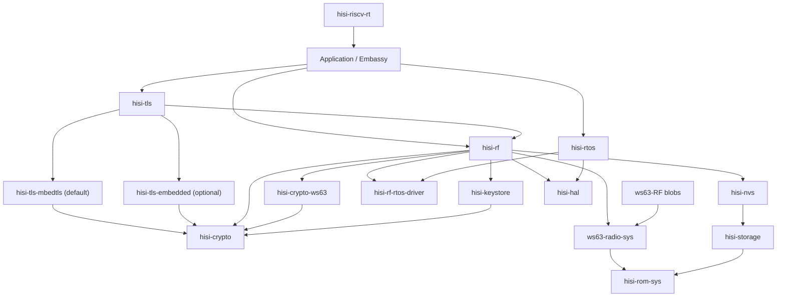

# RF5 之后的 HiSilicon Connectivity 全栈重构计划

## 状态

**当前执行窗口已闭合：U0-U4 已完成，下一产品 gate 尚未自动启动。** A5F 单依赖 facade、A5B 默认 bounded backend、A5R conformance、
A5U caller-owned resource admission、typed diagnostics 和 template/resource-report
已经形成可用基线；有界执行、真实 key ownership、opaque facade/runtime 解耦、最终
release-train response-bound 和严格 QEMU/HIL marker contract 已形成基线，真实
controller/connect/control source-path failure injection 也已在 host、QEMU 和真机闭合。
A5UX 无板/API 收窄已经完成。仓库内 Rust SoftAP/STA 已完成 pure-WPA3 SAE/PMF
能力证明；后续矩阵又暴露过 PM 诊断时序、smoltcp burst 容量和 AP queue-0 停摆等彼此
独立的反例。UDP metadata 容量修正后，RTOS 审计进一步收窄 switch target ownership：
block/sleep/exit 的状态转换、target detach 和 pending ticket commit 现在属于同一调度器
临界区；对 detached pending target 修改优先级或 policy 时不再错误地重新插入 ready
queue。固定 AP/STA ELF 的最新配对 20-reset 矩阵达到 `20/20`，STA 本地 echo
`200/200`，AP 最终 echo 计数每轮达到 `10/10`，timer worker 持续前进。该结果关闭当前
release candidate 的可复现本地数据面反例，但不能从成功矩阵反推旧 run 4/run 10 的
唯一根因。`hisi-rtos` commit `7cbcd48` 已把 ticket 创建前的
`prepare-or-observe-resume` 决策纳入 production helper、受控 TLA+ 旧设计反例、Kani
和入口级 host regression，并由同一提交的 RTOS profile 与双板矩阵完成真机 parity；
`hisi-rtos 0.1.0-alpha.24` 又把完整 ready ownership 不变量落成有界诊断、host/Kani/TLA+
证据和严格双板 HIL 合同；pure-WPA3 固定 ELF 的 20-reset 矩阵为 20/20、STA echo
200/200，两侧 ownership/duplicate/bucket/link 计数均为零。该结果仍不反推旧反例的
唯一根因。
`hisi-rf-ws63 0.1.0-alpha.71` 与 `hisi-rf 0.1.0-alpha.83` 已把命名 WS63
station profile 切到 bounded runner；legacy blocking backend 只在显式
`legacy-blocking-backend` feature 下保留一个迁移周期作为 oracle。A5 的 bounded 默认路径、
release contract 和双板 WPA2/WPA3 gate 已闭合；父仓 `v0.7.0-alpha.7` migration snapshot
与 B0 BLE archive/symbol/ABI closure 均已发布。B1 controller/host init 与 B2
advertising/scanning、B3 GATT、S0 SLE archive/ABI closure、S1 announce/seek、S2
connect/disconnect 与 S3 SSAP read/notification 已完成。产品 gate 已选择先收敛用户可见
radio API；U0 冻结迁移输入，U1 建立 facade-owned BLE/SLE composition preview，U2 已用
双板 20-reset 关闭 typed GAP/announce/seek，U3 又以 BLE/SLE 各 20/20 关闭 static typed
GATT/SSAP database，U4 又以 BLE/SLE 各 20/20 双板矩阵闭合 async
event/cancellation/lifecycle。不自动启动 coexistence、pairing 或稳定 API 工作。
U4 的无板实现已由 `hisi-rf-core` commit `fc7435f`、`hisi-rf-ws63`
commit `e04565a` 与 `hisi-rf` commit `a9401fd` 形成闭包：bounded event plane、
generation-tagged active guard、显式 `stop(self).await`、Drop best-effort cleanup、
重复 start/stale lifecycle fail-closed、backend stop callback 和 public API leak gate
均已通过 host tests、clippy 与 BLE/SLE RV32 check。固定 BLE/SLE lifecycle 镜像又分别
通过 3/3 shape gate 与 20/20 paired nRST matrix，因此 U4 已完成；这仍不表示 API stable。
vendor oracle 与旧 facade 仍分别受“一个迁移 release”和“不早于父仓 v0.8.0”的删除门槛
约束；它们不会被后续 BLE 里程碑扩张。
跨计划优先级和依赖以
[工程计划注册表](README.md)为准。

## 概要

A0-A5 的 **Wi-Fi connect → sustained local traffic** 基线已经冻结，独立 `hisi-rf`
垂直切片、pure-WPA3 双 WS63 fixture、bounded runner、资源准入和严格 release contract
均已通过提交态真机 HIL。当前产品方向按既定顺序选择 BLE；B0 已冻结 archive、symbol、
ABI 和资源事实闭包，B1 已完成 controller/host init，B2 已完成 advertising/scanning，
B3 已完成 GATT client/server、notification/indication、断连清理和双板 20-reset HIL；
S3 也已完成 SSAP exchange、service discovery、read、notification 和断连的双板 20-reset
HIL。下一方向启动前仍必须保留
A4/A5 的 Wi-Fi 真机证据，不能为了协议扩张打断北极星。

目标架构参考 esp-rs 的
`esp-radio → esp-radio-rtos-driver ← esp-rtos`、`esp-rom-sys` 和
`esp-storage` 分层，但增加 HiSilicon 特有的 vendor NVS、SLE 和 post-link
relocation 层。`hisi-rtos` 同时承载 radio blob 所需的线程/IPC 运行环境和
Embassy executor/time 运行环境。

本计划是 RF5 之后的完整执行事实源。Init/Scan 的历史、当前证据和 RF5A-C
入口仍记录在 [WS63 RF Init/Scan 计划](ws63-rf-init-scan.md)；根
[`ROADMAP.md`](../../ROADMAP.md) 只保留优先级和里程碑，不复制本文细节。

更长期的 protection domain、跨芯片 port、host runtime 与 CLI-first observability
架构已作为 deferred outlook 记录在
[`hisi-rtos` 未来架构](hisi-rtos-future-architecture.md)；它不属于当前 A3/A4 gate。
通用 scheduler 语义、形式化模型与实现一致性 gate 另见
[RTOS 调度语义与验证计划](hisi-rtos-semantics-and-verification.md)；WS63 blob
兼容 profile 不得反向改写通用 RTOS 语义。

<a id="active-window-now-a5u-developer-ux-and-resource-admission"></a>
<a id="active-window-now-a5b-incremental-backend-prototype"></a>

## 当前执行窗口：U4 已闭合，等待下一产品 gate

本计划保留完整架构，但当前 WIP 限制是**一个主要里程碑**。B0 已固定实际使用的 BLE
vendor archive/hash、required-symbol ownership、target ABI 与标准 relocation 产物，并通过
`ws63-radio-sys 0.1.0-alpha.12` 发布。完整证据见
[BLE B0 archive/ABI closure](evidence/ws63-ble-b0-archive-abi-2026-08-06.md)。

B1 已交付 controller/host init、共享 transport、identity/NVS 读取边界和实际 blob 所需的
RTOS capability closure。`hisi-rf-ws63` commit `6cb2faf`、`ws63-radio-sys` commit
`4fa4e3f` 与 `hisi-riscv-rt` commit `760fe7d` 组成提交态闭包；默认 B1 ELF 在 3 MHz 完整
verify 后连续三次仅 nRST 均输出 `RFDBG_BLE_B1_INIT_OK`，异常为零。诊断路径曾证明 2 KiB
snapshot task 栈会下溢到相邻 calibration BSS，现已隔离为 opt-in 4 KiB 诊断栈；默认镜像
不链接异常/阶段 wrapper。完整证据见
[BLE B1 controller/host init](evidence/ws63-ble-b1-controller-host-init-2026-08-07.md)。

B2 已交付 advertising/scanning、bounded event queue 和真机 marker。提交态默认镜像在
两块 WS63 上完成 3/3 shape gate 与 20/20 paired nRST matrix；两侧每轮均输出
`RFDBG_BLE_B2_ADV_OK`、`RFDBG_BLE_B2_SCAN_READY` 和 `RFDBG_BLE_B2_SCAN_MATCH`，无
missing callback、command error 或 event drop。完整证据见
[BLE B2 advertising/scanning](evidence/ws63-ble-b2-advertising-scanning-2026-08-07.md)。

B3 已交付 GATT client/server、notification/indication 和断连清理。固定 v55
server/client ELF 先完成 1/1 与 3/3 shape gate，再以同一镜像完成 20/20 paired nRST
matrix；每轮完整经过 scan、connect、service/characteristic/descriptor discovery、notify、
indicate confirmation 和 disconnect，且 missing callback、event drop 与 command error 均为零。
完整证据见 [BLE B3 GATT](evidence/ws63-ble-b3-gatt-2026-08-07.md)。

S0 已固定 `libbth_gle` 及共享 BT archives 的 hash、target ABI、external owner、标准
relocation 产物和保守 memory envelope。`ws63-radio-blob` 通过 Cargo 分发 normalized
`libbth_gle.a`，`ws63-radio-sys --features sle` 校验精确 profile revision；Linux、macOS、
Windows consumer CI 均使用同一 Cargo contract。完整证据见
[SLE S0 archive/ABI closure](evidence/ws63-sle-s0-archive-abi-2026-08-07.md)。

S1 已建立独立 rooted init、announce/seek、bounded event ownership 与双板 marker。固定
announce/seek 镜像完成 3/3 shape gate 和 20/20 paired nRST matrix；每轮双方 init、announce、
seek-ready 和 peer-match marker 完整，missing callback、command error 与 event drop 均为零。
完整证据见 [SLE S1 announce/seek](evidence/ws63-sle-s1-announce-seek-2026-08-07.md)。

S2 已建立 connect/disconnect 状态、bounded connection event 与双板 marker。固定
server/client 镜像先通过 3/3 shape gate，再完成 20/20 paired nRST matrix；每轮双方均观察
到 connected/disconnected，missing callback、command error 与 event drop 均为零。完整证据见
[SLE S2 connect/disconnect](evidence/ws63-sle-s2-connect-disconnect-2026-08-07.md)。

S3 已建立 SSAP exchange、primary-service discovery、property read、server notification、
client disconnect 和 bounded data event。固定 server/client 镜像先通过 3/3 shape gate，
再以同一镜像完成 20/20 paired nRST matrix；所有轮次 missing marker、command error 与
event drop 均为零。完整证据见
[SLE S3 SSAP](evidence/ws63-sle-s3-ssap-2026-08-07.md)。

本证据不包含 pairing、authenticated SSAP 或 client write。中间 pairing 诊断镜像稳定返回
`0x8000600c` (`ERRCODE_SLE_AUTH_FAIL`)，且两板 TRNG 均为 152 bytes、7 requests、0 failures；
因此 pairing 被移出 S3 临界路径并保留给独立 security/UX gate，而不是被标记为成功。

S3 后的产品 gate 已选择 Radio UX/API convergence。U0 由 `hisi-rf-ws63` commit
`2e0136c` 冻结 B3/S3 stage API、archive profile 和迁移映射；U1 由 `hisi-rf` commit
`9a600a8` 建立 `profile-ble-dual-role` / `profile-sle-ssap`、facade-owned storage、
resources、`RadioController::split()`、协议 handle 和 backend-owning `RadioRunner`。
public-api gate 明确拒绝泄漏 `hisi-rf-ws63`、raw sys 或 RTOS-driver 类型。U1 不提供假的
控制命令或事件流；typed control/event 仍属于当前 U2-U4。完整证据见
[Radio U0/U1 facade ownership](evidence/ws63-radio-u0-u1-facade-2026-08-07.md)。

U2 已把 chip-neutral validated BLE GAP 与 SLE announce/seek 配置、单命令 bounded mailbox、
controller/runner ownership 和 WS63 backend adapter 接入 facade。固定四个 ELF 先分别完成
3/3 shape gate，再完成 BLE 与 SLE 各 20/20 paired nRST matrix；每轮均到达 facade-owned
advertise/scan 或 announce/seek marker，missing marker、command error、panic 与 event drop
均为零。完整证据见
[Radio U2 typed control](evidence/ws63-radio-u2-typed-control-2026-08-07.md)。

U3 已完成实现与真机闭包：`hisi-rf-core` commit `e6e52ca` 定义静态 typed GATT/SSAP
database，`hisi-rf-ws63` commit `f0626ac` 集中完成 WS63 raw ABI 转换与 backend-owned
value storage，`hisi-rf` commit `f2fad72` 只暴露 facade command 和 opaque server handle。
host tests、host clippy、RV32 check 与 public-api leak gate 均通过。固定 BLE source/observer
镜像已在 3 MHz 完整 verify 后通过 3/3 shape gate 与 20/20 paired nRST matrix；每轮均完成
typed GATT registration、advertising 和 peer scan。固定 SLE source/observer 也以同一
FlashPlan + 3 MHz + 完整 verify 契约烧录，并通过 3/3 shape gate 与 20/20 paired nRST
matrix；每轮均完成 typed SSAP registration 和 peer seek，missing/failure marker 为空。
U3 至此关闭，唯一 WIP 切换到 U4。完整证据见
[Radio U3 static databases](evidence/ws63-radio-u3-static-databases-2026-08-08.md)。

U4 已完成实现与真机闭包：`hisi-rf-core` commit `fc7435f` 提供 bounded protocol event
transport，`hisi-rf-ws63` commit `e04565a` 接入可取消 BLE/SLE lifecycle，`hisi-rf`
commit `a9401fd` 提供 generation-tagged active guards、显式 `stop(self).await` 与 Drop
best-effort cleanup；fixture scheduler handoff 由 commit `cdcac5c` 固定。四个固定 ELF 在
3 MHz 完整 verify 后，BLE 与 SLE 分别通过 3/3 shape gate 和 20/20 paired nRST matrix，
missing/failure marker 均为空。U4 至此关闭；完整证据见
[Radio U4 lifecycle](evidence/ws63-radio-u4-lifecycle-2026-08-09.md)。

### A5 收口证据账本

A4/W2/A5 已交付 facade、标准 relocation、三平台 consumer、bounded protocol、
caller-owned resources、typed diagnostics、template/report 和严格双板 release gate。以下
保留历史反例与收口证据，不能把旧失败改写成单一根因，也不再作为当前 WIP：

1. 公开 `wifi_connectivity` 已把 A5B 与完整 connectivity contract 收敛到同一
   release-train ELF；较早矩阵曾取得 20/20，但 2026-07-29 的后续 unchanged-image
   20-reset 矩阵只有 18/20 完整通过。原始记录显示两次失败均已完成
   scan/connect/WPA/DHCP，但 gateway 仍各收到 `1/5`，公网 ICMP 为 `0/5`；它们不能归类为
   本地数据面全丢。另一轮 r3 的公网全丢样本分别仍有 gateway `2/5` 和 `5/5`。真正的
   gateway/public 同时 `0/5` 只在后续 PM-off A/B 中复现一次，继续作为本地路径风险。
   这些矩阵均无 auth-response-2 timeout、event drop、FRW 同步消息 timeout 或 DHCP
   失败。公网 ICMP 不再作为硬 pass/fail gate；当前临时本地门槛为 DHCP 成功并至少收到
   一次 gateway reply，公网 AliDNS ICMP 仅记录丢包。后续用 UDP DNS response 和受控
   同 LAN echo 替换临时门槛。`hisi-rf-radio-diagnostics/v5` 通过 capability
   mask 明确区分“已测量”和“当前不可观测”：窄诊断已覆盖 smoltcp TX、vendor TX
   submission、DMAC TX completion/RX prepare、vendor/Rust RX、WLMAC RX counters、
   ICMP/DHCP seam、IRQ 40/44/45、packed RX filter control，以及不泄露地址值的
   STA/BSSID identity 状态，当前 `path_caps=0x3f`。PAC/HAL 只读快照加入后的
   两轮同镜像复测分别为 `18 pass + 2 public ICMP loss` 和
   `15 pass + 3 connect failure + 2 public ICMP loss`；失败轮的 WLMAC/DMAC/IRQ 仍持续
   计数。显式关闭 STA power save 的诊断 A/B 为
   `17 pass + 2 connect failure + 1 local data-path failure`，没有超出基线波动，也没有消除
   gateway/public 同时全丢，因此省电不是已证实的唯一根因，正常 profile 保持 vendor
   默认策略。随后自 SVD 向上修正 packed filter-control 语义和 VAP0 STA/BSSID
   网络字节序，最终真机取得 gateway/public 各 `5/5`、STA address match 和 BSSID
   programmed marker；这只关闭寄存器语义子问题，不替代重复 reset reliability gate。
   随后的同镜像 20-reset 矩阵得到 19 次完整连接、gateway `95/95`、公网 `86/95`，
   另有 1 次两次 scan attempt 均 operation timeout。加入 v7 scan snapshot 并发布
   public-ICMP 重分类后，新一轮 20-reset 没有复现 scan timeout，但只有 19/20 通过：
   gateway `94/100`、AliDNS ICMP `92/100`；run 10 完成 scan/connect/DHCP 后
   gateway/public 均 `0/5`，属于 `local_data_path_failure`。旧
   `RF5A_ARP_OK` 实际由首个 ICMP reply 触发，因此该轮只能证明没有 ICMP reply，
   不能倒推出 ARP reply 一定没有到。两轮都没有 auth-response-2 timeout。当前必须
   同时保留 scan reliability 和本地 ARP/RX 尾部风险：前者用 v7 scan snapshot
   定位；`hisi-rf-radio-diagnostics/v8` 已增加双向 ARP request/reply、IPv4 和
   other frame 分类计数，示例输出 `RFDBG_A5B_L2`。v8 同镜像矩阵的 19 个成功轮
   全部带 L2 快照：gateway `95/95`、AliDNS `94/95`，ARP reply 每轮为 1，
   RX IPv4 为 12--44；唯一失败轮在 association operation 返回 `backend.other`，
   未进入 DHCP/L2，不能归类为公网 ICMP 或本地数据面失败。该轮 runner 单步最大
   1937 ms、association ioctl 最大 2040 ms，event drop 和 auth-response-2 timeout
   均为 0。该阶段的新矩阵未复现旧本地反例，但 A5B 当时仍未达到 20/20；不能用增加盲目重试或
   放宽公网 ICMP 门槛掩盖。
   marker-contract-v2 随后以直接 L2 ARP reply 作为本地门槛，以 AliDNS/Baidu DNS
   固定 A 查询作为公网协议门槛。单目标首轮矩阵为
   `17 pass + 2 public_dns_failure + 1 connect_error`：两个 DNS 失败轮均有 DHCP、
   ARP reply、零 queue drop 和三次无 tx error 的 AliDNS timeout；connect failure
   仍停在 association。加入第二 DNS 交替冗余后，同一 release closure 以 1 MHz
   verified download 烧录一次，再连续 20 次 nRST，得到 `20 pass`、20/20 合法 DNS
   response、20/20 ARP reply、`auth_rsp2_timeouts=0`、queue/backend error 为 0，
   runner 单步最大 37 ms。该结果关闭当前 A5B release acceptance；旧 ICMP/本地尾部
   反例仍保留为历史诊断证据，不再定义现行 pass/fail marker。
   2026-08-03 又完成一轮双 WS63 角色分离验证：一块板运行 C SDK SoftAP oracle，另一块
   运行公开 `wifi_connectivity` 增量路径。STA 完成 upstream WPA2、DHCP、本地 ARP 和
   lease renew；该隔离 AP 未下发默认路由，因此严格契约要求
   `RF5C_PUBLIC_DNS_SKIP reason=no-default-route` 与零 DNS 计数，而不是伪造公网成功。
   随后修复 scan retry 未消费前次 terminal event 的队列所有权问题，并保持公开 scan
   marker 的既有顺序。对同一已验证 STA 镜像连续执行 20 次 nRST，得到 20/20 完整
   upstream WPA2、DHCP、direct ARP、local-data-path 和 lease-renew contract，零
   auth-response-2 timeout、event drop、runner error 或 allocation failure；runner 单步
   最大 35 ms。隔离 AP 未下发默认路由，因此 20 轮均按契约跳过公网 DNS。该矩阵关闭
   A5B repeated dual-board local connectivity parity，不替代 Rust SoftAP、routed UDP DNS
   或 pure-WPA3 gate。证据见
   [A5B dual-board local-neighbor parity](evidence/ws63-rf-a5b-dual-board-local-neighbor-2026-08-03.md)。
   随后双板对端从 C SDK oracle 切换为仓库内 Rust `wifi_softap`：AP 自身提供固定
   `192.168.4.1/24`、DHCP 和 bounded UDP echo，STA 通过公开 facade 完成 upstream
   WPA2、DHCP、direct ARP、sequence-checked UDP echo 和 lease renew，RX queue drop
   与 AP vendor TX failure 均为 0。该隔离 fixture 有意不下发默认路由，因此公网 DNS
   继续按契约跳过。当前发布 gate 使用配对复位：每轮先 nRST AP、等待 `READY`，再 nRST
   STA；三轮 AP `boot/READY` 均为 20/20。AP 常驻、只复位 STA 可作为区分 AP 启动时序与
   STA 接收路径的差分实验，但不能替代配对复位 gate。证据见
   [A5B Rust SoftAP local connectivity](evidence/ws63-rf-a5b-rust-softap-local-connectivity-2026-08-03.md)。
   2026-08-04 的 Rust WPA3 SoftAP + upstream-native WPA3 STA 三轮矩阵累计
   `58 pass + 2 local_data_path_failure`。60 轮均完成 pure-WPA3 SAE、required PMF、
   association 与 DHCP，且无 auth-response-2 timeout。两个失败轮中 AP 收到并提交全部
   10 个 echo reply，STA request TX completion 全为成功，但 STA 上层没有收到 reply；
   当前风险已收窄到 AP reply submission 之后、STA Rust-visible L2 RX 之前。后两轮各
   20/20 不能覆盖该反例。证据见
   [双板 pure-WPA3 可靠性](evidence/ws63-rf-dual-board-pure-wpa3-reliability-2026-08-04.md)。
   后续诊断镜像还复现过 STA MAC/DMAC/HMAC/Rust RX 与 IRQ45 同时停止增长、AP 未收到
   echo request 的另一种形态；该轮 TX pbuf ownership 正常，BSSID 清零发生在 RX 冻结后。
   下一提交态矩阵必须同时采集两板 echo correlation 与 IRQ45 lifecycle，不能把两类反例
   合并为一个未经证明的根因。
   关闭 STA power save 的 20-reset A/B 只有 `15 pass + 5 local_data_path_failure`，因此
   power save 已被排除为充分根因。随后 STA 网络 runner 开始在 DHCP、local echo、DNS 和
   steady-state 全阶段消费 late `Disconnected`，断链时终止旧 IP 生命周期并复用已扫描
   BSS 重连。对应提交态矩阵为
   `16 pass + 3 local_data_path_failure + 1 scan_error`；3 个本地失败均保留 programmed
   BSSID、enabled IRQ45 和部分 echo reply，说明 lifecycle 修复关闭了 stale-link 缺口，
   但没有关闭 AP reply 可靠性。SoftAP RTOS snapshot 又发现优先级 0 vendor task 的
   `max_ready_latency_ms` 约 340 ms；当前 A/B 只把 adopted application thread 设为 5 ms
   `Preemptive`，vendor task profile 保持不变。新 AP/STA 均完成 3 MHz 完整 verify，随后
   OSAL receive-wait 终态矩阵得到 `18 pass + 2 local_data_path_failure`。失败轮分别收到
   `4/10` 与 `3/10` reply；两板 FRW wait/wakeup、task dispatch、IRQ45 与 HMAC RX 都继续
   前进，因此永久漏唤醒和 adopted-main 旧调度延迟都不是充分根因。run 6 有 4 个 request
   未到 AP Rust echo 层；run 19 中 AP 已观察并提交全部 10 个 reply。下一步必须用 completion
   packet number + timestamp 绑定异步 TX 归属，再区分 AP MAC completion、空口与 STA
   lower-RX，不能用 5 ms 即时 delta 代替修复。随后门槛修正后的提交态矩阵仍为
   `18 pass + 2 local_data_path_failure`，两次均是真实 `0/10`；AP 已生成并提交 reply，
   软件 q0 仍持有 7 个 PPDU/MPDU，硬件 data queue 为空且 TX completion 为 0。随后修复
   scan completion/timeout 的原子线性化，并以不可变 AP/STA identity 执行第二轮
   20-reset：20/20 完成 scan、pure-WPA3 association 和 DHCP，但结果为
   `18 capture_timeout + 2 local_data_path_failure`。AP 每轮提交 3--5 个 data frame，
   hardware data queue 每轮保持非空（主要为 `0x80010101`），过滤后的 data completion
   则始终为 0。因此当前诊断边界已越过软件队列出队，收敛为 hardware data queue 的
   credit、调度触发、ownership 与 completion 分类，而不是继续泛化为整个 RX/TX 路径。
   ROM callback table 的后续只读核对确认当前 profile 的 TX scheduler callback ID 为
   239 且已安装；此前读取 ID 238 得到 0 是诊断错误，不能说明 hook 缺失。直接用 linker
   `--wrap` 观测 ROM scheduler symbol 会让 AP 停在 init，已从默认路径移除；后续只允许
   不改变 ROM symbol resolution、RF layout 和 artifact identity 的诊断方式。
   `hisi-rf-ws63` commit `0e679e0` 随后把 completion 时间线扩展到四个 WMM data AC，
   并删除 completion callback 返回后的 vendor-private queue/VAP snapshot。父仓 closure
   为 `6cca7d227`，AP ELF SHA-256 为
   `6f9c7b0a3ae32e8d617a136cbbff0b060dfebe5ff23f8ad5688b1e2f8c7cd9f7`。
   对该 AP 与不变的 r17 STA 执行 20 次配对 nRST，20/20 完成 AP ready、scan、
   pure-WPA3 association 和 DHCP，`auth_rsp2_timeouts=0`；顶层仍为
   `20 capture_timeout`。AP 每轮都收到并提交两个 echo reply，并稳定记录
   `data_tx_submit_total=5`、`data_tx_completion_total=10`，其中 queue 3 八项、queue 0
   两项；STA 仍没有 local-data-path success marker。当前风险因此已越过 AP hardware
   completion，后续聚焦空口与 STA lower-RX/filter/decrypt 交付。
   后续 A/B 修正了这项归因。上述 STA profile 在 association 前启用了无响应的
   `diagnostic-disable-sta-pm`；移除该 feature、但保留全部 data-path diagnostics 后，
   当前源码先后达到 `3/3` 与 `19/20`。然而在失败 ELF 中等长旁路 PM UAPI 调用仍为
   `0/3`，因此只能判定该诊断 profile（含布局变化）不可靠，不能把根因缩写为 PM UAPI
   本身。随后发现 smoltcp 共享 UDP socket 只有一个 RX metadata 槽，SoftAP echo socket
   只有两个；扩大为 bounded burst 容量后，三轮从 `30 sent / 19 received` 恢复为
   `30/30`。修复由 ws63-examples commit `ca5c978`、父仓 closure `ef96628bf` 提交。
   提交态 20-reset 仍为 `18 pass + 2 local_data_path_failure`：正常轮中 17 轮 `10/10`、
   一轮 `7/10`，两个失败轮 `0/10`。失败 AP 已生成 echo，但 queue 0 没有 completion，
   software queue 非空且 hardware queue 空闲；成功轮则有十个 queue-0 completion 并清空
   software queue。故该阶段剩余 blocker 是 AP queue-0 lost-kick/调度闭环，不是 smoltcp
   socket burst、STA PM 或已经完成的 queue-3 completion 分类。一次 event-return 后的
   scheduler 补踢实验因检查时 queue 0 仍为空且 text layout 改变而 `0/3`，已撤销；后续
   诊断必须保留最终布局并观测真实 enqueue/schedule 线性化点。当前首要可证伪假设是
   queue-0 的 delayed reschedule timer 丢失或未重臂：原厂链路经 OSAL base timer、FRW
   message 55、DMAC timeout list，最终调用 `dmac_tx_sched_timer_handler ->
   dmac_tx_schedule`。下一次 stalled 终态先用 debugger 只读检查 timer 与有限 timeout
   list；只有确认对应 q0 timer 已 overdue，才受控触发一次既有 timeout/message 或
   `dmac_tx_schedule(device, 0)`。这项诊断不得先修改 RF text 或改变最终布局。
   reply 门槛只把 `2/10`、`4/10` 归为可达但有丢包，绝不把 `0/10` 放行。
   完整证据见
   [双板 pure-WPA3 可靠性](evidence/ws63-rf-dual-board-pure-wpa3-reliability-2026-08-04.md)
   和 [A5B data-path diagnostics](evidence/ws63-rf-a5b-data-path-diagnostics-2026-07-29.md)。
2. A5U 的失败注入必须穿过真实 production control/connect 路径；外部 fixture 必须持续
   精确锁定当前 facade release 和其 core/backend release closure。
3. QEMU/HIL gate 已执行相同 marker contract，缺 marker、非零 drop/error、budget
   violation、ELF/profile/hash 不一致均 fail closed。统一 parser、artifact identity、
   QEMU contract-only target fixture、credential-free HIL init/scan 和最终完整
   `wifi_connectivity` 20-reset 镜像均已闭合。

2026-08-02 起实验台具备两块独立 WS63，可分别承担 AP/STA，后续也可用于 BLE/SLE
对端测试。WPA2 双板本地 ARP/UDP echo 已闭合；随后 Rust SoftAP 增加 WPA3 authenticator
profile，并与 STA 共用仓库固定 HIL 配置。每个 rig 的 probe-rs selector、J-Link serial、
UART 与角色必须显式绑定，禁止依赖 USB 枚举顺序。双板能力和单次 AP 启动 marker 不自动
关闭 pure-WPA3 门槛，仍须让提交态同一镜像的最终 SAE-only 20-reset 矩阵无本地数据面反例；BLE/SLE 继续遵守 WIP=1，
在当前 Wi-Fi A5 收口后再启动。

命名 WS63 profile 当前使用 bounded backend；显式 legacy blocking profile 只保留为迁移
oracle。BLE、SLE、
TLS、Enterprise 和完整 SoftAP 产品化不与当前 A5 并行；作为 SAE-only 对端的有界
`wifi_softap` fixture 属于当前验证设施。

### 已完成 -- A3 收口

1. 已将每轮单次 ping 扩为每个目标 5 次；20 次 nRST 得到 WPA2/DHCP/ARP 20/20、
   公网 `88/100`、gateway `0/100`。后续 RF seam 矩阵证明 queue-full drop 为 0、
   high-water 为 1/4，应用收到的 Echo Reply 与 `driverif_input` 逐包一致。
   同一 Guest AP 上的 Mac 通过 `-b en0 -S 192.168.155.9` 强制 Wi-Fi 路径后，
   gateway 同样 `0/20`、公网同样 `88/100`，因此剩余现象已有量化环境边界，
   不回写成认证、RTOS 或 Rust RX queue 回归。
2. Q3 archive-bound task profile 已对当前 payload 闭合：只记录真实生成的 vendor task，
   以 archive hash、entry symbol、vendor priority、Q2 metrics 和
   `critical`/`worker`/`background`/`unknown` 角色绑定事实。角色未知时必须保持
   `unknown`；profile 第一阶段不改变 runtime policy。
3. Q4 已按 Q2 数据作出当前 payload 的显式决策：所有 vendor task 保持 Cooperative，
   不启用 per-thread `Budgeted` 或 group quota；没有 measured minimum-service demand，
   因此不实施 Reservation。payload/task-set 变化时必须重开 Q3/Q4。
4. reset matrix、调度不变量、版本、submodule pointer、profile revision、quota decision
   和网络归因已经冻结。完整收口见
   [A3 network attribution](evidence/ws63-rf-a3-network-attribution-2026-07-14.md)。

### 已完成 -- A4 Wi-Fi 垂直切片

A4 的第一条完整 vertical slice 已在 WS63 上运行：`RadioController`/`RadioRunner`、
`WifiController`/`WifiDevice`、bounded event queue 和应用持有的长生命周期 smoltcp
runner 已完成 init/scan/WPA2 connect、DHCP、neighbor discovery、重复 ICMP 和 lease
renew。`hisi-rf 0.1.0-alpha.1` 已发布，迁移 facade 有明确删除窗口，提交态
`ws63-hil` workflow 已 PASS。冻结证据见
[A4 Wi-Fi vertical slice](evidence/ws63-rf-a4-vertical-slice-2026-07-14.md)。

### 已完成 -- W2 上游 Supplicant 与 WPA3-Personal

W2 的当前状态、提交证据和完成门槛只维护在
[W2A-W2F 执行账本](#w2-upstream-supplicant-and-wpa3personal)；本 Active Window 不复制
逐阶段状态。当前硬约束是：W0B WPA2-only archive 和 A4 真机 gate 在整个迁移期间持续
回归；pure-WPA3 证据只由仓库固定配置的双 WS63 Rust SoftAP/STA fixture 产生，不读取
开发主机环境中的 Wi-Fi 凭据，也不把 transition-mode 或 WPA2 AP 写成 pure-WPA3 证据。

W3-W4、B/S/X、NVS/RTOS future、ported switch ticket、group Reservation、AP1 fast
path、i18n、BSP 和 Hi3322 均为 deferred/triggered backlog，不是当前 TODO。

A5F single-dependency facade、A5U caller-owned resource admission 和 A5B bounded host
prototype 已形成基线；发布的命名 profile 已选择 bounded adapter。上述审计项闭合前不删除
vendor oracle、不切换唯一默认 supplicant/backend，也不把无板证据写成 WPA3
真机稳定性结论。

## 目标架构



依赖方向必须保持单向：RTOS 不依赖 RF；NVS 不知道 RF key；ROM sys 不依赖
HAL；RF 不实现 IP stack；examples 不直接列 vendor archives 或 ROM 地址。

## 组件边界

| 组件 | 职责 |
| --- | --- |
| `ws63-RF` | Language-neutral blobs、headers、ROM symbol/patch lists；不放 Rust 实现。 |
| `hisi-rom-sys` | 芯片中立的显式 chip-selection facade；统一 re-export ROM facts，并转发 backend Cargo metadata。 |
| `hisi-rom-sys-ws63` | WS63 固定 ROM 地址、生成 symbol/callback/patch metadata 与同步工具；位于 `crates/chips/ws63/`。 |
| `ws63-radio-sys` | WS63 Wi-Fi/BLE/SLE raw FFI、archive selection、ABI/layout assertions 和 relocation 规则；拥有 pinned hostap source metadata、最小 supplicant raw ABI 与 WS63 driver/L2 integration。仓库同时发布 host CLI `hisi-rf-link`。 |
| `hisi-rf-rtos-driver` | runtime-neutral scheduler、semaphore、queue、timer、wait 和 ISR-wakeup contract；每个 firmware 只能注册一个实现。类型中立不等于语义留白：priority、timeout、handoff、ISR wake、lock 和 task identity 必须由版本化 profile 与 executable conformance suite 固定。 |
| `hisi-rtos` | 默认单-hart、优先级抢占、tickless scheduler，以及 IPC、Embassy executor/time integration；不依赖 RF。 |
| `hisi-alloc` | 用户提供 SRAM arenas、对齐分配，以及可选 C/global allocator adapter；移出 RF heap 所有权。 |
| `hisi-storage` | runtime internal-flash access 和 `embedded-storage` traits；memory-mapped read 优先，erase/write 暂留 unstable。 |
| `hisi-nvs` | WS63 ACPU KV page parser、CRC、partition selection 和 typed read API；RF item IDs 由 RF crate 定义。 |
| `hisi-crypto` | 芯片中立的小粒度密码能力契约、敏感类型和 RustCrypto 软件实现；不承载 TLS、网络状态机或芯片寄存器。 |
| `hisi-crypto-ws63` | WS63 cipher accelerator、ROM UAPI、TRNG、key slot、独占资源、超时和硬件错误；失败时禁止静默回退软件。 |
| `hisi-keystore` | `KeyHandle`、不可导出密钥、用途权限，以及 eFuse/OTP/受保护 Flash 策略；`hisi-nvs` 不拥有密钥策略。 |
| `hisi-tls` | 后端中立的 async TLS facade 和安全字节流入口；拥有 transport/BIO 与 `WANT_READ`/`WANT_WRITE` async 映射，不重写 TLS。 |
| `hisi-tls-mbedtls` | 默认 TLS backend；mbedTLS 作为无 OS 协议库，通过 `hisi-tls` BIO 对接 Rust 网络栈，不依赖 LiteOS socket。 |
| `hisi-tls-embedded` | 可选 `embedded-tls` backend，复用同一 transport、entropy、time 和 allocator contract。 |
| `hisi-rf` | 用户入口和安全的 `wifi`/`ble`/`sle`/`coex` API；拥有 blob adapter，不拥有 scheduler、allocator、NVS format、ROM symbols 或 IP stack。 |
| `hisi-hal` | `hisi-riscv-hal` 在 0.6.0 stable 之后的新 package/repository 名；继续拥有多芯片 peripheral drivers，不吸收 RF/RTOS/storage policy。 |
| `hisi-riscv-rt` | startup/trap/linker mechanism；收集 memory-profile descriptor 和 init hooks，不知道 Wi-Fi/BLE/SLE policy。 |

所有新组件使用独立 Git 仓库、`Cargo.lock`、CI、版本和 release；父仓以 submodule
固定开发版本。`ws63-radio-sys` 与 `hisi-rf-link` 同仓同版本，因为 blob ABI 和
relocation 规则必须原子升级。闭源 archive 未确认 crates.io 重分发边界前，
`ws63-radio-sys` 只通过 GitHub release/submodule 交付。

固定依赖方向为 `Application -> hisi-tls -> hisi-crypto`；WPA、BLE 与 SLE security
从 `hisi-rf` 依赖 `hisi-crypto`，firmware verification 也只依赖 `hisi-crypto`。
WPA supplicant 不属于 TLS；只有 Enterprise 的 EAP-TLS profile 可以依赖 `hisi-tls`。

## 公共契约

### RTOS 与 Embassy

- `hisi-rtos::start(config, timer0, soft_interrupt0, resources)` 一次性启动
  tickless、priority-preemptive scheduler。重复启动返回 `AlreadyStarted`。
- 初始 context switch 保存全部整数寄存器、`tp`、`mstatus`、`fcsr` 和全部浮点
  寄存器；只有 HIL 证明 lazy FP save 正确后才允许优化。
- TIMER_INT0 负责最早 deadline/time slice，WS63 software interrupt 负责立即
  reschedule；ISR 只记录/唤醒，调度和用户代码在退出中断后执行。
- `hisi-rtos` 提供 thread-mode Embassy executor 和唯一的 Embassy time driver。
  HAL 现有 time driver 保留一个 minor 的 deprecated 迁移窗；外设 async traits
  继续属于 HAL。
- 原厂 WS63 LiteOS 只作为 task-context、调度和 IRQ 行为 oracle，不进入产品依赖图，
  也不建立或维护 LiteOS backend。`hisi-rtos` 是唯一 native backend；
  `ws63-radio-sys`/WS63 ABI shim 只把 blob 实际引用的 `LOS_`/`osal_` 符号映射到
  `hisi-rf-rtos-driver` 小能力契约。该符号集合由 `nm -u`/link manifest 固定，新增
  未满足符号必须使 CI 失败。
- scheduler/IPC 对 blob 的入口只通过 `hisi-rf-rtos-driver` 注册宏导出的固定
  Rust ABI；链接到零个或多个实现都必须失败。
- scheduler state、RunPolicy、IRQ epilogue、timeout race、priority inheritance
  和 budget replenishment 的通用 contract 以
  [RTOS 调度语义与验证](hisi-rtos-semantics-and-verification.md) 为唯一计划事实源；
  A3 evidence 只证明已列出的实现/真机场景。

### 存储与 NVS

- `hisi-storage` 稳定面只承诺 memory-mapped read 和边界检查。erase/write 必须在
  RAM/ROM 中执行，并处理 SFC、cache、interrupt 和 XIP 约束；在掉电 HIL 前保持
  `unstable-write`。
- 初始稳定 API 为
  `hisi_nvs::NvReader<S>::read(NvKey, &mut [u8]) -> Result<usize, NvError>`。
  它校验 page header、反码、record bounds、state、encryption flag 和 CRC。

### 密码能力、密钥与 TLS

- `hisi-crypto` 是“芯片中立的密码能力契约 + RustCrypto 软件实现”，不是统一承包所有
  算法、硬件和协议的 provider。模块边界固定为 `error`、`hash`、`mac`、`cipher`、
  `aead`、`rng`、`kdf`、`signature`、`secret`、`key`、`software`；WS63 寄存器、ROM
  UAPI、key slot 和硬件资源只进入 `hisi-crypto-ws63`。
- `hisi-crypto` 优先直接采用生态 traits：`digest::{Digest, Update, FixedOutput, Mac}`、
  `cipher::{KeyInit, BlockEncrypt, BlockDecrypt}`、`aead::{AeadCore, AeadInPlace, KeyInit}`、
  `rand_core::{TryRng, TryCryptoRng}`、`signature::{Signer, Verifier}`，以及 `zeroize`、
  `subtle`、`pbkdf2`、`hkdf`。具体名称以锁定依赖版本为准；只有错误、阻塞和状态语义
  严格匹配时才直接实现标准 trait。
- 对 busy、clock、DMA/alignment、ROM UAPI、timeout、reset 等可失败能力，提供小粒度
  `TryHash`、`TryMac`、`TryBlockCipher`、`TryAeadInPlace`、`EntropySource`，不继续扩张
  当前单体 `CryptoProvider`。标准 trait 无法表达硬件失败时，不允许用 panic、无限等待或
  隐式状态掩盖错误；可在能力语义严格匹配后，从 `Try*` contract 提供标准 trait adapter。
- 协议层可定义窄的 `Wpa2Crypto`、`TlsCrypto`、`VerifyCrypto` profile，只表达协议最小
  能力集合，不取代底层通用 trait；具体 backend 由显式 `CryptoSuite<H, M, A, R>` 组合。
- 第一阶段硬件契约是有界超时的同步 API：通过独占 token 管理引擎，不在 critical
  section 中等待，不在 IRQ/锁中调用用户逻辑。DMA/IRQ 证据成熟后再增加独立
  `AsyncTry*` 接口。
- `EntropySource` 表示原始 TRNG；CSPRNG/DRBG 负责播种与重播种。TLS 随机请求不能每次
  直接同步读取慢速 TRNG。TRNG 优先实现 `rand_core` 的可失败接口。
- 可导出的 `SecretBytes` 必须 `ZeroizeOnDrop`；不可导出密钥使用包含 slot 与
  `KeyUsage` 的 `KeyHandle`/`KeyRef::Handle`，不提供读取字节的 API。
- backend 只能在构造、feature 或资源注入时显式选择。`hisi-crypto-ws63` 操作失败后
  禁止透明切到 RustCrypto；混合 hash/AES/RNG suite 也必须由类型显式组合。
- 推荐依赖链固定为 `protocol profile -> standard/fallible capability traits ->
  RustCryptoBackend 或 hisi-crypto-ws63 -> ROM/cipher accelerator/TRNG`。协议 crate
  不得越过 backend 直接调用 ROM UAPI，硬件 backend 也不得反向依赖 WPA/TLS。
- `hisi-tls::TlsStream<T>` 对外实现 `embedded_io_async::{Read, Write}`；默认
  `hisi-tls-mbedtls`，可选 `hisi-tls-embedded`。transport 可接 `embassy-net`、
  `smoltcp` 或任意 `embedded-io-async` 流。
- NVS 首版只读。GC、双页切换、磨损管理和中途掉电恢复全部完成后，才讨论稳定
  write API。RF calibration/MAC key newtype 留在 `hisi-rf`。

### 射频协议

- `hisi_rf::init(RadioConfig, RadioResources)` 返回独占 `RadioController`；所有协议共享
  RF、IRQ、blob、memory profile 和 coexistence resources，禁止分别以 `Wifi::new()`、
  `Ble::new()` 抢占同一硬件。`split()` 返回
  `RadioParts { wifi, ble, sle, runner }`，且只产生编译时启用的协议 handle。
- `RadioRunner` 是必须持续 poll 的长期后台任务，唯一负责推进 blob、处理控制命令、
  ack/wake 和投递事件；协议 handle 不在调用者 task 中直接驱动 vendor scheduler。
- 当前 `WifiBackend` 的 `scan/connect/disconnect` 仍允许同步实现把完整操作包在一次 trait
  调用中；WS63 backend 内部轮询、sleep 或等待终态时会独占 `RadioRunner`。公共 async
  facade 不能掩盖这一阻塞语义。A5 必须把 backend 收敛为可取消、可唤醒、每次推进有明确
  work budget 的增量状态机；仅把现有 trait 改成 `async fn` 不算完成。
- 公共接口分四个平面，不能用一个“万能 Radio trait”抹平协议语义：
  - **配置面**：`RadioConfig`、`ScanConfig`、`StationConfig`、`AdvertisingConfig`、
    `SeekConfig`、`CoexistenceConfig`；使用 validated newtype、enum 与 secret type，
    不接受无约束裸 channel、interval、密码或 key bytes。
  - **控制面**：Wi-Fi、BLE、SLE 各自提供 inherent async API；状态机和错误保持协议语义。
  - **数据面**：只在存在成熟标准时实现 ecosystem trait，不发明自有通用 socket/IP 层。
  - **事件面**：有界队列 + `next_event().await`；后续可选
    `futures_core::Stream` adapter。ISR/blob callback 只复制 bounded event、更新小状态并 wake，
    绝不调用用户 callback。
- Wi-Fi 分离 `WifiController` 与 `WifiDevice`。前者以 `&mut self` 串行化
  `scan/connect/disconnect/wait_for_link`，明确 cancellation 与状态迁移；scan 使用调用者
  提供的固定结果 buffer，返回 `{ count, truncated }`。后者只提供 L2 RX/TX，主要实现
  `embassy_net_driver::Driver`，可选实现 `smoltcp::phy::Device`。
- Wi-Fi 提供 L2 device；按 feature 实现 `smoltcp::phy::Device` 和
  `embassy-net-driver`。DHCP、ICMP、TCP/IP sockets 属于 smoltcp/Embassy Net。
- `embedded-svc::wifi` 仅可作为兼容 adapter，不是核心 API 的事实源。
- BLE 第一阶段封装 vendor GAP/GATT/SMP host 并提供安全自有 API。只有 controller-only
  边界被符号、packet ownership 和 HIL 证明后，才增加实验性 `ble-hci` 并实现
  `bt_hci::controller::Controller` 供 Trouble 使用；不得在 vendor host 上伪造 HCI。
- SLE 使用相同事件模型，提供 announce/seek/connect 和 SSAP client/server。
  SLE 没有可用的通用 Rust 标准，API 必须保持真实 SLE 语义，不伪装成 BLE。
- `coex` 初始始终 unstable；只有 Wi-Fi traffic 与 BLE/SLE 并发 HIL 通过后才允许稳定。
- 所有 blob callback 只把 bounded event 写入队列并 wake task；不得在 ISR、critical
  section 或 scheduler lock 中调用用户 callback。
- backend operation 必须带 generation-tagged identity。queued、started、cancel-requested、
  completed 和 failed 是不同状态；旧操作的延迟事件不得完成后续新操作。future 被 drop
  不能只停止调用者等待而让不可见操作无限继续，取消请求必须有明确的接受、完成和超时语义。
- Wi-Fi security 采用 `hisi-crypto` capability 边界。当前已验证组合是 WS63
  KM/RKP PBKDF2、TRNG、SPACC SHA/HMAC/AES；RustCrypto 保留为 host oracle 和显式软件
  profile，不作为硬件错误后的回退。RF 不公开密码实现 context，CCMP 数据面仍由 MAC/DMAC
  完成。
- 初始稳定候选仅为 WPA2-Personal/CCMP。WPA3-SAE、SoftAP authenticator 和 Enterprise
  分别使用独立 feature 与 HIL gate；编译进完整原厂 archive 不等于 API 已支持。
- `hisi-rf` 的依赖边界固定为 `hisi-rf-rtos-driver`、`hisi-crypto`、`hisi-nvs`、HAL
  和 chip backend（WS63 为 `ws63-radio-sys`）；它不拥有 scheduler、ROM symbols、NVS
  format、通用 crypto、TLS 或 IP stack。WPA supplicant 属于
  `hisi-rf::wifi::security` 并依赖 `hisi-crypto`，不经过 `hisi-tls`。
- `hisi-rf` 的公共概念保持芯片中立；WS63 FFI/blob/ABI 只存在于
  `ws63-radio-sys`。host/QEMU 使用 stub backend。闭源 payload 后续由自建 registry 的
  `ws63-radio-blob` 显式选择，通用 crates.io crate 不得强依赖私有 registry。

### Radio UX/API convergence（U0-U4 已完成）

S3 只冻结 backend 行为，不把当前 `BleB*` / `SleS*` 阶段类型直接改名后稳定发布。
未来用户只依赖 `hisi-rf`，由唯一 `RadioController` 初始化共享 RF、IRQ、blob、arena 与
coexistence resources；`split()` 只为编译期启用的协议生成 handle，`RadioRunner` 是唯一
长期推进任务。`hisi-rf-ws63`、`ws63-radio-sys` 和 RTOS driver 保持隐藏实现。

- BLE 公共形态为 `BleController`、`BleConnection`、`Advertiser`、`Scanner`、
  `GattClient`/`GattServer`/`Subscription`；SLE 独立使用 `SleController`、`SleLink`、
  `Announcer`、`Seeker`、`SsapClient`/`SsapServer`/`Subscription`，不创造统一 Scanner 或
  Connection trait 抹平协议语义。
- 操作使用 `&mut self`、generation-tagged `OperationId` 和 connection handle。取消必须由
  runner 收口 late completion；`#[must_use]` guard 提供 async stop/disconnect，`Drop` 只
  提交非阻塞 best-effort cleanup。断连后的 stale handle 必须 fail closed。
- 配置使用 validated address/role/PHY/power/interval/channel/security newtype；scan/seek
  使用调用者结果 buffer，GATT/SSAP database 使用静态 builder/macro 和 typed handle。
  caller-owned `Storage<NamedProfile>` 与 `ResourceReport` 使 task/queue/RAM 成本可见。
- 内部 command completion 与公开 unsolicited event 使用不同的 bounded queue。callback/
  IRQ 只复制事件并 wake；事件满必须报告 dropped/peak，绝不运行用户 callback。
- BLE pairing/bonding 以后通过 `SecurityConfig`、pairing responder、`hisi-keystore` 与脱敏
  secret 完成；SLE security 按真实协议独立建模。vendor host 不伪造 controller-only
  `bt-hci`，SLE 也不伪装成 BLE HCI。
- 命名 profile 为 `profile-ble-peripheral/central/dual-role`、
  `profile-sle-announce/seek/ssap`；Wi-Fi coexistence profile 只有并发 HIL 后才开放。

里程碑状态：U0 冻结 B3/S3 行为与迁移映射（完成）；U1 统一 controller/runner
composition（完成）；U2 typed GAP/announce/seek（完成：chip-neutral validated config、
单命令 bounded mailbox、controller/runner ownership、WS63 backend adapter、同步
accept/reject completion、host/RV32/clippy/public API gate，以及 BLE/SLE 各 20/20 双板
HIL）；U3 静态 GATT/SSAP database（完成：typed schema、opaque handle、backend-owned
storage、BLE/SLE 各 20/20 双板 HIL）；U4 async event/cancellation（完成：bounded event
plane、generation guard、显式/Drop cleanup、BLE/SLE 各 20/20 双板 HIL）；U5
pairing/bonding/keystore；U6 profile/storage/report/template；U7 三平台 consumer 与双板/
coexistence gate；U8 再评审 stable graduation。每一阶段都需要 compile-fail 生命周期测试、
host interleaving/event conservation 和双板证据，不能由当前纵向切片自动毕业。

U4 两道门均已完成：无板/API 门覆盖独立 command completion 与 unsolicited
event queue、generation-correlated lifecycle ownership、显式 stop、guard Drop cleanup、
duplicate start、stale generation、event overflow cleanup、host clippy、RV32 build 和
public API snapshot；真机门使用两块 WS63 验证 BLE advertise/scan 与 SLE announce/seek
的 start -> active guard -> explicit stop/Drop cleanup -> matching completion 闭环，并以
各 20/20 paired reset 检查 event conservation、late completion 和重复 reset。下一 gate
必须单独选择；U4 完成不会自动启动 U5 或稳定毕业。

U5A 安全控制面与 U5B 密码能力已经闭合，当前单一 WIP 是 **U5C keystore/bond
lifecycle**：`hisi-rf-core` 定义显式
`SecurityConfig`、`Bonding`、`IoCapability`、`SecurityRequirement` 与 typed
`PairingState`；WS63 adapter 把它们映射到经审核的四字节 GAP security ABI，并提供
pair/query/remove-bond 命令；facade 保持 command completion 与 unsolicited pairing/auth
event 分离。认证 callback 只公开 peer、status 和 `ltk_present`；LTK 字节不会进入 public
event、日志或 Debug。这个名称是有意的：原厂 `ble_auth_info_evt_t` 只有 `ltk_len +
ltk[16]`，并不包含 IRK、CSRK 或完整可恢复 bond。host tests、ABI size gate 与 RV32 check
已覆盖该边界。

U5B 的硬 gate 要求是把 fail-closed 的 BLE hash/MAC/symmetric/P-256 hooks 接到
`hisi-crypto -> hisi-crypto-ws63` 的显式 capability suite；不得在硬件失败后静默回退，
也不得在 IRQ/critical section/scheduler lock 中等待。U5C 已建立独立 `hisi-keystore`
候选 release unit：不可导出、generation-tagged `KeyHandle`，显式 kind/usage/persistence，
caller-owned `BondTable<N>`，以及容量先行的 `reserve -> import keys -> commit` 两阶段事务。
容量不足在导入 secret 前失败，放弃 reservation 不改变旧 bond，替换返回旧 opaque handles
供 backend 清理。该 crate 保持 `no_std`、无堆、芯片中立；`hisi-nvs` 只提供普通存储格式，
不拥有密钥策略。U5D 需要 pairing responder/cancellation/stale connection generation、
双板 authenticated pairing/bond restore/remove 的 20-reset 证据与事件守恒。U5A 通过
编译和 host tests 不代表 BLE pairing 可用，更不代表 U5 完成或 API stable。

U5C 的 WS63 restore gate 仍未闭合。原厂认证完成 callback 运行在 BTS service context，
其指针由 vendor service 管理，Rust 只能在 callback 内做有界复制并 wake runner，不能在
callback 中导入持久存储或执行用户逻辑。更重要的是，原厂 auto-save 路径维护约 79-byte
SMP record，而公开 callback 只提供 LTK；当前不得据此伪造 IRK/CSRK 或宣称 Rust keystore
能够跨重启恢复 vendor bond。下一步必须先从固定 archive/header/map/asm 建立完整、版本化的
manual-save/import/restore ABI，或明确让 vendor host 继续拥有完整 SMP persistence、Rust
keystore 只持有协议上确实可见的 LTK capability。两种 ownership 模式必须显式选择，禁止
双写且禁止把 vendor auto-save 成功误记为 Rust keystore restore 证据。

2026-08-12 的 archive/asm 审计进一步把该边界收窄：internal GAP event 19 和
`sapi_ble_recover_smp_keys` 使用相同的 71-byte record；已证明 bytes 0..5 是 peer address，
byte 70 是 remote initial-address type，bytes 8..69 会进入 vendor 的 79-byte ACPU persistence
slot，但其余 secret 字段在没有独立字段语义证据前保持 opaque。`ws63-radio-sys`
`0.1.0-alpha.18` 因此只定义 Debug-redacted、Drop-zeroizing raw record、枚举/恢复入口和
internal callback ABI；`hisi-rf-ws63` 只增加 callback 内单次复制的 bounded observer queue，
并记录 `received = processed + dropped + pending`。该 observer 在 `enable_ble` 接受 startup
后注册，不在 callback 中分配、阻塞、持久化或调用用户代码。

该 release unit 随后把 copied record 的清零收敛到 `zeroize` 契约，并为 archive restore
入口增加 bounded safe adapter：只接受 1..=8 个完整 71-byte records，checked 计算长度，
vendor 非零状态原样上送，host 构建明确返回 unsupported。这个 adapter 只闭合调用边界，
不会切换 save mode、不会写 NVS，也不构成 `RustManaged` persistence 的完成证据。
BLE archive ABI profile 同时升级到 v2：release CI 逐项要求 `libbt_app.a` 提供四个
enumerate/save-mode symbols、`libbt_host.a` 提供 restore symbol、`libbth_sdk.a` 提供 internal
callback registration，并继续绑定各 archive SHA-256。任一 provider 或符号漂移都会 fail
closed；Rust `extern` 声明不再是该 ABI 存在的唯一证据。

同一审计也否定了仅凭 `GAP_BLE_SAVE_SMP_KEYS_MANU` 宣称 ownership 已转移的做法：固定
archive 中 `g_ble_save_smp_keys_mode` 只被 getter/setter 访问，而 service manager 仍独立、
无条件注册 event-19 auto-save callback。当前唯一允许的模式仍是 `VendorManaged + Rust
observer`；在真机证明 manual mode 会阻断 vendor NV 写入、Rust record store 可恢复并删除
同一 bond 之前，不启用 `RustManaged`，也不把 71-byte chip serialization 塞进芯片中立的
`hisi-keystore::KeyStore`。后续 WS63 bond-record backend 负责该 opaque serialization，
`hisi-keystore` 继续只负责不可导出 key handle、用途权限和 secret-free bond metadata。

2026-08-12 的后续实现把这个允许模式补成了可执行但仍隐藏的 lifecycle。`ws63-radio-sys`
commit `805a9bc` 新增固定 8-record、Drop-zeroizing 的 `SmpRecordSet`，通过
`ble_get_all_smp_keys` 建立 bounded snapshot；archive 报告 count 超过 profile capacity 时
fail closed，`Debug` 只输出 count 和 `[REDACTED]`。`hisi-rf-ws63` commit `a1ad842` 在
`VendorManaged` 边界内增加 count 与 `snapshot -> sapi_ble_recover_smp_keys` replay，空表是
明确 no-op，facade 不接触 opaque bytes。`hisi-rf` commit `0d0a144` 只以 `#[doc(hidden)]`
暴露 secret-free restore count，并让 U5 central/peripheral fixture 在每次启动打印互斥的
`BOND_EMPTY` / `BOND_RESTORED` marker；父仓 commit `190074efc` 将该状态纳入 paired reset
matrix schema v2，restore error、缺失状态或同轮两个状态都会失败。

该增量已通过 raw BLE persistence 6 tests、backend 46 host tests、facade 9 host tests、三仓
clippy、raw/backend RV32 check，以及两份 U5 RV32 release ELF 构建；matrix 5 个 host tests
与 Python uv contract 也通过。它仍不是硅片 restore 证据：下一 gate 必须重新构建并绑定
ELF hash，完整 verify 烧录两块 WS63，先跑 3-reset，再跑 20-reset，并证明首次空表配对后
后续 reset 出现 restore marker、pair/auth/bond event 守恒且 remove 后重新变为空表。在该
证据完成前 U5C 状态保持 **implementation complete / silicon gate pending**，不宣称
`RustManaged`、authenticated pairing 或 stable graduation。

首次 U5C 双板 3-reset 于 2026-08-12 暴露了两层测试反例，不能记作 pairing 失败。第一轮
使用的 J-Link/UART 配对表被日志直接证伪：peripheral ELF 的启动 marker 出现在 central
参数指定的 UART，反之亦然；matrix schema v2 随后增加显式 `role_mismatch` 分类。纠正
物理映射后，两侧连续 3/3 均完成 RF/RTOS/BLE init 并报告唯一的 `BOND_EMPTY`，但
peripheral 只到 `PERIPHERAL_READY`，central 只到启动状态。根因是 fixture 消费
`AdvertisingStarted` / `ScanReady` 后立即丢弃 `#[must_use]` guard，`Drop` 按 U4 契约提交
best-effort stop，因而在配对前主动结束 advertising/scanning。

`hisi-rf` commit `b5a3493` 让 peripheral 持有 `Advertiser`，让 central 持有 `Scanner`
并在连接前显式等待 `scanner.stop()`；父仓 commit `546b9883d` 把 guard/stop 错误纳入硬
失败 marker，并以 7 个 host classifier tests 覆盖 role swap 与 lifecycle failure。修复后
facade host tests 9/9、clippy `-D warnings`、RV32 check 和两份 release build 通过；待烧录
ELF SHA-256 分别为 peripheral
`7938968e8c522ead8d610bf36d0e11694a1cbedc124db61874cc6a547360a75d`、central
`d0b34daeb57c9f1cd37972396015338bb58c0f71ffe11d20991cf0a663bfcdae`。由于 ELF 内容变化，
这两份 artifact 仍需新的明确硬件授权后才能 full-verify 重烧并重跑 3-reset/20-reset；
在此之前不得用旧 0/3 关闭或否定 U5C。

上述两份修正版随后已按授权以 3 MHz + 完整 verify 烧录；下载分别耗时 58.56 秒和
58.50 秒。纠正后的 3-reset 每轮都通过角色检查、两侧 `BOND_EMPTY`、peripheral ready、
central scan match 与双方 connected，但最终为 0/3，因此没有继续 20-reset。三轮都没有
进入 auth/bond event；peripheral 稳定停在 `RFDBG_MISSING_ROM_CALLBACK ra=0x0014819e`。
原厂 map/asm 与只读 ROM 反汇编把该返回地址串到 `smp_calc_x_confirm` 的间接 callback：
ROM `0x00148240` 最终跳到 ordered veneer `__real_new0fun`。这证明失败发生在 SMP confirm
分配回调，而不是 advertiser/scanner lifecycle、配对凭据或 keystore restore。

修复按三个 release unit 原子落地：`hisi-rf-core` commit `fde52ea` 增加 active lifecycle
generation 查询；`hisi-rf` commit `dc5d0bb` 把 pair 请求绑定到不可伪造的活动
`BleConnection` generation，并覆盖“请求入队后先断连”的 stale interleaving；
`hisi-rf-ws63` commit `06f1d7b` 将 `new0fun` 显式路由到所选 BLE `bg_common` archive 的
真实 zeroing allocator provider。最终 ELF 中 `__real_new0fun` 位于 `0x00231aee`，明确
尾跳到 `new0fun` `0x0026ca46`，不再进入 `__ws63_missing_rom_callback`。重新构建的
peripheral/central SHA-256 分别为
`fe868982c7cf39149e076f385b26ad584d9386926986105c0075e57715597863` 与
`095491ca46ee6c546558fd285932ad5f5b74ab540fefda69f00a76620b543d40`。这两个新 artifact
在获得绑定哈希的明确授权前不得烧录；下一 gate 仍是先 3-reset，只有 3/3 后才进入同一
镜像的 20-reset。

remove 的无板契约也已收窄：`hisi-rf` commit `a02438e` 要求同步 remove acceptance 后的
下一次 facade pairing-state query 返回 `NotPaired`，并通过 host 9/9、clippy 与 RV32
check。该证据只证明命令/state-machine 语义；vendor NVS 中的关系是否跨 nRST 保持删除，
仍必须由后续真机 `remove -> NotPaired -> reset -> BOND_EMPTY` 序列证明。

独立发布顺序也已实测：`hisi-keystore 0.1.0-alpha.1` 的 7 host tests、clippy 和 locked
package 通过，`hisi-rf-core 0.1.0-alpha.22` locked package 通过；`hisi-rf-ws63
0.1.0-alpha.75` 必须等待尚未发布的 `hisi-crypto 0.1.0-alpha.5`，`hisi-rf
0.1.0-alpha.87` 必须等待 `hisi-rf-core 0.1.0-alpha.22` 和 backend。父仓 path patch 只证明
集成构建，不能替代上述 crates.io release-order gate。

2026-08-09 的下一步收口已把 BLE profile 的 `Pke` 改为显式 owned resource，并将
archive 的 FIPS P-256R caller-provided-private-key `gen_key` 与 ECDH hook 接到同一个
`hisi-crypto-ws63` `CryptoService`。该兼容子集严格校验 curve、32-byte descriptor 和
P-256 私钥范围。2026-08-12 已补齐 `input_priv_key == NULL`：私有
`QualifiedWs63Entropy` 先执行启动重复块检查，再由 continuous-health-check + periodic-reseed
的 HMAC-SHA256 DRBG 生成私钥；DRBG 与 PKE 都受同一个 runtime mutex 独占，raw TRNG 不会
直接成为 CSPRNG。三个输出 descriptor 在硬件操作前完整校验，失败不会留下部分私钥输出。

同日后续提交已补齐 archive 实际可达子集的 bounded KM/keyslot/KLAD handle lifecycle，
以及单次 `start -> update -> finish` 的 HMAC-SM3 和 AES-128-CMAC bridge。handle 带
generation，key material 在 destroy/error 路径清零，重复 update、stale handle、未知算法、
错误 keyslot/destination/engine 组合均 fail closed；SPACC 调用在 critical section 外并复用
既有 runtime mutex。host 45 tests 与 host/RV32 clippy 通过，但在 diagnostic HIL known-vector
和真实 pairing 完成前仍只算 ABI/构建证据。

U5B 的 archive census 已确认实际 primitive 是 HMAC-SM3、AES-CMAC 和 P-256 ECDH/keygen，
不能把现有 SHA-1/SHA-256 `TryHash<N>` / `TryMac<N>` 按输出长度复用成 BLE 契约。
`hisi-crypto` commits `3c0af78`、`7edbb93`、`6e1dfd1` 已完成芯片中立能力：新增
“算法类型 + 输出长度”的
可失败 hash/MAC capability，并提供 SM3、HMAC-SM3 与 AES-CMAC 的软件 oracle；测试分别
绑定标准摘要、独立 OpenSSL HMAC 结果和 RFC 4493 CMAC 向量；P-256 增加 range-checked、
zeroizing private/shared-secret、public derivation、ECDH 和只接受显式 `TryCryptoRng` 的
key-generation contract。WS63 SPACC 已完成 typed SM3/HMAC-SM3 与 AES-128-CMAC 接线，
`hisi-crypto-ws63` commit `fbb1913` 让现有 PKE session 通过同一 point-multiply capability
获得 typed public/ECDH，不增加第二套驱动。前两项由
`tests-hil::spacc_sm3_hmac_sm3_known_answer_vectors` 通过标准向量，CMAC 由
`tests-hil::spacc_aes_cmac_known_answer_vector` 在真实 WS63 覆盖 RFC 4493 的 0/16/40/64
字节四组向量；PKE 由 `tests-hil::pke_p256_public_key_and_ecdh_known_answer` 以 scalar 2
验证 public `2G` 与 ECDH shared-x。三类能力均走 3 MHz probe 路径，更新后的完整 suite 为
6/6。该证据证明确定性 P-256 public/ECDH；后续 U5B DRBG 收口又以两个连续随机 keypair
验证私钥范围和非重复，并用零轮询 PKE lock 注入确定性覆盖 timeout fail-closed 分支，随后
立即完成 scalar-one public-key derivation，证明错误后引擎可复用。硬件失败仍不会选择
RustCrypto fallback。

随后 exact-UAPI diagnostic HIL 进一步通过 archive-facing HMAC-SM3、RFC 4493
AES-128-CMAC、P-256 scalar 2 public-key derivation 与 ECDH known-answer vectors。
release ELF SHA-256 为
`d431abb8fae70a531926feb55d2d2c20337e8a66ec435c55499b7bc839a8961b`；3 MHz
probe-rs 完整 verify 后连续两次硬件 nRST 均出现
`RFDBG_BLE_U5B_CRYPTO_COMPAT_OK`、`RFDBG_BLE_B1_INIT_OK` 与
`RFDBG_BLE_B2_COMMANDS_OK`。证据见
[WS63 BLE U5B crypto compatibility](evidence/ws63-ble-u5b-crypto-compat-2026-08-09.md)。
2026-08-12 的扩展镜像 ELF SHA-256 为
`bc03343432017cedd160193eedfebeae4713746b3cf51ffb57b5efd5a8fb381d`；3 MHz full-verify
下载耗时 58.91 秒，启动后同样通过三组 marker。至此 U5B 的 deterministic hooks、production
DRBG/random keygen 与 PKE fail-closed recovery 已闭合；这仍不关闭 U5C pairing/bond
keystore 或 U5D 双板 authenticated-pairing gate。
`0.1.0-alpha.5` release-prep commit `da8bee2` 及后续 P-256 commit `6e1dfd1`
已通过 standalone locked package、host tests、clippy 与 RV32 default/no-default build，但
尚未推送/tag。`hisi-crypto-ws63` 的 standalone lock 仍解析 crates.io
`hisi-crypto 0.1.0-alpha.4`，因此 release 顺序固定为：先发布 alpha.5，再独立刷新 WS63 backend lock、
执行 package/CI，最后发布 backend；父仓 path patch 只能用于本轮集成/HIL，不能作为 release
证据。

### BLE/SLE typed API 与标准 metadata（U2/U3 后续，延期）

当前 BLE GAP 和 SLE announce/seek validated types 是 TYP1 的起点，不把原厂 C enum 直接
`repr` 复制成最终用户 API。层次固定为 `Application -> hisi-rf safe API -> hisi-rf-core
domain types -> hisi-rf-ws63 conversion -> ws63-radio-sys::dli::raw -> controller archive`。
十六进制 wire value 只能出现在 raw ABI、经审核的 metadata 和 golden tests；正常示例不得
要求用户记忆 DLI opcode、位图、单位刻度或哨兵值。

- `hisi-rf-core` 拥有芯片中立语义：`AnnounceMode`、BLE/SLE PHY 与 channel bitflags、
  `TxPower::ControllerDefault`、`Option<RssiDbm>`、duration/interval/window newtype、typed
  permission/security、dynamic TCID 和 generation-tagged capability handle。raw connection、
  service、property、server ID 不进入安全 facade。
- `hisi-rf-ws63` 集中实现 safe type 与 WS63 raw ABI 的双向转换，并按 runtime capability
  裁剪。unknown controller output 可保留为 `Unknown(raw)` 供诊断；reserved value 和安全
  配置输入必须 fail closed，不能接受任意 raw 数字。
- 动态配置使用 `try_new` / `try_from_duration -> Result`；静态配置提供 `const fn` 构造器或
  const builder，使非法常量在 const evaluation 失败。typestate 仅表达 connectable mode
  必须携带连接参数、directed announce 必须有 peer 等结构约束，不把短暂连接状态扩散成泛型。
- 组合校验至少覆盖 `min <= max`、`seek_window <= seek_interval`、mode/peer/connection 参数、
  PHY timing、supervision timeout 与 interval/latency 关系，以及 SSAP/GATT
  property/permission/descriptor/payload 的一致性。错误必须给出 field/relation、supported
  range、chip capability 和 recovery action，而不是只返回 vendor status。
- 普通 announce/seek/connect 继续使用 typed builder。宏只用于复杂静态 schema，例如
  `ssap_service!` 和可选 `static_ble_gatt_service!`；生成 UUID/typed handle、codec 与容量需求，
  并在编译期拒绝重复 UUID、缺失 notify descriptor、permission 冲突、长度不符和 profile
  capacity 超限。宏必须展开为普通公开类型，不形成第二套运行时。

标准 metadata 是人工审核、机器可读的派生事实源，记录标准条款标识、raw value、unit/range、
reserved bits、cross-field constraint、WS63 支持状态和 vendor/silicon evidence。输入至少对照
TXS-10002、TXS-10003、TXS-20002、WS63 public headers、archive/nm/map/asm 与双板 HIL；
Cargo build 不解析 PDF，也不复制不可重分发正文。生成物包括 raw constants/decoder、public
newtype 文档、boundary/property tests、DLI golden frames 和 standard/vendor/silicon 差异报告。
标准允许范围与 WS63 实际范围发生冲突时两者都记录，stable API 只承诺真机证据交集。

后续里程碑保持 deferred，不插入当前 U2 WIP：TYP0 inventory 扫描 public headers 中所有
raw enum/flags/unit/handle/sentinel；TYP1 完成 core values、typed errors 和 API snapshot；TYP2
完成 WS63 conversion、capability 与 golden frame gate；TYP3 迁移 facade/examples 并让旧
stage/raw API 保留一个 migration release；TYP4 交付 SSAP/GATT schema、caller-owned storage
和 compile-fail capacity tests；TYP5 用 BLE GAP/GATT 与 SLE announce/seek/SSAP 双板 HIL
裁决稳定毕业。

CI drift gate 必须检查：安全 public API 不用裸 `u8/u16/u32` 表达模式、PHY、permission、
timing、handle 或 status；raw DLI 类型不越过 `ws63-radio-sys`；metadata 生成 `--check`；
vendor header drift report；unknown/reserved decoder；const positive/compile-fail negative；
示例 semantic magic-hex 扫描（custom UUID/vendor extension 需显式 allowlist）。

### Wi-Fi 上层生态补全（NET0-NET5，延期）

当前 Wi-Fi 主干保持 `Application -> hisi-rf facade -> RadioController::split() ->
WifiController + WifiDevice + RadioRunner -> hisi-rf-ws63`。已有控制与 L2 纵向切片包括：
唯一 controller、非 `Clone` 控制句柄、caller-owned scan buffer、bounded event queue、
generation/cancellation、typed SSID/凭据/超时/Personal security、WPA3 PMF 和 transition
降级约束、named WS63 profiles、`smoltcp::phy::Device`，以及 WPA2/WPA3、DHCP、ARP、
local UDP、public UDP DNS、lease renew 的 HIL 证据。该证据不等于 Embassy Net 已接入；
`incremental-embassy-wait` 只证明 Embassy wait backend。

层次边界固定如下：`hisi-rf` 只拥有 Wi-Fi 控制、连接状态和 Ethernet L2；
Embassy Net/smoltcp 拥有 IP、ARP/ND、DHCP、DNS、ICMP、TCP、UDP 和 multicast；
`hisi-tls` 拥有 TLS backend、证书验证和 async stream；HTTP/MQTT/CoAP/mDNS/SNTP/OTA
由应用协议或 service crate 负责。`embedded-svc::wifi` 只能是兼容 adapter，不能成为核心
API 事实源。当前不创建 `hisi-net`；只有第二个芯片或第二个独立消费者证明共用边界后，
才评估提取 `hisi-net-adapters`。

- **NET0 -- L2 contract closure**：让 `WifiDevice` 拥有 hardware address、link state、MTU/
  capability、RX/TX wake 和 backpressure 契约；以 `MacAddress`、`WifiChannel`、
  `CenterFrequency`、`RssiDbm`、`DisconnectReason` 等类型替换 public raw 数字，补齐
  negotiated security/PMF/channel/PHY/rate；收窄 `inner/inner_mut/into_inner` escape hatch。
  host tests 必须覆盖 link up/down、wake、queue conservation 和 saturation。L2 ownership
  必须属于具体 `RadioController` instance；现有 static/global bridge 只能是迁移实现，不能
  成为多实例 API 或资源模型的事实源。
- **NET1 -- Embassy Net primary adapter**：优先实现 `embassy_net_driver::Driver`，先评估
  `embassy-net-driver-channel`，只有其复制、RAM 或零拷贝模型不合适才直接实现 driver。
  `hisi-rf-core` 只依赖 driver contract，不依赖主 `embassy-net` crate；smoltcp adapter
  继续作为可选低层入口和既有 HIL oracle。工作 backend 存在前不得暴露虚假的
  `profile-wifi-wpa2-embassy-net` / `profile-wifi-wpa3-embassy-net`。HIL 覆盖 DHCP、DNS、
  TCP echo、UDP、lease renew、link-down 时 IP/DHCP deconfigure、reconnect 后重新配置、
  AP disappear/reappear、burst RX 与 backpressure。
- **NET2 -- socket ecosystem adapters**：TCP/TLS stream 在 IP/TLS 层实现
  `embedded_io_async::{Read, Write}`，`WifiDevice` 本身不得实现 stream。优先复用
  Embassy Net 与 `embedded-nal-async` 的 TCP/UDP/DNS contract；blocking embedded-nal
  仅在真实消费者出现后增加。`WifiEvent` 可选实现 `futures_core::Stream`，最小 API 仍是
  `next_event().await`。
- **NET3 -- TLS**：保持 `Application -> hisi-tls -> hisi-crypto`，默认
  `hisi-tls-mbedtls`、可选 `hisi-tls-embedded`。`TlsStream<T>` 实现 async Read/Write；
  certificate time、entropy/DRBG、server-name verification、caller-owned buffers、取消、
  timeout 与错误恢复必须显式建模。WPA supplicant 不经过 TLS，只有 EAP-TLS 依赖该层。
- **NET4 -- application protocols**：按真实需求评估 reqwless HTTP client、picoserve
  SoftAP server、minimq、edge-net/edge-mdns/edge-dhcp、sntpc；CoAP 因 alpha、flow-control
  与 dedup 风险后置。OTA 是 HTTP/TLS + `hisi-storage`/`hisi-fwpkg` service，不归 RF。
- **NET5 -- UX and evidence**：template 最终提供 Embassy Net 默认 happy path，用户只选
  chip/profile 和静态网络资源；生成机器可读 RAM/socket/packet-buffer report。验收覆盖
  repeated reset/cold boot、DHCP renew、AP disappear/reappear、DNS/TCP/UDP burst、queue
  saturation、TLS/MQTT reconnect，并以 crates.io-only external consumer 在 macOS/Linux/
  Windows 验证 facade、profile 与 caller-owned storage 契约。HIL 只能证明固定环境下的
  内部 queue/stack conservation 与行为 parity，不能宣称外部网络永不丢包。

NET0-NET5 是当前 U4 async event/cancellation/lifecycle 与 connectivity evidence 收口后的
triggered backlog，不与当前 Radio UX/API WIP 并行。STA 与 SoftAP 可以使用不同 backend，
但 composition、storage、runner、typed error、
diagnostics 和 network lifecycle UX 必须对齐；example 中手写的 smoltcp
`Interface/SocketSet/DHCP/UDP/DNS/renew` 在形成第二个消费者前继续作为可执行 composition
oracle，不下沉进 `hisi-rf`。

### WS63 GLE HCI / DLI 分层（延期）

TXS-10003 的 SLE DLI 在 WS63 SDK 中没有公开 `dli/` 源码目录；厂商产物称为 GLE HCI。
Host 侧事实源是 `libbth_gle.a` 的 `gle_hci_cmd/ev/data/send_data/core/qos` 对象，Controller
侧事实源是 `libbgtp.a` 的 `hci_if`、`hci_gle`、`dts_hci` 和 DM/LM/event-task 对象。
最终固件已确认 `gle_hci_command_encode_send_tl -> api_h2c_write -> hci_gle_*`，反向经
`api_c2h_write` callback。raw packet type `0xA1..0xA5` 只归
`ws63-radio-sys::dli::raw`：command、event、async unicast、sync unicast、async multicast；
当前固件实证链已覆盖 `0xA2/0xA3/0xA4` 的 event、ACB async、ICB sync data。
当前单芯片主路径是进程内函数/callback transport，`dts_hci` 不能与协议语义混为一层。

依赖固定为 `Application -> hisi-rf::sle -> chip-neutral SLE contracts ->
hisi-rf-ws63 -> ws63-radio-sys::dli -> WS63 GLE HCI/controller blob`：

- `ws63-radio-sys::dli` 拥有 raw `repr(C)` header/packet、opcode/event mapping、ACB/ICB
  framing、command/data credit、callback ABI、archive hash/symbol manifest 和 unsafe FFI。
- `hisi-rf-ws63` 把 WS63 command/event/data 转成 generation/correlation 驱动的芯片中立
  内部事件，并接入 `RadioRunner` 与 bounded queues。
- `hisi-rf::sle` 只暴露 announce/seek/connect/SSAP/async/sync data 等安全语义，不公开
  WS63 packet type、opcode、credit、archive symbol 或 `void *` callback。
- transport 只负责完整 packet lifecycle；in-process、UART、USB 等后端不拥有 DLI
  opcode 语义。只有真正 BLE controller-only 边界才可能实现
  `bt_hci::controller::Controller`。

后续 D0-D9 仍为 triggered backlog：D0 建立 TXS-10003/厂商 archive/OpenHarmony 三方
opcode/event/schema/勘误清单；D1 no_std codec 与 golden/fuzz/property packets；D2 credit、
correlation、timeout/recovery 和事件守恒；D3 transport lifecycle/loopback；D4 BLE vendor-host
slice；D5 SLE announce/seek/connect/pair/SSAP；D6 SLE async/sync data；D7 SLB logical channel；
D8 Basic Service Layer Port/TCID/TransportChannel；D9 coexistence/capability stabilization。
在 archive、golden frame 与双板 HIL 校准前，不宣称 WS63 GLE HCI 完全符合 DLI。
<a id="native-supplicant-dependency-contract"></a>

- 新 supplicant 路径固定为 `hostap 2.11 固定源码 -> os_hisi_rtos /
  eloop_hisi_rtos -> driver_ws63 / l2_packet_ws63 -> 固定版本的窄 C shim ->
  Rust FFI 安全 wrapper -> hisi-rf::wifi::security -> RadioController / RadioRunner /
  有界 event queue`。
  运行时只经 `hisi-rf-rtos-driver -> hisi-rtos`；不得新增 LiteOS backend、LOS shim
  daemon 或完整 POSIX 仿真。callback/IRQ 只复制有界事件并 wake `RadioRunner`，用户逻辑
  只能在普通任务上下文运行。

### RF 依赖体验与组合根

最终用户的 RF 集成依赖必须收敛为一条显式 chip/profile 选择：

```toml
[dependencies]
hisi-rf = {
    version = "0.2",
    features = ["chip-ws63", "wifi", "wpa3-personal", "smoltcp"]
}
```

这里的“单依赖”只表示应用不再直接列出 RF backend、sys/blob、RTOS driver 或 link tool；
应用仍按自身执行环境显式依赖 `hisi-hal`、`hisi-riscv-rt`、`hisi-rtos`、Embassy 或网络栈。
`chip-ws63` 必须显式选择且只能选择一个 chip，不以 default feature 猜测目标；`wifi`、
`wpa2-personal`/`wpa3-personal` 和数据面 feature 由 facade 精确转发到后端。

为避免 `hisi-rf -> WS63 backend -> hisi-rf` 的 Cargo 循环，目标分层固定为：

```text
Application
  -> hisi-rf                 # user facade and composition root
       -> hisi-rf-core       # chip-neutral controller/runner/config/backend contracts
       -> hisi-rf-ws63       # selected by chip-ws63
            -> hisi-rf-core
            -> ws63-radio-sys
            -> hisi-hal / hisi-crypto-ws63 / hisi-rf-rtos-driver
```

`hisi-rf` facade 负责 feature selection、public re-export 和 chip-specific safe constructor；
`hisi-rf-core` 不知道任何芯片；`hisi-rf-ws63` 是当前 `ws63-rf-rs` integration/backend 的
长期归属；`ws63-radio-sys` 继续拥有 raw ABI、archive/profile 和 blob facts，但只能作为
传递实现依赖，不能出现在应用 manifest、`hisi-rf` 公共签名或 rustdoc 中。Facade 作为
composition root 可以同时依赖抽象与具体实现，这不改变 backend 依赖 core abstraction 的
反转方向。

期望初始化入口是由 facade re-export 的安全资源构造器，例如：

```rust,ignore
hisi_rf::ws63::declare_radio_arena!(static RADIO_ARENA);

let arena = RADIO_ARENA
    .claim_for::<hisi_rf::ws63::SelectedProfile>()?
    .install()?;
let resources =
    hisi_rf::ws63::Resources::<hisi_rf::ws63::WifiWpa2Smoltcp>::builder(efuse, arena)
        .crypto(km, spacc, trng)
        .build();
let radio = hisi_rf::ws63::init(
    RadioConfig::default(),
    resources,
    &RADIO_STATE,
)?;
```

用户不能传入 `ws63_radio_sys::*` raw type、archive path、ROM address 或 relocation profile。
WPA3 profile 使用同一 builder，但必须在 `build()` 前显式 `.pke(pke)`；WPA2 profile
在类型上不消费 PKE。
标准 RISC-V relocation archive、可重定位 ROM patch object 和 dependency-owned link directives
是此 UX 的前置条件；最终应用不得运行 guarded-link shell、读取
`DEP_WS63_RADIO_SYS_*`、调用 `hisi-rf-link` 或依赖 GCC/Python/个人绝对路径才能完成普通
`cargo build`。

### TLS 层

- `hisi-tls` 默认使用 mbedTLS；`embedded-tls` 是显式 opt-in backend。backend 选择不改变
  上层 async stream contract，应用不得依赖 mbedTLS C context。
- mbedTLS 作为无 OS 协议库使用，不直接调用 LiteOS socket。自有 BIO adapter 接
  `embedded-io-async`/smoltcp/Embassy Net，把 `WANT_READ/WANT_WRITE` 转为 async 等待。
- 每个 TLS context 由单一 Embassy task 独占；跨 task 使用通过 channel/ownership 转移，
  不在 ISR、critical section 或 scheduler lock 内推进握手。
- 熵源来自 `hisi-crypto`，可信时间来自平台 time contract，内存来自 `hisi-alloc` 的
  Rust/C shared allocator 或专用 C arena。硬件加速只存在于 crypto backend，不散落在
  TLS 状态机、BIO 或证书策略中。

### Runtime 与链接

- `hisi-riscv-rt` 增加一个 pre-relocation memory-profile descriptor 和一个
  linker-collected post-relocation init registry；重复 memory profile 由 linker
  `ASSERT` 失败。
- `ws63-radio-sys` 贡献 packet-RAM NOBITS input section、BGLE/shared-memory profile、
  ROM patch payload 和 post-relocation hook；RT 只负责收集与执行机制。
- `hisi-rf-link` 是 maintainer/release-side 工具：从固定来源把 vendor relocation
  预先规范化为标准 RISC-V relocation，并验证 archive/profile。`ws63-radio-blob`
  通过 Cargo 分发 hash-bound normalized archives，`ws63-radio-sys` 在普通 build 中生成
  可重定位 ROM patch object 并发出 link contract；stock `rust-lld` 只做一次最终链接，
  不运行 layout pass 或 post-link patch。最终 ELF 再交给 `hisi-fwpkg` 计算
  header/hash/body；RF 工具不得复制镜像格式语义。

## 里程碑

### RF5A -- TX/RX 收口

- 从 vendor headers 生成 pbuf offset/size assertions，覆盖当前已验证的 80-byte
  zero-copy reserve 以及 TX/RX 实际访问字段。
- 找到真实 transmit symbol，把 `netif_smoltcp` 测试 sink 替换为 blob adapter；
  `driverif_input` 把 RX frame 送入有界队列，并定义满队列 drop counter。
- HIL 先通过 ARP request/reply，证明双向 Ethernet frame 数据面。
- 2026-07-12 已完成：原厂 lwIP 配置/DWARF 驱动的 pbuf/netif ABI 检查、DHCP lease、
  gateway ARP reply 均在真机通过。MTU-sized smoltcp token 曾令 8 KiB 主栈下溢并覆盖
  FRW queue；现改为静态单占用 scratch，并以 token-size host test 防回归。

### RF5B -- 开放 AP 连接

- 在当前 `ws63-rf-rs` 中增加 typed station config、connection-state event 和
  `Wifi::connect`；第一目标是受控实验室 open AP，不宣称生产安全能力。
- UART marker 固定为 `RF5_CONNECT_BEGIN`、`RF5_CONNECT_OK` 或
  `RF5_CONNECT_ERR:<class>:<vendor-code>`；用户逻辑不在 vendor event callback 中执行。

### RF5C -- Ping 与基线冻结

- 第一轮使用静态 IPv4、gateway 和受控 peer，随后补 DHCP；ICMP 必须经过 Rust-visible
  L2 device，而不是 vendor lwIP 隐藏路径。
- HIL 固定 `RF5C_PING_OK rx=N`，保存 UART log、ELF section/layout report、ROM
  patch manifest、image plan 和资源占用，作为迁移前 A0 baseline。
- 2026-07-12 已完成：修复 ICMP frame 实际长度与 IPv4 `total_length` 不一致后，
  `HUAWEI-HLJ_Guest` 上的 DHCP、gateway ARP 和 `1.1.1.1` Echo Reply 均通过
  Rust-visible L2 path；UART 输出 `RF5C_PING_OK rx=0x00000004`。迁移前 A0 已冻结在
  [WS63 RF A0 baseline](evidence/ws63-rf-a0-2026-07-12.md)。

### A0 -- 基线冻结

- [x] 固定 init/scan/connect/DHCP/ARP/ping UART marker。
- [x] 固定最终 ELF、rust-lld map、relocation manifest、ROM patch report、canonical image
  和 FlashPlan 的 SHA-256 与资源摘要。
- [x] 保留 `.wifi_pkt_ram` NOBITS、ROM symbol、patch count 与 image body/erase range 证据。
- A1-A4 的每个迁移阶段必须复现该 baseline；不能用仅构建或 QEMU 结果替代 RF 真机证据。

### W0-W4 -- Wi-Fi 安全能力收口

1. **W0A Oracle（已完成）**：完整原厂 supplicant + mbedTLS/security archive 在真机完成
   WPA2-Personal connect、DHCP、ARP、ping；保留 marker、ABI probe 和资源基线。
2. **W0B 仅 WPA2（已完成）**：从原厂同版本源码/config 生成只含 STA WPA2-PSK/CCMP 的 archive，
   删除 SAE、AP、EAP/TLS/WPS/P2P/WAPI 对象。以 link closure 固定所需 crypto/libc ABI，
   对外 feature 命名为 `wifi-wpa2-personal`。机器可读边界由
   `chips/ws63/rf/tools/wpa2-personal-profile.toml` 定义，并由
   `check-wpa-profile.py` 对原厂 CMake source/define 集执行 fail-closed 检查。
   2026-07-12 真机复现 connect、DHCP、ARP、ping；构建闭包、SDK compatibility define
   陷阱和资源差异见 [WPA2 cropped evidence](evidence/ws63-wpa2-cropped-2026-07-12.md)。
3. **W1 密码能力基线（已完成，已由 W2E-H 演进）**：过渡 `CryptoProvider` 已覆盖 PBKDF2-HMAC-SHA1、
   SHA-1/SHA-256、HMAC-SHA1/HMAC-SHA256、AES 和 TRNG。WS63 当前使用已验证的
   unified-cipher PBKDF2/TRNG，最初 SHA/HMAC/AES 使用 RustCrypto；最终 ELF 无 `mbedtls_*`
   supplicant 符号，并在真机 KAT 后完成 WPA2 connect/DHCP/ARP/ping。SPACC HMAC/SYMC
   因 transitional runtime 下的 calc timeout 保持 experimental，待 `hisi-crypto` 独立
   clock/IRQ/wait HIL 后再启用。该单体 trait 只作为迁移基线，后续由小能力 traits、
   显式 `CryptoSuite` 和 `hisi-crypto-ws63` 取代。证据见
   [WPA2 cropped evidence](evidence/ws63-wpa2-cropped-2026-07-12.md)。
<a id="w2-upstream-supplicant-and-wpa3personal"></a>

4. **W2 上游 Supplicant + WPA3/SAE（已完成）**：正式路径从固定 upstream hostap
   源码用标准跨平台 RISC-V 工具链可复现构建，不依赖原厂 compiler、预编译 supplicant
   archive 或 LiteOS backend。分阶段 gate 如下；WIP policy 由 Active Window 唯一维护：

   - **W2A 固定源码与 Oracle（已完成）**：固定 upstream hostap 2.11 tag
     `hostap_2_11`、commit `d945ddd368085f255e68328f2d3b020ceea359af` 和 tarball
     SHA-256 `912ea06f74e30a8e36fbb68064d6cdff218d8d591db0fc5d75dee6c81ac7fc0a`；
     vendor 2.10 fork、原厂 compiler 和 WPA2/WPA3 archives 只用于差分、WS63 driver ABI
     与真机 HIL oracle。安全更新/CVE radar 必须能独立升级 hostap pin，而不迫使
     `hisi-rf` 公共 API 改版。
   - **W2B 窄 ABI（已完成）**：`ws63-radio-sys` 拥有窄、版本化 C shim 和预生成/手写
     Rust FFI，只暴露 create/init/configure/connect/disconnect、management/EAPOL 输入、
     poll/event 与 key-install hooks。CI 校验 source pin/hash、ABI size/offset、callback
     calling convention、required symbols 和 archive/profile drift；禁止 bindgen 暴露 hostap
     内部结构、全局状态或要求构建机安装 libclang。
   - **W2C 原生 OS 与事件循环（已完成）**：`ws63-radio-sys` commits `310db49`、
     `7ffd946`、`701b1c3`
     已实现 `os_hisi_rtos`、`eloop_hisi_rtos` 和版本化 OS hook table；host 行为测试与
     freestanding RV32 编译覆盖 allocator、sleep、单调/墙钟时间、entropy、timeout
     排序/取消/重设、runner wake/wait，以及重复/冲突注册。native C objects 显式使用
     `rv32imfc + ilp32f`，最终 ELF 不再混入 clang 默认的 soft-float `ilp32`。父仓 adapter
     将 allocator、WS63 time/entropy 和 wake semaphore 接到
     `hisi-rf-rtos-driver -> hisi-rtos`，未安装 runtime 时 fail closed。当前
     `hostap-2.11-personal-v1` profile 已将 42 个 upstream/port 源文件编译为真实
     RV32IMFC ILP32F 对象；私有 freestanding formatter/libc contract、受限 `sscanf`
     format 集和 18-symbol external ABI 均由 CI fail-closed 校验。父仓 commit
     `7e67f145d` 已让唯一 `RadioRunner` 在真机推进 event loop；实现没有新增 `LOS_*`、
     LiteOS daemon/backend、OS thread 或完整 POSIX 模拟。
     WS63 blob 仍实际引用的有界 `LOS_`/`osal_` ABI 只是 compatibility
     adapter：`LOS_TaskLock`/`LOS_TaskUnlock` 与 `osal_kthread_lock`/`unlock` 现均委托
     `hisi-rf-rtos-driver` 的可嵌套 scheduler-lock contract，不再依赖“Cooperative
     所以 no-op”的旧假设。该符号集合必须继续受 archive hash 与 required-symbol
     manifest 限定，不得扩张为 LiteOS backend。父仓 commits `9369b7828` 和
     `389f8e369` 的 host contract test、独立 WPA2/WPA3 profile CI 以及 vendor-WPA2 真机
     connectivity smoke 均已通过；证据追加到
     [WPA2 cropped evidence](evidence/ws63-wpa2-cropped-2026-07-12.md)。
   - **W2D WS63 Driver 与安全 Wrapper（已完成）**：实现最小 `driver_ws63` 与
     `l2_packet_ws63`，只覆盖 scan/auth/assoc、management/EAPOL、set-key 和事件桥接；
     allocator、clock、entropy/crypto、TX/RX/key install 分别走既定 `hisi-*` contract。
     `ws63-radio-sys` commits `a7cf71e`、`58c267a`、`e668776`、`701b1c3` 已完成
     `EAPOL-only` 路径
     `l2_packet_ws63`、版本化 driver-hook 生命周期、upstream `wpa_driver_ops` 的
     init/deinit、MAC、management TX 与 key 参数归一化；host 行为测试、freestanding RV32
     编译和 exact object-symbol manifest 均通过。当前窄 C lifecycle 已真实调用 upstream
     `wpa_supplicant_init/add_iface/select_network/deauthenticate/event`，并显式报告 bounded
     event queue overflow；这证明 source/lifecycle closure，不证明 driver path 已可连接。
     `ws63-radio-sys` commit `59d5ce0` 进一步把 opaque context 的 size 与 alignment 都纳入
     C/Rust ABI；父仓 commit `b7fc6df4e` 增加 fail-closed RAII owner，保证 create/init
     失败和正常 Drop 都按 `destroy -> free` 顺序回收。`hisi-rf` commit `b357aff` 与父仓
     commit `6dd01ba43` 又增加默认兼容的 backend `poll` contract：WS63 upstream backend
     在 initialize 时创建 owner，并只由唯一 `RadioRunner::run_once` 推进 bounded work。
     父仓 commit `7e67f145d` 与 examples commit `0b8d3dc` 已让
     `wifi_init_smoke --features upstream-supplicant` 走真实 `hisi-rf` backend；真机完成
     context create/init、EAPOL receive registration、runner poll 与 17-AP scan，输出
     `W2D_NATIVE_RUNNER_RX_READY`。
     父仓 commit `35f706295` 已把 hook 注册接入
     scan-only `Wifi::initialize`，并以统一 WAL boundary 实现 live netif MAC（fallback command
     9）、EAPOL TX（command 5）、management TX（command 4）和 new/set/delete key
     （commands 1/3/2）；未知 cipher、PMK/MODIFY、歧义 key flags、错误 ABI 和越界 payload
     全部 fail closed。父仓 commit `7e67f145d` 又闭合 management RX 与 EAPOL RX：管理帧
     callback 深拷贝到 8 槽、768-byte 上限的 FIFO，EAPOL callback 只置 pending/wake，runner
     通过 commands 6/7/8 有预算地排空；queue overflow 作为明确 backend error 上报，任何
     callback/IRQ 都不直接调用 hostap 或用户逻辑。`hisi-crypto-ws63` commit `b8d11db`
     把 PBKDF2/TRNG 变成显式 capability；upstream profile 明确选择 RustCrypto PBKDF2 + WS63
     TRNG，不依赖 vendor WPA archive 导出的 PBKDF2 UAPI，也不在硬件失败后静默回退。
     该 profile 的两遍 link 验证 1157 个 layout sections、4127 个 patched relocations、37 个
     ROM patches，且 `drv_soc_hwal_wpa_ioctl` 由 HMAC/WAL archive 解析。父仓 commit
     `1028114da` 又按原厂 ABI 把 EAPOL receive 的正值 `0xffff` 识别为 skb queue 已排空，
     而不是把它误报为 feed failure；scan event queue 同时保留 terminal done slot，超出
     C cache 容量的 BSS 结果被记录为 bounded truncation。`ws63-radio-sys` commit
     `bd8069b` 为 null endpoint、invalid frame 和 uninitialized context 保留不同错误码；
     `hisi-rf` commit `fac1fe0` 与 examples commit `145727f` 明确每个 bounded runner batch
     后都要提供调度点。清理诊断代码后的同一镜像连续三次 nRST 均完成 upstream-native
     WPA2 connect、DHCP、ARP neighbor discovery、5/5 public ICMP、零 RX queue drop 和
     DHCP renew，因此 W2D 的 auth/assoc/event/key/L2/safe-wrapper vertical slice 已闭合。
     `hisi-rf::wifi::security` 已有 typed WPA3-Personal/PMF/SAE-PWE config，过渡 vendor
     candidate 已通过真实 link closure：1568 sections、5612 relocations、37 ROM patches，
     ELF SHA-256 `ed7cd91357ddb981d8fe599f8ebd8d4eed658d525ec72c60fc2b0745fe6dc024`；
     这不等于 WPA3 已完成。早期 native owner/RX/runner 证据见
     [W2D 原生 runner 与 RX bridge](evidence/ws63-rf-w2d-native-runner-rx-2026-07-14.md)，
     WPA2 parity 收口见
     [W2E upstream WPA2 parity](evidence/ws63-rf-w2e-upstream-wpa2-parity-2026-07-14.md)。
   - **W2E 一致性 HIL（已完成）**：upstream-native path 已重现 A4 WPA2 connect、DHCP、
     ARP、重复 ping 和 lease-renew marker。host gate 已在固定 hostap 2.11 上覆盖 WPA2
     PMK-to-PTK、EAPOL M2 MIC、WPA2/WPA3/transition RSNE 与 PMF、SAE group 19 HnP/H2E
     双端 roundtrip，并重放 upstream 的 5 个 SAE corpus fixtures；证据见
     [W2E host protocol vectors](evidence/ws63-rf-w2e-host-protocol-vectors-2026-07-15.md)。
     `personal-wpa3` profile 的 41 个 SAE bignum/P-256 ABI、1157-section 最终链接与
     fail-closed 真机探测见
     [W2E 上游 WPA3 就绪度](evidence/ws63-rf-w2e-upstream-wpa3-readiness-2026-07-15.md)：
     当前 Guest BSS 被 WS63 scan 判为 WPA2-only，因此没有发送 SAE Authentication frame；
     同一代码基线随后再次通过 upstream WPA2 connect、DHCP、5/5 public ping、零 RX drop
     和 DHCP renew。
     后续 vendor-oracle profile 已在受控 WPA2/WPA3 transition BSS 完成 SAE、PMF、四次
     握手、DHCP 与重复 ping；缺失的 mbedTLS harden provider 注册是此前 status 15 的根因，
     证据见 [W2 vendor WPA3 oracle](evidence/ws63-rf-w2-vendor-wpa3-oracle-2026-07-15.md)。
     该结果只建立迁移 oracle。随后 upstream-native hostap 2.11 路径修正了
     `ext_external_auth_stru` 的 WS63 short-enum ABI：原厂最终汇编传递 28-byte event 13，
     旧 Rust 结构按 32 bytes 建模并静默拒绝事件；回送 status 也存在同一布局错误。双向
     修复后，受控 transition BSS 已完成 SAE、required PMF、DHCP、网关/公网各 5/5 ping、
     零 RX drop 与 DHCP renew，完整 smoke PASS。证据见
     [W2E upstream WPA3 transition](evidence/ws63-rf-w2e-upstream-wpa3-transition-2026-07-15.md)。
     该单次通过闭合 transition capability proof。随后针对原先 `18/20` 的非确定性失败，
     将两条尾部路径分别定位为“status 30 后缺少 comeback 信息”和“association success 后
     首个 EAPOL 未进入 host”。最终修复让 firmware scan 同时填充 hostap BSS cache，并在
     首个 EAPOL 超时时执行 bounded asynchronous disconnect + cached-BSS reassociation；HAL
     TRNG 也改为由唯一 peripheral token 持有，消除全局发布竞态。同一已提交镜像连续
     20 次 nRST 得到 transition association `20/20`、`WLAN_AUTH_RSP2_TIMEOUT=0`，capture
     窗口内 gateway ICMP `70/70`。证据见
     [W2E WPA3 reset reliability](evidence/ws63-rf-w2e-wpa3-reset-reliability-2026-07-16.md)。
     transition reset gate 已闭合。受控 WPA3-only SAE+PMF 已建立仓库内双板 fixture：
     `wifi_softap --features wpa3` 提供固定 SSID/passphrase/channel 的 Rust SoftAP，
     `wifi_connectivity --features wpa3,dual-board-hil` 使用同一配置作为 STA；fixture 不读取
     开发主机环境中的 Wi-Fi 凭据。AP/STA 对应 release-train ELF 已构建并完成三轮
     unchanged-image 20-reset：认证、PMF、association 和 DHCP 为 60/60，但完整 contract
     为 58/60；两次失败均位于本地 echo reply-path，详见
     [双板 pure-WPA3 可靠性](evidence/ws63-rf-dual-board-pure-wpa3-reliability-2026-08-04.md)。
     最终 gate 使用
     `ws63-connectivity-reset-matrix.py --required-ap-mode pure-wpa3`；classifier 会逐轮校验
     固件从 scan RSNE 得出的 `pure-wpa3` marker，transition 成功不得计入通过。后续固定
     release-closure ELF 上，WPA2 与 pure-WPA3 各完成 20/20，STA 各取得 200/200 本地
     echo，认证 timeout、event/backend error 和 ready-ownership 指标均为零。证据见
     [WPA2/WPA3 release closure](evidence/ws63-rf-release-closure-wpa2-wpa3-2026-08-06.md)
     与 [ready ownership closure](evidence/ws63-rtos-ready-ownership-2026-08-06.md)。这关闭
     W2E/A5 的 release gate，但不自动删除 vendor oracle、宣称 stable API 或绕过
     `ws63-rf-rs` 不早于父仓 v0.8.0 的迁移窗口。
   - **W2E-H 握手密码能力硬件加速（已完成，2026-07-17）**：第一项
     PBKDF2-HMAC-SHA1 已由 `hisi-crypto-ws63` 直接驱动 PAC 建模的 WS63 KM/RKP，并通过
     唯一 `KM`/`TRNG` token、双层互斥、有界轮询、寄存器清零和 fail-closed 错误传播建立
     资源与失败契约。upstream WPA2 同一镜像 20 次 nRST 均完成 association/DHCP，40 次
     hardware PBKDF2 请求零失败；相对 RustCrypto 基线总 ELF 占用减少 732 bytes，观察到的
     PBKDF2 调用路径最大栈帧约减少 256 bytes。证据见
     [W2E-H RKP PBKDF2](evidence/ws63-rf-w2e-h-rkp-pbkdf2-2026-07-16.md)。
     第二项 SHA-1/SHA-256 与 HMAC-SHA1/HMAC-SHA256 已迁入 token-owned SPACC
     backend；同一 upstream WPA2 镜像 20 次 nRST 均完成 association/DHCP，40 次 hash
     与 160 次 MAC 请求零失败；diagnostic profile 的 bounded timeout 后恢复检查同样
     20/20 零失败，但不冒充真实跨 owner contention injection。证据见
     [W2E-H SPACC hash/HMAC](evidence/ws63-rf-w2e-h-spacc-hash-2026-07-16.md)。
     第三项 AES-128/192/256 单块加解密已迁入 SPACC symmetric channel 1 + KM/KLAD
     MCipher keyslot；hostap 的 RFC3394 key unwrap 与 AES-CMAC 继续复用其上游状态机，只通过
     窄 `aes_encrypt/decrypt` ABI 落到 `TryBlockCipher`，没有在 Rust 侧复制协议。标准 KAT
     覆盖三种 key length 的 encrypt/decrypt；同一 upstream WPA2 镜像 20 次 nRST 均完成
     association，每轮 36 次 AES 请求、0 失败，bounded timeout recovery 同样 20/20。
     证据见 [W2E-H SPACC AES](evidence/ws63-rf-w2e-h-spacc-aes-2026-07-16.md)。
     第四项 P-256 affine point multiplication、point addition 与固定素数域
     multiplication/squaring/exponentiation 已迁入 WS63 PKE：hostap SAE 仍拥有协议和
     Dragonfly 状态机，只经
     `TryP256PointMul`/`TryP256PointAdd`/`TryP256FieldMul`/`TryP256FieldPow` 调用硬件；
     标量、点坐标、canonical field element 和临时输出均在返回前
     清零，PKE timeout/fault 直接使握手失败，不回退软件。首次真机运行还证明 stateful PKE
     ROM helper 会读取与 standalone Rust 镜像冲突的固定 ROM-RAM；实现因此只复用无状态
     ROM RAM-copy/curve-parameter entry，并以 PAC 明确完成 lock、work length、instruction、
     batch、finish、Montgomery parameter 和 DRAM clear。generator-by-one KAT 和 WPA3-SAE
     smoke 均通过。首轮同一镜像 20 次 nRST 中，PKE 请求全部零失败、无 exception，观察到
     的单次最大耗时 8 ms；association 19/20。失败轮证明 raw `8030`/IEEE status 30 后的
     全量重扫仍可能停滞，而不是 PKE 失败。父仓 commit `e7da74d62` 随后在唯一
     RadioRunner 中对 raw `8030` 执行一次有界、fail-closed 的 WS63 disconnect ioctl，清理
     nRST 后 AP/MAC 残留的 PMF/STA 状态，再按原厂 `driver_soc` 语义把 disconnect 事件交给
     hostap；first-EAPOL watchdog 则继续等待异步 disconnect 后直接复用 cached BSS，缓存
     缺失时才允许扫描。修复镜像 20 次 nRST 全部 association/DHCP/ping 通过：19 次 status 30
     清理均返回成功，20 次 cached-BSS retry、0 次 scan retry，PKE/TRNG 均零失败，且
     `WLAN_AUTH_RSP2_TIMEOUT=0`。证据见
     [W2E-H PKE P-256](evidence/ws63-rf-w2e-h-pke-p256-2026-07-17.md)。
     后续 point-add 实现又将无穷点建模为显式结果；真机证明原厂 affine-add 指令不覆盖
     `P == Q` doubling，因此等点相加明确走已验证的 hardware scalar-mul-by-2，distinct
     `G + 2G = 3G` 才验证真实 add 指令，逆点返回 infinity。修复镜像单次 smoke 的 5 次
     point-add 零失败；同一镜像 20 次 nRST 全部 association 通过，累计 344 次 PKE point
     operation 与 141 次 point-add 均零失败，point-add 最大 2 ms，gateway ICMP 100/100。
     固定素数域 contract 只接受 `< p` 的 32-byte canonical element，不把 PKE 包装成
     generic bignum provider。首次真机 KAT 还定位出原厂 `instr_rsa_mod_mul` 前置的
     `update_rsa_modulus()` 会间接写入 Montgomery `R^2 mod p`；backend 现显式复现该
     固定素数副作用。最终镜像单次 smoke 的 144 次 field operation 零失败；同一镜像
     20 次 nRST 全部 association 通过，累计 7,680 次 field operation（7,580 mul、
     100 square）、340 次 point operation 与 140 次 point-add 均零失败，field 最大
     1 ms、point 最大 8 ms、point-add 最大 2 ms。
     固定素数幂运算继续复用原厂 Apache-2.0 PKE ROM 的 RSA modular-exponentiation
     microcode，但 contract 固定 P-256 modulus、canonical base 和 256-bit exponent，
     不暴露 generic RSA provider。hostap 的 exact-P256 `exptmod`、非零 `inverse` 与
     `Legendre` 现经过这一 fallible capability；过宽 exponent、非 canonical base 或
     非 P-256 modulus 在硬件启动前保留既有 RustCrypto 语义。最终同镜像 20 次 nRST
     association 20/20、EAPOL notify/receive/feed/send 40/40/40/40，累计 2,947 次 pow、
     10,627 次全部 field operation 均零失败，pow/field 观察最大值均为 1 ms。
     因此当前 production candidate 已是 KM/RKP + TRNG + SPACC SHA/HMAC/AES + PKE P-256
     point multiplication/addition 加 fixed-prime field
     multiplication/squaring/exponentiation
     的显式硬件 profile；RustCrypto 仍是 host oracle，不得被描述为硬件失败后的 fallback。
     最后一条 association-success/no-first-EAPOL 竞态也已收敛：confirmed disconnect
     callback 不再在同一 hostap event stack 内直接发起 association，而是注册 zero-delay
     eloop owner work，待当前 `EVENT_DISASSOC` 状态迁移完成后再复用 cached BSS。最终
     20-reset 矩阵每轮都实际命中 timeout/disconnect/cached retry，得到 association 20/20、
     EAPOL receive/feed/send 各 40、scan fallback 0、event drop 0、
     `WLAN_AUTH_RSP2_TIMEOUT=0`；gateway ICMP 100/100，公网 94/100 的损失继续归入既有
     外部网络边界。transition-mode 的 status-30 与 association-success/no-first-EAPOL
     重复连接门槛已经闭合。同一已提交、未重烧镜像在整板断电上电后，UART 只读监听连续
     观察到 `A4_NET_RUNNER_ALIVE lease=up`，证明 cold start 最终进入持有 DHCP lease 的
     长生命周期 network runner；由于监听在启动后接入，该样本不包含逐阶段 cold-boot 时序。
     point inversion、curve validation 与 `y^2` composition 随后也已通过固定 P-256
     小能力 contract 接入硬件。最终 20-reset 矩阵累计 2,660 次曲线组合请求（80 次
     inversion、100 次 validation、2,480 次 `y^2`）全部零失败，association/DHCP
     20/20、gateway ICMP 100/100；同口径 guarded ELF 的 text 增加 5,616 bytes、data
     不变、BSS 增加 32 bytes，三个 C ABI 入口的直接栈帧增量分别为 64/224/128 bytes。
     完整口径见上述 PKE evidence。由此当前 hostap exact-P256 Dragonfly 所需的小能力
     已完成显式硬件迁移；这仍不等于 generic ECC/bignum provider，也不替代受控
     WPA3-only SAE+PMF gate。依赖固定为
     `upstream supplicant -> hisi-crypto fallible traits -> hisi-crypto-ws63 -> WS63 cipher/TRNG`；
     supplicant 不得直接调用芯片 UAPI，也不得重新依赖 LiteOS 或 vendor supplicant。
     backend 必须在构造、feature 或资源注入时显式选择 software、hardware 或准确标注的
     mixed `CryptoSuite`，硬件失败后禁止静默回退 RustCrypto。硬件引擎由独占 token 管理，
     每次操作有有界 timeout，且不得在 IRQ、critical section 或 scheduler lock 中等待。
     CCMP 数据面继续由 MAC/DMAC 执行，禁止把逐包加解密搬到 CPU。每项迁移都必须具备
     标准向量、RustCrypto/原厂差分、timeout 与错误恢复、重复握手 HIL，以及性能、栈和
     代码尺寸对比；各项证据闭合前只能声明具体已加速能力，不能给出笼统硬件加速承诺。
     HAL 只拥有 `Spacc`/`Pke`/`Km`/`Trng` token 与 clock/reset/IRQ/cache/DMA 基础机制；
     算法、channel/descriptor、keyslot、清零和错误恢复只归 `hisi-crypto-ws63`。HAL 中原有
     无消费者的 SPACC/PKE no-op stub 已删除，不再形成第二套驱动事实源。SPACC hash/cipher
     DMA storage 已从 backend 隐式 `.bss` 移出：调用方通过
     `Ws63CryptoResources` 注入 32-byte aligned `Ws63CryptoStorage`，当前 all-feature storage
     为 4,384 bytes；RF 以独立 `StaticCell` 提供唯一实例。PKE 当前不持有同类 backend
     scratch，因此不能继续写成“PKE scratch gate”。父仓 `cb7662f3a` 与 crypto
     `7760638` 的最终 guarded link 仍为 1,157 sections / 4,127 relocations / 37 ROM patches；
     3 MHz full-verify transition smoke 在 93.31 秒下载后完成 SAE+required PMF、DHCP、ARP、
     gateway 5/5、public 4/5 和 DHCP renew，TRNG/PBKDF2/SPACC/PKE 全部 failure counter 为
     0。该证据只关闭 storage ownership，不替代 WPA3-only gate。随后
     `rf-crypto-contention-diag` 以两个同优先级 native RTOS task 对 production
     `CryptoService` mutex 制造真实竞争：holder 持锁显式 yield，waiter 进入真实 SPACC AES
     路径并阻塞，holder 完成 SHA-256 KAT 后释放并直接交接。单次完整 smoke 与同一镜像
     20 次 nRST 均得到 contention observed、holder/waiter completion 和 WPA3 association
     `20/20`，每轮 TRNG/hash/MAC/cipher/P-256 failure counter 均为 0，gateway ICMP
     `100/100`；公网 `89/100` 继续归入外部数据面边界。证据见
     [W2E-H SPACC hash/HMAC](evidence/ws63-rf-w2e-h-spacc-hash-2026-07-16.md)。最初使用
     timed sleep 的诊断暴露了 all-blocked timed-wake seam；`hisi-rtos` commit
     `2024e62` 已修复 idle 的 IRQ handoff 和 ordinary-ready ownership，独立
     `rtos_preemption` 镜像在创建任何动态任务前验证 main sleep -> idle -> TIMER_INT0 wake，
     同一镜像 20 次 nRST 均得到 `A3_RTOS_IDLE_WAKE_OK` 与
     `A3_RTOS_PREEMPTION_OK`。证据见
     [A3 unified task-context preemption](evidence/ws63-rf-a3-unified-context-2026-07-14.md)。
     contention gate 的显式 yield 仍只证明 mutex handoff，不能被改写成 timer 证据。
     `Ws63CryptoResources` 也是后续 capability builder 的边界：不得重新膨胀为要求所有
     引擎的大构造器，未注入的 PKE/SPACC/RKP/TRNG 能力应在类型或显式构造错误上可见。
     后续纯结构整理只在当前 W2E-H/HIL 冻结后进行，内部按 error、RKP/TRNG、SPACC
     channel/hash/symmetric、PKE channel/ECC/SM2 和 keyslot 收敛，不改变已经验证的算法
     与超时语义。`hisi-crypto-ws63` 采用 `MIT OR Apache-2.0`；参考原厂 Apache-2.0
     `security_unified` driver 时必须保留 attribution、修改说明和专利条款，不能做无说明的
     逐行翻译。
     RF 外层 mutex 加内部 busy guard 同样是迁移边界，长期以
     `&mut self`/`CryptoSession` 表达独占，并保留 unsafe/FFI 防御。
     国密能力复用同一细粒度 fallible contract：SM3 对应 SPACC hash/HMAC，SM4 对应 SPACC
     symmetric 加 KM/keyslot，SM2 对应 PKE；算法必须由 typed algorithm/profile 区分，不能
     仅凭输出长度选择。当前没有 SM9 硬件支持证据。原厂 `security_unified` driver 只作为
     Apache-2.0 oracle，派生实现必须保留 attribution、修改说明和相应专利条款。
     依赖发布已经闭合：`ws63-pac 0.4.0`、`hisi-crypto 0.1.0-alpha.4`、
     `hisi-crypto-ws63 0.1.0-alpha.2`、`hisi-riscv-rt 0.5.5` 与
     `hisi-hal 0.7.0-alpha.3` 均已发布；独立 lockfile 和父仓解析只包含一个
     `ws63-pac 0.4.0`，不再存在可解析到缺少 SPACC/PKE 字段旧 PAC 的发布组合。
   - **W2F 迁移路径退役（部分完成）**：upstream WPA2/WPA3 profile 已不选择任何
     vendor supplicant、mbedTLS 或 LiteOS libc archive。旧 vendor supplicant archive 与 supplicant-only
     LiteOS glue 保留一个 migration release 作为 oracle；满足 WPA2/WPA3 parity 后移出默认
     路径并删除 `wpa_compat.rs` 及其独占符号。`litos.rs` 不作为文件名或 LiteOS
     语义长期保留：必须按 required-symbol manifest 拆出/重命名为有界 WS63 runtime
     compatibility adapter，只保留非 supplicant radio blob 仍可达符号；不可为了删文件
     而伪造符号闭包，也不可建立 LiteOS backend。之后按既定兼容窗口退役
     `ws63-rf-rs` facade，但不得因架构迁移破坏 A4 gate。
     2026-07-19 已将 `litos.rs` 收窄并重命名为私有 `ws63_runtime_compat`；
     `ws63-radio-sys` 的 `ws63-runtime-compat.toml` 记录基础 Wi-Fi archives 的 15 个
     kernel/arch namespace 引用，其中 7 个由 Rust adapter 提供、8 个在当前 upstream
     最终链接中 off-path。子仓 `nm -u` gate、父仓 provider gate 和最终 ELF gate 同时
     防止兼容面静默扩大或 off-path 符号复活。迁移期 historical guarded lane 的
     upstream WPA3 证据为 1,157 sections、4,127 patched relocations 和 37 ROM patches；
     它只作为差分 oracle，不再是 upstream consumer build。`wpa_compat.rs` 与旧
     vendor feature 仍只作为迁移 oracle 保留，待受控 WPA3-only gate 闭合后删除；
     `ws63-rf-rs` facade 仍按既定“不早于父仓 v0.8.0”窗口处理。父层和
     `ws63-radio-sys` 现都把任意 vendor supplicant profile 与任意 upstream profile
     定义为互斥能力；CI 对两层非法 feature union 执行负向编译，防止下游 workspace 的
     Cargo feature 合并把 oracle archive 重新带入正式路径。
     `ws63-supplicant-boundary.toml` 进一步成为该迁移边界的机器事实源：upstream
     final link 必须证明 Cargo-delivered native hostap archive 的必要 object markers
     可达，同时证明
     vendor supplicant/security/mbedTLS/libc archive 全部不可达；最终 ELF 还必须不包含
     `wpa_compat.rs` 的精确 legacy provider 符号。profile drift、合成 map/ELF 负向场景和
     final ELF 均由 uv 单脚本 CI gate，避免仅凭 Cargo feature 拓扑推断最终产物。
     `ws63-radio-sys v0.1.0-alpha.3` release unit 已由 tag CI run `29687842852` 按
     `hisi-rf-link -> ws63-radio-blob -> ws63-radio-sys` 顺序发布到 crates.io；main CI
     从 pinned `ws63-RF` 重建全部 normalized vendor archives，并对 bytes、hash、size 和
     relocation count 做 fail-closed 比较。main CI run `29687398059` 建立、tag CI 再次执行
     的 canonical archive gate 使用固定
     Homebrew tap revision、GCC 15.1.0、GNU binutils 2.45 和 `cc-rs 1.2.67`，从 pinned
     hostap 2.11 source 分别重建 WPA2/WPA3 target archive，并与 Cargo payload 逐字节
     相等；因此 target archive 的来源与构建器也已形成可执行 release gate，而 C 工具链
     仍只存在于 maintainer/release lane。父仓 upstream WPA2/WPA3 已切到普通
     `cargo build --release` + stock `rust-lld` 单次链接；Ubuntu x86_64、macOS arm64 和
     Windows x86_64 原生 CI 均通过，最终 ELF 保持 37 项 ROM patch、零 58/59/61 vendor
     relocation，并证明 legacy provider 不可达。上游 HIL 脚本也已切到这一 plain Cargo
     lane。无秘密 `init-scan` gate 已在真机完成两次 3 MHz full-verify，并由正式脚本
     以 `RF1_IMAGE_OK`、RF init、非空 scan、native runner ready 和无 fatal marker 退出 0；
     证据见 [W2F plain Cargo link](evidence/ws63-rf-w2f-plain-cargo-link-2026-07-19.md)。
     这只证明标准 relocation 产物能在硅片执行到 scan，不替代完整 transition connect，
     更不替代纯 WPA3 gate。vendor WPA2 分支继续 guarded link，仅作为 migration oracle。

   **参考实现与取舍：**

   正式依赖链只在
   [Native supplicant dependency contract](#native-supplicant-dependency-contract) 定义；
   本节只记录参考实现的取舍，不复制依赖链。

   - Zephyr hostap 是 C port 的首要实现参考：研究
     [`os_zephyr.c`](https://github.com/zephyrproject-rtos/hostap/blob/main/src/utils/os_zephyr.c)、
     [`driver_zephyr.c`](https://github.com/zephyrproject-rtos/hostap/blob/main/src/drivers/driver_zephyr.c)、
     [`l2_packet_zephyr.c`](https://github.com/zephyrproject-rtos/hostap/blob/main/src/l2_packet/l2_packet_zephyr.c)
     和 [`supp_main.c`](https://github.com/zephyrproject-rtos/zephyr/blob/main/modules/hostap/src/supp_main.c)
     的 OS、driver、L2 与 lifecycle seam；不照搬其大而全 Wi-Fi management ABI，也不模拟
     完整 POSIX。当前 `l2_packet_ws63` 因此只承载 EAPOL，不承载 IP socket 或通用 packet
     filter；WS63 management frame 继续走窄 driver/event contract。
   - Embassy [`cyw43`](https://github.com/embassy-rs/embassy/tree/main/cyw43) 只用于校准 Rust 用户 API 与执行模型：controller/runner/device 分层、
     bounded event queue 和 async join/scan/leave；WS63 的 host-side supplicant 不能假定
     CYW43 那样由固件 offload WPA/SAE。
   - ESP bare-metal Rust 的 [`esp-radio`](https://github.com/esp-rs/esp-hal/tree/main/esp-radio)
     用于校准 `hisi-rf -> hisi-rf-rtos-driver -> hisi-rtos` 以及
     per-chip sys crate 边界；不采用预编译 `libwpa_supplicant.a` 作为长期默认。
   - [Fuchsia Rust WLAN](https://fuchsia.googlesource.com/fuchsia/+/refs/heads/main/src/connectivity/wlan/)
     只作为 RSNE/AKM/cipher/PMF/transition compatibility 的协议建模、
     golden-vector 与状态机性质 oracle；不移植其 FIDL、`std` 或 heap architecture。
   - 纯 Rust [`supplicant-rs`](https://github.com/structured-world/supplicant-rs) 当前不进入
     产品临界路径。未来 backend 可以替换，但不得为此发明
     巨大 provider trait；`hisi-rf` 公共 API 只依赖协议最小的内部 shim/capability contract。
5. **W3 SoftAP**：分别验证 open AP、WPA2-Personal authenticator、WPA3-SAE AP；覆盖
   beacon、STA join/leave、GTK rekey、多客户端和 Wi-Fi/BT coexistence。AP authenticator
   与 STA supplicant 使用独立 feature 和任务资源预算，不能为了 SoftAP 把 hostapd/EAP
   server 对象重新塞入默认 STA archive。双 WS63 HIL 使用两个独立固件角色：AP 固件
   创建受控测试网络，STA 固件连接该网络；两者从示例拥有的同一份非生产 fixture
   配置生成 SSID、安全模式、信道和测试口令，不读取开发机环境文件，也不依赖外部
   路由器。fixture 值必须明确标注仅用于测试，模板和用户应用不得继承为生产默认值。
6. **W4 Enterprise**：最后接入 EAP/TLS、证书/私钥存储、可信时间和 server validation；
   WPA2-Enterprise 与 WPA3-Enterprise 分开 gate。TLS provider 独立于 WPA2/WPA3 personal
   crypto provider。默认 backend 固定为 mbedTLS，可选 `embedded-tls`；两者必须复用同一
   async BIO、entropy/time/allocator contract，不得把“能链接 TLS”当作认证证据。

W0-W4 可以在 A1-A4 拆分期间逐项迁移，但每一步必须保留上一阶段 HIL。外部 AP 的
SSID/passphrase 只通过临时 secret 注入，不进入源码、日志或 evidence artifact；双板
受控 HIL 则使用仓库内明确标为非生产用途的固定 fixture，避免凭据文件和外部网络成为
可复现性前置条件。两条路径不得复用同一个配置入口。

### H0 -- 将 `hisi-riscv-hal` 重命名为 `hisi-hal`

**状态：已完成（2026-07-13）。** 证据如下：

- 已发布仅用于迁移的 `hisi-riscv-hal 0.6.1`，并保留 `release/0.6` 维护分支，没有
  yank 历史版本。
- GitHub 仓库和父仓 gitlink 已重命名为 `hisi-hal`，已发布
  `hisi-hal 0.7.0-alpha.1`，并通过归一化 stable API parity gate。
- WS63/BS20/BS21 examples、RF、stable/unstable HIL ELF、template
  `v0.7.0-alpha.1`、CI、skills、mdBook metadata 和 WS63/BS21 rustdoc 均已迁移并链接。
- template 的三个项目使用 crates.io package 通过 GitHub CI matrix，证明 happy path
  不依赖旧仓库重定向。

- H0 只在 `hisi-riscv-hal 0.6.0` 正式发布且 RF5C baseline 已冻结后开始，并在
  A1 新组件建仓前完成。重命名 release 不夹带 API、寄存器行为或 feature 重构。
- 先发布仅补迁移说明的 `hisi-riscv-hal 0.6.1`，保留 `release/0.6` 分支一个
  release train，只接收 critical correctness/security fixes；历史版本不 yank。
- GitHub repository 改名为 `hisi-hal`，父仓 submodule URL 和文档链接随迁；GitHub
  redirect 只作为辅助，CI 不依赖 redirect。
- Cargo 新 package 从 `hisi-hal 0.7.0-alpha.1` 开始，Rust crate path 是
  `hisi_hal`。chip features、stable/unstable policy 和默认公开面与 0.6.0 等价，
  用 rustdoc JSON/semver checks 证明重命名之外没有 surface 漂移。
- 官方模板、examples、HIL、docs、skills、CI 和后续 `hisi-*` crates 全部改用
  `hisi-hal` / `hisi_hal`。迁移期下游若暂时不改源码导入，可使用：

  ```toml
  hisi-riscv-hal = { package = "hisi-hal", version = "0.7.0-alpha.1", features = ["chip-ws63"] }
  ```

- 父仓下一条 `v0.7.0-alpha.1` release train 以 `hisi-hal 0.7.0-alpha.1` 为 anchor；
  `hisi-riscv-rs v0.6.x` 文档快照继续指向旧 package，不回写历史版本。

### A1-A4 -- 组件拆分与 Wi-Fi 迁移

1. A1：在 H0 完成后抽取 `hisi-rom-sys`、`hisi-alloc`、`hisi-crypto`、
   `hisi-crypto-ws63`、`ws63-radio-sys`、`hisi-rf-link`；examples
   不再维护 ROM/link/archive 列表。
2. A2：抽取 `hisi-storage` 和 read-only `hisi-nvs`；移除 RF parser 与 RT 中的 NVS
   partition symbols。主机端 image builder/CLI 的 N0-N5 后续独立按
   [NVS 镜像工具链计划](hisi-nvs-image.md)推进，不阻塞 A2/connectivity。
3. A3：建立 `hisi-rf-rtos-driver`；把现 scheduler/IPC 迁到 `hisi-rtos`，再升级为
   抢占式实现并接管 Embassy time/executor。
4. A4：建立 `hisi-rf` 并迁移 Wi-Fi API/L2 device。每一步复跑 A0；全部等价后
   `ws63-rf-rs` 作为 re-export facade 保留一个 migration release，再删除。
5. W4 Enterprise 前建立 `hisi-tls`、默认 `hisi-tls-mbedtls` 与可选
   `hisi-tls-embedded`；TLS 不阻塞 A1-A4 的 Wi-Fi personal 迁移。密钥句柄策略随后
   独立到 `hisi-keystore`，不塞进 NVS 或 TLS backend。

<a id="a4-extraction-gates"></a>

#### A4 提取门槛

- 在 A2/A3 完成前不启动 `hisi-rf` 大规模迁移；现有 `ws63-rf-rs` 继续承载已经验证的
  init/scan/connect/ping，架构整洁不能中断 connectivity baseline。
- 第一条 A4 vertical slice 必须同时交付 `RadioController`、`RadioParts`、可运行的
  `RadioRunner`、Wi-Fi controller/device 分离和一个 bounded event queue；禁止只创建
  facade/空 trait 后长期双轨维护。
- 每次迁移必须在同一真机镜像复现 A0 marker 和 Rust-visible L2 ping；完成 parity 后
  才迁下一平面。兼容 facade 保留一个 release，并明确弃用窗口。
- `hisi-rf-link` 继续唯一拥有 radio relocation/layout；`hisi-fwpkg` 继续唯一拥有
  header/hash/body/image semantics。任何 backend 或私有 blob 分发都不得复制这两类事实。

#### A4 进展

- [x] 独立公开 `hisi-rf` repository 已建立；公共 crate 为 `no_std`，不依赖 WS63 PAC、
  blob、ROM、NVS format、scheduler 或 IP stack。host tests 覆盖 runner-only backend
  execution、bounded queue overflow、future cancellation 后的 sequence 隔离和 typed config。
- [x] 第一条 vertical slice 同时交付 `RadioController`/`RadioParts`、唯一
  `RadioRunner`、`WifiController`/`WifiDevice` 和 bounded `WifiEvent` queue；不是空 facade。
- [x] WS63 backend 隐藏 vendor auth/pairwise/scan cache，`ws63-rf-rs::radio` 仅作为迁移
  facade re-export chip-neutral API。只有 runner 调用 backend，用户逻辑不在 ISR、critical
  section 或 vendor callback 中运行。
- [x] `wifi_init_smoke` 已通过 ported runtime 运行 A4 控制面。首次 HIL 暴露
  `mstatus.MIE=0` 导致 ported yield 返回 `InvalidContext`；应用按 `start_with_port` contract
  显式启用 global MIE 后，init/scan/connect 全部恢复，未用优先级改动掩盖根因。
- [x] 应用层长生命周期 smoltcp runner 独占 `WifiDevice`、Interface、DHCP/ICMP sockets 和
  neighbor cache；首次租约后持续 poll，处理 deconfigure/renew，不把 TCP/IP 放入 `hisi-rf`。
- [x] 真机复现 A0/A3 marker，公共 ICMP 5/5、RX queue drop 0，并以首次租约后的 L2
  DHCP REQUEST/ACK 增量证明 renew。guarded link 仍为 1,486 sections、5,337 relocations、
  37 ROM patches。完整证据见
  [A4 Wi-Fi vertical slice](evidence/ws63-rf-a4-vertical-slice-2026-07-14.md)。
- [x] `hisi-rf 0.1.0-alpha.1` 已发布到 crates.io；tag-triggered publish、独立 lockfile、
  host tests、RV32 build-std、clippy 与 package gate 均通过。
- [x] `ws63-rf-rs::radio` 已标记 deprecated，并固定为父仓 0.7.x 的 migration facade，
  不早于父仓 v0.8.0 删除。
- [x] `hil/ws63-connectivity-smoke.sh` 固定 WPA2 archive hash，复用 guarded link、FlashPlan
  bin download、J-Link nRST 与 UART capture，并对 A4 control/L2/IP/renew markers 建立
  self-hosted HIL gate；该提交入口已在本地实板完整 PASS。
- [x] ephemeral `ws63-hil` runner 执行提交态 `wifi_init_smoke` gate；workflow
  [29328000891](https://github.com/hispark-rs/hisi-riscv-rs/actions/runs/29328000891)
  在 revision `3c2db43e971bb21d7565035179a7fee63d7861d1` 完整 PASS，A4 已冻结。

### A5 -- Backend、Runtime 与 Facade 收口

A5 处理 A4 冻结后暴露出的三个架构债务：`WifiController` 虽然提供 async API，
`WifiBackend` 仍允许一次同步调用阻塞到操作终态；`hisi-rf-rtos-driver` 虽然不绑定具体
RTOS 类型，却仍把若干会影响 blob 正确性的行为留给实现自行解释；应用仍需直接感知
WS63 backend/sys 与特殊链接路径。A5 不改变 W2 当前连接路径；pure-WPA3 最终双板门槛闭合前
不能迁移默认 backend。迁移期间保留旧 backend 作为一个 release 的
oracle adapter。

#### A5B -- 增量式 `WifiBackend`

`hisi-rf-core 0.1.0-alpha.12` 已发布 opt-in contract：feature
`incremental-backend-experiment` 提供 generation-tagged `OperationId`、
`Queued -> Started -> CancelRequested -> Terminal` tracker、双维 `WorkBudget`/
`WorkReport`、组合 `WaitSet`、公平 wake selector、确定性 `IncrementalRunnerState` 与
`IncrementalWifiBackend`。可执行 `IncrementalBackendDriver` 已把 command arbiter、generation
state、start/poll/cancel、固定 work budget、wait-set 和 terminal slot recovery 组合起来；最多
一个 active + 一个 pending command，替换命令只触发一次 cancel，queue full 归还命令所有权，
stale terminal 不得结束复用后的 operation。alpha.9 进一步用 `split_incremental` 把该 driver
接到现有 async `WifiController`、L2 device、bounded event queue 和固定 scan storage；facade
只在 driver pending slot 可接收时才从单项 command channel 取命令，使 active、pending 和
channel 各自保持唯一所有权。alpha.10 增加一致性 `IncrementalWaitIntent` snapshot：平台可在
一次读取中得到 immediate-work、command/backend/L2/timer wake-set 和单调 deadline；有 deadline
时 TIMER 订阅强制存在，driver backpressure 时 COMMAND 订阅撤销，避免 busy poll、猜测 timeout
或从 channel 过早取走第三条命令。43 个 host tests 覆盖 stale completion、幂等
cancel、cancel-before/after-start、late-success suppression、start/poll/cancel error、budget
exhaustion、连续丢弃 future 后的 bounded backpressure，以及持续 command/backend/L2/timer
ready 时的公平选择；alpha.10 main/publish CI runs `29964634195`/`29964792672` 通过。
alpha.11 再增加 executor-neutral `IncrementalWaitPlatform` 和 `wait_ready()`：controller command
channel 与 backend/L2/timer 在同一个 future 中注册，平台错误和未订阅 ready bit 用 typed error
fail closed，command 只观察不消费。该实现测试时发现并修复了一条真实状态同步缺口：backend
存在 deadline 时，driver 不仅要在 wait intent 中暴露 TIMER，还必须把 TIMER 加入 runner 的
实际订阅，否则 deadline 到达后 `run_once(TIMER)` 不会 poll backend。45 个 feature host tests、
main/publish runs `29966641702`/`29966772572` 均通过。
alpha.12 又给当前 blocking lane 增加饱和原子诊断：event queue high-water、
`run_once`/command/backend poll/work/error/immediate-repoll 计数均可从 controller 获取；默认/feature
host tests 分别为 16/46 项，行为/publish runs `29968577797`/`29968667510` 通过。这些计数只用于
迁移测量，不参与同步或正确性决策，也没有把 host 计数写成硅片性能结论。
alpha.13 补齐固定单槽 control command channel 的当前 occupancy 与 high-water；completed send
即证明单槽曾被占用，即使 runner 随即消费也不会漏记。行为/publish runs
`29971558975`/`29971767278` 通过。

`hisi-rf-ws63 0.1.0-alpha.15` 已给 `initialize/scan/connect/disconnect/poll` 包装 allocation-free
blocking metrics，并单独记录内部 1 ms sleep 与 native supplicant poll。每项同时记录 calls、
timed calls 和最大耗时：ROM timebase 尚未安全初始化时只增加 calls，不把“未计时”误写成 0 ms。
WPA2/WPA3 host tests 分别为 55/60 项，双 profile clippy/RV32、独立 package 与 macOS/Linux/
Windows 最终链接均通过（行为/publish runs `29970030735`/`29970214192`）。

`ws63-radio-sys 0.1.0-alpha.7` 把 native supplicant poll ABI 提升到 v9：
`work_completed` 精确记录本轮完成的 eloop/Rust 输入队列工作，`output_pending` 只表示 C shim
输出事件可取，不再混用“做过工作”和“仍有输出”两个概念。可重现 archive 重建、ABI、双
profile 与发布 workflow `29976597661` 全部通过。`hisi-rf-ws63 0.1.0-alpha.16` 在此 ABI 上
加入非默认的真实 connect/disconnect 增量切片：借用已经初始化的 upstream supplicant，按
generation-tagged operation、事件数/耗时双预算、显式 cancel、backend/timer wait set 和 bounded
event drain 推进。迟到 `AUTHORIZED` 不得越过取消，disconnect cancel 不重复发 driver 请求，
backend 超报预算会 fail closed 并清除 active operation。65 项 host tests、WPA2/WPA3 RV32、
独立 package 均通过；CI `29977175954` 还把 `wpa2-incremental` 作为固定 matrix profile，
publish `29977347273` 通过。

后续提交 `0ffdf60` 把 scan 也接入同一非默认 adapter：启动 ioctl 只提交一次，native
supplicant 输入和输出按精确 work accounting 推进，结果集按剩余 event budget 逐项复制并显式
报告 truncation。由于 vendor scan callback 没有 operation generation，取消和超时会等待旧 scan-done
与 cache drain 后才完成，防止迟到结果污染下一次扫描。WPA2/WPA3 host tests 分别为 67/72 项，
双 incremental profile、普通 smoltcp profile、RV32、package 与三平台最终链接在修复后的 CI
`29979582873` 全部通过。`hisi-rf-ws63 0.1.0-alpha.17` 又修复了并行测试对全局 runtime
安装状态的错误假设：测试现在只断言缺少 runtime semaphore 时不会注册 C singleton，不再依赖
其他测试是否已安装不可卸载的 fake runtime。72 项 WPA3 incremental host tests 连续 10 轮通过，
完整 package、RV32、WPA2/WPA3 与 Linux/macOS/Windows 最终链接 CI `29980903208` 全绿；
发布 workflow `29981024969` 成功，alpha.17 已可从 crates.io 获取。

alpha.17 仍是**部分 adapter**：initialize 返回明确 unsupported error，而不是包装现有 blocking
调用伪装成增量实现。`hisi-rf 0.1.0-alpha.28` 曾把精确依赖同步到 WS63 backend alpha.17；
package、host/RV32、Linux/macOS/Windows consumer、最终固件链接、crates.io-only fixture、
离线/只读 registry 与并发构建 CI `29981408046` 全绿，但 crates.io 上传被 24 小时版本频率限制
以 HTTP 429 拒绝（workflow `29981646548`），因此该 tag 只保留为历史发布尝试，不是可获取版本。

`hisi-rf-ws63 0.1.0-alpha.18` 随后闭合了 **blocking bootstrap 之后** 的所有权链：显式
`init_incremental_after_blocking_bootstrap` 先同步完成 vendor Wi-Fi、netdev 与 native supplicant
bootstrap，再把已经初始化的 backend 移交给 owned `IncrementalRadioController`/
`IncrementalRadioRunner`。增量 `Initialize` request 只确认该 bootstrap 已完成；确认前取消会
确定性返回 `Cancelled`，不会再次执行或伪装切分 vendor 初始化。若同步 bootstrap 已创建 vendor
task 后失败，task-slot reservation 可能仍被其持有，实验入口因此 fail closed 且保持 one-shot，
不能释放全局 reservation 制造悬垂引用。默认 blocking `init`/runner 路径完全不变。WPA2/WPA3
incremental host tests、严格 clippy、RV32、独立 package 与 Linux/macOS/Windows 最终 RF 链接
在 CI `29983061894` 全绿；publish workflow `29983184413` 成功。

`hisi-rf 0.1.0-alpha.29` 已把 `incremental-backend-experiment` 同时转发到 core 与 WS63 backend，
并从 `hisi_rf::ws63` 暴露上述显式实验生命周期；普通用户 API 和默认 backend 仍未切换。CI
`29983369220` 覆盖 WPA2/WPA3 完整 composition、RV32、package、三平台最终固件链接、外部
crates.io-only fixture 和离线只读 registry，全部通过；publish workflow `29983636191` 成功，
alpha.29 已可从 crates.io 获取。这一阶段证明的是“同步 bootstrap 后可进入有界增量 runner”，
不是“vendor bootstrap 已增量化”。

`hisi-rf-ws63 0.1.0-alpha.19` 又把同步 bootstrap 拆成 11 个固定编号的诊断阶段：resource claim、
crypto install/self-test、vendor memory、ROM timebase、vendor Wi-Fi init、station netdev create、
event registration、station open、supplicant port 和 native supplicant create。每阶段只记录进入、
完成、失败、可计时调用数和观测到的最大毫秒数；timebase 初始化前不伪造 `0 ms` 证据，阶段
边界也不承诺 vendor 调用可抢占。minimal target、WPA2/WPA3 blocking/incremental、独立 package
及 Linux/macOS/Windows 最终 RF 链接在 CI `29985603598` 全绿，publish workflow
`29985785769` 成功。`hisi-rf 0.1.0-alpha.30` 从安全 WS63 composition root 转发这些隐藏诊断
类型，CI `29986181474` 的六组三平台 consumer 与 crates.io-only/offline gate 全绿，publish
workflow `29986543335` 成功。当前仍缺真实硅片逐阶段 WCT 和可轮询 vendor init 边界，因此
这些证据不会把默认 backend 切换为增量实现，也不会提前关闭 A5B。

`hisi-rf-ws63 0.1.0-alpha.20` 随后闭合了 vendor Wi-Fi bootstrap 的栈破坏问题。根因是普通
8 KiB main stack 在同步 `uapi_wifi_init` 中溢出并破坏相邻 vendor `.bss`，不是 PAC、RTOS
handle、relocation 或 flash。`hisi-riscv-rt 0.5.6` 新增显式
`ws63-radio-main-stack-32k` profile；RF bootstrap 选择该 profile 并在 resource report 中声明
`main_stack_bytes_required = 32768`，普通 WS63 固件仍保持 8 KiB 默认值。3 MHz 完整烧录与
verify 后，同一镜像连续 20 次 nRST 均得到 `RFDBG_BOOTSTRAP_PROFILE_OK`，vendor Wi-Fi init
20/20 完成，实测 61--62 ms。RT/RF 的 CI runs `30194568618`/`30195327948` 与 publish runs
`30194608951`/`30195406751` 均通过；RF CI 还覆盖 Linux/macOS/Windows 的 plain firmware 和
bootstrap profile 最终链接。完整证据见
[A5B bootstrap stack evidence](evidence/ws63-rf-a5b-bootstrap-stack-2026-07-26.md)。
这证明当前同步 bootstrap 的实测最坏时延在该样本矩阵内可接受，但不把 vendor 调用改写成
可轮询或可抢占操作，也不切换默认 backend。

`hisi-rf-ws63 0.1.0-alpha.21` 随后把真实增量等待平台收进 WS63 composition root：
callback 采用边沿通知、L2 RX 采用电平检查、timer deadline 复用 `hisi-rtos` 提供的
Embassy 单调时钟；应用侧的 `IncrementalRadioRunner::wait_ready()` 不再要求自行实现
WS63 wait platform。默认 blocking backend 保持不变，WPA2/WPA3 blocking/incremental、
RV32、独立 package 与 Linux/macOS/Windows 最终链接 CI `30199337137` 全绿，publish
workflow `30199422282` 成功。alpha.22 又把 backend 生成的 mask-ROM fallback linker
script 作为 Cargo `links` metadata 显式导出；三平台完整链接 CI `30199903543` 与
publish workflow `30199981160` 成功。

这项修复随后暴露了一条 release-unit 边界缺陷：Cargo 不会把依赖 crate 的
`cargo:rustc-link-arg` 传给最终应用。未发布的 `hisi-rf 0.1.0-alpha.31` 因此在跨平台
完整链接 CI `30199606414` 中失败；没有 tag 或上传。alpha.22 的 Cargo metadata 与
`hisi-rf 0.1.0-alpha.32` 的 facade build-script relay 只能修复“facade 自身是当前
package root”的一层路径，CI `30200099048` 和 publish workflow `30200262951` 虽然成功，
但发布后精确锁定 alpha.32 的两层 `application -> hisi-rf -> hisi-rf-ws63` fixture
在 CI `30200341652` 再次因 mask-ROM 符号未定义而失败。这个失败证明 build-script linker
argument 不能跨 library dependency 递归 relay，不能作为公开 composition contract。

`hisi-rf-ws63 0.1.0-alpha.23` 改为把 mask-ROM 地址作为全局绝对 ELF symbol 编入 backend
rlib；最终应用从 archive closure 正常解析这些符号，不再依赖可见性受 package 边界限制的
linker argument。backend 的 host/profile/RV32/package 以及 Linux/macOS/Windows 完整固件
链接在 CI `30200638835` 全绿，publish workflow `30200720676` 成功。
`hisi-rf 0.1.0-alpha.33` 随后删除无效 relay，只精确选择 alpha.23；当前源码测试和六组
完整 facade 链接在 CI `30200915891` 通过，publish workflow `30201065552` 成功。发布后的
crates.io-only fixture 精确锁定 alpha.33/alpha.23，并在 CI `30201114073` 通过
Linux/macOS/Windows × WPA2/WPA3、普通最终链接、opt-in incremental contract、离线只读
registry 和并发构建。ROM 地址与芯片策略仍只由 WS63 backend 拥有，facade 不复制事实。

`hisi-rf-core 0.1.0-alpha.14` 为非默认 incremental runner 增加 allocation-free、饱和计数的
运行诊断，覆盖 ready batch、wait、operation lifecycle、budget exhausted 以及 driver/protocol
错误；`hisi-rf-ws63 0.1.0-alpha.24` 增加 backend/L2 signal、waker、platform poll 和 timer-ready
计数；`hisi-rf 0.1.0-alpha.34` 从公开 composition root 转发两类 snapshot。三仓主 CI
`30202489928`、`30202636247`、`30202814013` 与 publish workflows `30202532430`、
`30202726472`、`30203190600` 均通过。发布后的 crates.io-only fixture 进一步精确锁定
alpha.34/alpha.24/alpha.14，并直接类型检查两类诊断 API；CI `30203358342` 覆盖
Linux/macOS/Windows、WPA2/WPA3、离线只读 registry 和并发构建，全部通过。该阶段只闭合
“可读取无秘密统计”的仪表接口；尚未取得真实硅片 scan/connect/disconnect/poll、wake 和
queue high-water 样本，不能据此勾选下方 HIL baseline 或切换默认 backend。

2026-07-27 的未发布提交 `e0a3de5`/`0cedcae` 随后闭合了第一条真实增量 HIL：
core 不再让 terminal deadline 掩盖 backend 的立即本地续跑；WS63 scan callback 同时唤醒
legacy semaphore 和 incremental wait bridge，已经归属 backend 的 scan/output 批次会在
`WaitSet::empty()` 上公平续跑。凭据无关的 `incremental_scan_profile` 在 3 MHz、完整 verify
后完成 blocking bootstrap、增量 initialize 和一次 scan，返回 10 个结果、无 truncation、
event queue high-water 2/8、drop 0；6 次 runner step 包含一次有界
`budget_exhausted`，随后正常完成，最终 marker 为 `RFDBG_A5B_SCAN_PROFILE_OK`。单次 runner
实测 5--12 ms，证明先前 2 ms 诊断预算没有硅片依据。LTO 同时暴露并修复了 strong assembler
ROM alias 被 `R_RISCV_CALL_PLT` 当作 PC-relative displacement 的问题；当前恢复 linker-script
`PROVIDE` 语义。core CI `30260136814` 和 WS63 修复后 CI `30260695179` 通过，后者覆盖
package、WPA2/WPA3 blocking/incremental profile、RV32，以及 Linux/macOS/Windows 的
plain/bootstrap/incremental-scan 最终链接。完整串口证据见
[A5B incremental scan evidence](evidence/ws63-rf-a5b-incremental-scan-2026-07-27.md)。
该结果不读取 AP 凭据，也不替代 pure-WPA3 gate。

2026-07-28 的 transition-mode differential 又给 connect 路径加上了 fail-closed 时间证据：
WPA2 profile 在同一份镜像上连续 20 次 J-Link nRST 全部完成 connect/disconnect，20 轮都观察到
并恢复 vendor `8030` / IEEE status 30，`WLAN_AUTH_RSP2_TIMEOUT` 为 0。fixture 的单步
`WorkBudget` 从临时 5 s 收紧到 100 ms 后没有越界，runner 最大 38 ms，初始 association ioctl
最大 32 ms；这证伪了“数秒 runner slice 必然来自 association ioctl”。完整脱敏证据见
[A5B transition work-budget evidence](evidence/ws63-rf-a5b-transition-work-budget-2026-07-28.md)。
该结果只建立 transition AP 上的 WPA2 differential 和执行上界；当时该 AP 不提供
pure-WPA3 模式，因此这份历史证据不能据此切换默认 backend 或宣称 WPA3 stable。当前
pure-WPA3 门槛已经迁移到仓库内双 WS63 fixture，并由后续可靠性矩阵单独裁决。

2026-07-30 使用当前发布链进行 transition-WPA3 单轮复测时，3 MHz 下载与完整 verify
成功，但 connect 的后续 supplicant/eloop poll 耗时 179 ms，随后被内部错误
`0x5732b003` 误报为 operation failure。按 runner phase 与底层计时重新对齐后，
connect configure/submit 两轮分别约 59/28 ms，association ioctl 最大 24 ms；179 ms
发生在下一轮 eloop work，当前高概率范围是 SAE/P-256 或同一 handler 内的同步工作，
不能再笼统归因到 association ioctl。旧实现因事后计时超过 100 ms 清空 active
operation，使后续 authorization event 无主可归。
`hisi-rf-core 0.1.0-alpha.20` 与 WS63 backend 的对应修复把事件数量保留为硬上限，把
不可抢占调用的时间超限报告为
可观测 `budget_exhausted`，并用确定性 host test 证明 179 ms 超限后 operation 仍能接收
AUTHORIZED 并完成。该修复已通过 core 52 项、WS63 93 项 host tests、双 crate clippy 与
RV32 check；尚未重新取得真机 connect 证据，因此不能把这一项写成 HIL 闭合。长期门槛仍是
拆开或异步化该 eloop handler 的长工作，使 100 ms 成为可执行上界，而不只是返回后的
超限观测。

`hisi-rf-ws63 0.1.0-alpha.62` 进一步完成无板实现：启用
`incremental-embassy-wait` 时，runner-facing backend 只向 caller-owned 固定邮箱提交
start/poll/cancel；唯一 RTOS worker 持有 supplicant backend，并在 task 进入 ready queue 前
原子安装 100/200 ms `Budgeted` 周期 CPU quota。取消只记录 generation-tagged intent 并
wake worker，vendor/hostap 调用、scan result copy 和 completion publish 均不在 IRQ 或
critical section 内执行。该路径要求 runtime contract v1.5，并增加第 8 个 dynamic task。
`hisi-rf-ws63 0.1.0-alpha.63` 随后修正完整应用的 SRAM 模型：7 个 vendor task 各使用
24 KiB 栈，incremental worker 使用 8 KiB 栈，并由两份 owner-bound reservation 分别消费；
worker control state 也从共享 RF arena 中显式扣除。未校准 profile revision 因此升为
`ws63-wifi-2026-08-03-r8`，精确 task stack 为 180,224 bytes、runtime arena 为
197,120 bytes、shared RF arena 为 101,888 bytes。102 项 feature host tests、严格 clippy、
WPA2/WPA3 RV32 检查，以及使用 crates.io `hisi-rf 0.1.0-alpha.73` 的完整
`wifi_connectivity` release ELF 与 offline locked 重建均已通过。此 quota 约束的是单 hart
CPU ownership，不等价于不可中断 C 调用在 100 ms 墙钟时间内返回；在双板 HIL 完成 worker
preemption、cancel、late completion 和 connectivity parity 前，A5B 仍保持非默认且下方
silicon gate 不勾选。

r8 首次真机 init/scan 依次揭示了三项准入问题：vendor bootstrap 用 composition 总数 8
重复检查已经单独预留的 worker slot；诊断 fixture 仍从 shared RF heap 分配 7 个 24 KiB
vendor 栈，只能提供 98,304/172,032 bytes；RTOS 全局 24 KiB minimum 又拒绝了 profile
明确预留的 8 KiB worker 栈。`hisi-rf-ws63 0.1.0-alpha.64` 先拆开 7-slot vendor contract
与 8-slot composition total；alpha.65 再让 fixture 使用 caller-owned `SchedulerStorage` /
`SchedulerArena`，并由 v9 profile 导出 heterogeneous minimum task stack。facade
`hisi-rf 0.1.0-alpha.75`、公开示例和 template alpha.26 均从同一 profile 配置 RTOS，vendor
栈仍逐个保留 24 KiB，不以缩栈掩盖问题。

同一 credential-free incremental-scan ELF 随后在两块 WS63 上以 3 MHz、完整 verify 分别
下载 90.86/90.71 秒，两板均输出 `RFDBG_A5B_SCAN_PROFILE_OK`。scan count 分别为 3/4，
runner invocations 为 14/12、completed 均为 2、budget-exhausted 为 3/2，backend error、
event drop 与 blocking scan/poll 均为 0。这是实际 RTOS worker 证据；此前 blocking 双板
init/scan 只保留为对照。该证据关闭无凭据 worker bootstrap/init/scan gate，不替代
connect/ping、主动取消、late completion 或 pure-WPA3 gate。完整记录见
[A5B worker admission evidence](evidence/ws63-rf-a5b-worker-admission-2026-08-03.md)。

该矩阵使用的 status-30 恢复 ABI 已随 `ws63-radio-sys 0.1.0-alpha.8` 发布；release-unit CI
`30299853553` 与 publish workflow `30300012911` 通过。`hisi-rf-ws63 0.1.0-alpha.25`
随后精确依赖该 sys release 并固化 100 ms fixture，CI `30300680338` 覆盖 package、
WPA2/WPA3 blocking/incremental profile 以及 Linux/macOS/Windows 最终链接，publish workflow
`30300939460` 成功。`hisi-rf 0.1.0-alpha.35` 再把 facade 精确依赖提升到 backend
alpha.25，并将 bounded incremental backend 与 `incremental-embassy-wait` 拆为两个显式
feature contract；CI `30301584752` 覆盖两条能力路径、六组跨平台 consumer、crates.io-only
fixture 与 offline rebuild，publish workflow `30301976965` 成功。发布后的 backend
Unreleased 提交 `d9d4df6` 还用标准 linker `--wrap` 恢复了 normalized archive 下的
`rf-eloop-diag` 最终链接，CI `30301165743` 通过；该诊断修复不属于 alpha.25。

更早的 `hisi-rf 0.1.0-alpha.26` 精确依赖 core alpha.13 与 WS63 backend alpha.15，并转发 blocking
diagnostics、incremental
driver、async facade
runner、split result、wait intent、wait platform 与 typed wait error；行为/publish runs
`29972299125`/`29972733982` 通过。发布后的 crates.io-only fixture 直接类型检查
`RadioController::split_incremental`、wait-intent snapshot，以及外部
`IncrementalWaitPlatform` 实现、`runner.wait_ready()` future、blocking runner snapshot 和 event
high-water/control queue occupancy，还会从 `hisi_rf::ws63` 读取
operation/sleep/supplicant-poll snapshot；Linux、macOS 和 Windows 继续覆盖 WPA2/WPA3
clean/offline 构建（CI run `29972956808`）。该 facade adapter 仍要求 WS63 平台实现真实
wake/deadline wait；backend 的 scan/connect/disconnect 原型尚未覆盖 initialize，也未成为默认
`RadioRunner`。这段记录描述 alpha.26 的历史边界；当前 alpha.71/alpha.83 已把命名
profile 切到 bounded 路径，legacy blocking 只由显式 feature 选择。

- [x] 提供 opt-in async facade adapter，保持 `WifiController`/`WifiDevice` 用户 API、scan
  storage 和 bounded event queue；active + pending + channel backpressure 有 host 回归，协议
  mismatch 会唤醒 controller 并返回 `Error::Protocol`，不会静默挂起。

- [x] 记录现有 `initialize/scan/connect/disconnect/poll` 的最长单次调用时间、内部 sleep、
  poll 次数、runner wake 次数和控制/event queue high-water，形成迁移前 host/HIL baseline。
  core alpha.13/WS63 alpha.15 已接好 runner/poll、control/event queue high-water、operation
  duration、内部 sleep 与 supplicant poll 的无板计数底座；core alpha.14/WS63 alpha.24/facade
  alpha.34 又把 incremental runner 与 wait bridge 的无秘密饱和计数导出到 composition root。
  alpha.20 已在真机固定 bootstrap 主栈为 32 KiB，并以 20/20 nRST 记录 vendor init
  61--62 ms；2026-07-27 的 credential-free HIL 又记录了 incremental initialize/scan、
  runner wake、event/control queue high-water 和 5--12 ms runner step。2026-07-28 的
  transition differential 的 20/20 完整 trailer 经同一 reset-matrix parser 离线复算：
  initialize 36--37 ms、scan 1514--1610 ms、connect 5089--5306 ms、disconnect
  48--53 ms；runner 单步最大 34--38 ms、22--25 次 wake/wait、23--27 次 backend poll、
  control/event high-water 分别为 1/4，event drop、backend error、blocking scan/poll、
  internal sleep 与 supplicant busy poll 均为 0。association ioctl 最大 28--32 ms。
  parser 在 success marker 缺少任一指标时 fail closed，完整脱敏聚合见
  [A5B transition work-budget evidence](evidence/ws63-rf-a5b-transition-work-budget-2026-07-28.md)。
- [x] 用 generation-tagged `OperationId` 和显式状态机替代“调用直到完成”：backend 提供
  `start_*`、有界 `poll(reason, budget)`、`next_deadline()`、`cancel(operation)` 和 bounded
  event drain；具体命名可在 `hisi-rf` alpha API review 中调整，但不得退回隐式全程等待。
- [x] `WorkBudget` 对事件数量实施硬上限，并对单次 poll 的时间 grant 做返回后计时；
  backend 必须返回 made-progress、pending/deadline、terminal result 或
  budget-exhausted，禁止内部无界循环、固定 `sleep_ms(1)` busy polling 或等待外部
  RF/AP 进展。不可抢占平台调用若返回时已经超限，必须保留 operation ownership 并报告
  overrun，不能伪装成可回滚的 backend failure。
- [x] 把同步 supplicant/vendor seam 移入独立 RTOS worker；caller-owned 固定邮箱提供
  backpressure，worker 在 spawn 时原子绑定周期 CPU quota，runner 不再直接进入该 seam。
- [x] 在 A5B 成为默认路径前，以双板 HIL 校准 worker 的 100 ms CPU ownership、取消、
  late completion 和 connectivity parity；周期 quota 不能被表述成单次 C 调用的墙钟返回
  保证，事后 `WorkReport` overrun 仍须保留并归因。2026-08-03 的 credential-free
  cancellation profile 已在两块 WS63 上闭合其中的主动取消子项：真实 scan future 在 100 ms
  被丢弃，两板 runner 均按序观测 `cancel_requested -> cancelled -> replacement completed`，
  指标均为 3 operations / 2 completed / 1 cancelled / 0 errors，并输出
  `RFDBG_A5B_CANCEL_PROFILE_OK`。这证明 worker 消费取消、terminal cleanup 和 operation-slot
  reuse。随后同一凭据无关 fixture 从 production RTOS task snapshot 精确匹配唯一的
  `8 KiB + Budgeted(100/200 ms)` worker；双板分别观测到 15/11 ms 累计 CPU、最长连续运行
  均为 3 ms、最大 ready latency 均为 2 ms、最长 scheduler lock 均为 1 ms，且
  budget-lock overrun 均为 0，最终输出 `RFDBG_A5B_WORKER_RTOS_OK`。这关闭当前
  init/scan/cancel workload 的 CPU-ownership 校准，但不承诺单次同步 vendor 调用在 100 ms
  内返回，也没有故意制造 quota exhaustion。随后 opt-in contract fixture 在 replacement
  operation 启动后、第一次 backend poll 前注入一次旧 generation 的成功 worker response；
  两板均精确观测 1 次 injection / 1 次 discard、0 runner error，replacement scan 正常完成并
  输出 `RFDBG_A5B_STALE_COMPLETION_OK`。这关闭 production worker/mailbox/runner 边界的
  late-success suppression；它是受控硅片 contract injection，不宣称 vendor firmware 在这两轮
  自然产生了相同时序。v10 结构化资源 release closure 随后用同一最终 ELF 在两板重跑该
  fixture：3 MHz 完整 verify 均成功，两板均为 3 operations / 2 completed / 1 cancelled /
  1 stale injection / 1 discard / 0 errors，最长连续 worker 执行均为 3 ms，证明 allocator/
  admission 重构没有让这些边界回退。双板单轮 WPA2/DHCP/local-neighbor parity 已通过，
  repeated connectivity parity 最后由同一已验证 STA ELF 的 20 次 nRST 矩阵闭合：
  20/20 完成 WPA2、DHCP、direct ARP、local-data-path 和 lease renew，零 auth-response-2
  timeout、event drop、runner error 或 allocation failure，runner 单步最大 35 ms。隔离
  AP 没有默认路由，因此公网 DNS 20/20 按契约跳过；这不冒充 routed 或 pure-WPA3
  证据。
- [x] opt-in `IncrementalRadioRunner` 提供统一 wait intent 与 executor-neutral `wait_ready()`：
  control command、backend/callback wake、L2 RX、timer deadline 和 cancellation 共用一次等待；
  无事件时休眠，有事件时按公平、可观测的批次推进。平台错误和未订阅 wake source fail closed。
  callback/IRQ 仍只复制 bounded data、置位和 wake。WS63 composition 已在 alpha.21 内置
  callback/L2/timer bridge；外部平台参数只保留给 core conformance fixture。
- [x] 固定 operation lifecycle：`Queued -> Started -> CancelRequested -> Terminal`；取消前、
  启动后、底层不可立即取消和 terminal event 同时到达均有定义。late event 必须按
  operation generation 丢弃或归档，不能错误完成新请求。
- [x] 保持 `WifiController::scan/connect/disconnect/wait_for_link` 的 async 用户体验和
  `WifiDevice` L2 contract；backend 状态机是内部机制，不让用户接触 vendor poll 或 RTOS
  primitive。旧同步 adapter 继续作为显式 migration oracle；命名 WS63 profile 的用户路径
  已由 alpha.71/alpha.83 切到 bounded runner。
- [x] 增加 deterministic host interleaving：connect 期间 scan/disconnect、command 与 RX/
  timeout 同时到达、queue full、cancel-before-start、cancel-after-start、stale completion、
  backend error/recovery，以及持续 L2 traffic 下控制面不饥饿。
- [x] 完成 WS63 真实 incremental adapter：alpha.16-alpha.20 已闭合 upstream supplicant 的
  scan/connect/disconnect、精确 poll accounting、取消、旧 scan quiescence、预算回归，以及同步
  bootstrap 后的 owned facade/runner 生命周期。alpha.19 为初始化的 11 个阶段提供无秘密统计；
  alpha.20 修复 8 KiB main stack 溢出，并在 32 KiB profile 上以 20/20 nRST 证明当前
  `uapi_wifi_init` 为 61--62 ms。该证据接受当前 bootstrap 的 blocking WCT，但 netdev 创建、
  事件注册和 native supplicant create 等 vendor 调用本身仍不可抢占。alpha.21 已接入真实
  facade wait platform；2026-07-27 已取得真实 initialize/scan、runner wake、预算续跑与
  queue high-water 统计。2026-07-28 同一镜像 20/20 nRST 又闭合 connect/disconnect/poll、
  wait/wake、queue 和 blocking-call 聚合；每轮四个 operation 均 terminal、runner error 与
  event drop 均为 0，100 ms work budget 无越界。当前同步 bootstrap 的 WCT 被明确接受，
  netdev 创建、事件注册和 native supplicant create 等 vendor 调用仍不宣称可抢占；
  后续 alpha.71/alpha.83 已完成 bounded 默认路径切换，以上数据继续作为迁移基线。

- [x] 用无阻塞、能力标记的数据面快照闭合 unchanged-image 失败归因。2026-07-29
  的首轮 `path_caps=0x03` HIL 已证明 Rust 可观测的 vendor TX submission 与 RX
  boundary 在 ping 全丢轮仍持续前进，且 RX queue drop 为 0。ROM
  `hh503_get_mac_rx_statistics_data()` 在连接后、network runner 前的通用快照中会阻塞，
  因此已从窄诊断移除；只有建立可调用上下文、超时和真机证据后才可重新声明 MAC
  capability。见
  [A5B data-path diagnostics](evidence/ws63-rf-a5b-data-path-diagnostics-2026-07-29.md)。
  同日后续窄诊断以只递增 atomic 并原样转发的 wrapper 增加 DMAC TX completion 与
  DMAC RX prepare，`path_caps=0x1b`；恢复后的同一最终镜像取得 20/20 connectivity
  contract、零 auth response-2 timeout、零 TX reject/event drop/runner error，在线和
  离线复算一致。每轮 DMAC TX/RX 边界均稳定非零，但该轮没有复现先前反例，因此只证明
  新观测低扰动并缩小未来归因范围，不能把旧 ping/connect 失败倒推成已知根因，也不恢复
  不安全的 ROM MAC statistics getter。
  后续通过 SVD/PAC/HAL 建模 WLMAC 的六个只读 RX counter，避免调用 ROM helper；
  `path_caps=0x1f` 的反例轮显示 MAC successful/failed/filtered、DMAC RX prepare 与
  IRQ45 均继续增长，而 vendor RX 仅收到少量 DHCP/管理流量，ICMP reply 没有跨过
  vendor RX boundary。这排除了整个 RX engine 静止和 Rust queue drop，但尚不能区分
  AP 未发、关联后过滤/密钥状态、空口丢失或更深的 vendor RX 分类。
  随后从 SVD/PAC/HAL 向上修正 packed RX filter-control 语义和 VAP0 STA/BSSID
  网络字节序，并将 capability 扩为 `path_caps=0x3f`。修正后的公开 release-train
  镜像在真机得到 STA address match、BSSID programmed，以及 gateway/public 各
  `5/5`；该证据关闭“诊断自身误解寄存器或地址字节序”的子问题，但单轮 smoke
  不能覆盖此前反例，也不关闭 A5B 20-reset reliability gate。
  关闭 STA power save 的隐藏诊断 feature 已在同一镜像 20 次 nRST 做 A/B；17/20
  完整通过，剩余 2 次 connect failure 和 1 次 ping 全丢，故不能把 PM-off 固化成
  production 默认或公开策略。历史矩阵重新按本地和公网边界分类后，r2/r3 的四个
  公网 `0/5` 样本均仍有 gateway reply，不能继续计为本地失败；PM-off 的一轮两者
  `0/5` 才保留为 `local_data_path_failure`。
  一轮同镜像 20-reset 得到 19 次完整连接（gateway `95/95`、公网 `86/95`）和 1 次
  scan operation timeout。`hisi-rf-radio-diagnostics/v7` 已增加 bounded scan snapshot，
  timeout/retry 边界输出 native start/result/done、queue pending/drop 和 vendor
  active/done/status。随后 public-ICMP 重分类 release 的 20-reset 矩阵没有复现 scan
  timeout，但为 19/20：gateway `94/100`、AliDNS ICMP `92/100`，run 10 在 DHCP 后
  两个目标均 `0/5`，明确归为 `local_data_path_failure`。旧 marker 是由 ICMP reply
  推导 neighbor，而不是 ARP/neighbor cache 的直接观测，因此不能把该轮进一步写成
  “ARP reply 未到”。`hisi-rf-ws63 0.1.0-alpha.57` 与 `hisi-rf
  0.1.0-alpha.66` 已发布 v8 L2 分类快照，`ws63-examples 10dee35` 输出
  `RFDBG_A5B_L2`。最新 unchanged-image 20-reset 矩阵得到 `19 pass + 1
  connect_error`；19 个成功轮 gateway `95/95`、AliDNS `94/95`，L2 快照均存在，
  ARP reply 每轮为 1、RX IPv4 为 12--44。失败轮在 association operation 返回
  `backend.other`，没有进入 DHCP/L2；parser 已改为让显式 fatal marker 优先于
  不完整 A5B trailer，避免将其误报为 `missing_a5b_metrics`。该矩阵没有复现旧
  `local_data_path_failure`。marker-contract-v2 随后改用直接 L2 ARP reply 作为本地
  硬门槛，并以 AliDNS/Baidu DNS 的合法 UDP DNS response 作为公网协议门槛；同一
  release closure 连续 20 次 nRST 得到 20/20 ARP reply、20/20 DNS response、零
  queue/backend error，关闭了当前 release 的 unchanged-image 数据面验收。旧 ICMP
  反例继续作为历史诊断样本保留，但不再保持为现行 blocker。
- [x] 将公网验证从 ICMP 观测升级为 UDP DNS contract：向 AliDNS `223.5.5.5:53`
  发送固定、无秘密查询并校验 transaction id、QR/rcode 和响应来源；可用第二 DNS
  `180.76.76.76:53` 交替冗余。当前 gate 同时要求 DHCP、直接 gateway ARP reply、
  至少一个合法 DNS response、零 DNS TX error/queue drop，并保留受控同 LAN
  UDP/TCP echo 为后续增强而非当前 blocker。

#### A5R -- 可执行 RTOS 语义

- [x] 在 `hisi-rf-rtos-driver 0.1.0-alpha.11` 冻结
  `RuntimeContractVersion 1.0`、细粒度 capability bitset 和 fail-closed install/require；RF 在
  claim 硬件、准备 vendor memory 前先要求 contract v1，不能因函数签名相同就宣称兼容。
- [x] 给 contract 补独立 execution profile 描述，区分 portless cooperative、ported
  cooperative、budgeted 与 preemptive 的可执行保证；alpha.11 的
  `RuntimeRequirements::V1_PORTED_COOPERATIVE` 已进入 WS63 RF 初始化前置检查，conformance
  report schema v2 同时记录 profile revision/mode bits，不再用 capability bitset 暗示时序。
- [x] 固定 contract-v1 priority 为 0..31，数字越小优先级越高；`TaskPriority` 在边界验证，
  不实现容易被误用的自然 `Ord`，WS63 vendor 数字只在 adapter 转换。
- [x] 继续消除“runtime-defined”关键语义：`hisi-rf-rtos-driver 0.1.0-alpha.13` 已用共享
  场景固定 zero-delay 等价 yield、wait-forever、同 deadline FIFO，以及 semaphore
  多 waiter 按有效优先级选择且同优先级 FIFO；`hisi-rtos` 同时修复了等待中优先级变化的
  重排。通用 contract 只接受单调毫秒时间和 `WaitTimeout`，不解释 vendor tick；WS63
  archive-bound profile 另行固定 100 Hz tick、毫秒到 tick 向上取整、tick 到毫秒向下取整、
  `u32` 饱和和 wait-forever。`LOS_MS2Tick`/`LOS_Tick2MS` 当前均为 off-path，一旦进入
  reachable closure 而没有受审 provider，CI fail closed。
- [x] 固定 context 规则：ISR 只能使用明确的 ISR-safe wake/post，任务只能在 outermost
  interrupt exit 后运行；nested scheduler lock 只在最外层 unlock 后 reschedule，并有最大
  持有时间/诊断；任何 callback 都不得在 IRQ、critical section 或 scheduler lock 中执行。
  这些规则已进入 normative requirement map、共享 nested IRQ/lock 场景、host tests 和既有
  `A3_SCHEDULER_STRESS_OK` HIL 证据。
- [x] `TaskId`/wait/resource handle 具有 identity generation 或等价 stale-handle 防护；定义 task
  return/exit、stack reclaim、destroy-with-waiters、重复 destroy、资源 grant 后取消和 FFI
  非法上下文的 fail-closed 结果，禁止 slot 复用让旧句柄指向新任务。
  `hisi-rf-rtos-driver 0.1.0-alpha.14` 将 contract 提升到 v1.1，增加 generation-bearing
  resource handle 与显式 wait cancellation；`hisi-rtos 0.1.0-alpha.8` 拒绝 stale/duplicate/
  busy destroy，并在 cancel-after-grant 时准确归还 semaphore count 或释放/继续 handoff mutex。
  共享 conformance schema v6 共 22 个场景，production-core host suite 共 56 个测试。两条
  Kani harness 覆盖 stale generation 与重复销毁，`ResourceLifecycle.tla` 在 257 个生成状态、
  89 个 distinct state、depth 15 下验证 stale/double destroy fail closed 与 grant 不重复。
  2026-07-28 的 `A5R_RESOURCE_LIFECYCLE_OK` 又在真实 WS63 上覆盖 stale/duplicate handle、
  destroy-with-waiter/owner 和 cancel-after-grant；同一镜像连续 20 次 nRST 全部通过，详见
  [A5R resource-lifecycle evidence](evidence/ws63-rtos-a5r-resource-lifecycle-2026-07-28.md)。
- [x] 扩完整 runtime-neutral `Scenario -> Action -> Observation` conformance harness，至少覆盖
  spawn/yield/sleep/time advance、lock/unlock、sem wait/post、mutex PI、enter/exit IRQ、timeout
  和 task exit。相同 suite 必须运行在 `hisi-rtos`、host deterministic backend 及未来任何
  backend；未通过者不能注册为 RF production runtime。共享 schema 已由
  `hisi-rf-rtos-driver 0.1.0-alpha.11` 首次发布，alpha.13 扩充；`hisi-rtos` 的 host
  deterministic adapter 复用生产 `Sched`、wait queue 和 PI 核心执行十六条场景：
  priority/FIFO、nested scheduler lock、
  sleep deadline、nested IRQ exit、task exit/reuse、semaphore direct handoff、semaphore
  timeout cleanup、recursive mutex PI/direct handoff、stale task identity、zero-delay yield、
  wait-forever、same-deadline FIFO、highest-priority semaphore waiter、不平衡 scheduler
  unlock、不平衡 IRQ exit，以及 scheduler lock 内 sleep/semaphore/mutex 阻塞拒绝。
- [x] WS63 vendor priority/tick/return-code 差异只在 archive-hash-bound compatibility
  profile 中转换；LiteOS oracle 测试约束 adapter，不反向定义通用 `hisi-rtos` API。通用
  scheduler 的内部模型、Kani/TLA+ 和 policy 仍以
  [RTOS 调度语义与验证](hisi-rtos-semantics-and-verification.md) 为唯一事实源。现有
  `ws63-runtime-compat.toml` 绑定 archive profile revision，并机器化 priority 0..31、100 Hz
  tick、rounding/saturation/wait-forever 与 LiteOS success/failure/timeout 返回码；校验脚本
  同时比对实际 archive undefined-symbol closure。
- [x] conformance 输出机器可读 report，包含 contract/profile revision、backend version、
  capability set 和每个 scenario 结果；schema v4 固定容量 report 可无分配写 JSON，十六条
  scenario inventory 由 driver crate 定义并由 `hisi-rtos` production-core adapter 执行；
  profile 缺失或不满足 adapter requirement 时在初始化前 fail closed。

##### A5R-F -- 形式化模型覆盖收口（已闭合）

当前形式化基线只覆盖 `Budgeted` quota 与 scheduler-lock 交互：TLA+ 检查
single-running、budget bound、exhausted eligibility 和 lock-deferred exhaustion，Kani 验证
一次 dispatch/switch-out 的预算上界。这是有效基线，但不代表 RTOS 整体已形式化。
完整证明义务、requirement ID 和模型语义继续以
[RTOS 调度语义与验证](hisi-rtos-semantics-and-verification.md) 为唯一事实源；本节只定义
A5R 后续排期和验收顺序。

- [x] **A5R-F0 -- 覆盖清单**：把 normative requirement 分为 abstract-model、
  concrete-Rust 和 silicon-only 证明义务；在 requirement map 中明确每条性质的
  TLA+/Kani/host/HIL 证据，禁止把普通 unit test 标成形式证明。当前 41 个 normative
  requirement ID 已与模型、Kani、host/RV32 和 silicon-only 证据类型对齐。
- [x] **A5R-F1 -- 身份与资源生命周期**：建模 generation-bearing task/semaphore/
  mutex handle 的 create/destroy/reuse，验证 stale handle 不能命中新对象、重复销毁失败、
  存在 waiter/owner 时销毁 fail closed；Kani 覆盖实际 slot/generation 编码与 pool
  状态转换。`ResourceLifecycle.tla` 与两条 production-encoding Kani harness 已进入 CI。
- [x] **A5R-F2 -- Wait 线性化与 Queue Ownership**：`WaitLinearization.tla` 已覆盖
  post/timeout/cancel/direct-grant/consume 交错，验证 wait/ready 归属互斥、grant 只属于
  Ready task、terminal result 唯一和 permit conservation；TLC 完整搜索生成 47 个状态、
  27 个 distinct state、depth 4。两条 production-path Kani harness 显式穷举 signal 前后
  cancel、signal 前后 timeout、grant pending/consume，分别完成 582 和 568 项检查且零失败。
  semaphore cancel/timeout 的线性化步骤由通用 runtime 与 proof 共用，wait queue 删除遍历
  以实际 17 个 task slot 为上界，损坏或成环队列不再无限挂住 scheduler。抽象模型对资源
  类型保持中立；mutex handoff/cancel 的具体行为继续由 production host tests 覆盖，优先级
  donation 属于 F3。sleep/throttle 和全局 single-running 仍由 `RTOS-STATE-*`/budget 模型
  追踪，不把本项写成整个 scheduler 状态空间已被证明。
- [x] **A5R-F3 -- 优先级继承**：`hisi-rtos 0.1.0-alpha.11` 已覆盖最高有效优先级
  waiter、同级 FIFO、donation 传播与移除、timeout/cancel/release 后基础优先级恢复，
  并对两级链式继承和 cycle 拒绝完成有界反例搜索。抽象 TLA+ 模型完整搜索 299 个
  distinct state；两条 production-path Kani harness、60 个 host tests、RV32 build/
  clippy 与 requirements drift gate 均通过，CI run `30204615209` 和 crates.io publish
  run `30204693243` 全绿。完整语义与证据边界见
  [RTOS 调度语义与验证](hisi-rtos-semantics-and-verification.md)。
- [x] **A5R-F4 -- Port 线性化**：`hisi-rtos 0.1.0-alpha.12` 已用
  `SwitchIntent { sequence, previous: TaskRef, target: TaskRef,
  previous_resume_generation }` 和单次消费的 `PendingSwitch` 替换裸
  `forced_next`；task identity/resume generation 失效时显式取消，并把仍有效的 detached
  target 归还 ready queue。timer re-arm generation 的静止点最终一致性由
  `TimerRearm.tla` 和 production-path Kani harness 验证，switch commit/cancel/consume、
  identity 与 detached ownership 由 `SwitchIntent.tla`、3 条 Kani harness 和 7 条 host
  regression 覆盖。TLC 分别完整搜索 1,135 与 17 个 distinct state；64 个 host tests、
  RV32 build/clippy、requirements gate 和 CI run `30208473782` 全绿，publish run
  `30208614225` 成功。已有 `switch_race_recoveries` 仍保留；只有 T6 真机 parity
  完成后才允许执行 T7 删除。
- [x] **A5R-F4B -- Switch intent 创建决策线性化**：alpha.12 的证明从 intent 已创建
  开始，覆盖 commit/cancel/consume 与 detached ownership；它没有覆盖 `switch_away`
  将 source 标记为 non-running 后、准备 intent 前被 IRQ 切换并恢复 source 的 TOCTOU。
  connectivity 最终双板 gate 闭合后，扩展 `RTOS-PORT-004`，把 task-state transition、
  `prepare-or-observe-resume` 与 pending delivery 纳入同一证明义务。修复后的原子线性化点
  必须只产生两个结果之一：提交唯一 pending intent 并由其持有 detached target，或观察到
  source 已恢复并返回 `NoSwitch`，且 ready target 不丢失、不重复、不残留 pending。
  TLA+ 必须让旧两阶段设计产生受控反例并让新模型通过；Kani 必须直接验证 production
  helper；host regression 必须覆盖 sleep、semaphore、mutex 和 task exit；最终以
  Cooperative/Budgeted/Preemptive/Embassy 加 WPA3 SoftAP/STA 压力矩阵绑定修复 commit、
  ELF hash、intent ownership 和 pending 状态。`hisi-rtos` commit `7cbcd48` 已完成上述
  production、TLA+、Kani、host、RV32 与 CI gate；固定 AP/STA ELF 的 20-reset 矩阵为
  20/20，STA echo 200/200，100 个 AP scheduler snapshot 均无 pending target，timer
  worker dispatch 单调前进，detached priority/policy mutation 计数均为 0。完整证据见
  [switch-intent creation evidence](evidence/ws63-rtos-switch-intent-creation-2026-08-06.md)。
  该结果证明修复和 parity，不把旧 run 4/run 10 归因为单一根因；连续 max-pending-age
  计量归入 observability 改进，现有 `recover_completed_switch_request` 防线继续保留。
- [x] **A5R-F4C -- Ready ownership 全量审计**：`hisi-rtos 0.1.0-alpha.24` 对全部
  32 个优先级 bucket 做 17-slot 有界遍历，并以 `RTOS-STATE-004` 固定 ordinary queue、
  pending target、idle、`current`/`Running` 的唯一归属。host regression 覆盖 detached、
  duplicate、wrong-bucket、double-owned 和损坏链；Kani 直接验证 production audit，TLA+
  同时保留 legacy 受控反例。AP/STA marker contract v3 对缺失或非零诊断 fail closed；
  固定 pure-WPA3 ELF 的 3/3 预检和 20/20 矩阵取得 STA echo 200/200、两侧六项最大值全零、
  runner/allocator error 全零，并生成 `A5R_READY_OWNERSHIP_OK`。完整 commit、ELF hash、
  3 MHz verified download 和因果边界见
  [ready-ownership evidence](evidence/ws63-rtos-ready-ownership-2026-08-06.md)。
- [x] **A5R-F5 -- 证据门槛**：TLC/Kani 使用 pin 版本进入 CI，保存模型参数、
  状态空间统计、反例和 harness inventory；相同 requirement ID 必须能追溯到
  normative spec、abstract model、Rust harness、conformance scenario 和必要的 HIL marker。
  trap frame/`mret`/FPU/IRQ 时序仍由 RV32 compile checks 与真机 HIL 验收，不宣称
  TLA+ 或 Kani 可以替代硬件证据。`hisi-rtos` commit `4498331` 已让 CI 对 41 个
  requirement 的实现符号、host test、TLA invariant、Kani harness/CI invocation 和 HIL
  marker 做 fail-closed 校验，并发布带固定工具版本的 `requirement-evidence` JSON 与完整
  `tla-state-space-evidence` 日志；CI run `30208954292` 的 check、TLA 和 11 条 Kani
  harness 全绿。软件可追溯性门槛已闭合。`hisi-rtos` commit `1a7aecb` 修复了 forever
  semaphore wait 丢失 cancel-after-grant 结果的问题，并把
  `A5R_RESOURCE_LIFECYCLE_OK` 绑定到 `RTOS-WAIT-003/004`；`ws63-examples` commit
  `cceba4b` 在同一镜像 20 次 nRST 中同时取得 20/20
  `A3_SCHEDULER_STRESS_OK` 和 20/20 `A5R_RESOURCE_LIFECYCLE_OK`。资源生命周期与
  取消语义的真机缺口已经闭合。commit `a774d64` 进一步加入
  `docs/spec/hil-evidence.toml`，要求 requirement 中引用的 6 个唯一 marker 与 6 条
  immutable parent-commit evidence record 完全一致，并把 target、日期、成功次数和 reset
  模式写入 CI 的 `requirement-evidence` JSON。该可追溯性 gate 已闭合；requirement 仍保持
  `hil-required`，登记证据不会自动把 silicon-specific API 毕业。资源真机记录见
  [A5R resource-lifecycle evidence](evidence/ws63-rtos-a5r-resource-lifecycle-2026-07-28.md)。

#### A5F -- 单依赖 Facade

- [x] 已将芯片中立类型、controller、runner 和 backend contract 提取为独立发布的
  `hisi-rf-core 0.1.0-alpha.3`；它保持 `no_std`，不依赖 PAC/sys/blob/RTOS/allocator，
  `hisi-rf` 通过 re-export 保留原公共路径。
- [x] 已建立并发布 `hisi-rf-ws63 0.1.0-alpha.7`，接收原 `ws63-rf-rs` 的
  `Ws63WifiBackend`、safe resources、WS63 event/L2 adapter 和 feature mapping；它依赖
  `hisi-rf-core` 与 `ws63-radio-sys`，后两者不依赖 facade。
- [x] `hisi-rf 0.1.0-alpha.10` 已转为用户 facade/composition root：要求 exactly-one
  `chip-*` feature，按 chip 选择 backend，re-export `hisi-rf-core` 公共类型，并提供
  `hisi_rf::ws63::{Resources, init}`。chip 未选、多选或 security profile 冲突必须
  `compile_error!`，不能由 target triple 或 default feature 静默猜测。
- [x] Facade 已逐项、单向转发 `wifi`、`wpa2-personal`、`wpa3-personal` 和 `smoltcp`；
  WPA2/WPA3 冲突会在编译期失败，vendor oracle 不在 facade feature 中；通用 diagnostics
  无需另开 feature，由 facade 直接 re-export。`embassy-net` 尚无 backend，因此没有暴露
  一个不能工作的空 feature。
- [x] 标准 relocation archive、37 项 ROM patch object、link order 和 memory contract
  已封装进 `hisi-rf-ws63 -> ws63-radio-sys 0.1.0-alpha.6` 构建链。普通 consumer 的
  `build.rs` 不读取 `DEP_WS63_RADIO_SYS_*`，不执行 `hisi-rf-link`/shell/Python/GCC，也不
  维护 archive 名称、顺序、绝对路径或 ROM 地址。
- [x] 删除用户 happy-path examples/template 对 `ws63-rf-rs`、`ws63-radio-sys` 和
  `hisi-rf-rtos-driver` 的直接 RF 集成依赖；runtime 由应用通过 `hisi-rtos` public API
  启动，radio runner 由 facade/RTOS-safe API 承载，不要求应用调用 driver service locator。
  当前模板、迁移 how-to 和跨 OS 外部 consumer 已只使用 facade；父仓现存直接依赖已冻结成
  不可扩张的 maintainer
  allowlist：`wifi_init_smoke`/`rf_port_demo`/`wifi_blob_link` 是迁移 oracle，RTOS 示例是
  conformance fixture，`net_ping` 是 QEMU 合成 L2 fixture。pure-WPA3 gate 已闭合，但 oracle
  删除仍须先形成父仓 migration release 并满足 v0.8.0 窗口；新增 application manifest
  直接依赖底层 crate 会由 CI 拒绝。
- [x] 增加当前 WS63 dependency-boundary gate：`hisi-rf` release unit 已解析 Cargo
  metadata，证明应用只直依赖 facade，`sys/blob/RTOS driver` 只沿
  `hisi-rf -> hisi-rf-ws63 -> ws63-radio-sys -> ws63-radio-blob` 传递出现，且相关 package
  唯一来自 registry；生成的 facade rustdoc 不出现底层 crate 名。父仓 drift check 同时禁止
  application manifest 和普通 build script 重新引入底层 crate/tool。WPA2/WPA3 boundary gate
  由 `hisi-rf` CI run `29720244237` 验证。
- [ ] **条件触发 -- 第二芯片隔离**：添加第二个 chip backend 时，必须增加非 WS63
  consumer，证明其不下载、不编译 WS63 blob；当前只有 WS63 backend，不能用 feature 文本
  扫描替代真实 Cargo 解析与构建证据。本项不阻塞当前 WS63 A5F。
- [x] 在 macOS arm64、Linux x64 和 Windows x64 的 clean/offline consumer fixture 上，仅用
  crates.io/cache 中的 Rust packages 执行 `cargo build`；覆盖含空格/非 ASCII 路径、只读
  Cargo registry 和并发构建，确保 single-dependency UX 不是父仓 patch/submodule 假象。
  `ws63-radio-sys` main/publish runs `29717997656`/`29718132327`、`hisi-rf-ws63`
  main/publish runs `29718772390`/`29718883955` 和 `hisi-rf` main/publish runs
  `29719074968`/`29719188141` 已闭合 release chain。外部 fixture 只声明发布版 `hisi-rf`
  作为 RF 依赖，不含 path/patch/build.rs；CI runs `29719583839`、`29719800458` 已在三种 OS、
  两种 Personal profile 下完成 clean + offline 最终 ELF 构建，后者还覆盖含空格、非 ASCII
  和长 target path。run `29720774020` 进一步将解析到的 registry source 临时设为只读、比较
  构建前后文件集合与 SHA-256，并在 Ubuntu 同时启动隔离 target 的 WPA2/WPA3 构建；三平台
  两种 profile 全部通过。caller-owned profile storage 的 release chain 由
  `hisi-rf-ws63` main/publish runs `29892493214`/`29892626898` 和 `hisi-rf`
  main/publish runs `29893029109`/`29893410676` 闭合。
  task-capacity 与 typed-diagnostics release chain 继续由 `hisi-rf-core`
  main/publish runs `29896917072`/`29897007083`、`hisi-rf-ws63`
  main/publish runs `29897444266`/`29897577038` 和 `hisi-rf`
  main/publish runs `29897676064`/`29897985216` 闭合；发布后 crates.io-only diagnostic
  fixture 的三平台复验由 run `29898320517` 跟踪。细分 stage/profile/trace 的 v2 release
  chain 由 `hisi-rf-core` main/publish runs `29935225660`/`29935347504`、
  `hisi-rf-ws63` main/publish runs `29935539659`/`29935728262` 和 `hisi-rf`
  main/publish runs `29936129708`/`29936614642` 闭合；发布后的 alpha.10 crates.io-only
  fixture 由 run `29936906866` 在三平台继续复验。
- [x] 已给出 [`ws63-rf-rs` -> `hisi-rf` Cargo feature 与 API 迁移表](
  ../src/how-to/12-migrate-ws63-rf-to-hisi-rf.md)，覆盖单 facade 依赖、命名 profile、
  caller-owned storage、composition root、RTOS 启动和 dependency-tree 验证；模板和用户
  how-to 已只使用 `hisi-rf`。
- [x] **Opaque public facade**：`hisi-rf-ws63 0.1.0-alpha.33` 将初始化错误收窄为
  facade-owned `InitError`/`InitErrorKind`，删除返回 `Ws63WifiBackend` 的 blocking
  `RadioController::split()`，并让 `start_runner()` 只返回 facade-owned
  `WifiParts`/`WifiDevice`/RX/TX token。CI 使用 `cargo public-api` 解析真实导出面并拒绝
  `hisi-rf-rtos-driver`、`Ws63WifiBackend`、`Ws63Device` 出现在 composition signatures；
  backend main/publish runs `30347690142`/`30348070565` 和 facade
  main/publish runs `30348315746`/`30348706944` 均通过。发布后的 crates.io-only fixture
  还直接编译检查 opaque `start_runner -> Result<WifiParts, InitError>` 契约。
- [x] **Runtime choice stays with the application**：`hisi-rf-ws63 0.1.0-alpha.33`
  已把 `hisi-rtos` 移到仅 RV32 target tests/examples 使用的 dev-dependency，并让
  `incremental-embassy-wait` 只启用 runtime-neutral wait bridge。`hisi-rf
  0.1.0-alpha.43` 的 Cargo metadata gate 会在选择 named profile 与该 feature 后遍历
  非 dev production graph，发现具体 `hisi-rtos` 即失败；发布后 external fixture
  lockfile 同时实际移除了 `hisi-rtos`、`embassy-executor-timer-queue` 和
  `embassy-time-queue-utils`。目标 examples 仍可在 dev-dependencies 中显式选择 runtime。
- [x] **Bounded facade default**：`hisi-rf-ws63 0.1.0-alpha.71` 把普通命名 station
  profile 收敛到 bounded worker/wait 路径，并把旧同步实现隔离到显式
  `legacy-blocking-backend` feature；`hisi-rf 0.1.0-alpha.83` 删除公开 blocking
  `start_runner`/backend aliases，只暴露 implementation-neutral
  `RadioController::split -> RadioParts { wifi, runner }`。backend CI/publish runs
  `31039214045`/`31039549364`、facade CI/publish runs
  `31040616332`/`31041075793` 均通过；`ws63-examples` commit `34289bb` 已将
  WPA2/WPA3 station 与 SoftAP 固定到 RTOS alpha.23，CI run `31042741510` 通过。最终 profile-specific
  双板 HIL 仍由下方 release-closure gate 单独裁决。
- [ ] `ws63-rf-rs` facade 继续保留一个 migration release；父仓中的
  `wifi_init_smoke`/`rf_port_demo`/`wifi_blob_link` 仍是明确 allowlist 的 maintainer
  oracle，不是假装成用户 happy path。只有 pure-WPA3 parity gate 闭合、所有 oracle
  用途被新 facade evidence 替代，并经过不早于父仓 v0.8.0 的迁移窗口后才删除；历史
  evidence 不回写。

#### A5U -- 开发者体验 P0

P0 面向应用开发者，只收敛完成 Wi-Fi demo 所必需的四个体验缺口；统一 workflow CLI、BSP/
board-manager、IDE 图形界面和更多协议不进入该 gate。独立 `cargo-hisi` 的命令、agent、安全、
跨平台与 release 规划见 [`cargo-hisi` Developer Workflow CLI Plan](cargo-hisi-cli.md)。

- [x] **隐藏组合根**：`hisi_rf::ws63::Resources::<Profile>::builder(...)` 消费明确的 HAL
  peripheral tokens，`hisi_rf::ws63::init` 完成 backend/crypto/event/L2 组装并返回只能通过
  chip-neutral API `split()` 的 controller。普通 consumer 不构造 `Ws63WifiBackend`，不直接
  依赖 `ws63-radio-sys`/blob/RTOS driver，也不调用 vendor OSAL。
- [x] **提供命名、验证过的 profile**：当前发布的
  `profile-wifi-wpa2-smoltcp`/`profile-wifi-wpa3-smoltcp` 固定 supplicant、crypto、network
  adapter 和 link contract；缺 chip、冲突 profile 与缺失 smoltcp 均在编译期失败。尚无经过
  backend/HIL 验证的 Embassy Net 组合，因此不暴露虚假的 `*-embassy` profile。
- [x] **调用方持有 Storage 第一阶段**：`Storage<SelectedProfile, EVENTS>` 已集中持有 bounded
  radio/event state 与 4,384-byte SPACC DMA scratch，重复 claim 在硬件启动前返回错误；packet
  RAM 保持 linker-owned 并由 report 明确列出，没有把迁移成本藏进新的 backend 全局 `.bss`。
- [x] **完成静态资源准入**：将 task-slot reservation、task stacks、supplicant arena、alignment
  与 memory-profile admission 接入 `Storage<Profile>` 或显式 runtime capability；不足时返回
  `Required/Available` 结构化错误，不得进入 blob 后才停在 `RF2_INIT_BEGIN`。
  task-slot 子项已由 `hisi-rf-rtos-driver 0.1.0-alpha.16` 的 v1.3 owner-bound reservation、
  `hisi-rtos 0.1.0-alpha.10` 和 `hisi-rf-ws63 0.1.0-alpha.10` 闭合：main/idle 不消耗
  15 个 dynamic slots，profile 在硬件访问前原子保留 public runner 与五个已观测 worker 所需的
  6 个 slot，容量不足携带 `required/available`，失败或初始化回滚时释放 reservation。
  task-stack 子项进一步由 `hisi-rf-rtos-driver 0.1.0-alpha.17` 的 v1.4 resource contract、
  `hisi-rtos 0.1.0-alpha.13`、`hisi-rf-ws63 0.1.0-alpha.26` 与
  `hisi-rf 0.1.0-alpha.36` 闭合初始化前准入：RTOS 在 scheduler critical section 外预分配
  6 个 24 KiB stack，随后与 slot reservation 原子发布；部分分配、slot 准入或初始化失败均
  完整回滚，reserved spawn 请求超过 24 KiB 时在消费任何资源前失败。
  `hisi-rf-ws63 0.1.0-alpha.13` 又让 C `memalign` 走受检的 power-of-two aligned heap path，
  不再静默降级为默认对齐。`hisi-alloc 0.1.0-alpha.2`、`hisi-rf-ws63
  0.1.0-alpha.14` 和 `hisi-rf 0.1.0-alpha.17` 进一步从 public facade 暴露 allocation-free 的
  arena/live/peak/allocation-failure 指标；其 main/publish CI runs 分别为
  `29951395537`/`29951468013`、`29951849863`/`29952027018` 和
  `29952214198`/`29952911404`。这些值用于 HIL 校准和泄漏诊断，不承诺最大连续可分配块，也
  不等价于初始化前的 reservation。task stack 已有精确 144 KiB profile reservation 与
  commit-state HIL；shared arena 随后收敛为 profile-owned 296 KiB one-shot capability。
  `hisi-rtos` commit `a580c1e` 已把实际动态栈分配字节数加入只读 task snapshot；
  `ws63-examples` commit `985aee2` 在 credential-free init/scan HIL 的稳定点测得 5 个 live
  dynamic tasks 均分配 24 KiB，合计 120 KiB，main/idle 报告 0。profile 仍保留 6 个 slot
  reservation，scan-only 样本不能提前把 connect-time envelope 写死为 120 KiB。完整边界见
  [A5U task-stack allocation evidence](evidence/ws63-rf-a5u-task-stack-allocation-2026-07-28.md)。
  父仓提交 `c23c2b45e` 的无凭据 bootstrap HIL 随后以 3 MHz 完整 verify 通过，并输出
  `A5U_TASK_STACK_ADMISSION_OK bytes=0x00024000 reserved=0x00000002`：启动前承诺
  147,456 B，初始化消费四个 reservation 后保留两个。该 marker 只证明 resource admission，
  不替代 scan/connect、stack high-water 或 pure-WPA3 gate。
  同一稳定点的共享 RF heap 为 367,008 B，scan 峰值 193,764 B、180 个 allocation，
  allocation/deallocation failure 均为 0；该值混合 vendor、supplicant 与 OSAL 所有者。
  后续 WPA2-on-transition connect HIL 在另一最终 ELF 上得到 340,416 B linker arena、
  211,080 B 峰值、204 个 peak live allocations，关联/EAPOL/断开成功且分配/释放失败均为 0；
  两次 WPA3 transition 尝试则在 EAPOL 前失败，不能提供 SAE 峰值。两份历史镜像的 linker
  remainder 不同，证明“吃掉剩余 SRAM”不是稳定 profile contract。`hisi-riscv-rt 0.5.7`
  现将 WS63 ACPU SRAM 事实修正为 544 KiB，并提供固定 shared-arena/32 KiB radio-main-stack
  linker contract、重叠断言和启动期清零；`hisi-rf-ws63 0.1.0-alpha.28` 提供 296 KiB、
  16-byte aligned、one-shot `RadioArenaStorage`，`claim_for().install()` 在 RF 电源与 blob
  启动前完成 owner/profile/required/available 检查，并把失败转换为 versioned
  `hisi-rf-error/v2`；`hisi-rf 0.1.0-alpha.38` 只通过 facade re-export 该能力。最终 ELF 中
  arena 结束于 `0xA7BE80`，32 KiB main stack 从 `0xA7CB00`
  开始，保留 `0xC80` 间隔；3 MHz 完整 verify 后，真实 WS63 init/non-empty scan HIL 输出
  `RFDBG_A5B_SCAN_PROFILE_OK`，event drop/error 均为 0。pure-WPA3 峰值与最终资源校准仍需
  双板可靠性门槛闭合，但不再阻塞静态 admission contract。完整边界见
  [A5U shared RF arena evidence](evidence/ws63-rf-a5u-shared-arena-2026-07-28.md)。
- [x] **闭合结构化资源树与物理容量一致性**：把当前分散在 profile constants、composition、
  linker NOLOAD section、allocator 和 RTOS admission 中的事实收敛为
  `WifiResourcePlan { vendor, worker, queues, runtime_objects, rf_heap_min }` 或等价结构。
  composition total 必须由 child plan checked-sum 派生，不能再同时手写 vendor/worker/total；
  vendor task stack 大小来自 pinned archive 的 task-create inventory，不凭经验统一缩小。
  caller-owned `Storage<Profile>` 应同时决定静态字节、linker section、task slots、异构 task
  stacks、对象容量和机器报告，并在触碰 RF 前原子 dry-run/预留全部资源。失败必须携带
  owner/group、required、available 与 largest-contiguous，并保证 no partial init。
  CI 需要证明 resource report 等于最终 linker symbols/section，total 等于 children sum，且
  allocator 能按真实顺序完成所有异构 reservation；HIL 只校准 peak/headroom，不把一次观测
  反写为结构事实。`hisi-alloc 0.1.0-alpha.3`、`hisi-rf-rtos-driver
  0.1.0-alpha.19`、`hisi-rtos 0.1.0-alpha.19` 和 `hisi-rf-ws63
  0.1.0-alpha.66` 已闭合该契约：v10 resource plan 从 7 个 24 KiB vendor stack 与 1 个
  8 KiB incremental-worker stack 派生总量，RTOS 在 scheduler critical section 外完成
  heterogeneous dry-run，再在一个临界区原子发布全部 group；任何失败均回滚并报告 owner、
  required、available、largest-contiguous。host negative tests 覆盖第二 group 失败且第一 group
  无残留，build-report gate 同时核对 child sum 与最终 ELF `.hisi_shared_arenas`。plain Cargo
  profile 精确链接 303,168 B；incremental profile 精确链接 299,072 B，其中 runtime arena
  197,120 B、task-stack payload 180,224 B。3 MHz 完整 verify 后，真实 WS63 输出
  `RFDBG_A5B_WORKER_RTOS_OK` 和 `RFDBG_A5B_SCAN_PROFILE_OK`，worker stack 为 8 KiB，未出现
  slot/stack admission failure。完整证据见
  [A5U structured resource plan evidence](evidence/ws63-rf-a5u-structured-resource-plan-2026-08-03.md)。
- [x] **资源报告第一阶段**：`Storage::report()` 产生 allocation-free、versioned、确定性的 JSON，
  覆盖 profile/revision/security/network、event capacity、caller-owned/radio/crypto-DMA、packet
  RAM 和观测到的 dynamic tasks。schema v5 已把 144 KiB task-stack reservation、296 KiB
  shared arena 和 32 KiB radio main stack 固化为 profile contract；尚未归属或 HIL 校准的
  runtime internal/flash 字节继续保持 `null`/`runtime_resources_calibrated=false`，不伪造估算。运行期 RF heap
  live/peak 指标另由 `hisi_rf::ws63::rf_heap_metrics()` 提供；静态 report 不把一次运行的
  watermark 回写成 profile 保证。
  schema v8 进一步把 caller-owned scheduler arena 拆成 172,032 B task-stack payload、
  512 B allocator metadata 和 16,384 B runtime-object headroom；可用 RF arena 相应缩至
  114,176 B，二者仍共享原有 303,168 B NOLOAD envelope。stack-only v7 在真机初始化时
  发生 15 次 RTOS allocation failure，而 v8 在同一完整 connectivity contract 下通过。
  后续同一 WPA2 最终镜像 20 次 nRST 均完成 local gateway、DHCP renew 与严格资源 marker：
  RTOS/RF allocation failure 均为 0，最坏峰值分别为 172,660 / 188,928 B 和
  59,672 / 114,176 B；因此 `hisi-rf-ws63 0.1.0-alpha.60` 只把 WPA2 profile 标记为
  `runtime_resources_calibrated=true`，WPA3 保持 false，不继承尚未获得的硅片证据。
  同轮公网 UDP DNS 为 17/20，三次失败均仍完成本地门槛，继续单列为公网 connectivity
  风险，不回写成 allocator/local-data-path failure；
  见 [WS63 caller-owned scheduler storage evidence](
  evidence/ws63-rtos-caller-owned-storage-2026-07-30.md)。
- [x] **闭合构建产物报告**：把 runtime admission 和最终 ELF/image flash size 合并到同一
  build/CI artifact；人类摘要、文档表格和 agent JSON 从该 report 生成或校验，不维护第二份值。
  父仓 `scripts/assemble-radio-build-report.py` 将 versioned profile resource JSON、
  `hisi-fwpkg` image plan 与最终 ELF/image 信息合并为唯一 artifact；CI runs
  `29941153042`、`29949035543` 已生成并上传该 report。父仓 report assembler 已升级到
  schema v5，并校验 296 KiB shared arena；仍未闭合的字段继续为 `null`。
- [x] **错误可执行诊断**：公共错误优先返回稳定、协议化 enum，例如 association status、
  SAE/EAPOL/PMF stage、timeout/cancel/resource/runtime class；vendor/raw code、最后状态、profile
  revision 和 bounded trace 保留在 `Diagnostics`，不作为用户匹配的主要 API。错误 display/
  JSON 必须提供安全的 next action 和相关 docs anchor，禁止只输出 `BackendError(0x...)`。
  当前 `hisi-rf-core 0.1.0-alpha.5` / `hisi-rf-ws63 0.1.0-alpha.13` /
  `hisi-rf 0.1.0-alpha.16` 已提供 `hisi-rf-error/v2`：stable code、明确的 scan/authenticate/
  associate/SAE/EAPOL/PMF/disconnect/runtime stage、recovery action、lossless numeric backend
  code、profile revision、4 项有界 numeric trace、truncation 状态、docs anchor、allocation-free
  deterministic JSON 和 secret-redaction tests。vendor raw status、IEEE 802.11 status、hostap
  status 与 disconnect reason 使用不同 trace kind；WS63 status 30 映射到 PMF，association
  success 后 first-EAPOL stall 映射到 EAPOL，未知和负 status 均保真上报，不从 packed code 反推。
  association rejection、first-EAPOL timeout、cancel/resource/backend timeout 的 fixture
  matrix和目标序列化 parity 已闭合；`hisi-rf-ws63 0.1.0-alpha.31` 又通过 production
  incremental driver 完成真实 operation-level cancellation/backend-timeout injection，
  并证明 terminal slot 可供下一操作复用。
- [x] **闭合 host typed-error fixture parity**：`hisi-rf-core` 的公开 fixture matrix 覆盖
  association rejection、first-EAPOL timeout、cancel、resource shortage 和 runtime/backend
  timeout；`hisi-rf-ws63` commit `27af8f0` 又把 status 30/PMF rejection 与“association 成功但
  首个 EAPOL 未到”的 fixture 绑定到生产连接循环实际调用的 error builder，验证 stable code、
  stage、profile revision、recovery action 和 bounded trace。CI run `29953423800` 在 WPA2/WPA3
  profile、minimal target、package 和 macOS/Linux/Windows final-link 上通过。此证据只闭合
  host/构建层，不替代 QEMU 或 HIL failure injection。
- [x] 为 typed error 建立 vendor/IEEE/hostap source matrix 和 unknown-code 保真回退；新增 raw
  code 不修改既有 stable enum 判别语义，secret、passphrase、key material 不进入 `Debug`、
  Display 或 JSON。release chain 由 core main/publish runs `29947847220`/`29948082527`、backend
  runs `29948247748`/`29948416210` 和 facade runs `29948547164`/`29948895065` 闭合。
- [x] 对 association rejection、first-EAPOL timeout 建立 production source-path
  QEMU/HIL parity，并对 cancel/backend timeout 建立 operation-level injection；
  通用 stable-class 的 RV32 UART/JSON/redaction parity 已闭合，但不能替代这些行为证据。
  resource-shortage 子项已经闭合：生产 `ArenaAdmissionError` 在 QEMU 与真实 WS63 上逐字输出
  相同的 `resource.unavailable` / `runtime` / `provide_resources`，并保留
  `required=303104`、`available=0` 两项有界 trace；错误在 RF 电源和 blob 启动前产生，不需要
  AP 或凭据。3 MHz 完整 verify 的真机下载为 2.28 秒。backend main/publish runs
  `30320681798`/`30320859956`，facade main/publish runs
  `30320968688`/`30321264555` 均通过。association rejection/first-EAPOL 子项随后由
  `hisi-rf-ws63 0.1.0-alpha.30` 闭合：隐藏的 firmware-only fixture 直接调用生产 connect
  loop 使用的 builder，不在 example 复制 status/stage 规则；同一 RV32 ELF 在 QEMU 与真实
  WS63 上逐字输出 status 30/PMF 和 association-success/no-first-EAPOL/EAPOL timeout 的
  stable code、recovery action、profile revision 与 bounded trace。3 MHz 完整 verify 下载为
  2.65 秒。backend main/publish runs `30334902194`/`30335131492`、facade main/publish
  runs `30335307515`/`30335653352` 均通过。该证据不冒充 live AP failure injection；
  cancel/backend timeout 子项随后由 `hisi-rf-ws63 0.1.0-alpha.31` 闭合：fixture 驱动
  production `IncrementalBackendDriver` 和私有 WS63 incremental backend，观察
  `CancelRequested -> Cancelled`、deadline timeout 和终态后的 slot recovery；同一 RV32
  ELF 在 QEMU 与真实 WS63 上逐字输出 `operation.cancelled` 和 `backend.timeout`。
  3 MHz 完整 verify 下载为 2.38 秒。backend main/publish runs
  `30336483115`/`30336721595`、facade main/publish runs
  `30336949920`/`30337275627` 均通过。该证据不初始化 RF 或消费 AP 凭据，也不替代更广的
  owner/timer/queue/key conservation 验收。完整边界见
  [A5U connect-error source-path parity evidence](evidence/ws63-rf-a5u-connect-error-source-path-parity-2026-07-28.md)
  和
  [A5U operation error injection evidence](evidence/ws63-rf-a5u-operation-error-injection-2026-07-28.md)。
- [x] **闭合通用 cancellation/backend-timeout 目标序列化 parity**：凭据无关的 production
  diagnostic fixture 在 QEMU 和真实 WS63 上逐字输出相同的
  `operation.cancelled`/`backend.timeout`、stage、recovery action、numeric backend code、
  空 bounded trace 和 docs anchor；3 MHz 完整 verify 下载为 2.24 秒。该证据证明 RV32
  UART/JSON schema 与 secret-redaction parity，不冒充真实 operation cancellation 生命周期或
  芯片 backend timeout 注入。`hisi-rf-ws63 0.1.0-alpha.29` main/publish runs
  `30322046865`/`30322230818`，`hisi-rf 0.1.0-alpha.39` main/publish runs
  `30322310077`/`30322601660` 均通过。完整边界见
  [A5U typed-error target parity evidence](evidence/ws63-rf-a5u-typed-error-target-parity-2026-07-28.md)。
- [x] facade example 与 crates.io-only consumer 已只展示：选择命名 profile、构造
  `Resources`/`Storage`、初始化 controller；在线、离线、只读 registry、含空格/非 ASCII 和
  并发 target 构建均使用发布 crate，不依赖父仓 patch。
- [x] 更新 application template 和完整 Wi-Fi starter，使 happy path 只展示：选择一个已验证 profile、构造
  `Resources`/`Storage`、启动 runner、调用 async `scan/connect` 和交给标准 L2/IP stack；
  sys/blob/RTOS driver/linker 细节只保留在 maintainer reference。`hisi-rs-template
  v0.7.0-alpha.12` 固定 `hisi-rf 0.1.0-alpha.49`、`hisi-rtos 0.1.0-alpha.14` 和
  `hisi-riscv-rt 0.5.7`，通过 facade macro 声明并安装 caller-owned arena，不再让应用直接
  依赖 `hisi-alloc`；init、runner startup 或控制面失败时先输出 `hisi-rf-error/v2` JSON。
  生成项目自身携带 pinned nightly/`rust-src`、target、`--no-relax` 和根级
  `codegen-units = 1` release profile，不依赖父 workspace 继承这些决定。
  Wi-Fi workspace 还通过同一个精确版本的 public `hisi-rf` 依赖生成确定性的
  `hisi-rf-resource-report/v5`，`just image` 同时产出 ELF、FlashPlan image、plan JSON
  与 resource JSON。branch/tag CI runs `30376540180`、`30377443816` 已在 native
  Linux/macOS/Windows 运行 host helper，并生成、构建 WS63 Wi-Fi 项目及 plan image；tag
  workflow 只有在完整矩阵成功后才发布 GitHub prerelease。父仓旧
  `wifi_init_smoke`/`rf_port_demo` 等仍作为迁移 oracle，不再属于用户 happy path，也不因
  pure-WPA3 认证能力已经证明而提前删除；删除仍受本地回包可靠性门槛约束。
  2026-07-30 的校准 release train 进一步将 `hisi-rf-ws63 0.1.0-alpha.60`
  的 profile revision `ws63-wifi-2026-07-30-r6` 经 `hisi-rf 0.1.0-alpha.70`
  传播到 `hisi-rs-template v0.7.0-alpha.22` 和公开 `wifi_connectivity`
  示例；Linux/macOS/Windows template resource-report CI 均验证 WPA2
  `runtime_resources_calibrated=true`，而 WPA3 保持 false。
  最终 template `v0.7.0-alpha.28` 固定 `hisi-rf 0.1.0-alpha.83` 与
  `hisi-rtos 0.1.0-alpha.23`，生成 bounded `RadioRunner` 项目；main/tag CI runs
  `31042921415`/`31043936338` 均通过，GitHub prerelease 已公开。

#### A5UX -- 最终镜像验收后的公共 API 形态收敛

**状态：已完成。** 无板/API 收敛与最终双板 HIL 均已闭合。冻结的 pre-migration
`wifi_connectivity` ELF 已通过 20-reset response-bound/connectivity HIL；下面的 API-only
收敛均已落地，并要求迁移前后使用同一 connect/DHCP/ping/renew marker contract。不得为了
缩短示例而隐藏 RAM 成本、长期 runner 任务、runtime 选择或可失败资源准入。

- [x] 在 API 迁移前建立三层 `cargo-public-api 0.52.0` 基线：`hisi-rf-core`
  all-features 532 项、`hisi-rf-ws63` WPA2/WPA3 incremental 各 498 项、`hisi-rf`
  facade 107 项可达名字。backend 两个 profile 只允许 `SelectedProfile` 目标类型这一项
  预期差异；其他新增、删除或签名变化必须输出可审查 diff 并使 CI 失败。该门禁只冻结
  起点，不代表下面的 API 收敛或最终 HIL 已完成。证据见
  [A5UX public API baseline](evidence/ws63-rf-a5ux-public-api-baseline-2026-07-28.md)。
- [x] 将迁移实现名 `init_incremental_after_blocking_bootstrap` 收敛为 facade 的长期
  `hisi_rf::ws63::init` 入口。blocking bootstrap、incremental backend 和 archive/profile
  选择留在 composition root 内；需要显式实验选择时使用命名 profile，不把实现阶段编码进
  普通用户函数名。旧入口仅保留一个 alpha 迁移周期，并由 rustdoc/compile fixture 验证新
  用户路径不引用它。`hisi-rf-ws63 0.1.0-alpha.41` 新增后端维护者使用的
  `init_incremental`，并 deprecate 旧长名字；`hisi-rf 0.1.0-alpha.50` 在显式
  `incremental-backend-experiment` 下将 `ws63::init` 精确绑定为返回
  `IncrementalRadioController` 的入口，未选择实验 backend 时仍保留 blocking controller
  语义。函数指针 compile test、WPA2/WPA3 host tests、RV32 checks、公共 API snapshot、
  standalone package 和 crates.io 发布均通过；公开 `wifi_connectivity` 已只使用长期入口。
  facade main CI
  [30392415479](https://github.com/hispark-rs/hisi-rf/actions/runs/30392415479)
  进一步验证了 macOS/Linux/Windows 的 WPA2/WPA3 外部 consumer、完整链接、crates.io-only
  fixture 与离线重建。
- [x] 将当前多参数 `hisi_rf::ws63::Resources::new(efuse, km, spacc, pke, trng, arena)`
  收敛为 profile-aware typed builder 或等价能力构造器。缺少 profile 必需资源必须在编译期
  或初始化前返回结构化 `Required/Available` 错误；WPA2 profile 不应被迫理解仅 WPA3/SAE
  使用的能力，新增 DMA/keyslot/IRQ 也不得继续无限增长位置参数。builder 仍显式消费 HAL
  peripheral token，不能重新引入 service locator 或隐藏软件回退。`hisi-rf-ws63
  0.1.0-alpha.40` 提供 profile-aware typestate builder：WPA2 在 `.crypto(...)` 后可
  `build()` 且不消费 PKE；WPA3 必须再 `.pke(...)` 才能 `build()`。两种 profile 的公共
  名字集合除预期的 `SelectedProfile` 目标外一致，host tests、RV32 checks、独立
  `cargo package --locked` 与 public-API gate 均通过。`hisi-rf 0.1.0-alpha.49`、
  `ws63-examples` 和 template v0.7.0-alpha.12 已沿 facade 消费同一契约。
- [x] 冻结 `Storage<Profile, EVENTS>` 与 `RadioArenaStorage` 的长期所有权形态：普通用户
  只声明一个 caller-owned `RadioStorage<Profile, const EVENTS: usize>` composition，并
  通过单一 `install()` / `into_init_parts()` admission 入口消费。实现必须物理拆分普通
  `.bss` control state 与 `.hisi.shared-arena` NOLOAD backing；把两者强行放入同一 linker
  section 会与 WS63 SRAM 布局冲突，因此“逻辑单一所有权、物理分区存放”是已冻结契约。
  allocation hooks 只可通过已安装的 `InstalledRadioStorage` 访问 arena。resource report
  schema v6 使用 WS63 RV32 模型而不是 host `size_of`，并显式报告 control、radio state、
  crypto DMA、arena backing 与零尺寸 composition handle。`hisi-rf-ws63
  0.1.0-alpha.43`、`hisi-rf 0.1.0-alpha.52`、WS63 example 和 template 均沿同一公开
  composition 构建；证据见
  [A5UX caller-owned radio storage](evidence/ws63-rf-a5ux-caller-owned-storage-2026-07-29.md)。
- [x] 让事件容量属于命名 profile 的 storage/resource report，而不是传播进常用控制面
  签名。`hisi-rf 0.1.0-alpha.53` 的 WS63 facade 将当前公开 profile 固定为八个有界事件槽；
  普通业务函数只接收 `WifiController`、`RadioController`、`WifiParts` 或 incremental
  opaque handle，`declare_radio_storage!(static RADIO_STORAGE)` 也不再接收 `events=`
  参数。core/backend 维护面仍保留 const-generic 容量及 queue-full、stale generation 和
  取消交错测试；未来不同容量必须作为经资源报告和 HIL 校准的命名 profile 发布，而不是重新
  泄漏到每个调用签名。crates.io-only WPA2/WPA3 consumer、RV32 final link、独立 package
  和 public-API/boundary gate 均已通过；WS63 example 与 template 已迁移到同一形态。证据见
  [A5UX opaque event capacity](evidence/ws63-rf-a5ux-opaque-event-capacity-2026-07-29.md)。
- [x] 冻结三层 timeout/cancellation 语义：协议 operation timeout、backend/vendor timeout
  与应用等待 deadline 必须使用不同类型或明确命名，错误分别映射为稳定 stage/code；禁止
  `ScanConfig` 内层 timeout 与外层 `with_timeout` 在文档中被描述成同一保证。外层取消必须
  经过 production cancel/cleanup 路径，不能只丢弃 Future。`hisi-rf-core
  0.1.0-alpha.17` 引入 `OperationTimeout` / `BackendTimeout`、`operation.timeout` /
  `backend.timeout` 和 `hisi-rf-error/v3`，并以 RAII drop guard 将已接受 Future 的丢弃转换为
  有界 cancel 请求；vendor cleanup 仍只由 runner 在普通任务上下文执行。`hisi-rf-ws63
  0.1.0-alpha.44` 完成 WS63 映射，`hisi-rf 0.1.0-alpha.54` 只通过 facade re-export；
  `wifi_connectivity` 与 template `v0.7.0-alpha.15` 又把应用等待收敛到独立配置，其中模板使用
  `ApplicationWaitDeadline` 和脱敏的 `hisi-rf-application-wait/v1` marker。host、clippy、
  RV32、公共 API、standalone package、WPA2/WPA3 blocking/incremental 矩阵与 crates.io-only
  consumer 已通过；最终 transition-profile HIL 仍需在同一 release train 镜像上重跑，不由
  这些无板证据代替。证据见
  [A5UX timeout and cancellation contract](
  evidence/ws63-rf-a5ux-timeout-cancellation-2026-07-29.md)。
- [x] 将 station MAC 和 L2 capability 归属到 `WifiDevice`/`WifiParts` 的实例方法或只读
  capability snapshot，删除普通用户路径对隐藏全局 `station_mac_address()` 的依赖；host
  mock、多次初始化失败恢复和未来多 radio 实例不得共享无所有权的可变全局身份。
  `hisi-rf-core 0.1.0-alpha.18` 将 capability state 放入每个 `RadioState`，初始化成功后
  才发布经校验的 station MAC；失败初始化不会留下部分状态，两个独立 radio 的 identity
  测试互不串扰。`hisi-rf-ws63 0.1.0-alpha.45` 从实例 backend 返回该 snapshot，并将底层
  netif accessor 收窄为 crate-private；`hisi-rf 0.1.0-alpha.55` 删除全局 facade 函数。
  WS63 example 与 template `v0.7.0-alpha.16` 都改由自己的 `WifiDevice` 读取 MAC，配置项仍
  集中在各自配置模块。host、RV32、public API、package、crates.io-only 与三平台 consumer
  验证见
  [A5UX instance-owned L2 capability evidence](
  evidence/ws63-rf-a5ux-instance-l2-capabilities-2026-07-29.md)。
- [x] 提供 facade-owned、allocation-free 的统一只读诊断快照，组合 runner、wait、event、
  blocking-call 和 resource 指标；现有细粒度诊断方法可作为内部来源，但不得要求应用用全局
  `Mutex<Cell<Option<_>>>` 拼装一致快照。快照 schema 必须版本化、secret-redacted，并与
  `hisi-rf-error/v3` 和 resource report 保持单向引用，不能复制第二份错误分类事实源。
  `hisi-rf 7aac78b` 将 schema 升级为 `hisi-rf-radio-diagnostics/v3`，统一包含
  runner、control、wait、event、blocking-call、resource、RX queue、DHCP 以及 TX/RX/IRQ
  data-path counters；`ws63-examples f705a9a` 的 post-ping 诊断只消费该 facade snapshot，
  不再自行拼装第二条全局诊断路径。WPA2/WPA3 API snapshot parity、host tests、RV32
  check 和 clippy 均通过。随后 `hisi-rf-ws63 d7680a8`、`hisi-rf 7f2a168` 和
  `ws63-examples 0465cab` 将 schema 升至 v4，补齐 vendor bridge、DMAC completion、
  最终 vendor RX 和 MAC receive-engine 计数；目标端 v4 计数矩阵仍属于上面重新打开的
  A5B 可靠性 gate。
- [x] 将最终用户 happy path 的可恢复初始化、配置和连接错误改为 typed `Result` 控制流；
  HIL fixture 可以在记录结构化错误后 `halt`，但教程/template 不应把所有资源不足或网络失败
  展示为 `expect`/panic。panic 只保留给违反静态/unsafe contract 的不可恢复状态。
  `hisi-rs-template 821e5b5` 将配置、caller-owned storage、RTOS 启动、radio operation
  和 application deadline 失败统一为版本化、可执行下一步的诊断后停机；panic/expect
  只保留 scheduler contract、固定容量和初始化后硬件状态等不变量。CI 生成真实 WS63 Wi-Fi
  项目并禁止恢复为旧 panic 文案，独立 crates.io 依赖项目的 RV32 release check 已通过。
- [x] WS63 runtime port 的第一阶段用户级启动 facade 已落地：
  `hisi-rtos 0.1.0-alpha.15` 提供 `chip-ws63`、
  `hisi_rtos::bind_interrupts!` 和 `hisi_rtos::ws63::start(...)`，统一消费 TIMER/SYS_CTL1、
  安装 Timer/SWI handler、提供 24 MHz monotonic clock，并在 scheduler 完整安装后启用
  全局中断。公开 `wifi_connectivity` 与 template `v0.7.0-alpha.18` 已退出手写
  `SchedulerPort`、Timer/SWI callback 和全局中断启动时序；RTOS CI 覆盖
  `chip-ws63` 与 `chip-ws63,embassy`，模板 CI 生成并构建真实 Wi-Fi 项目。相同
  connectivity ELF 在真机完成 init/scan/WPA2 connect/DHCP/gateway ARP/UDP DNS/renew，
  证据见
  [WS63 RTOS port facade](evidence/ws63-rtos-port-facade-2026-07-30.md)。
- [x] WS63 runtime port 已收敛到 caller-owned `SchedulerStorage<15>`、
  `SchedulerArena<N>` 与正式 Embassy adapter，应用不再提供 allocator callback；
  task capacity、stack payload、runtime-object headroom 和 RF arena 均进入 versioned
  resource report。`hisi-rtos 0.1.0-alpha.17` 的 CI/Kani/TLA+ 与真实 WS63
  connectivity HIL 已通过，保留 15 dynamic-task 兼容容量和既有
  Cooperative/Budgeted/Preemptive/Embassy 契约。更远期可变 TCB backing、manifest 生成和
  protection-domain storage 仍按
  [RTOS 未来架构](hisi-rtos-future-architecture.md#延期里程碑) deferred，不反向打开本项。

验收要求：新增 crates.io-only 外部 consumer compile fixture 和 `cargo-public-api` gate；
Linux/macOS/Windows clean/offline 构建通过；旧 API 在迁移窗口结束后不可从 facade rustdoc
到达；同一 WS63 固件完成 init/scan/connect/DHCP/repeated-ping/renew，runner budget、
resource report、typed diagnostics 与取消/超时资源守恒均不回归。

#### A5 验收

- [x] 增量 backend 的 `start`/`cancel` 只执行有界内存状态转换；vendor、transport 和硬件
  动作只允许在带 work budget 的 `poll` turn 中推进。`hisi-rf-core 0.1.0-alpha.16`
  将该约束写入 trait contract，并在 start/cancel 后安排立即 poll，避免尚无外部 wake source
  时停滞；`hisi-rf-ws63 0.1.0-alpha.34` 将 scan/connect/disconnect/cancel 的 vendor 调用
  拆为逐 turn 状态机。WPA2/WPA3 host tests 分别为 86/91 项，core 48 项测试、clippy、
  RV32 check、standalone package 和三平台最终 RF link 均通过；facade
  `hisi-rf 0.1.0-alpha.44` 已把该契约带入单依赖入口。CI runs `30350075588`、
  `30350374536`、`30350922514` 与 publish runs `30350139315`、`30350618398`、
  `30351273191` 全部成功。
- [x] connect/SAE/EAPOL 等长操作期间，control cancellation、L2 RX/TX、timer 和
  diagnostics 均能获得可量化的目标端最大响应时间。
  同一 transition-profile 镜像 20 次 nRST 中每次 100 ms budget 均无越界，runner step
  最大 34--38 ms，最长 association ioctl 为 32 ms，queue/event drop 和 backend error
  均为 0。该结果是当前固定 profile 的迁移上界，不扩大成任意 callback 或其他芯片的
  公共实时保证。由于上述矩阵早于 `alpha.34` 的 start/cancel 状态机修正，仍需用同一最终
  release train 镜像重跑 target acceptance；旧证据只保留为观测基线，不能关闭该门槛。证据见
  [A5B transition work-budget evidence](evidence/ws63-rf-a5b-transition-work-budget-2026-07-28.md)。
  当前 parser 已进一步收窄：声明 `--max-runner-step-ms` 时，缺少当前 stage 所需的完整
  A5B trailer 本身即 contract violation，且 `connectivity` 阶段也执行同一上界检查；
  长生命周期 IP runner 不要求仅 `connect` 阶段使用的 disconnect timing。专用
  `hil/ws63-a5b-response-bound.sh` 构建公开 `wifi_connectivity` 示例，并在同一最终
  ELF 上同时执行 A5B 上界与完整 connectivity contract；2026-07-29 的首轮矩阵冻结
  release closure 与 ELF/profile identity、只烧录一次并执行 20 次 J-Link nRST，曾取得
  20/20 pass、零 auth response-2 timeout、零 event drop/runner error，runner step 最大
  81 ms，association ioctl 最大 31 ms。后续矩阵出现上面记录的 18/20 反例，因此该证据
  只保留为成功基线，不再单独关闭数据面可靠性 gate。原始基线见
  [A5 final connectivity and response-bound evidence](
  evidence/ws63-rf-a5-final-connectivity-2026-07-29.md)。
- [x] host 测试证明操作取消不会泄漏 owner、queue slot、timer 或 key state，旧 generation 的
  completion 不可观察为新操作成功；loom/Kani/TLA+ 是否使用按对应状态机风险决定，但不能
  只靠 happy-path unit test。提交 `26757c2` 通过生产 incremental adapter/driver 执行
  key-held connect、replacement queue、cancel、late `AUTHORIZED`、final `DISCONNECTED` 和
  generation-reuse 的对抗序列。后续 `ws63-radio-sys` commit `8e77747` 已通过实际
  `wpa_driver_ws63_ops.set_key` 覆盖 install/remove hook、重复删除错误传播；
  `hisi-rf-ws63 0.1.0-alpha.35` commit `3ce931a` 又通过生产
  `install_key_via`/`remove_key_via` 覆盖 `IOCTL_NEW_KEY -> IOCTL_SET_KEY ->
  IOCTL_DEL_KEY` 和 SET 失败回滚，WPA2/WPA3 host profile 分别通过 88/93 项测试。facade
  `hisi-rf 0.1.0-alpha.45` 已发布并通过三平台 crates.io-only consumer CI。随后
  `ws63-radio-sys` commit `aef315a` 将完整 pinned hostap source closure 链入
  lifecycle regression：生产 `hisi_wpa_disconnect` 调用 upstream `wpa_clear_keys`，
  经过真实 `wpa_driver_ws63_ops.set_key` 删除 hook，并验证 pairwise key 只释放一次且
  重复 disconnect 不重复删除。CI run `30355215033` 同时通过 native WPA2/WPA3 profile、
  RV32 closure、package 和 Linux/macOS/Windows consumer。结合
  `SupplicantPort::disconnect -> NativeSupplicant::disconnect -> hisi_wpa_disconnect`
  的生产直连，以及 `remove_key_via -> IOCTL_DEL_KEY` 的 backend regression，host
  cancellation-to-key-remove 契约已在每个精确生产 seam 上形成可执行闭包。主机测试不能
  读回硬件 key table，真实 target 行为仍由连接/断连 HIL 负责；这不重开 host
  conservation gate。证据见
  [A5 incremental resource conservation](evidence/ws63-rf-a5-resource-conservation-2026-07-28.md)。
- [x] `hisi-rtos` 通过完整 RF runtime conformance suite 和 invalid-context negative tests；
  archive compatibility suite、generic runtime suite 与真机 HIL 三层证据分开报告。
  contract v1.1 的 22 个共享场景、production-core 56 项 host tests、Kani/TLA+ resource
  lifecycle，以及 20/20 `A5R_RESOURCE_LIFECYCLE_OK` 真机矩阵已经分别留存；archive
  priority/tick/return-code profile 仍由 hash-bound compatibility manifest 单独约束。
  证据见
  [A5R resource-lifecycle evidence](evidence/ws63-rtos-a5r-resource-lifecycle-2026-07-28.md)。
- [x] 独立生成的 WS63 consumer manifest 在 RF 相关依赖中只列 `hisi-rf`，并以
  `features = ["chip-ws63", "profile-wifi-wpa3-smoltcp"]` 在三种开发主机上完成
  plain `cargo build`；最终 dependency graph 可含传递的 `hisi-rf-ws63`/
  `ws63-radio-sys`，但用户源码、manifest、build script 与文档 happy path 不直接引用它们。
  facade CI runs `29948547164`、`29949674878` 已在 macOS/Linux/Windows 对 WPA2/WPA3 profile
  完成 crates.io-only clean、offline、只读 registry 和最终 ELF 构建。
- [x] template 生成项目不导入 `Ws63WifiBackend` 或 `hisi-rf-rtos-driver`；一个命名 profile
  可以完成资源构造、runner 启动和 async scan/connect，资源不足在 blob 初始化前报告精确
  required/available，构建产物同时生成可复查的 resource/profile report。该契约由
  `hisi-rs-template v0.7.0-alpha.11` 和 branch/tag CI runs `30376540180`、
  `30377443816` 闭合；生成项目自己的工具链、target/linker 与 release profile 不再依赖
  父 workspace。
- [x] WPA2/WPA3、association rejection、first-EAPOL timeout、cancellation、task-slot/arena
  不足和 backend timeout 均有 typed error fixture；人类输出给出下一步，`--json`/agent 路径
  使用版本化 schema，且 secret-redaction tests 通过。
- [x] failure injection 必须穿过实际 controller/connect/control source path；直接调用
  error builder 的 fixture 只能证明序列化契约，不能证明生产状态机会产生同一错误。
  `hisi-rf-ws63 0.1.0-alpha.36` 将凭据无关 fixture 从私有 driver 直调改为公开
  `WifiController::connect`/`disconnect`，经过 facade command/completion/event channel、
  `IncrementalRadioRunner` 和真实 WS63 incremental backend。host 回归验证取消经 public
  event queue 返回 `operation.cancelled/operation`，一毫秒连接 deadline 经 connect future
  返回 `backend.timeout/connect`；同一 RV32 ELF 在 QEMU 与真实 WS63 上逐字输出相同 JSON
  和 marker，3 MHz 完整 verify 下载为 2.49 秒。backend commit `407ae8a` 的 main/publish
  runs `30357162605`/`30357192915` 成功；facade `hisi-rf 0.1.0-alpha.46` commit
  `868537b` 精确携带该 release。该项只关闭 production source-path injection，不替代下一项
  对完整 init/scan/connect/DHCP/renew marker 与 artifact hash 的统一 fail-closed parser。
  证据见
  [A5U operation error injection evidence](evidence/ws63-rf-a5u-operation-error-injection-2026-07-28.md)。
- [x] QEMU 与 HIL 使用同一组分阶段 marker 和 fail-closed parser；缺少 init/scan/connect/
  DHCP/renew、出现非零 drop/error/budget violation，或 ELF/profile/evidence hash 不一致时
  必须失败并保存可复算 artifact。
  `hil/ws63-connectivity-reset-matrix.py` 已成为单次 smoke、unchanged-image reset matrix
  和离线复算的共享 classifier，覆盖有序阶段、fatal marker、内部 drop/error、A5B budget
  与 `hisi-connectivity-artifact/v1` ELF/profile identity。最终 release closure 的
  credential-free upstream-WPA2 init/scan 镜像已在 3 MHz 完整 verify 后通过真机严格契约；
  host 18 项 negative/identity 回归和 QEMU contract-only target fixture 均通过。QEMU
  fixture 只证明 target marker producer 与 parser 可执行契约，不作为 RF 行为证据。新的
  公开 `wifi_connectivity` 示例已只通过
  `hisi-rf 0.1.0-alpha.48` 组合完整增量 runner、scan/connect、smoltcp DHCP、gateway/public
  五次 ping 与 lease renew；WPA2/WPA3 release link、37 项 ROM patch、零 vendor relocation
  和 native-supplicant/legacy-boundary 检查均已通过。2026-07-29 的同一最终 ELF 又完成
  20 次 unchanged-image nRST：init/scan/connect/DHCP/renew/repeated-ping marker 曾全部
  通过，artifact identity 一致，且 parser 离线复算与在线分类同为 20/20。后续同路径
  18/20 反例重新打开了数据面 gate；parser/identity contract 仍有效，但不能把分类器正确
  识别失败误写成 RF 行为已稳定。
  证据见
  [A5 marker and artifact contract](evidence/ws63-rf-a5-marker-contract-2026-07-28.md)
  和
  [A5 final connectivity and response-bound evidence](
  evidence/ws63-rf-a5-final-connectivity-2026-07-29.md)。
- [x] 同一 release closure 中分别构建不可变的 WPA2 与 pure-WPA3 profile-specific ELF；
  两个镜像各自完成 init/scan、association、DHCP/renew 和重复本地数据面 parity，且每个
  profile 至少 20 次 unchanged-image nRST 无 runner starvation、永久 pending、stale
  completion、event drop 或 scheduler invariant failure。WPA2 与 pure-WPA3 具有不同
  target archive/feature closure，绝不能写成或验收为“同一最终镜像”。
  2026-08-06 的最终 pinned closure 分别完成 WPA2 与 pure-WPA3 双板 20/20，STA
  本地 echo 均为 `200/200`，`WLAN_AUTH_RSP2_TIMEOUT=0`，event drop 和 runner error
  均为 0。两组 AP 压力日志中的 detached pending priority/policy mutation 计数也始终为
  0，因此该矩阵证明 release parity，但不能把历史 run-04/run-10 单因归结为
  `fac6dd4`。精确 commit、ELF hash、下载失败隔离和 CI/release 证据见
  [WPA2/WPA3 release-closure evidence](
  evidence/ws63-rf-release-closure-wpa2-wpa3-2026-08-06.md)。
  第二轮 pure-WPA3 矩阵的 `data_tx_completion_total=0` 仅代表 queue 0：WS63 原厂
  `hal_tx_queue_type_enum` 将 BE/BK/VI/VO 定义为 queue 0--3，恢复预检中三个 echo reply
  提交后 raw completion 与 `mac_tx_norm` 均增加 6，hardware snapshot 位于 queue 3。
  后续 gate 必须先按全部单播 AC 关联 submission/completion，再检查 STA RX；不能沿用
  “hardware data completion 为 0”的旧归因。一次只改变 queue predicate 的镜像已在真机
  停于 SoftAP init；随后只增加轻量 queue histogram、保持 queue 1--3 不进入 timeline/
  PAC snapshot 的 ELF 也在新增 callback 尚未执行前停于相同位置。两次实验均已撤销，
  故进一步 target instrumentation 依赖 normalized relocation 与最终布局契约稳定化。
  恢复 r18 AP 后的另一轮固定产物 20-reset 全部完成 scan、pure-WPA3 association 与 DHCP，
  `WLAN_AUTH_RSP2_TIMEOUT=0`，但 40 个 STA 本地探针均被 AP 观察并提交、STA 收到 0，
  最终为 `20 capture_timeout`。这把当前 blocker 固定为 AP vendor TX submission 之后到
  STA RX 之前的数据路径；仍未达到 connectivity pass gate。对相同 AP/STA ELF 的第二轮
  20-reset 仍为 20/20 scan、association、DHCP 成功和 `20 capture_timeout`，但关联计数
  进一步显示 STA 发送 40、AP 观察/提交 20、STA 收到 0。当前 blocker 因此必须同时覆盖
  STA request 到 AP RX 与 AP reply submission 到 STA RX，不能只修单向 AP TX 后半段。
  最新提交态 socket-capacity 矩阵已把普通 burst 丢包从应用测量中移除：三轮为
  `30/30`，20-reset 中 17 轮 `10/10`、一轮 `7/10`、两轮 `0/10`。两个零回复反例的 AP
  queue 0 software queue 非空、hardware queue 空闲且 queue-0 completion 为 0；成功轮
  则有十个 queue-0 completion。后续 `hisi-rtos fac6dd4` 收窄 switch-away 线性化并修复
  pending target 的 detached ready ownership 后，固定 v18 产物完成 20/20、STA echo
  `200/200`，timer worker 不再冻结。追加 v19 只读因果计数器后，同一 STA、仅替换 AP 的
  20-reset 仍为 20/20、`200/200`，但 detached pending target 的 priority/policy mutation
  计数始终为 0。因此当前组合已关闭复现门槛，却没有证明旧反例实际命中了该 mutation
  路径；不得把相关性改写成单一根因，也不能用提高 socket 容量掩盖历史反例。详细变量
  边界与原始证据见
  [pure-WPA3 reliability evidence](evidence/ws63-rf-dual-board-pure-wpa3-reliability-2026-08-04.md)。
- [x] WS63 命名 profile 已从公共默认路径删除 blocking `WifiBackend` adapter，并随
  `hisi-rf-ws63 0.1.0-alpha.71` / `hisi-rf 0.1.0-alpha.83` 发布；旧实现只在显式
  `legacy-blocking-backend` feature 下保留一个 migration release。它在上述 profile-specific
  HIL 完成前不得物理删除，A4/W2 旧版本文档继续保持历史事实。

#### A1 进展

- [x] `hisi-alloc` 已抽为独立 repository/release unit。通用 crate 只拥有 caller-provided
  arena、对齐/ownership 校验和可选 C allocation mechanics；WS63 linker symbols、RF C ABI
  和诊断仍留在 adapter。
- [x] RF adapter 已移除对 `linked_list_allocator` 的直接依赖，并在 2026-07-13 真机复现
  init、scan、WPA2 connect、DHCP、ARP 和 ping。证据见
  [A1 allocator migration](evidence/ws63-rf-a1-alloc-2026-07-13.md)。
- [x] `hisi-rom-sys` 已进一步收窄为芯片中立 facade；WS63 固定地址、生成 ROM symbol、
  callback ABI、Wi-Fi patch metadata 和同步工具由独立 `hisi-rom-sys-ws63` backend
  拥有。facade 的 Cargo `links` contract 转发 backend metadata，父仓 drift check 保证
  生成 artifact 与语言中立源一致。
- [x] ROM artifact 迁移后再次通过 1,486 section、5,335 relocation、37 patch 的 guarded
  link，并在真机复现完整 connectivity marker。证据见
  [A1 ROM metadata migration](evidence/ws63-rf-a1-rom-sys-2026-07-13.md)。
- [x] `hisi-crypto` 已抽为独立 repository/release unit。当前过渡 trait 覆盖
  PBKDF2/SHA/HMAC/AES/entropy，RustCrypto backend 作为软件实现与 KAT oracle。
- [x] WS63 unified-cipher backend 已抽入独立 `hisi-crypto-ws63`；
  `hisi-crypto 0.1.0-alpha.3` 新增小能力 traits 与显式 suite。RF 已显式注入硬件
  PBKDF2/TRNG、SPACC SHA/HMAC/AES，禁止失败后静默回退。host、guarded link、标准 KAT、
  timeout recovery 与 WPA2 repeated-connect HIL 通过，证据链见
  [A1 WS63 crypto backend](evidence/ws63-rf-a1-crypto-ws63-2026-07-13.md)。
- [x] RF 已移除对 `aes`、`hmac`、`sha1`、`sha2`、`pbkdf2` 的直接依赖；迁移后的
  guarded link 与真机 WPA2/DHCP/ARP/ping 均通过。证据见
  [A1 crypto provider migration](evidence/ws63-rf-a1-crypto-2026-07-13.md)。
- [x] `ws63-radio-sys` 已抽为独立 repository，嵌套唯一的语言中立 `ws63-RF`
  payload，并通过 Cargo `links` 元数据拥有 archive order、root symbols、ABI/ROM 路径。
- [x] 同仓 `hisi-rf-link` 已拥有 relocation transform、layout verifier 和 mask-ROM
  patch 工具；父仓删除重复 Python 实现。迁移后 guarded link 与 WPA2/DHCP/ARP/ping
  真机 parity 通过，证据见
  [A1 radio sys/link migration](evidence/ws63-rf-a1-radio-sys-2026-07-13.md)。
- [x] 父仓 example/build/tool scripts 已统一读取 `ws63-radio-sys` machine profile；CI
  drift check 禁止 operational scripts 重新维护 archive 名称、顺序或旧 payload 路径。
- [x] A1 已完成：`hisi-crypto-ws63 0.1.0-alpha.1`、芯片中立
  `hisi-rom-sys 0.1.0-alpha.3` 与 WS63 backend `hisi-rom-sys-ws63 0.1.0-alpha.1`
  均已由 GitHub Actions 发布到 crates.io；父仓 workspace、machine profile 和 drift
  checks 只消费各自 owner 导出的契约。

#### 密码能力迁移门槛

- [x] 通用 crate 已从“大 `CryptoProvider`”方向转为小能力 trait 与显式
  `CryptoSuite`；旧 provider 仅作为迁移兼容面，不再增加算法。
- [x] 当前 WS63 backend 已实现并验证 PBKDF2/TRNG、SPACC SHA/HMAC/AES；RustCrypto
  保持 host oracle 和显式 software profile，不因硬件 timeout 自动回退。
- [x] `hisi-crypto` 已提供 `SecretBytes`、`KeyUsage`、`KeyHandle` 和 `KeyRef`：exportable
  bytes 在 drop 时 zeroize，安全代码不能签发 backend handle，handle 不提供 key bytes，且
  provider/slot/usage 路由和用途拒绝均有 host tests。该契约只封闭通用 key model；稳定硬件
  key-slot API 仍须等待 `hisi-keystore` 的生命周期、授权和真机证据。
- [x] `hisi-crypto` 已将 raw `EntropySource` 与 CSPRNG/DRBG 分层：raw adapter 只实现
  fallible `TryRngCore`、不能满足 `TryCryptoRng`；只有显式资格标记的 entropy source 才能
  经过连续 128-bit duplicate-block check，构造有 request-bounded reseed 的
  `ReseedingCryptoRng`。初始取熵、重播种和 backend failure 均有传播测试，失败后不产出旧
  RNG 数据。通用 crate 不替用户选择 DRBG 算法；未来 TLS backend 必须注入经向量验证的
  `TrySeedableCryptoRng`，不得把每次随机读取直接映射为同步 TRNG 调用。
- [x] SPACC hash/MAC/AES 已具备标准向量、bounded timeout recovery、独占 token 和重复
  真机 HIL；硬件错误通过 fallible trait 传播，没有静默 fallback。调用方注入的 32-byte
  aligned SPACC DMA storage 已通过 host/RV32/link/transition HIL；真实 cross-owner
  contention injection 已通过两个 native RTOS task 和同一镜像 20-reset gate。
- [x] WPA 握手的 PBKDF2-HMAC-SHA1、SHA/HMAC、AES key-wrap/CMAC，以及 SAE P-256 point
  multiplication/addition 和 fixed-prime field multiplication/squaring/exponentiation 已完成
  硬件迁移；exact-P256 inverse/Legendre 已复用同一 pow capability，point inversion、
  curve validation 与 `y^2` composition 也已逐项接入并独立计数。每一步均记录
  RustCrypto/原厂差分、重复握手 HIL、性能、直接栈帧和代码尺寸；直接栈帧不冒充完整调用链
  峰值。CCMP 数据面保持 MAC/DMAC offload。PKE 本身及 transition-mode association 的同镜像
  20 次 nRST 均已 20/20；status-30 清理和 first-EAPOL cached-BSS 恢复具有逐轮诊断证据。
  断电冷启动最终状态已由同一未重烧镜像的 `lease=up` marker 证明；受控 WPA3-only
  SAE+PMF 和依赖版本发布仍阻塞
  WPA3-SAE stable 声明。

#### A2 进展

- [x] `hisi-storage 0.1.0-alpha.1` 已作为独立 repository/release unit 发布，稳定候选面
  仅包含 bounded memory-mapped/read-only `embedded-storage` contract；erase/write 未暴露。
- [x] `hisi-nvs 0.1.0-alpha.1` 已建立独立 repository、tag、green CI，并发布到 crates.io；
  ACPU KV 只读解析器
  覆盖 page complement、duplicate sequence、record bounds/state/encryption length、CRC 与
  integrity-before-buffer-size，共 9/9 host tests。
- [x] RF 已删除内联 NVS format/constants/parser，`uapi_nv_read` 仅保留 vendor C ABI 与
  RF key IDs，通过 `NvReader<MemoryMappedStorage>` 读取。
- [x] `__nv_storage_*` 已从 `hisi-riscv-rt` 移到芯片专属
  `ws63-radio-sys/linker/ws63-nvs.x`；guarded link 的 1,486 section、5,335 relocation、
  37 ROM patch 不变，迁移前后 planned image 逐字节一致。
- [x] WS63 HIL 已复现 init/scan/WPA2 connect/DHCP/ARP/ping；证据见
  [A2 storage/NVS migration](evidence/ws63-rf-a2-nvs-2026-07-13.md)。
- [x] 发布 workflow 已统一使用生态事实源 secret `CARGO_REGISTRY_TOKEN`；crate 与 GitHub
  prerelease 均可从当前 tag 获取。A2 已完成，主机端 image builder/CLI 继续按独立 N0-N5
  计划推进，不反向阻塞只读 runtime reader。

#### A3 进展

- [x] 已建立独立公开 `hisi-rf-rtos-driver 0.1.0-alpha.6` release unit；其 contract
  包含可失败 task/semaphore、validated stack/timeout/wait 类型和 exactly-one runtime
  注册，不依赖 WS63、RF、scheduler、allocator 或网络栈。
- [x] 真实 vendor `osal_kthread_create`、`osal_msleep`、current-task、semaphore、mutex、
  wait/message queue 和 event-group 路径已穿过 driver contract；opaque handle 的销毁也由
  contract 显式完成，不是空 facade。
- [x] 已建立独立 `hisi-rtos 0.1.0-alpha.7` release unit；task slots、task stacks、context
  switch 和 cooperative scheduler ownership 已从 RF crate 移出。应用显式注入 allocator、
  deallocator 和 monotonic clock resources 后启动唯一 runtime。
- [x] 当前兼容基线恢复为 1 adopted main + 1 internal idle + 15 dynamic task slots；host
  回归、RV32 build 和 Cooperative/Budgeted/Preemptive/Embassy/RF HIL 已闭合，证据见
  [A3 task-capacity compatibility](evidence/ws63-rf-a3-task-capacity-2026-07-14.md)。
  17-slot 实现不是长期上限。`SchedulerStorage<N>`、profile、reservation/quota 与 TaskId
  编码演进只在 A3/RF parity 冻结后实施，唯一计划见
  [`hisi-rtos` Task Capacity And Static Storage Evolution](hisi-rtos-future-architecture.md#task-capacity-and-static-storage-evolution)。
- [x] scheduler 的 allocation/free 和 monotonic clock 读取已移出 critical section；临界区只
  更新 task state、ready/sleep metadata 和当前 task bookkeeping。
- [x] task priority 已穿过 driver/OSAL contract，退出栈由另一 task 延迟回收。所有
  `RunPolicy` 都按 effective priority + FIFO 选择下一个 eligible task；policy 只决定当前
  task 何时允许被强制切换。RF smoke 使用 `PortedConfig`，ISR wake 由统一 trap epilogue
  处理；portless 路径只能通过 `start_cooperative` 启动，不能表达 Budgeted/Preemptive。
- [x] scheduler lock/unlock 已穿过 driver/OSAL contract；`hisi-rtos` 按 task 跟踪嵌套深度，
  拒绝不平衡 unlock，host test 覆盖嵌套与错误路径。该能力不冒充抢占或优先级继承。
- [x] Guarded link 仍验证 1,486 section、5,335 relocation 和 37 ROM patch；WS63 HIL
  已复现 init/scan/WPA2 connect/DHCP/ARP/ping。driver contract 的首次证据见
  [A3 driver 契约](evidence/ws63-rf-a3-driver-contract-2026-07-13.md)，scheduler ownership
  迁移证据见 [A3 hisi-rtos extraction](evidence/ws63-rf-a3-hisi-rtos-2026-07-13.md)，策略
  收窄与最新真机 parity 见
  [A3 scheduling policy](evidence/ws63-rf-a3-scheduling-policy-2026-07-13.md)。
- [x] `0x1451` 已按原厂定义确认为 `WLAN_AUTH_RSP2_TIMEOUT`，并通过 unchanged-image
  reset matrix 完成归因：同步 vendor UART 开启时 20 次中出现 3 次该超时；关闭 RF 热路径
  同步日志后 Rust 为 20/20、原厂 LiteOS 对照也为 20/20，均无 0x1451。该问题不是“AP
  瞬态”；`rf-vendor-log` 仅保留为显式诊断 feature，统计型连接回归继续作为 HIL gate。
  完整矩阵和 summary hash 见
  [A3 scheduling policy](evidence/ws63-rf-a3-scheduling-policy-2026-07-13.md)。
- [x] `hisi-riscv-rt` 已为 DIRECT/MIE/local IRQ 提供 linker-overridable epilogue hook；
  `hisi-rtos` 的 Priority backend 仅在 outermost IRQ、scheduler unlocked 且更高优先级 task
  ready 时切换。11/11 host tests 通过；真机 RF 全链路通过且
  `irq_preemptions=0x00000289`。证据见
  [A3 IRQ epilogue preemption](evidence/ws63-rf-a3-irq-preemption-2026-07-14.md)。
- [x] WS63 `SYS_CTL1.SOFT_INT0` 已按原厂定义和真机验证为 custom local IRQ 36，而非标准
  RISC-V MachineSoft。SVD/PAC `device.x`、默认与实验 runtime 向量表、命名 handler 均已
  对齐；两次 nRST 都得到 `mcause=0x80000024` 且清中断后状态归零。证据见
  [A3 software interrupt routing](evidence/ws63-rf-a3-software-interrupt-2026-07-14.md)。
- [x] TIMER_INT0 one-shot deadline/time slice 与 SOFT_INT0 deferred reschedule 已使用统一
  272-byte `TaskContext` ABI；interrupt 保存完整 GPR/FPR，cooperative 路径只刷新 ABI
  callee-saved 槽，所有 restore 统一走 `mret`。`rtos_preemption` 连续三次真机得到
  `timer_irqs=101`、`slice_preemptions=101`、`software_irqs=2`、`fp_failures=0`。
  2026-07-17 follow-up 又在动态任务创建前增加 all-blocked idle/timed-wake gate；同一镜像
  20 次 nRST 均得到 `A3_RTOS_IDLE_WAKE_OK` 与 `A3_RTOS_PREEMPTION_OK`，没有 panic、
  exception 或 failure marker。
  证据见 [A3 unified task-context preemption](evidence/ws63-rf-a3-unified-context-2026-07-14.md)。
- [x] Recursive mutex 已从 WS63 ABI shim 下沉到 runtime-neutral contract；`hisi-rtos`
  实现 priority-ordered waiters、direct handoff、timeout cleanup 和 transitive priority
  inheritance。19/19 host tests 通过，经典 low/medium/high inversion HIL 连续三次输出
  `A3_PRIORITY_INHERITANCE_OK`；证据见
  [A3 priority inheritance](evidence/ws63-rf-a3-priority-inheritance-2026-07-14.md)。
- [x] TIMER timeout removal、nested runtime IRQ bracket 与 ISR semaphore wake 已由
  `rtos_scheduler_stress` 连续三次真机验证：任务只在 outermost IRQ exit 后运行，诊断为
  `timeout_count=1`、`wake_count=1`、`ran_in_handler=0`。WS63 trap 默认关闭 MIE 且当前
  使用单一 IRQ stack，因此不宣称物理 nested IRQ；证据见
  [A3 scheduler stress](evidence/ws63-rf-a3-scheduler-stress-2026-07-14.md)。
- [x] `hisi-rtos` 的可选 Embassy time driver 已与 scheduler sleep/time-slice 共享同一
  TIMER_INT0 port；`rtos_embassy_coexist` 连续三次真机得到
  `native_ticks=17`、`embassy_ticks=10`、`timer_irqs=26`、`context_switches=34`。
  持久 time-slice deadline 同时防止 Embassy timer re-arm 延后同优先级轮转；证据见
  [A3 Embassy coexistence](evidence/ws63-rf-a3-embassy-coexistence-2026-07-14.md)。
- [x] Q0-Q1 已闭合：`Budgeted` 实现周期 CPU quota 上限，timer 强制 throttle/replenish；
  typed `CooperativeOnly`/`Ported` capability、scheduler-lock fail-stop 上界、stale timer
  re-arm 线性化、MIE/SWI delivery guard 已有 host/UI/Kani/TLA+ 与真机 marker。
- [x] Q2 per-thread 低扰动 observability 已闭合：CPU/IRQ time、dispatch、budget
  exhaustion、最长连续运行、ready/lock/IRQ latency 均可按 task 快照。它捕获并修复了
  IRQ 已完成 handoff 后线程重放 stale switch request、造成多个 task 同时 `Running` 的
  竞态；20 次 unchanged-image nRST 得到 scan/connect/DHCP 20/20、`0x1451` 0/20、
  exception 0/20，且每轮都实际命中 6--16 次恢复路径。证据见
  [A3 switch-race and observability](evidence/ws63-rf-a3-switch-race-observability-2026-07-14.md)。
- [x] Q3 已按 archive hash 将当前四个 vendor task 分类为 critical/worker；application
  main、idle 和 Rust timer worker 因非 archive-owned 而保持 `unknown`。20 次 HIL 的
  exact-symbol/address join、Q2 指标和 final ELF hash 均一致。证据见
  [A3 task profile and multi-ping](evidence/ws63-rf-a3-task-profile-multiping-2026-07-14.md)。
- [x] Q4 已完成当前 payload 决策：20 轮中 vendor task 最大连续运行 37 ms、最大 ready
  latency 38 ms，没有证据要求 CPU cap；保持 Cooperative，不引入 per-thread Budgeted、
  group quota 或 Reservation。payload/task-set/Q2 证据变化时重开。
- [x] Q3 的机器事实源已落地：`ws63-radio-sys` 的
  `profiles/ws63-scheduling.toml` 以 payload revision、archive/ROM SHA-256、entry symbol
  和 vendor priority 记录 observed task role，未匹配 entry 必须为 `unknown`。当前 profile
  不改变 runtime policy；`hisi-rf-link task-profile` 已把 final ELF SHA/symbol 与可选 Q2
  UART metrics 合并为 versioned JSON，guarded link 自动生成报告。当前四个 vendor task
  已在 20/20 报告中精确匹配；profile 角色不自动映射为 policy。
- [x] A3 连接可靠性归因已闭合：20-reset baseline 的公网 `88/100`（12% loss）由同一
  Guest AP、强制 `en0` 的 Mac 精确复现，gateway silence 也由 Mac 复现；当前实现的
  RF seam/app Echo Reply 计数一致，RX queue drop 为 0、high-water 为 1/4。该结论是
  当前 AP/route/payload 的环境边界，不是跨环境零丢包承诺。证据见
  [A3 network attribution](evidence/ws63-rf-a3-network-attribution-2026-07-14.md)。
- WS63 blob 的 ABI、LiteOS-derived semantic profile 与真机证据采用三层 gate，唯一详细
  计划见 [WS63 RF runtime compatibility](ws63-rf-runtime-compatibility.md)。该 profile
  绑定具体 archive hash，只约束 compatibility adapter，不定义 `hisi-rtos` 公共语义。
- A3 baseline 冻结后，RF adapter 必须以观测数据把 vendor task 分为 critical、worker、
  background 和 unknown，并按 archive hash 维护 scheduling profile；不得把一个
  `radio_task_policy` 永久应用到所有 task。critical 候选可使用高优先级 Preemptive，
  worker/background 使用 per-thread quota，并在分类完成后评估 aggregate group quota。
  `Budgeted` 不提供最低 CPU 服务保证；是否引入独立 Reservation 只按
  [Quota 收口与保证服务演进](hisi-rtos-semantics-and-verification.md#quota-closure-and-guaranteed-service-evolution)
  的 G0 gate 决定，不阻塞当前 init/scan/connect/ping parity。
- ported switch 的长期 ticket/generation 强化是独立 deferred correctness 轨道，唯一排期见
  [Ported Switch Intent/Ticket 协议](hisi-rtos-semantics-and-verification.md#ported-switch-intentticket-protocol-deferred)。
  当前已验证的 stale-request recovery 在该轨道完成 100-reset HIL 前不得删除；它不属于
  Q4 group quota 或 Reservation。

### B0-B3 -- BLE 优先使用原厂 Host

1. B0（完成）：对 `libbg_common`、`libbt_host`、`libbt_app`、`libbth_sdk` 做 symbol closure、
   archive/version hash、ABI layout 和 memory-profile 清单；证据绑定 `ws63-radio-sys
   0.1.0-alpha.12`。
2. B1（完成）：controller/host init、transport、identity/NVS 读取边界和 RTOS contract
   已由提交态默认镜像完成 3/3 nRST HIL；证据绑定 commit 与 ELF/image hash。
3. B2（完成）：advertising/scanning、bounded event queue 和双板 HIL marker 已由固定
   ELF 完成 20/20 paired nRST matrix。
4. B3（完成）：GATT client/server、notification/indication 和断连清理由固定 v55
   server/client ELF 完成 20/20 paired nRST matrix。Classic BR/EDR 不在本轮范围。

### S0-S3 -- SLE 移植

1. S0（完成）：`libbth_gle` 及共享 BT archives 的 hash、ABI、external owner、memory
   envelope、normalized artifact 与三平台 Cargo consumer contract 已闭合。
2. S1（完成）：独立 rooted init、announce/seek、bounded event queue 和双板 20/20 paired
   nRST matrix 已闭合。
3. S2（完成）：connect/disconnect 与 bounded connection events 已由固定 server/client
   ELF 完成 20/20 paired nRST matrix。
4. S3（完成）：SSAP exchange、primary-service discovery、read、notification 和 disconnect
   已由固定 server/client ELF 完成 3/3 shape gate 与 20/20 paired nRST matrix。pairing、
   authenticated SSAP 和 client write 不属于本证据。

### X0 与 R0 -- 共存和发布

- 先验证 Wi-Fi ping + BLE advertising/connection，再验证 Wi-Fi + SLE；只有并发 RF
  时序、shared RAM profile、heap watermark 和 IRQ latency 都有 HIL 后才公开 `coex`。
- R0 发布 compatibility matrix、RAM/flash/task budget、blob/ROM hashes、known issues、
  examples 和 HIL evidence；之后才把更高层 convenience API 作为稳定候选。

## 验证

W2 的七个 security/migration gate 按顺序为：

1. upstream tag/commit/tarball hash 固定并通过 CVE/source radar；
2. C/Rust shim 的 size/offset/calling-convention/required-symbol drift gate；
3. host EAPOL/RSNE/SAE/PMF golden vectors 或 pcap replay；
4. 上游原生 WPA2 connect/DHCP/ARP/repeated-ping/lease-renew 一致性 HIL；
5. WPA3-only SAE+PMF 与 WPA2/WPA3 transition-mode HIL；
6. 按 W2E-H 顺序完成握手密码学硬件迁移；显式软件/mixed profile 可先用于行为验证，但
   WPA3-SAE stable 前必须闭合对应硬件证据；
7. old vendor archive/LiteOS glue 保留一个 migration release 后退出默认路径，且 hostap
   安全更新不要求修改 `hisi-rf` 公共 API。

通用组件验证继续分为：

- Host：NVS malformed pages/CRC、allocator alignment/ownership、scheduler state model、IPC
  timeout/cancellation、ABI sizes、relocation transforms、WPA crypto known-answer vectors 和
  security feature matrix。
- Link：ROM/blob hash、archive closure、唯一 memory profile、NOBITS regions、final/oracle
  layout、无 unresolved vendor relocation、`hisi-fwpkg` image plan。
- QEMU：RTOS priority/preemption、ISR wake、FP context、Embassy timers、stubbed radio adapter；
  QEMU 结果不得被描述为 RF 证据。
- WS63 HIL：scan/connect/ping、RTOS+Embassy、BLE advertising/scanning/GATT，以及 SLE
  two-board。增加 vendor tasks + Embassy tasks + timed semaphore + nested IRQ wake + repeated
  scan 的 scheduler stress。
- CI drift：禁止 ROM symbols、NVS constants、scheduler implementation 和 direct blob link
  args 出现在各自 owner 之外；检查依赖图无反向边和循环。

## 假设与锁定决策

- 先完成 Wi-Fi ping，再拆仓；不并行维护新旧两条主路径。
- `hisi-riscv-hal 0.6.0` 是旧名称的最后一个主 release；新名称从
  `hisi-hal 0.7.0-alpha.1` 开始，H0 在 A1 之前完成。
- 每个新底座是独立仓库和 release unit，父仓通过 submodule 集成。
- BLE vendor host 先行；TrouBLE/raw HCI 后置。
- NVS 稳定面只读；写入保持 experimental。
- `hisi-rtos` 只维护一个统一的 single-hart scheduler backend，不分叉维护
  “协作式内核”和“抢占式内核”。同一 backend 按 thread 支持
  `RunPolicy::{Cooperative, Budgeted, Preemptive}`：普通 Rust/Embassy 执行路径
  以协作为主，vendor worker/background 使用带 quota 上限的 `Budgeted` 作为失控保护，
  只有经观测确认需要确定响应上界的 critical thread 才使用 `Preemptive`。未来最低服务
  Reservation 是独立 admitted capability，不改变 `Budgeted` 语义。
- 初期不创建 `hisi-sync` 或 `hisi-phy`：同步继续使用 `critical-section` / 
  `portable-atomic`，PHY policy 在出现可复用、非 blob-owned 行为前留在 radio adapter。
