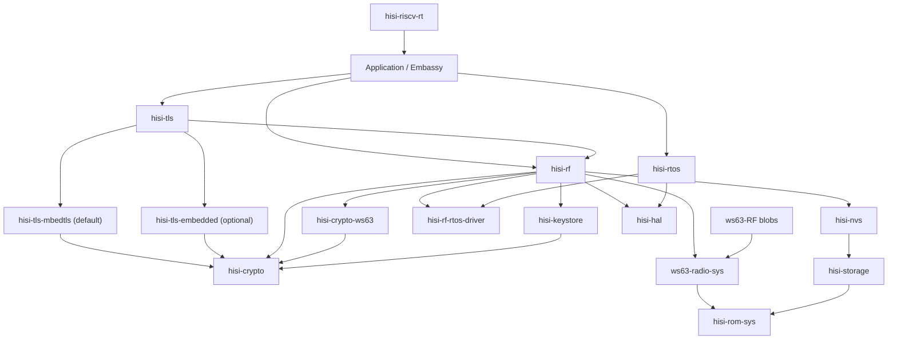

# RF5 之后的 HiSilicon Connectivity 全栈重构计划

## 状态

**执行中 / P0。** A5U 的无板 developer UX 已收口到发布模板，当前唯一主要 WIP 是
A5B 非默认增量 backend 原型；A5U 的 stack/arena 校准和 QEMU/HIL parity 保留为证据门槛。
pure-WPA3 HIL 门槛仍受外部条件阻塞。跨计划优先级和依赖以
[工程计划注册表](README.md)为准。

## 概要

A0-A4 的 **Wi-Fi connect → ping** 基线已经冻结，独立 `hisi-rf` 垂直切片
已经通过提交态真机 HIL。W2 的 pure-WPA3 最终门槛因缺少 SAE-only AP 标为
**外部阻塞门槛**；A5F 的无板 facade/release 收口已完成，当前唯一 active
milestone 是不依赖 AP、且不切换默认路径的 A5B 增量 backend 原型。
每一步都必须保留 A4 的真实硅片连接性证据，不能为了架构迁移打断北极星。

目标架构参考 esp-rs 的
`esp-radio → esp-radio-rtos-driver ← esp-rtos`、`esp-rom-sys` 和
`esp-storage` 分层，但增加 HiSilicon 特有的 vendor NVS、SLE 和 post-link
relocation 层。`hisi-rtos` 同时承载 radio blob 所需的线程/IPC 运行环境和
Embassy executor/time 运行环境。

本计划是 RF5 之后的完整执行事实源。Init/Scan 的历史、当前证据和 RF5A-C
入口仍记录在 [WS63 RF Init/Scan 计划](ws63-rf-init-scan.md)；根
[`ROADMAP.md`](../../ROADMAP.md) 只保留优先级和里程碑，不复制本文细节。

更长期的 protection domain、跨芯片 port、host runtime 与 CLI-first observability
架构已作为 deferred outlook 记录在
[`hisi-rtos` 未来架构](hisi-rtos-future-architecture.md)；它不属于当前 A3/A4 gate。
通用 scheduler 语义、形式化模型与实现一致性 gate 另见
[RTOS 调度语义与验证计划](hisi-rtos-semantics-and-verification.md)；WS63 blob
兼容 profile 不得反向改写通用 RTOS 语义。

<a id="active-window-now-a5u-developer-ux-and-resource-admission"></a>
<a id="active-window-now-a5b-incremental-backend-prototype"></a>

## 当前执行窗口：A5B 非默认增量 Backend 原型

本计划保留完整架构，但当前 WIP 限制是**一个主要里程碑**。A4 已冻结；W2
transition-mode 证据已闭合，pure-WPA3 只等待外部 AP 条件。A5F 已闭合单依赖 facade、
标准 relocation 与三平台 crates.io-only consumer；A5U 已闭合 profile/storage/report、
typed diagnostics、文档锚点和发布模板等无板部分。当前只推进 A5B 的 opt-in core protocol、
deterministic host interleaving 与后续非默认 adapter；不改当前验证过的 WS63 blocking backend。
BLE、SLE、TLS、SoftAP 和 Enterprise 不与当前 A5B 并行。

### 已完成 -- A3 收口

1. 已将每轮单次 ping 扩为每个目标 5 次；20 次 nRST 得到 WPA2/DHCP/ARP 20/20、
   公网 `88/100`、gateway `0/100`。后续 RF seam 矩阵证明 queue-full drop 为 0、
   high-water 为 1/4，应用收到的 Echo Reply 与 `driverif_input` 逐包一致。
   同一 Guest AP 上的 Mac 通过 `-b en0 -S 192.168.155.9` 强制 Wi-Fi 路径后，
   gateway 同样 `0/20`、公网同样 `88/100`，因此剩余现象已有量化环境边界，
   不回写成认证、RTOS 或 Rust RX queue 回归。
2. Q3 archive-bound task profile 已对当前 payload 闭合：只记录真实生成的 vendor task，
   以 archive hash、entry symbol、vendor priority、Q2 metrics 和
   `critical`/`worker`/`background`/`unknown` 角色绑定事实。角色未知时必须保持
   `unknown`；profile 第一阶段不改变 runtime policy。
3. Q4 已按 Q2 数据作出当前 payload 的显式决策：所有 vendor task 保持 Cooperative，
   不启用 per-thread `Budgeted` 或 group quota；没有 measured minimum-service demand，
   因此不实施 Reservation。payload/task-set 变化时必须重开 Q3/Q4。
4. reset matrix、调度不变量、版本、submodule pointer、profile revision、quota decision
   和网络归因已经冻结。完整收口见
   [A3 network attribution](evidence/ws63-rf-a3-network-attribution-2026-07-14.md)。

### 已完成 -- A4 Wi-Fi 垂直切片

A4 的第一条完整 vertical slice 已在 WS63 上运行：`RadioController`/`RadioRunner`、
`WifiController`/`WifiDevice`、bounded event queue 和应用持有的长生命周期 smoltcp
runner 已完成 init/scan/WPA2 connect、DHCP、neighbor discovery、重复 ICMP 和 lease
renew。`hisi-rf 0.1.0-alpha.1` 已发布，迁移 facade 有明确删除窗口，提交态
`ws63-hil` workflow 已 PASS。冻结证据见
[A4 Wi-Fi vertical slice](evidence/ws63-rf-a4-vertical-slice-2026-07-14.md)。

### 外部阻塞 -- W2 上游 Supplicant 与 WPA3-Personal

W2 的当前状态、提交证据和完成门槛只维护在
[W2A-W2F 执行账本](#w2-upstream-supplicant-and-wpa3personal)；本 Active Window 不复制
逐阶段状态。当前硬约束是：W0B WPA2-only archive 和 A4 真机 gate 在整个迁移期间持续
回归，`HUAWEI-HLJ_Guest` 只作为 WPA2 parity AP，不能被写成 pure WPA3 证据。

W3-W4、B/S/X、NVS/RTOS future、ported switch ticket、group Reservation、AP1 fast
path、i18n、BSP 和 Hi3322 均为 deferred/triggered backlog，不是当前 TODO。

A5F single-dependency facade 和 A5U 无板 developer UX 已完成；A5B
`WifiBackend` 非阻塞化现只推进 opt-in prototype。pure-WPA3 gate 闭合前，A5B 不删除
vendor oracle、不切换唯一默认 supplicant/backend，也不把无板证据写成 WPA3
真机稳定性结论。

## 目标架构



依赖方向必须保持单向：RTOS 不依赖 RF；NVS 不知道 RF key；ROM sys 不依赖
HAL；RF 不实现 IP stack；examples 不直接列 vendor archives 或 ROM 地址。

## 组件边界

| 组件 | 职责 |
| --- | --- |
| `ws63-RF` | Language-neutral blobs、headers、ROM symbol/patch lists；不放 Rust 实现。 |
| `hisi-rom-sys` | 芯片中立的显式 chip-selection facade；统一 re-export ROM facts，并转发 backend Cargo metadata。 |
| `hisi-rom-sys-ws63` | WS63 固定 ROM 地址、生成 symbol/callback/patch metadata 与同步工具；位于 `crates/chips/ws63/`。 |
| `ws63-radio-sys` | WS63 Wi-Fi/BLE/SLE raw FFI、archive selection、ABI/layout assertions 和 relocation 规则；拥有 pinned hostap source metadata、最小 supplicant raw ABI 与 WS63 driver/L2 integration。仓库同时发布 host CLI `hisi-rf-link`。 |
| `hisi-rf-rtos-driver` | runtime-neutral scheduler、semaphore、queue、timer、wait 和 ISR-wakeup contract；每个 firmware 只能注册一个实现。类型中立不等于语义留白：priority、timeout、handoff、ISR wake、lock 和 task identity 必须由版本化 profile 与 executable conformance suite 固定。 |
| `hisi-rtos` | 默认单-hart、优先级抢占、tickless scheduler，以及 IPC、Embassy executor/time integration；不依赖 RF。 |
| `hisi-alloc` | 用户提供 SRAM arenas、对齐分配，以及可选 C/global allocator adapter；移出 RF heap 所有权。 |
| `hisi-storage` | runtime internal-flash access 和 `embedded-storage` traits；memory-mapped read 优先，erase/write 暂留 unstable。 |
| `hisi-nvs` | WS63 ACPU KV page parser、CRC、partition selection 和 typed read API；RF item IDs 由 RF crate 定义。 |
| `hisi-crypto` | 芯片中立的小粒度密码能力契约、敏感类型和 RustCrypto 软件实现；不承载 TLS、网络状态机或芯片寄存器。 |
| `hisi-crypto-ws63` | WS63 cipher accelerator、ROM UAPI、TRNG、key slot、独占资源、超时和硬件错误；失败时禁止静默回退软件。 |
| `hisi-keystore` | `KeyHandle`、不可导出密钥、用途权限，以及 eFuse/OTP/受保护 Flash 策略；`hisi-nvs` 不拥有密钥策略。 |
| `hisi-tls` | 后端中立的 async TLS facade 和安全字节流入口；拥有 transport/BIO 与 `WANT_READ`/`WANT_WRITE` async 映射，不重写 TLS。 |
| `hisi-tls-mbedtls` | 默认 TLS backend；mbedTLS 作为无 OS 协议库，通过 `hisi-tls` BIO 对接 Rust 网络栈，不依赖 LiteOS socket。 |
| `hisi-tls-embedded` | 可选 `embedded-tls` backend，复用同一 transport、entropy、time 和 allocator contract。 |
| `hisi-rf` | 用户入口和安全的 `wifi`/`ble`/`sle`/`coex` API；拥有 blob adapter，不拥有 scheduler、allocator、NVS format、ROM symbols 或 IP stack。 |
| `hisi-hal` | `hisi-riscv-hal` 在 0.6.0 stable 之后的新 package/repository 名；继续拥有多芯片 peripheral drivers，不吸收 RF/RTOS/storage policy。 |
| `hisi-riscv-rt` | startup/trap/linker mechanism；收集 memory-profile descriptor 和 init hooks，不知道 Wi-Fi/BLE/SLE policy。 |

所有新组件使用独立 Git 仓库、`Cargo.lock`、CI、版本和 release；父仓以 submodule
固定开发版本。`ws63-radio-sys` 与 `hisi-rf-link` 同仓同版本，因为 blob ABI 和
relocation 规则必须原子升级。闭源 archive 未确认 crates.io 重分发边界前，
`ws63-radio-sys` 只通过 GitHub release/submodule 交付。

固定依赖方向为 `Application -> hisi-tls -> hisi-crypto`；WPA、BLE 与 SLE security
从 `hisi-rf` 依赖 `hisi-crypto`，firmware verification 也只依赖 `hisi-crypto`。
WPA supplicant 不属于 TLS；只有 Enterprise 的 EAP-TLS profile 可以依赖 `hisi-tls`。

## 公共契约

### RTOS 与 Embassy

- `hisi-rtos::start(config, timer0, soft_interrupt0, resources)` 一次性启动
  tickless、priority-preemptive scheduler。重复启动返回 `AlreadyStarted`。
- 初始 context switch 保存全部整数寄存器、`tp`、`mstatus`、`fcsr` 和全部浮点
  寄存器；只有 HIL 证明 lazy FP save 正确后才允许优化。
- TIMER_INT0 负责最早 deadline/time slice，WS63 software interrupt 负责立即
  reschedule；ISR 只记录/唤醒，调度和用户代码在退出中断后执行。
- `hisi-rtos` 提供 thread-mode Embassy executor 和唯一的 Embassy time driver。
  HAL 现有 time driver 保留一个 minor 的 deprecated 迁移窗；外设 async traits
  继续属于 HAL。
- 原厂 WS63 LiteOS 只作为 task-context、调度和 IRQ 行为 oracle，不进入产品依赖图，
  也不建立或维护 LiteOS backend。`hisi-rtos` 是唯一 native backend；
  `ws63-radio-sys`/WS63 ABI shim 只把 blob 实际引用的 `LOS_`/`osal_` 符号映射到
  `hisi-rf-rtos-driver` 小能力契约。该符号集合由 `nm -u`/link manifest 固定，新增
  未满足符号必须使 CI 失败。
- scheduler/IPC 对 blob 的入口只通过 `hisi-rf-rtos-driver` 注册宏导出的固定
  Rust ABI；链接到零个或多个实现都必须失败。
- scheduler state、RunPolicy、IRQ epilogue、timeout race、priority inheritance
  和 budget replenishment 的通用 contract 以
  [RTOS 调度语义与验证](hisi-rtos-semantics-and-verification.md) 为唯一计划事实源；
  A3 evidence 只证明已列出的实现/真机场景。

### 存储与 NVS

- `hisi-storage` 稳定面只承诺 memory-mapped read 和边界检查。erase/write 必须在
  RAM/ROM 中执行，并处理 SFC、cache、interrupt 和 XIP 约束；在掉电 HIL 前保持
  `unstable-write`。
- 初始稳定 API 为
  `hisi_nvs::NvReader<S>::read(NvKey, &mut [u8]) -> Result<usize, NvError>`。
  它校验 page header、反码、record bounds、state、encryption flag 和 CRC。

### 密码能力、密钥与 TLS

- `hisi-crypto` 是“芯片中立的密码能力契约 + RustCrypto 软件实现”，不是统一承包所有
  算法、硬件和协议的 provider。模块边界固定为 `error`、`hash`、`mac`、`cipher`、
  `aead`、`rng`、`kdf`、`signature`、`secret`、`key`、`software`；WS63 寄存器、ROM
  UAPI、key slot 和硬件资源只进入 `hisi-crypto-ws63`。
- `hisi-crypto` 优先直接采用生态 traits：`digest::{Digest, Update, FixedOutput, Mac}`、
  `cipher::{KeyInit, BlockEncrypt, BlockDecrypt}`、`aead::{AeadCore, AeadInPlace, KeyInit}`、
  `rand_core::{TryRng, TryCryptoRng}`、`signature::{Signer, Verifier}`，以及 `zeroize`、
  `subtle`、`pbkdf2`、`hkdf`。具体名称以锁定依赖版本为准；只有错误、阻塞和状态语义
  严格匹配时才直接实现标准 trait。
- 对 busy、clock、DMA/alignment、ROM UAPI、timeout、reset 等可失败能力，提供小粒度
  `TryHash`、`TryMac`、`TryBlockCipher`、`TryAeadInPlace`、`EntropySource`，不继续扩张
  当前单体 `CryptoProvider`。标准 trait 无法表达硬件失败时，不允许用 panic、无限等待或
  隐式状态掩盖错误；可在能力语义严格匹配后，从 `Try*` contract 提供标准 trait adapter。
- 协议层可定义窄的 `Wpa2Crypto`、`TlsCrypto`、`VerifyCrypto` profile，只表达协议最小
  能力集合，不取代底层通用 trait；具体 backend 由显式 `CryptoSuite<H, M, A, R>` 组合。
- 第一阶段硬件契约是有界超时的同步 API：通过独占 token 管理引擎，不在 critical
  section 中等待，不在 IRQ/锁中调用用户逻辑。DMA/IRQ 证据成熟后再增加独立
  `AsyncTry*` 接口。
- `EntropySource` 表示原始 TRNG；CSPRNG/DRBG 负责播种与重播种。TLS 随机请求不能每次
  直接同步读取慢速 TRNG。TRNG 优先实现 `rand_core` 的可失败接口。
- 可导出的 `SecretBytes` 必须 `ZeroizeOnDrop`；不可导出密钥使用包含 slot 与
  `KeyUsage` 的 `KeyHandle`/`KeyRef::Handle`，不提供读取字节的 API。
- backend 只能在构造、feature 或资源注入时显式选择。`hisi-crypto-ws63` 操作失败后
  禁止透明切到 RustCrypto；混合 hash/AES/RNG suite 也必须由类型显式组合。
- 推荐依赖链固定为 `protocol profile -> standard/fallible capability traits ->
  RustCryptoBackend 或 hisi-crypto-ws63 -> ROM/cipher accelerator/TRNG`。协议 crate
  不得越过 backend 直接调用 ROM UAPI，硬件 backend 也不得反向依赖 WPA/TLS。
- `hisi-tls::TlsStream<T>` 对外实现 `embedded_io_async::{Read, Write}`；默认
  `hisi-tls-mbedtls`，可选 `hisi-tls-embedded`。transport 可接 `embassy-net`、
  `smoltcp` 或任意 `embedded-io-async` 流。
- NVS 首版只读。GC、双页切换、磨损管理和中途掉电恢复全部完成后，才讨论稳定
  write API。RF calibration/MAC key newtype 留在 `hisi-rf`。

### 射频协议

- `hisi_rf::init(RadioConfig, RadioResources)` 返回独占 `RadioController`；所有协议共享
  RF、IRQ、blob、memory profile 和 coexistence resources，禁止分别以 `Wifi::new()`、
  `Ble::new()` 抢占同一硬件。`split()` 返回
  `RadioParts { wifi, ble, sle, runner }`，且只产生编译时启用的协议 handle。
- `RadioRunner` 是必须持续 poll 的长期后台任务，唯一负责推进 blob、处理控制命令、
  ack/wake 和投递事件；协议 handle 不在调用者 task 中直接驱动 vendor scheduler。
- 当前 `WifiBackend` 的 `scan/connect/disconnect` 仍允许同步实现把完整操作包在一次 trait
  调用中；WS63 backend 内部轮询、sleep 或等待终态时会独占 `RadioRunner`。公共 async
  facade 不能掩盖这一阻塞语义。A5 必须把 backend 收敛为可取消、可唤醒、每次推进有明确
  work budget 的增量状态机；仅把现有 trait 改成 `async fn` 不算完成。
- 公共接口分四个平面，不能用一个“万能 Radio trait”抹平协议语义：
  - **配置面**：`RadioConfig`、`ScanConfig`、`StationConfig`、`AdvertisingConfig`、
    `SeekConfig`、`CoexistenceConfig`；使用 validated newtype、enum 与 secret type，
    不接受无约束裸 channel、interval、密码或 key bytes。
  - **控制面**：Wi-Fi、BLE、SLE 各自提供 inherent async API；状态机和错误保持协议语义。
  - **数据面**：只在存在成熟标准时实现 ecosystem trait，不发明自有通用 socket/IP 层。
  - **事件面**：有界队列 + `next_event().await`；后续可选
    `futures_core::Stream` adapter。ISR/blob callback 只复制 bounded event、更新小状态并 wake，
    绝不调用用户 callback。
- Wi-Fi 分离 `WifiController` 与 `WifiDevice`。前者以 `&mut self` 串行化
  `scan/connect/disconnect/wait_for_link`，明确 cancellation 与状态迁移；scan 使用调用者
  提供的固定结果 buffer，返回 `{ count, truncated }`。后者只提供 L2 RX/TX，主要实现
  `embassy_net_driver::Driver`，可选实现 `smoltcp::phy::Device`。
- Wi-Fi 提供 L2 device；按 feature 实现 `smoltcp::phy::Device` 和
  `embassy-net-driver`。DHCP、ICMP、TCP/IP sockets 属于 smoltcp/Embassy Net。
- `embedded-svc::wifi` 仅可作为兼容 adapter，不是核心 API 的事实源。
- BLE 第一阶段封装 vendor GAP/GATT/SMP host 并提供安全自有 API。只有 controller-only
  边界被符号、packet ownership 和 HIL 证明后，才增加实验性 `ble-hci` 并实现
  `bt_hci::controller::Controller` 供 Trouble 使用；不得在 vendor host 上伪造 HCI。
- SLE 使用相同事件模型，提供 announce/seek/connect 和 SSAP client/server。
  SLE 没有可用的通用 Rust 标准，API 必须保持真实 SLE 语义，不伪装成 BLE。
- `coex` 初始始终 unstable；只有 Wi-Fi traffic 与 BLE/SLE 并发 HIL 通过后才允许稳定。
- 所有 blob callback 只把 bounded event 写入队列并 wake task；不得在 ISR、critical
  section 或 scheduler lock 中调用用户 callback。
- backend operation 必须带 generation-tagged identity。queued、started、cancel-requested、
  completed 和 failed 是不同状态；旧操作的延迟事件不得完成后续新操作。future 被 drop
  不能只停止调用者等待而让不可见操作无限继续，取消请求必须有明确的接受、完成和超时语义。
- Wi-Fi security 采用 `hisi-crypto` capability 边界。当前已验证组合是 WS63
  KM/RKP PBKDF2、TRNG、SPACC SHA/HMAC/AES；RustCrypto 保留为 host oracle 和显式软件
  profile，不作为硬件错误后的回退。RF 不公开密码实现 context，CCMP 数据面仍由 MAC/DMAC
  完成。
- 初始稳定候选仅为 WPA2-Personal/CCMP。WPA3-SAE、SoftAP authenticator 和 Enterprise
  分别使用独立 feature 与 HIL gate；编译进完整原厂 archive 不等于 API 已支持。
- `hisi-rf` 的依赖边界固定为 `hisi-rf-rtos-driver`、`hisi-crypto`、`hisi-nvs`、HAL
  和 chip backend（WS63 为 `ws63-radio-sys`）；它不拥有 scheduler、ROM symbols、NVS
  format、通用 crypto、TLS 或 IP stack。WPA supplicant 属于
  `hisi-rf::wifi::security` 并依赖 `hisi-crypto`，不经过 `hisi-tls`。
- `hisi-rf` 的公共概念保持芯片中立；WS63 FFI/blob/ABI 只存在于
  `ws63-radio-sys`。host/QEMU 使用 stub backend。闭源 payload 后续由自建 registry 的
  `ws63-radio-blob` 显式选择，通用 crates.io crate 不得强依赖私有 registry。
<a id="native-supplicant-dependency-contract"></a>

- 新 supplicant 路径固定为 `hostap 2.11 固定源码 -> os_hisi_rtos /
  eloop_hisi_rtos -> driver_ws63 / l2_packet_ws63 -> 固定版本的窄 C shim ->
  Rust FFI 安全 wrapper -> hisi-rf::wifi::security -> RadioController / RadioRunner /
  有界 event queue`。
  运行时只经 `hisi-rf-rtos-driver -> hisi-rtos`；不得新增 LiteOS backend、LOS shim
  daemon 或完整 POSIX 仿真。callback/IRQ 只复制有界事件并 wake `RadioRunner`，用户逻辑
  只能在普通任务上下文运行。

### RF 依赖体验与组合根

最终用户的 RF 集成依赖必须收敛为一条显式 chip/profile 选择：

```toml
[dependencies]
hisi-rf = {
    version = "0.2",
    features = ["chip-ws63", "wifi", "wpa3-personal", "smoltcp"]
}
```

这里的“单依赖”只表示应用不再直接列出 RF backend、sys/blob、RTOS driver 或 link tool；
应用仍按自身执行环境显式依赖 `hisi-hal`、`hisi-riscv-rt`、`hisi-rtos`、Embassy 或网络栈。
`chip-ws63` 必须显式选择且只能选择一个 chip，不以 default feature 猜测目标；`wifi`、
`wpa2-personal`/`wpa3-personal` 和数据面 feature 由 facade 精确转发到后端。

为避免 `hisi-rf -> WS63 backend -> hisi-rf` 的 Cargo 循环，目标分层固定为：

```text
Application
  -> hisi-rf                 # user facade and composition root
       -> hisi-rf-core       # chip-neutral controller/runner/config/backend contracts
       -> hisi-rf-ws63       # selected by chip-ws63
            -> hisi-rf-core
            -> ws63-radio-sys
            -> hisi-hal / hisi-crypto-ws63 / hisi-rf-rtos-driver
```

`hisi-rf` facade 负责 feature selection、public re-export 和 chip-specific safe constructor；
`hisi-rf-core` 不知道任何芯片；`hisi-rf-ws63` 是当前 `ws63-rf-rs` integration/backend 的
长期归属；`ws63-radio-sys` 继续拥有 raw ABI、archive/profile 和 blob facts，但只能作为
传递实现依赖，不能出现在应用 manifest、`hisi-rf` 公共签名或 rustdoc 中。Facade 作为
composition root 可以同时依赖抽象与具体实现，这不改变 backend 依赖 core abstraction 的
反转方向。

期望初始化入口是由 facade re-export 的安全资源构造器，例如：

```rust,ignore
let radio = hisi_rf::ws63::init(
    hisi_rf::ws63::Resources::new(efuse, km, spacc, pke, trng),
    &RADIO_STATE,
)?;
```

用户不能传入 `ws63_radio_sys::*` raw type、archive path、ROM address 或 relocation profile。
标准 RISC-V relocation archive、可重定位 ROM patch object 和 dependency-owned link directives
是此 UX 的前置条件；最终应用不得运行 guarded-link shell、读取
`DEP_WS63_RADIO_SYS_*`、调用 `hisi-rf-link` 或依赖 GCC/Python/个人绝对路径才能完成普通
`cargo build`。

### TLS 层

- `hisi-tls` 默认使用 mbedTLS；`embedded-tls` 是显式 opt-in backend。backend 选择不改变
  上层 async stream contract，应用不得依赖 mbedTLS C context。
- mbedTLS 作为无 OS 协议库使用，不直接调用 LiteOS socket。自有 BIO adapter 接
  `embedded-io-async`/smoltcp/Embassy Net，把 `WANT_READ/WANT_WRITE` 转为 async 等待。
- 每个 TLS context 由单一 Embassy task 独占；跨 task 使用通过 channel/ownership 转移，
  不在 ISR、critical section 或 scheduler lock 内推进握手。
- 熵源来自 `hisi-crypto`，可信时间来自平台 time contract，内存来自 `hisi-alloc` 的
  Rust/C shared allocator 或专用 C arena。硬件加速只存在于 crypto backend，不散落在
  TLS 状态机、BIO 或证书策略中。

### Runtime 与链接

- `hisi-riscv-rt` 增加一个 pre-relocation memory-profile descriptor 和一个
  linker-collected post-relocation init registry；重复 memory profile 由 linker
  `ASSERT` 失败。
- `ws63-radio-sys` 贡献 packet-RAM NOBITS input section、BGLE/shared-memory profile、
  ROM patch payload 和 post-relocation hook；RT 只负责收集与执行机制。
- `hisi-rf-link` 是 maintainer/release-side 工具：从固定来源把 vendor relocation
  预先规范化为标准 RISC-V relocation，并验证 archive/profile。`ws63-radio-blob`
  通过 Cargo 分发 hash-bound normalized archives，`ws63-radio-sys` 在普通 build 中生成
  可重定位 ROM patch object 并发出 link contract；stock `rust-lld` 只做一次最终链接，
  不运行 layout pass 或 post-link patch。最终 ELF 再交给 `hisi-fwpkg` 计算
  header/hash/body；RF 工具不得复制镜像格式语义。

## 里程碑

### RF5A -- TX/RX 收口

- 从 vendor headers 生成 pbuf offset/size assertions，覆盖当前已验证的 80-byte
  zero-copy reserve 以及 TX/RX 实际访问字段。
- 找到真实 transmit symbol，把 `netif_smoltcp` 测试 sink 替换为 blob adapter；
  `driverif_input` 把 RX frame 送入有界队列，并定义满队列 drop counter。
- HIL 先通过 ARP request/reply，证明双向 Ethernet frame 数据面。
- 2026-07-12 已完成：原厂 lwIP 配置/DWARF 驱动的 pbuf/netif ABI 检查、DHCP lease、
  gateway ARP reply 均在真机通过。MTU-sized smoltcp token 曾令 8 KiB 主栈下溢并覆盖
  FRW queue；现改为静态单占用 scratch，并以 token-size host test 防回归。

### RF5B -- 开放 AP 连接

- 在当前 `ws63-rf-rs` 中增加 typed station config、connection-state event 和
  `Wifi::connect`；第一目标是受控实验室 open AP，不宣称生产安全能力。
- UART marker 固定为 `RF5_CONNECT_BEGIN`、`RF5_CONNECT_OK` 或
  `RF5_CONNECT_ERR:<class>:<vendor-code>`；用户逻辑不在 vendor event callback 中执行。

### RF5C -- Ping 与基线冻结

- 第一轮使用静态 IPv4、gateway 和受控 peer，随后补 DHCP；ICMP 必须经过 Rust-visible
  L2 device，而不是 vendor lwIP 隐藏路径。
- HIL 固定 `RF5C_PING_OK rx=N`，保存 UART log、ELF section/layout report、ROM
  patch manifest、image plan 和资源占用，作为迁移前 A0 baseline。
- 2026-07-12 已完成：修复 ICMP frame 实际长度与 IPv4 `total_length` 不一致后，
  `HUAWEI-HLJ_Guest` 上的 DHCP、gateway ARP 和 `1.1.1.1` Echo Reply 均通过
  Rust-visible L2 path；UART 输出 `RF5C_PING_OK rx=0x00000004`。迁移前 A0 已冻结在
  [WS63 RF A0 baseline](evidence/ws63-rf-a0-2026-07-12.md)。

### A0 -- 基线冻结

- [x] 固定 init/scan/connect/DHCP/ARP/ping UART marker。
- [x] 固定最终 ELF、rust-lld map、relocation manifest、ROM patch report、canonical image
  和 FlashPlan 的 SHA-256 与资源摘要。
- [x] 保留 `.wifi_pkt_ram` NOBITS、ROM symbol、patch count 与 image body/erase range 证据。
- A1-A4 的每个迁移阶段必须复现该 baseline；不能用仅构建或 QEMU 结果替代 RF 真机证据。

### W0-W4 -- Wi-Fi 安全能力收口

1. **W0A Oracle（已完成）**：完整原厂 supplicant + mbedTLS/security archive 在真机完成
   WPA2-Personal connect、DHCP、ARP、ping；保留 marker、ABI probe 和资源基线。
2. **W0B 仅 WPA2（已完成）**：从原厂同版本源码/config 生成只含 STA WPA2-PSK/CCMP 的 archive，
   删除 SAE、AP、EAP/TLS/WPS/P2P/WAPI 对象。以 link closure 固定所需 crypto/libc ABI，
   对外 feature 命名为 `wifi-wpa2-personal`。机器可读边界由
   `chips/ws63/rf/tools/wpa2-personal-profile.toml` 定义，并由
   `check-wpa-profile.py` 对原厂 CMake source/define 集执行 fail-closed 检查。
   2026-07-12 真机复现 connect、DHCP、ARP、ping；构建闭包、SDK compatibility define
   陷阱和资源差异见 [WPA2 cropped evidence](evidence/ws63-wpa2-cropped-2026-07-12.md)。
3. **W1 密码能力基线（已完成，已由 W2E-H 演进）**：过渡 `CryptoProvider` 已覆盖 PBKDF2-HMAC-SHA1、
   SHA-1/SHA-256、HMAC-SHA1/HMAC-SHA256、AES 和 TRNG。WS63 当前使用已验证的
   unified-cipher PBKDF2/TRNG，最初 SHA/HMAC/AES 使用 RustCrypto；最终 ELF 无 `mbedtls_*`
   supplicant 符号，并在真机 KAT 后完成 WPA2 connect/DHCP/ARP/ping。SPACC HMAC/SYMC
   因 transitional runtime 下的 calc timeout 保持 experimental，待 `hisi-crypto` 独立
   clock/IRQ/wait HIL 后再启用。该单体 trait 只作为迁移基线，后续由小能力 traits、
   显式 `CryptoSuite` 和 `hisi-crypto-ws63` 取代。证据见
   [WPA2 cropped evidence](evidence/ws63-wpa2-cropped-2026-07-12.md)。
<a id="w2-upstream-supplicant-and-wpa3personal"></a>

4. **W2 上游 Supplicant + WPA3/SAE（进行中）**：正式路径从固定 upstream hostap
   源码用标准跨平台 RISC-V 工具链可复现构建，不依赖原厂 compiler、预编译 supplicant
   archive 或 LiteOS backend。分阶段 gate 如下；WIP policy 由 Active Window 唯一维护：

   - **W2A 固定源码与 Oracle（已完成）**：固定 upstream hostap 2.11 tag
     `hostap_2_11`、commit `d945ddd368085f255e68328f2d3b020ceea359af` 和 tarball
     SHA-256 `912ea06f74e30a8e36fbb68064d6cdff218d8d591db0fc5d75dee6c81ac7fc0a`；
     vendor 2.10 fork、原厂 compiler 和 WPA2/WPA3 archives 只用于差分、WS63 driver ABI
     与真机 HIL oracle。安全更新/CVE radar 必须能独立升级 hostap pin，而不迫使
     `hisi-rf` 公共 API 改版。
   - **W2B 窄 ABI（已完成）**：`ws63-radio-sys` 拥有窄、版本化 C shim 和预生成/手写
     Rust FFI，只暴露 create/init/configure/connect/disconnect、management/EAPOL 输入、
     poll/event 与 key-install hooks。CI 校验 source pin/hash、ABI size/offset、callback
     calling convention、required symbols 和 archive/profile drift；禁止 bindgen 暴露 hostap
     内部结构、全局状态或要求构建机安装 libclang。
   - **W2C 原生 OS 与事件循环（已完成）**：`ws63-radio-sys` commits `310db49`、
     `7ffd946`、`701b1c3`
     已实现 `os_hisi_rtos`、`eloop_hisi_rtos` 和版本化 OS hook table；host 行为测试与
     freestanding RV32 编译覆盖 allocator、sleep、单调/墙钟时间、entropy、timeout
     排序/取消/重设、runner wake/wait，以及重复/冲突注册。native C objects 显式使用
     `rv32imfc + ilp32f`，最终 ELF 不再混入 clang 默认的 soft-float `ilp32`。父仓 adapter
     将 allocator、WS63 time/entropy 和 wake semaphore 接到
     `hisi-rf-rtos-driver -> hisi-rtos`，未安装 runtime 时 fail closed。当前
     `hostap-2.11-personal-v1` profile 已将 42 个 upstream/port 源文件编译为真实
     RV32IMFC ILP32F 对象；私有 freestanding formatter/libc contract、受限 `sscanf`
     format 集和 18-symbol external ABI 均由 CI fail-closed 校验。父仓 commit
     `7e67f145d` 已让唯一 `RadioRunner` 在真机推进 event loop；实现没有新增 `LOS_*`、
     LiteOS daemon/backend、OS thread 或完整 POSIX 模拟。
     WS63 blob 仍实际引用的有界 `LOS_`/`osal_` ABI 只是 compatibility
     adapter：`LOS_TaskLock`/`LOS_TaskUnlock` 与 `osal_kthread_lock`/`unlock` 现均委托
     `hisi-rf-rtos-driver` 的可嵌套 scheduler-lock contract，不再依赖“Cooperative
     所以 no-op”的旧假设。该符号集合必须继续受 archive hash 与 required-symbol
     manifest 限定，不得扩张为 LiteOS backend。父仓 commits `9369b7828` 和
     `389f8e369` 的 host contract test、独立 WPA2/WPA3 profile CI 以及 vendor-WPA2 真机
     connectivity smoke 均已通过；证据追加到
     [WPA2 cropped evidence](evidence/ws63-wpa2-cropped-2026-07-12.md)。
   - **W2D WS63 Driver 与安全 Wrapper（已完成）**：实现最小 `driver_ws63` 与
     `l2_packet_ws63`，只覆盖 scan/auth/assoc、management/EAPOL、set-key 和事件桥接；
     allocator、clock、entropy/crypto、TX/RX/key install 分别走既定 `hisi-*` contract。
     `ws63-radio-sys` commits `a7cf71e`、`58c267a`、`e668776`、`701b1c3` 已完成
     `EAPOL-only` 路径
     `l2_packet_ws63`、版本化 driver-hook 生命周期、upstream `wpa_driver_ops` 的
     init/deinit、MAC、management TX 与 key 参数归一化；host 行为测试、freestanding RV32
     编译和 exact object-symbol manifest 均通过。当前窄 C lifecycle 已真实调用 upstream
     `wpa_supplicant_init/add_iface/select_network/deauthenticate/event`，并显式报告 bounded
     event queue overflow；这证明 source/lifecycle closure，不证明 driver path 已可连接。
     `ws63-radio-sys` commit `59d5ce0` 进一步把 opaque context 的 size 与 alignment 都纳入
     C/Rust ABI；父仓 commit `b7fc6df4e` 增加 fail-closed RAII owner，保证 create/init
     失败和正常 Drop 都按 `destroy -> free` 顺序回收。`hisi-rf` commit `b357aff` 与父仓
     commit `6dd01ba43` 又增加默认兼容的 backend `poll` contract：WS63 upstream backend
     在 initialize 时创建 owner，并只由唯一 `RadioRunner::run_once` 推进 bounded work。
     父仓 commit `7e67f145d` 与 examples commit `0b8d3dc` 已让
     `wifi_init_smoke --features upstream-supplicant` 走真实 `hisi-rf` backend；真机完成
     context create/init、EAPOL receive registration、runner poll 与 17-AP scan，输出
     `W2D_NATIVE_RUNNER_RX_READY`。
     父仓 commit `35f706295` 已把 hook 注册接入
     scan-only `Wifi::initialize`，并以统一 WAL boundary 实现 live netif MAC（fallback command
     9）、EAPOL TX（command 5）、management TX（command 4）和 new/set/delete key
     （commands 1/3/2）；未知 cipher、PMK/MODIFY、歧义 key flags、错误 ABI 和越界 payload
     全部 fail closed。父仓 commit `7e67f145d` 又闭合 management RX 与 EAPOL RX：管理帧
     callback 深拷贝到 8 槽、768-byte 上限的 FIFO，EAPOL callback 只置 pending/wake，runner
     通过 commands 6/7/8 有预算地排空；queue overflow 作为明确 backend error 上报，任何
     callback/IRQ 都不直接调用 hostap 或用户逻辑。`hisi-crypto-ws63` commit `b8d11db`
     把 PBKDF2/TRNG 变成显式 capability；upstream profile 明确选择 RustCrypto PBKDF2 + WS63
     TRNG，不依赖 vendor WPA archive 导出的 PBKDF2 UAPI，也不在硬件失败后静默回退。
     该 profile 的两遍 link 验证 1157 个 layout sections、4127 个 patched relocations、37 个
     ROM patches，且 `drv_soc_hwal_wpa_ioctl` 由 HMAC/WAL archive 解析。父仓 commit
     `1028114da` 又按原厂 ABI 把 EAPOL receive 的正值 `0xffff` 识别为 skb queue 已排空，
     而不是把它误报为 feed failure；scan event queue 同时保留 terminal done slot，超出
     C cache 容量的 BSS 结果被记录为 bounded truncation。`ws63-radio-sys` commit
     `bd8069b` 为 null endpoint、invalid frame 和 uninitialized context 保留不同错误码；
     `hisi-rf` commit `fac1fe0` 与 examples commit `145727f` 明确每个 bounded runner batch
     后都要提供调度点。清理诊断代码后的同一镜像连续三次 nRST 均完成 upstream-native
     WPA2 connect、DHCP、ARP neighbor discovery、5/5 public ICMP、零 RX queue drop 和
     DHCP renew，因此 W2D 的 auth/assoc/event/key/L2/safe-wrapper vertical slice 已闭合。
     `hisi-rf::wifi::security` 已有 typed WPA3-Personal/PMF/SAE-PWE config，过渡 vendor
     candidate 已通过真实 link closure：1568 sections、5612 relocations、37 ROM patches，
     ELF SHA-256 `ed7cd91357ddb981d8fe599f8ebd8d4eed658d525ec72c60fc2b0745fe6dc024`；
     这不等于 WPA3 已完成。早期 native owner/RX/runner 证据见
     [W2D 原生 runner 与 RX bridge](evidence/ws63-rf-w2d-native-runner-rx-2026-07-14.md)，
     WPA2 parity 收口见
     [W2E upstream WPA2 parity](evidence/ws63-rf-w2e-upstream-wpa2-parity-2026-07-14.md)。
   - **W2E 一致性 HIL（部分完成）**：upstream-native path 已重现 A4 WPA2 connect、DHCP、
     ARP、重复 ping 和 lease-renew marker。host gate 已在固定 hostap 2.11 上覆盖 WPA2
     PMK-to-PTK、EAPOL M2 MIC、WPA2/WPA3/transition RSNE 与 PMF、SAE group 19 HnP/H2E
     双端 roundtrip，并重放 upstream 的 5 个 SAE corpus fixtures；证据见
     [W2E host protocol vectors](evidence/ws63-rf-w2e-host-protocol-vectors-2026-07-15.md)。
     `personal-wpa3` profile 的 41 个 SAE bignum/P-256 ABI、1157-section 最终链接与
     fail-closed 真机探测见
     [W2E 上游 WPA3 就绪度](evidence/ws63-rf-w2e-upstream-wpa3-readiness-2026-07-15.md)：
     当前 Guest BSS 被 WS63 scan 判为 WPA2-only，因此没有发送 SAE Authentication frame；
     同一代码基线随后再次通过 upstream WPA2 connect、DHCP、5/5 public ping、零 RX drop
     和 DHCP renew。
     后续 vendor-oracle profile 已在受控 WPA2/WPA3 transition BSS 完成 SAE、PMF、四次
     握手、DHCP 与重复 ping；缺失的 mbedTLS harden provider 注册是此前 status 15 的根因，
     证据见 [W2 vendor WPA3 oracle](evidence/ws63-rf-w2-vendor-wpa3-oracle-2026-07-15.md)。
     该结果只建立迁移 oracle。随后 upstream-native hostap 2.11 路径修正了
     `ext_external_auth_stru` 的 WS63 short-enum ABI：原厂最终汇编传递 28-byte event 13，
     旧 Rust 结构按 32 bytes 建模并静默拒绝事件；回送 status 也存在同一布局错误。双向
     修复后，受控 transition BSS 已完成 SAE、required PMF、DHCP、网关/公网各 5/5 ping、
     零 RX drop 与 DHCP renew，完整 smoke PASS。证据见
     [W2E upstream WPA3 transition](evidence/ws63-rf-w2e-upstream-wpa3-transition-2026-07-15.md)。
     该单次通过闭合 transition capability proof。随后针对原先 `18/20` 的非确定性失败，
     将两条尾部路径分别定位为“status 30 后缺少 comeback 信息”和“association success 后
     首个 EAPOL 未进入 host”。最终修复让 firmware scan 同时填充 hostap BSS cache，并在
     首个 EAPOL 超时时执行 bounded asynchronous disconnect + cached-BSS reassociation；HAL
     TRNG 也改为由唯一 peripheral token 持有，消除全局发布竞态。同一已提交镜像连续
     20 次 nRST 得到 transition association `20/20`、`WLAN_AUTH_RSP2_TIMEOUT=0`，capture
     窗口内 gateway ICMP `70/70`。证据见
     [W2E WPA3 reset reliability](evidence/ws63-rf-w2e-wpa3-reset-reliability-2026-07-16.md)。
     transition reset gate 已闭合；受控 WPA3-only SAE+PMF 当前标记为 **External Blocked
     Gate**：没有可用的 SAE-only AP，因此暂不执行、不再索取 AP 或凭据，也不让该硬件门槛
     冻结 A5R/A5F/A5U/A5B 的无板工作。Guest AP 仍只提供 WPA2 parity，不能替代 pure WPA3
     HIL。具备受控 AP 后，最终 unchanged-image 20-reset gate 必须使用
     `ws63-connectivity-reset-matrix.py --required-ap-mode pure-wpa3`；classifier 会逐轮校验
     固件从 scan RSNE 得出的 `pure-wpa3` marker，transition 成功不得计入通过。在该 gate
     闭合前，不删除 vendor supplicant oracle/`wpa_compat.rs`，不宣称 WPA3 stable，也不把
     新 backend 切为唯一默认路径或退役旧 facade。
   - **W2E-H 握手密码能力硬件加速（已完成，2026-07-17）**：第一项
     PBKDF2-HMAC-SHA1 已由 `hisi-crypto-ws63` 直接驱动 PAC 建模的 WS63 KM/RKP，并通过
     唯一 `KM`/`TRNG` token、双层互斥、有界轮询、寄存器清零和 fail-closed 错误传播建立
     资源与失败契约。upstream WPA2 同一镜像 20 次 nRST 均完成 association/DHCP，40 次
     hardware PBKDF2 请求零失败；相对 RustCrypto 基线总 ELF 占用减少 732 bytes，观察到的
     PBKDF2 调用路径最大栈帧约减少 256 bytes。证据见
     [W2E-H RKP PBKDF2](evidence/ws63-rf-w2e-h-rkp-pbkdf2-2026-07-16.md)。
     第二项 SHA-1/SHA-256 与 HMAC-SHA1/HMAC-SHA256 已迁入 token-owned SPACC
     backend；同一 upstream WPA2 镜像 20 次 nRST 均完成 association/DHCP，40 次 hash
     与 160 次 MAC 请求零失败；diagnostic profile 的 bounded timeout 后恢复检查同样
     20/20 零失败，但不冒充真实跨 owner contention injection。证据见
     [W2E-H SPACC hash/HMAC](evidence/ws63-rf-w2e-h-spacc-hash-2026-07-16.md)。
     第三项 AES-128/192/256 单块加解密已迁入 SPACC symmetric channel 1 + KM/KLAD
     MCipher keyslot；hostap 的 RFC3394 key unwrap 与 AES-CMAC 继续复用其上游状态机，只通过
     窄 `aes_encrypt/decrypt` ABI 落到 `TryBlockCipher`，没有在 Rust 侧复制协议。标准 KAT
     覆盖三种 key length 的 encrypt/decrypt；同一 upstream WPA2 镜像 20 次 nRST 均完成
     association，每轮 36 次 AES 请求、0 失败，bounded timeout recovery 同样 20/20。
     证据见 [W2E-H SPACC AES](evidence/ws63-rf-w2e-h-spacc-aes-2026-07-16.md)。
     第四项 P-256 affine point multiplication、point addition 与固定素数域
     multiplication/squaring/exponentiation 已迁入 WS63 PKE：hostap SAE 仍拥有协议和
     Dragonfly 状态机，只经
     `TryP256PointMul`/`TryP256PointAdd`/`TryP256FieldMul`/`TryP256FieldPow` 调用硬件；
     标量、点坐标、canonical field element 和临时输出均在返回前
     清零，PKE timeout/fault 直接使握手失败，不回退软件。首次真机运行还证明 stateful PKE
     ROM helper 会读取与 standalone Rust 镜像冲突的固定 ROM-RAM；实现因此只复用无状态
     ROM RAM-copy/curve-parameter entry，并以 PAC 明确完成 lock、work length、instruction、
     batch、finish、Montgomery parameter 和 DRAM clear。generator-by-one KAT 和 WPA3-SAE
     smoke 均通过。首轮同一镜像 20 次 nRST 中，PKE 请求全部零失败、无 exception，观察到
     的单次最大耗时 8 ms；association 19/20。失败轮证明 raw `8030`/IEEE status 30 后的
     全量重扫仍可能停滞，而不是 PKE 失败。父仓 commit `e7da74d62` 随后在唯一
     RadioRunner 中对 raw `8030` 执行一次有界、fail-closed 的 WS63 disconnect ioctl，清理
     nRST 后 AP/MAC 残留的 PMF/STA 状态，再按原厂 `driver_soc` 语义把 disconnect 事件交给
     hostap；first-EAPOL watchdog 则继续等待异步 disconnect 后直接复用 cached BSS，缓存
     缺失时才允许扫描。修复镜像 20 次 nRST 全部 association/DHCP/ping 通过：19 次 status 30
     清理均返回成功，20 次 cached-BSS retry、0 次 scan retry，PKE/TRNG 均零失败，且
     `WLAN_AUTH_RSP2_TIMEOUT=0`。证据见
     [W2E-H PKE P-256](evidence/ws63-rf-w2e-h-pke-p256-2026-07-17.md)。
     后续 point-add 实现又将无穷点建模为显式结果；真机证明原厂 affine-add 指令不覆盖
     `P == Q` doubling，因此等点相加明确走已验证的 hardware scalar-mul-by-2，distinct
     `G + 2G = 3G` 才验证真实 add 指令，逆点返回 infinity。修复镜像单次 smoke 的 5 次
     point-add 零失败；同一镜像 20 次 nRST 全部 association 通过，累计 344 次 PKE point
     operation 与 141 次 point-add 均零失败，point-add 最大 2 ms，gateway ICMP 100/100。
     固定素数域 contract 只接受 `< p` 的 32-byte canonical element，不把 PKE 包装成
     generic bignum provider。首次真机 KAT 还定位出原厂 `instr_rsa_mod_mul` 前置的
     `update_rsa_modulus()` 会间接写入 Montgomery `R^2 mod p`；backend 现显式复现该
     固定素数副作用。最终镜像单次 smoke 的 144 次 field operation 零失败；同一镜像
     20 次 nRST 全部 association 通过，累计 7,680 次 field operation（7,580 mul、
     100 square）、340 次 point operation 与 140 次 point-add 均零失败，field 最大
     1 ms、point 最大 8 ms、point-add 最大 2 ms。
     固定素数幂运算继续复用原厂 Apache-2.0 PKE ROM 的 RSA modular-exponentiation
     microcode，但 contract 固定 P-256 modulus、canonical base 和 256-bit exponent，
     不暴露 generic RSA provider。hostap 的 exact-P256 `exptmod`、非零 `inverse` 与
     `Legendre` 现经过这一 fallible capability；过宽 exponent、非 canonical base 或
     非 P-256 modulus 在硬件启动前保留既有 RustCrypto 语义。最终同镜像 20 次 nRST
     association 20/20、EAPOL notify/receive/feed/send 40/40/40/40，累计 2,947 次 pow、
     10,627 次全部 field operation 均零失败，pow/field 观察最大值均为 1 ms。
     因此当前 production candidate 已是 KM/RKP + TRNG + SPACC SHA/HMAC/AES + PKE P-256
     point multiplication/addition 加 fixed-prime field
     multiplication/squaring/exponentiation
     的显式硬件 profile；RustCrypto 仍是 host oracle，不得被描述为硬件失败后的 fallback。
     最后一条 association-success/no-first-EAPOL 竞态也已收敛：confirmed disconnect
     callback 不再在同一 hostap event stack 内直接发起 association，而是注册 zero-delay
     eloop owner work，待当前 `EVENT_DISASSOC` 状态迁移完成后再复用 cached BSS。最终
     20-reset 矩阵每轮都实际命中 timeout/disconnect/cached retry，得到 association 20/20、
     EAPOL receive/feed/send 各 40、scan fallback 0、event drop 0、
     `WLAN_AUTH_RSP2_TIMEOUT=0`；gateway ICMP 100/100，公网 94/100 的损失继续归入既有
     外部网络边界。transition-mode 的 status-30 与 association-success/no-first-EAPOL
     重复连接门槛已经闭合。同一已提交、未重烧镜像在整板断电上电后，UART 只读监听连续
     观察到 `A4_NET_RUNNER_ALIVE lease=up`，证明 cold start 最终进入持有 DHCP lease 的
     长生命周期 network runner；由于监听在启动后接入，该样本不包含逐阶段 cold-boot 时序。
     point inversion、curve validation 与 `y^2` composition 随后也已通过固定 P-256
     小能力 contract 接入硬件。最终 20-reset 矩阵累计 2,660 次曲线组合请求（80 次
     inversion、100 次 validation、2,480 次 `y^2`）全部零失败，association/DHCP
     20/20、gateway ICMP 100/100；同口径 guarded ELF 的 text 增加 5,616 bytes、data
     不变、BSS 增加 32 bytes，三个 C ABI 入口的直接栈帧增量分别为 64/224/128 bytes。
     完整口径见上述 PKE evidence。由此当前 hostap exact-P256 Dragonfly 所需的小能力
     已完成显式硬件迁移；这仍不等于 generic ECC/bignum provider，也不替代受控
     WPA3-only SAE+PMF gate。依赖固定为
     `upstream supplicant -> hisi-crypto fallible traits -> hisi-crypto-ws63 -> WS63 cipher/TRNG`；
     supplicant 不得直接调用芯片 UAPI，也不得重新依赖 LiteOS 或 vendor supplicant。
     backend 必须在构造、feature 或资源注入时显式选择 software、hardware 或准确标注的
     mixed `CryptoSuite`，硬件失败后禁止静默回退 RustCrypto。硬件引擎由独占 token 管理，
     每次操作有有界 timeout，且不得在 IRQ、critical section 或 scheduler lock 中等待。
     CCMP 数据面继续由 MAC/DMAC 执行，禁止把逐包加解密搬到 CPU。每项迁移都必须具备
     标准向量、RustCrypto/原厂差分、timeout 与错误恢复、重复握手 HIL，以及性能、栈和
     代码尺寸对比；各项证据闭合前只能声明具体已加速能力，不能给出笼统硬件加速承诺。
     HAL 只拥有 `Spacc`/`Pke`/`Km`/`Trng` token 与 clock/reset/IRQ/cache/DMA 基础机制；
     算法、channel/descriptor、keyslot、清零和错误恢复只归 `hisi-crypto-ws63`。HAL 中原有
     无消费者的 SPACC/PKE no-op stub 已删除，不再形成第二套驱动事实源。SPACC hash/cipher
     DMA storage 已从 backend 隐式 `.bss` 移出：调用方通过
     `Ws63CryptoResources` 注入 32-byte aligned `Ws63CryptoStorage`，当前 all-feature storage
     为 4,384 bytes；RF 以独立 `StaticCell` 提供唯一实例。PKE 当前不持有同类 backend
     scratch，因此不能继续写成“PKE scratch gate”。父仓 `cb7662f3a` 与 crypto
     `7760638` 的最终 guarded link 仍为 1,157 sections / 4,127 relocations / 37 ROM patches；
     3 MHz full-verify transition smoke 在 93.31 秒下载后完成 SAE+required PMF、DHCP、ARP、
     gateway 5/5、public 4/5 和 DHCP renew，TRNG/PBKDF2/SPACC/PKE 全部 failure counter 为
     0。该证据只关闭 storage ownership，不替代 WPA3-only gate。随后
     `rf-crypto-contention-diag` 以两个同优先级 native RTOS task 对 production
     `CryptoService` mutex 制造真实竞争：holder 持锁显式 yield，waiter 进入真实 SPACC AES
     路径并阻塞，holder 完成 SHA-256 KAT 后释放并直接交接。单次完整 smoke 与同一镜像
     20 次 nRST 均得到 contention observed、holder/waiter completion 和 WPA3 association
     `20/20`，每轮 TRNG/hash/MAC/cipher/P-256 failure counter 均为 0，gateway ICMP
     `100/100`；公网 `89/100` 继续归入外部数据面边界。证据见
     [W2E-H SPACC hash/HMAC](evidence/ws63-rf-w2e-h-spacc-hash-2026-07-16.md)。最初使用
     timed sleep 的诊断暴露了 all-blocked timed-wake seam；`hisi-rtos` commit
     `2024e62` 已修复 idle 的 IRQ handoff 和 ordinary-ready ownership，独立
     `rtos_preemption` 镜像在创建任何动态任务前验证 main sleep -> idle -> TIMER_INT0 wake，
     同一镜像 20 次 nRST 均得到 `A3_RTOS_IDLE_WAKE_OK` 与
     `A3_RTOS_PREEMPTION_OK`。证据见
     [A3 unified task-context preemption](evidence/ws63-rf-a3-unified-context-2026-07-14.md)。
     contention gate 的显式 yield 仍只证明 mutex handoff，不能被改写成 timer 证据。
     `Ws63CryptoResources` 也是后续 capability builder 的边界：不得重新膨胀为要求所有
     引擎的大构造器，未注入的 PKE/SPACC/RKP/TRNG 能力应在类型或显式构造错误上可见。
     后续纯结构整理只在当前 W2E-H/HIL 冻结后进行，内部按 error、RKP/TRNG、SPACC
     channel/hash/symmetric、PKE channel/ECC/SM2 和 keyslot 收敛，不改变已经验证的算法
     与超时语义。`hisi-crypto-ws63` 采用 `MIT OR Apache-2.0`；参考原厂 Apache-2.0
     `security_unified` driver 时必须保留 attribution、修改说明和专利条款，不能做无说明的
     逐行翻译。
     RF 外层 mutex 加内部 busy guard 同样是迁移边界，长期以
     `&mut self`/`CryptoSession` 表达独占，并保留 unsafe/FFI 防御。
     国密能力复用同一细粒度 fallible contract：SM3 对应 SPACC hash/HMAC，SM4 对应 SPACC
     symmetric 加 KM/keyslot，SM2 对应 PKE；算法必须由 typed algorithm/profile 区分，不能
     仅凭输出长度选择。当前没有 SM9 硬件支持证据。原厂 `security_unified` driver 只作为
     Apache-2.0 oracle，派生实现必须保留 attribution、修改说明和相应专利条款。
     依赖发布已经闭合：`ws63-pac 0.4.0`、`hisi-crypto 0.1.0-alpha.4`、
     `hisi-crypto-ws63 0.1.0-alpha.2`、`hisi-riscv-rt 0.5.5` 与
     `hisi-hal 0.7.0-alpha.3` 均已发布；独立 lockfile 和父仓解析只包含一个
     `ws63-pac 0.4.0`，不再存在可解析到缺少 SPACC/PKE 字段旧 PAC 的发布组合。
   - **W2F 迁移路径退役（部分完成）**：upstream WPA2/WPA3 profile 已不选择任何
     vendor supplicant、mbedTLS 或 LiteOS libc archive。旧 vendor supplicant archive 与 supplicant-only
     LiteOS glue 保留一个 migration release 作为 oracle；满足 WPA2/WPA3 parity 后移出默认
     路径并删除 `wpa_compat.rs` 及其独占符号。`litos.rs` 不作为文件名或 LiteOS
     语义长期保留：必须按 required-symbol manifest 拆出/重命名为有界 WS63 runtime
     compatibility adapter，只保留非 supplicant radio blob 仍可达符号；不可为了删文件
     而伪造符号闭包，也不可建立 LiteOS backend。之后按既定兼容窗口退役
     `ws63-rf-rs` facade，但不得因架构迁移破坏 A4 gate。
     2026-07-19 已将 `litos.rs` 收窄并重命名为私有 `ws63_runtime_compat`；
     `ws63-radio-sys` 的 `ws63-runtime-compat.toml` 记录基础 Wi-Fi archives 的 15 个
     kernel/arch namespace 引用，其中 7 个由 Rust adapter 提供、8 个在当前 upstream
     最终链接中 off-path。子仓 `nm -u` gate、父仓 provider gate 和最终 ELF gate 同时
     防止兼容面静默扩大或 off-path 符号复活。迁移期 historical guarded lane 的
     upstream WPA3 证据为 1,157 sections、4,127 patched relocations 和 37 ROM patches；
     它只作为差分 oracle，不再是 upstream consumer build。`wpa_compat.rs` 与旧
     vendor feature 仍只作为迁移 oracle 保留，待受控 WPA3-only gate 闭合后删除；
     `ws63-rf-rs` facade 仍按既定“不早于父仓 v0.8.0”窗口处理。父层和
     `ws63-radio-sys` 现都把任意 vendor supplicant profile 与任意 upstream profile
     定义为互斥能力；CI 对两层非法 feature union 执行负向编译，防止下游 workspace 的
     Cargo feature 合并把 oracle archive 重新带入正式路径。
     `ws63-supplicant-boundary.toml` 进一步成为该迁移边界的机器事实源：upstream
     final link 必须证明 Cargo-delivered native hostap archive 的必要 object markers
     可达，同时证明
     vendor supplicant/security/mbedTLS/libc archive 全部不可达；最终 ELF 还必须不包含
     `wpa_compat.rs` 的精确 legacy provider 符号。profile drift、合成 map/ELF 负向场景和
     final ELF 均由 uv 单脚本 CI gate，避免仅凭 Cargo feature 拓扑推断最终产物。
     `ws63-radio-sys v0.1.0-alpha.3` release unit 已由 tag CI run `29687842852` 按
     `hisi-rf-link -> ws63-radio-blob -> ws63-radio-sys` 顺序发布到 crates.io；main CI
     从 pinned `ws63-RF` 重建全部 normalized vendor archives，并对 bytes、hash、size 和
     relocation count 做 fail-closed 比较。main CI run `29687398059` 建立、tag CI 再次执行
     的 canonical archive gate 使用固定
     Homebrew tap revision、GCC 15.1.0、GNU binutils 2.45 和 `cc-rs 1.2.67`，从 pinned
     hostap 2.11 source 分别重建 WPA2/WPA3 target archive，并与 Cargo payload 逐字节
     相等；因此 target archive 的来源与构建器也已形成可执行 release gate，而 C 工具链
     仍只存在于 maintainer/release lane。父仓 upstream WPA2/WPA3 已切到普通
     `cargo build --release` + stock `rust-lld` 单次链接；Ubuntu x86_64、macOS arm64 和
     Windows x86_64 原生 CI 均通过，最终 ELF 保持 37 项 ROM patch、零 58/59/61 vendor
     relocation，并证明 legacy provider 不可达。上游 HIL 脚本也已切到这一 plain Cargo
     lane。无秘密 `init-scan` gate 已在真机完成两次 3 MHz full-verify，并由正式脚本
     以 `RF1_IMAGE_OK`、RF init、非空 scan、native runner ready 和无 fatal marker 退出 0；
     证据见 [W2F plain Cargo link](evidence/ws63-rf-w2f-plain-cargo-link-2026-07-19.md)。
     这只证明标准 relocation 产物能在硅片执行到 scan，不替代完整 transition connect，
     更不替代纯 WPA3 gate。vendor WPA2 分支继续 guarded link，仅作为 migration oracle。

   **参考实现与取舍：**

   正式依赖链只在
   [Native supplicant dependency contract](#native-supplicant-dependency-contract) 定义；
   本节只记录参考实现的取舍，不复制依赖链。

   - Zephyr hostap 是 C port 的首要实现参考：研究
     [`os_zephyr.c`](https://github.com/zephyrproject-rtos/hostap/blob/main/src/utils/os_zephyr.c)、
     [`driver_zephyr.c`](https://github.com/zephyrproject-rtos/hostap/blob/main/src/drivers/driver_zephyr.c)、
     [`l2_packet_zephyr.c`](https://github.com/zephyrproject-rtos/hostap/blob/main/src/l2_packet/l2_packet_zephyr.c)
     和 [`supp_main.c`](https://github.com/zephyrproject-rtos/zephyr/blob/main/modules/hostap/src/supp_main.c)
     的 OS、driver、L2 与 lifecycle seam；不照搬其大而全 Wi-Fi management ABI，也不模拟
     完整 POSIX。当前 `l2_packet_ws63` 因此只承载 EAPOL，不承载 IP socket 或通用 packet
     filter；WS63 management frame 继续走窄 driver/event contract。
   - Embassy [`cyw43`](https://github.com/embassy-rs/embassy/tree/main/cyw43) 只用于校准 Rust 用户 API 与执行模型：controller/runner/device 分层、
     bounded event queue 和 async join/scan/leave；WS63 的 host-side supplicant 不能假定
     CYW43 那样由固件 offload WPA/SAE。
   - ESP bare-metal Rust 的 [`esp-radio`](https://github.com/esp-rs/esp-hal/tree/main/esp-radio)
     用于校准 `hisi-rf -> hisi-rf-rtos-driver -> hisi-rtos` 以及
     per-chip sys crate 边界；不采用预编译 `libwpa_supplicant.a` 作为长期默认。
   - [Fuchsia Rust WLAN](https://fuchsia.googlesource.com/fuchsia/+/refs/heads/main/src/connectivity/wlan/)
     只作为 RSNE/AKM/cipher/PMF/transition compatibility 的协议建模、
     golden-vector 与状态机性质 oracle；不移植其 FIDL、`std` 或 heap architecture。
   - 纯 Rust [`supplicant-rs`](https://github.com/structured-world/supplicant-rs) 当前不进入
     产品临界路径。未来 backend 可以替换，但不得为此发明
     巨大 provider trait；`hisi-rf` 公共 API 只依赖协议最小的内部 shim/capability contract。
5. **W3 SoftAP**：分别验证 open AP、WPA2-Personal authenticator、WPA3-SAE AP；覆盖
   beacon、STA join/leave、GTK rekey、多客户端和 Wi-Fi/BT coexistence。AP authenticator
   与 STA supplicant 使用独立 feature 和任务资源预算，不能为了 SoftAP 把 hostapd/EAP
   server 对象重新塞入默认 STA archive。
6. **W4 Enterprise**：最后接入 EAP/TLS、证书/私钥存储、可信时间和 server validation；
   WPA2-Enterprise 与 WPA3-Enterprise 分开 gate。TLS provider 独立于 WPA2/WPA3 personal
   crypto provider。默认 backend 固定为 mbedTLS，可选 `embedded-tls`；两者必须复用同一
   async BIO、entropy/time/allocator contract，不得把“能链接 TLS”当作认证证据。

W0-W4 可以在 A1-A4 拆分期间逐项迁移，但每一步必须保留上一阶段 HIL。测试 SSID 和
passphrase 只从 self-hosted runner secret 注入，不进入源码、日志或 evidence artifact。

### H0 -- 将 `hisi-riscv-hal` 重命名为 `hisi-hal`

**状态：已完成（2026-07-13）。** 证据如下：

- 已发布仅用于迁移的 `hisi-riscv-hal 0.6.1`，并保留 `release/0.6` 维护分支，没有
  yank 历史版本。
- GitHub 仓库和父仓 gitlink 已重命名为 `hisi-hal`，已发布
  `hisi-hal 0.7.0-alpha.1`，并通过归一化 stable API parity gate。
- WS63/BS20/BS21 examples、RF、stable/unstable HIL ELF、template
  `v0.7.0-alpha.1`、CI、skills、mdBook metadata 和 WS63/BS21 rustdoc 均已迁移并链接。
- template 的三个项目使用 crates.io package 通过 GitHub CI matrix，证明 happy path
  不依赖旧仓库重定向。

- H0 只在 `hisi-riscv-hal 0.6.0` 正式发布且 RF5C baseline 已冻结后开始，并在
  A1 新组件建仓前完成。重命名 release 不夹带 API、寄存器行为或 feature 重构。
- 先发布仅补迁移说明的 `hisi-riscv-hal 0.6.1`，保留 `release/0.6` 分支一个
  release train，只接收 critical correctness/security fixes；历史版本不 yank。
- GitHub repository 改名为 `hisi-hal`，父仓 submodule URL 和文档链接随迁；GitHub
  redirect 只作为辅助，CI 不依赖 redirect。
- Cargo 新 package 从 `hisi-hal 0.7.0-alpha.1` 开始，Rust crate path 是
  `hisi_hal`。chip features、stable/unstable policy 和默认公开面与 0.6.0 等价，
  用 rustdoc JSON/semver checks 证明重命名之外没有 surface 漂移。
- 官方模板、examples、HIL、docs、skills、CI 和后续 `hisi-*` crates 全部改用
  `hisi-hal` / `hisi_hal`。迁移期下游若暂时不改源码导入，可使用：

  ```toml
  hisi-riscv-hal = { package = "hisi-hal", version = "0.7.0-alpha.1", features = ["chip-ws63"] }
  ```

- 父仓下一条 `v0.7.0-alpha.1` release train 以 `hisi-hal 0.7.0-alpha.1` 为 anchor；
  `hisi-riscv-rs v0.6.x` 文档快照继续指向旧 package，不回写历史版本。

### A1-A4 -- 组件拆分与 Wi-Fi 迁移

1. A1：在 H0 完成后抽取 `hisi-rom-sys`、`hisi-alloc`、`hisi-crypto`、
   `hisi-crypto-ws63`、`ws63-radio-sys`、`hisi-rf-link`；examples
   不再维护 ROM/link/archive 列表。
2. A2：抽取 `hisi-storage` 和 read-only `hisi-nvs`；移除 RF parser 与 RT 中的 NVS
   partition symbols。主机端 image builder/CLI 的 N0-N5 后续独立按
   [NVS 镜像工具链计划](hisi-nvs-image.md)推进，不阻塞 A2/connectivity。
3. A3：建立 `hisi-rf-rtos-driver`；把现 scheduler/IPC 迁到 `hisi-rtos`，再升级为
   抢占式实现并接管 Embassy time/executor。
4. A4：建立 `hisi-rf` 并迁移 Wi-Fi API/L2 device。每一步复跑 A0；全部等价后
   `ws63-rf-rs` 作为 re-export facade 保留一个 migration release，再删除。
5. W4 Enterprise 前建立 `hisi-tls`、默认 `hisi-tls-mbedtls` 与可选
   `hisi-tls-embedded`；TLS 不阻塞 A1-A4 的 Wi-Fi personal 迁移。密钥句柄策略随后
   独立到 `hisi-keystore`，不塞进 NVS 或 TLS backend。

<a id="a4-extraction-gates"></a>

#### A4 提取门槛

- 在 A2/A3 完成前不启动 `hisi-rf` 大规模迁移；现有 `ws63-rf-rs` 继续承载已经验证的
  init/scan/connect/ping，架构整洁不能中断 connectivity baseline。
- 第一条 A4 vertical slice 必须同时交付 `RadioController`、`RadioParts`、可运行的
  `RadioRunner`、Wi-Fi controller/device 分离和一个 bounded event queue；禁止只创建
  facade/空 trait 后长期双轨维护。
- 每次迁移必须在同一真机镜像复现 A0 marker 和 Rust-visible L2 ping；完成 parity 后
  才迁下一平面。兼容 facade 保留一个 release，并明确弃用窗口。
- `hisi-rf-link` 继续唯一拥有 radio relocation/layout；`hisi-fwpkg` 继续唯一拥有
  header/hash/body/image semantics。任何 backend 或私有 blob 分发都不得复制这两类事实。

#### A4 进展

- [x] 独立公开 `hisi-rf` repository 已建立；公共 crate 为 `no_std`，不依赖 WS63 PAC、
  blob、ROM、NVS format、scheduler 或 IP stack。host tests 覆盖 runner-only backend
  execution、bounded queue overflow、future cancellation 后的 sequence 隔离和 typed config。
- [x] 第一条 vertical slice 同时交付 `RadioController`/`RadioParts`、唯一
  `RadioRunner`、`WifiController`/`WifiDevice` 和 bounded `WifiEvent` queue；不是空 facade。
- [x] WS63 backend 隐藏 vendor auth/pairwise/scan cache，`ws63-rf-rs::radio` 仅作为迁移
  facade re-export chip-neutral API。只有 runner 调用 backend，用户逻辑不在 ISR、critical
  section 或 vendor callback 中运行。
- [x] `wifi_init_smoke` 已通过 ported runtime 运行 A4 控制面。首次 HIL 暴露
  `mstatus.MIE=0` 导致 ported yield 返回 `InvalidContext`；应用按 `start_with_port` contract
  显式启用 global MIE 后，init/scan/connect 全部恢复，未用优先级改动掩盖根因。
- [x] 应用层长生命周期 smoltcp runner 独占 `WifiDevice`、Interface、DHCP/ICMP sockets 和
  neighbor cache；首次租约后持续 poll，处理 deconfigure/renew，不把 TCP/IP 放入 `hisi-rf`。
- [x] 真机复现 A0/A3 marker，公共 ICMP 5/5、RX queue drop 0，并以首次租约后的 L2
  DHCP REQUEST/ACK 增量证明 renew。guarded link 仍为 1,486 sections、5,337 relocations、
  37 ROM patches。完整证据见
  [A4 Wi-Fi vertical slice](evidence/ws63-rf-a4-vertical-slice-2026-07-14.md)。
- [x] `hisi-rf 0.1.0-alpha.1` 已发布到 crates.io；tag-triggered publish、独立 lockfile、
  host tests、RV32 build-std、clippy 与 package gate 均通过。
- [x] `ws63-rf-rs::radio` 已标记 deprecated，并固定为父仓 0.7.x 的 migration facade，
  不早于父仓 v0.8.0 删除。
- [x] `hil/ws63-connectivity-smoke.sh` 固定 WPA2 archive hash，复用 guarded link、FlashPlan
  bin download、J-Link nRST 与 UART capture，并对 A4 control/L2/IP/renew markers 建立
  self-hosted HIL gate；该提交入口已在本地实板完整 PASS。
- [x] ephemeral `ws63-hil` runner 执行提交态 `wifi_init_smoke` gate；workflow
  [29328000891](https://github.com/hispark-rs/hisi-riscv-rs/actions/runs/29328000891)
  在 revision `3c2db43e971bb21d7565035179a7fee63d7861d1` 完整 PASS，A4 已冻结。

### A5 -- Backend、Runtime 与 Facade 收口

A5 处理 A4 冻结后暴露出的三个架构债务：`WifiController` 虽然提供 async API，
`WifiBackend` 仍允许一次同步调用阻塞到操作终态；`hisi-rf-rtos-driver` 虽然不绑定具体
RTOS 类型，却仍把若干会影响 blob 正确性的行为留给实现自行解释；应用仍需直接感知
WS63 backend/sys 与特殊链接路径。A5 不改变 W2 当前连接路径；pure-WPA3 外部门槛期间只做
无板、非默认原型，不能迁移默认 backend。迁移期间保留旧 backend 作为一个 release 的
oracle adapter。

#### A5B -- 增量式 `WifiBackend`

`hisi-rf-core 0.1.0-alpha.12` 已发布 opt-in contract：feature
`incremental-backend-experiment` 提供 generation-tagged `OperationId`、
`Queued -> Started -> CancelRequested -> Terminal` tracker、双维 `WorkBudget`/
`WorkReport`、组合 `WaitSet`、公平 wake selector、确定性 `IncrementalRunnerState` 与
`IncrementalWifiBackend`。可执行 `IncrementalBackendDriver` 已把 command arbiter、generation
state、start/poll/cancel、固定 work budget、wait-set 和 terminal slot recovery 组合起来；最多
一个 active + 一个 pending command，替换命令只触发一次 cancel，queue full 归还命令所有权，
stale terminal 不得结束复用后的 operation。alpha.9 进一步用 `split_incremental` 把该 driver
接到现有 async `WifiController`、L2 device、bounded event queue 和固定 scan storage；facade
只在 driver pending slot 可接收时才从单项 command channel 取命令，使 active、pending 和
channel 各自保持唯一所有权。alpha.10 增加一致性 `IncrementalWaitIntent` snapshot：平台可在
一次读取中得到 immediate-work、command/backend/L2/timer wake-set 和单调 deadline；有 deadline
时 TIMER 订阅强制存在，driver backpressure 时 COMMAND 订阅撤销，避免 busy poll、猜测 timeout
或从 channel 过早取走第三条命令。43 个 host tests 覆盖 stale completion、幂等
cancel、cancel-before/after-start、late-success suppression、start/poll/cancel error、budget
exhaustion、连续丢弃 future 后的 bounded backpressure，以及持续 command/backend/L2/timer
ready 时的公平选择；alpha.10 main/publish CI runs `29964634195`/`29964792672` 通过。
alpha.11 再增加 executor-neutral `IncrementalWaitPlatform` 和 `wait_ready()`：controller command
channel 与 backend/L2/timer 在同一个 future 中注册，平台错误和未订阅 ready bit 用 typed error
fail closed，command 只观察不消费。该实现测试时发现并修复了一条真实状态同步缺口：backend
存在 deadline 时，driver 不仅要在 wait intent 中暴露 TIMER，还必须把 TIMER 加入 runner 的
实际订阅，否则 deadline 到达后 `run_once(TIMER)` 不会 poll backend。45 个 feature host tests、
main/publish runs `29966641702`/`29966772572` 均通过。
alpha.12 又给当前 blocking lane 增加饱和原子诊断：event queue high-water、
`run_once`/command/backend poll/work/error/immediate-repoll 计数均可从 controller 获取；默认/feature
host tests 分别为 16/46 项，行为/publish runs `29968577797`/`29968667510` 通过。这些计数只用于
迁移测量，不参与同步或正确性决策，也没有把 host 计数写成硅片性能结论。
alpha.13 补齐固定单槽 control command channel 的当前 occupancy 与 high-water；completed send
即证明单槽曾被占用，即使 runner 随即消费也不会漏记。行为/publish runs
`29971558975`/`29971767278` 通过。

`hisi-rf-ws63 0.1.0-alpha.15` 已给 `initialize/scan/connect/disconnect/poll` 包装 allocation-free
blocking metrics，并单独记录内部 1 ms sleep 与 native supplicant poll。每项同时记录 calls、
timed calls 和最大耗时：ROM timebase 尚未安全初始化时只增加 calls，不把“未计时”误写成 0 ms。
WPA2/WPA3 host tests 分别为 55/60 项，双 profile clippy/RV32、独立 package 与 macOS/Linux/
Windows 最终链接均通过（行为/publish runs `29970030735`/`29970214192`）。

`ws63-radio-sys 0.1.0-alpha.7` 把 native supplicant poll ABI 提升到 v9：
`work_completed` 精确记录本轮完成的 eloop/Rust 输入队列工作，`output_pending` 只表示 C shim
输出事件可取，不再混用“做过工作”和“仍有输出”两个概念。可重现 archive 重建、ABI、双
profile 与发布 workflow `29976597661` 全部通过。`hisi-rf-ws63 0.1.0-alpha.16` 在此 ABI 上
加入非默认的真实 connect/disconnect 增量切片：借用已经初始化的 upstream supplicant，按
generation-tagged operation、事件数/耗时双预算、显式 cancel、backend/timer wait set 和 bounded
event drain 推进。迟到 `AUTHORIZED` 不得越过取消，disconnect cancel 不重复发 driver 请求，
backend 超报预算会 fail closed 并清除 active operation。65 项 host tests、WPA2/WPA3 RV32、
独立 package 均通过；CI `29977175954` 还把 `wpa2-incremental` 作为固定 matrix profile，
publish `29977347273` 通过。

后续提交 `0ffdf60` 把 scan 也接入同一非默认 adapter：启动 ioctl 只提交一次，native
supplicant 输入和输出按精确 work accounting 推进，结果集按剩余 event budget 逐项复制并显式
报告 truncation。由于 vendor scan callback 没有 operation generation，取消和超时会等待旧 scan-done
与 cache drain 后才完成，防止迟到结果污染下一次扫描。WPA2/WPA3 host tests 分别为 67/72 项，
双 incremental profile、普通 smoltcp profile、RV32、package 与三平台最终链接在修复后的 CI
`29979582873` 全部通过。`hisi-rf-ws63 0.1.0-alpha.17` 又修复了并行测试对全局 runtime
安装状态的错误假设：测试现在只断言缺少 runtime semaphore 时不会注册 C singleton，不再依赖
其他测试是否已安装不可卸载的 fake runtime。72 项 WPA3 incremental host tests 连续 10 轮通过，
完整 package、RV32、WPA2/WPA3 与 Linux/macOS/Windows 最终链接 CI `29980903208` 全绿；
发布 workflow `29981024969` 成功，alpha.17 已可从 crates.io 获取。

alpha.17 仍是**部分 adapter**：initialize 返回明确 unsupported error，而不是包装现有 blocking
调用伪装成增量实现。`hisi-rf 0.1.0-alpha.28` 曾把精确依赖同步到 WS63 backend alpha.17；
package、host/RV32、Linux/macOS/Windows consumer、最终固件链接、crates.io-only fixture、
离线/只读 registry 与并发构建 CI `29981408046` 全绿，但 crates.io 上传被 24 小时版本频率限制
以 HTTP 429 拒绝（workflow `29981646548`），因此该 tag 只保留为历史发布尝试，不是可获取版本。

`hisi-rf-ws63 0.1.0-alpha.18` 随后闭合了 **blocking bootstrap 之后** 的所有权链：显式
`init_incremental_after_blocking_bootstrap` 先同步完成 vendor Wi-Fi、netdev 与 native supplicant
bootstrap，再把已经初始化的 backend 移交给 owned `IncrementalRadioController`/
`IncrementalRadioRunner`。增量 `Initialize` request 只确认该 bootstrap 已完成；确认前取消会
确定性返回 `Cancelled`，不会再次执行或伪装切分 vendor 初始化。若同步 bootstrap 已创建 vendor
task 后失败，task-slot reservation 可能仍被其持有，实验入口因此 fail closed 且保持 one-shot，
不能释放全局 reservation 制造悬垂引用。默认 blocking `init`/runner 路径完全不变。WPA2/WPA3
incremental host tests、严格 clippy、RV32、独立 package 与 Linux/macOS/Windows 最终 RF 链接
在 CI `29983061894` 全绿；publish workflow `29983184413` 成功。

`hisi-rf 0.1.0-alpha.29` 已把 `incremental-backend-experiment` 同时转发到 core 与 WS63 backend，
并从 `hisi_rf::ws63` 暴露上述显式实验生命周期；普通用户 API 和默认 backend 仍未切换。CI
`29983369220` 覆盖 WPA2/WPA3 完整 composition、RV32、package、三平台最终固件链接、外部
crates.io-only fixture 和离线只读 registry，全部通过；publish workflow `29983636191` 成功，
alpha.29 已可从 crates.io 获取。这一阶段证明的是“同步 bootstrap 后可进入有界增量 runner”，
不是“vendor bootstrap 已增量化”。

`hisi-rf-ws63 0.1.0-alpha.19` 又把同步 bootstrap 拆成 11 个固定编号的诊断阶段：resource claim、
crypto install/self-test、vendor memory、ROM timebase、vendor Wi-Fi init、station netdev create、
event registration、station open、supplicant port 和 native supplicant create。每阶段只记录进入、
完成、失败、可计时调用数和观测到的最大毫秒数；timebase 初始化前不伪造 `0 ms` 证据，阶段
边界也不承诺 vendor 调用可抢占。minimal target、WPA2/WPA3 blocking/incremental、独立 package
及 Linux/macOS/Windows 最终 RF 链接在 CI `29985603598` 全绿，publish workflow
`29985785769` 成功。`hisi-rf 0.1.0-alpha.30` 从安全 WS63 composition root 转发这些隐藏诊断
类型，CI `29986181474` 的六组三平台 consumer 与 crates.io-only/offline gate 全绿，publish
workflow `29986543335` 成功。当前仍缺真实硅片逐阶段 WCT 和可轮询 vendor init 边界，因此
这些证据不会把默认 backend 切换为增量实现，也不会提前关闭 A5B。

`hisi-rf-ws63 0.1.0-alpha.20` 随后闭合了 vendor Wi-Fi bootstrap 的栈破坏问题。根因是普通
8 KiB main stack 在同步 `uapi_wifi_init` 中溢出并破坏相邻 vendor `.bss`，不是 PAC、RTOS
handle、relocation 或 flash。`hisi-riscv-rt 0.5.6` 新增显式
`ws63-radio-main-stack-32k` profile；RF bootstrap 选择该 profile 并在 resource report 中声明
`main_stack_bytes_required = 32768`，普通 WS63 固件仍保持 8 KiB 默认值。3 MHz 完整烧录与
verify 后，同一镜像连续 20 次 nRST 均得到 `RFDBG_BOOTSTRAP_PROFILE_OK`，vendor Wi-Fi init
20/20 完成，实测 61--62 ms。RT/RF 的 CI runs `30194568618`/`30195327948` 与 publish runs
`30194608951`/`30195406751` 均通过；RF CI 还覆盖 Linux/macOS/Windows 的 plain firmware 和
bootstrap profile 最终链接。完整证据见
[A5B bootstrap stack evidence](evidence/ws63-rf-a5b-bootstrap-stack-2026-07-26.md)。
这证明当前同步 bootstrap 的实测最坏时延在该样本矩阵内可接受，但不把 vendor 调用改写成
可轮询或可抢占操作，也不切换默认 backend。

`hisi-rf-ws63 0.1.0-alpha.21` 随后把真实增量等待平台收进 WS63 composition root：
callback 采用边沿通知、L2 RX 采用电平检查、timer deadline 复用 `hisi-rtos` 提供的
Embassy 单调时钟；应用侧的 `IncrementalRadioRunner::wait_ready()` 不再要求自行实现
WS63 wait platform。默认 blocking backend 保持不变，WPA2/WPA3 blocking/incremental、
RV32、独立 package 与 Linux/macOS/Windows 最终链接 CI `30199337137` 全绿，publish
workflow `30199422282` 成功。alpha.22 又把 backend 生成的 mask-ROM fallback linker
script 作为 Cargo `links` metadata 显式导出；三平台完整链接 CI `30199903543` 与
publish workflow `30199981160` 成功。

这项修复随后暴露了一条 release-unit 边界缺陷：Cargo 不会把依赖 crate 的
`cargo:rustc-link-arg` 传给最终应用。未发布的 `hisi-rf 0.1.0-alpha.31` 因此在跨平台
完整链接 CI `30199606414` 中失败；没有 tag 或上传。alpha.22 的 Cargo metadata 与
`hisi-rf 0.1.0-alpha.32` 的 facade build-script relay 只能修复“facade 自身是当前
package root”的一层路径，CI `30200099048` 和 publish workflow `30200262951` 虽然成功，
但发布后精确锁定 alpha.32 的两层 `application -> hisi-rf -> hisi-rf-ws63` fixture
在 CI `30200341652` 再次因 mask-ROM 符号未定义而失败。这个失败证明 build-script linker
argument 不能跨 library dependency 递归 relay，不能作为公开 composition contract。

`hisi-rf-ws63 0.1.0-alpha.23` 改为把 mask-ROM 地址作为全局绝对 ELF symbol 编入 backend
rlib；最终应用从 archive closure 正常解析这些符号，不再依赖可见性受 package 边界限制的
linker argument。backend 的 host/profile/RV32/package 以及 Linux/macOS/Windows 完整固件
链接在 CI `30200638835` 全绿，publish workflow `30200720676` 成功。
`hisi-rf 0.1.0-alpha.33` 随后删除无效 relay，只精确选择 alpha.23；当前源码测试和六组
完整 facade 链接在 CI `30200915891` 通过，publish workflow `30201065552` 成功。发布后的
crates.io-only fixture 精确锁定 alpha.33/alpha.23，并在 CI `30201114073` 通过
Linux/macOS/Windows × WPA2/WPA3、普通最终链接、opt-in incremental contract、离线只读
registry 和并发构建。ROM 地址与芯片策略仍只由 WS63 backend 拥有，facade 不复制事实。

`hisi-rf-core 0.1.0-alpha.14` 为非默认 incremental runner 增加 allocation-free、饱和计数的
运行诊断，覆盖 ready batch、wait、operation lifecycle、budget exhausted 以及 driver/protocol
错误；`hisi-rf-ws63 0.1.0-alpha.24` 增加 backend/L2 signal、waker、platform poll 和 timer-ready
计数；`hisi-rf 0.1.0-alpha.34` 从公开 composition root 转发两类 snapshot。三仓主 CI
`30202489928`、`30202636247`、`30202814013` 与 publish workflows `30202532430`、
`30202726472`、`30203190600` 均通过。发布后的 crates.io-only fixture 进一步精确锁定
alpha.34/alpha.24/alpha.14，并直接类型检查两类诊断 API；CI `30203358342` 覆盖
Linux/macOS/Windows、WPA2/WPA3、离线只读 registry 和并发构建，全部通过。该阶段只闭合
“可读取无秘密统计”的仪表接口；尚未取得真实硅片 scan/connect/disconnect/poll、wake 和
queue high-water 样本，不能据此勾选下方 HIL baseline 或切换默认 backend。

2026-07-27 的未发布提交 `e0a3de5`/`0cedcae` 随后闭合了第一条真实增量 HIL：
core 不再让 terminal deadline 掩盖 backend 的立即本地续跑；WS63 scan callback 同时唤醒
legacy semaphore 和 incremental wait bridge，已经归属 backend 的 scan/output 批次会在
`WaitSet::empty()` 上公平续跑。凭据无关的 `incremental_scan_profile` 在 3 MHz、完整 verify
后完成 blocking bootstrap、增量 initialize 和一次 scan，返回 10 个结果、无 truncation、
event queue high-water 2/8、drop 0；6 次 runner step 包含一次有界
`budget_exhausted`，随后正常完成，最终 marker 为 `RFDBG_A5B_SCAN_PROFILE_OK`。单次 runner
实测 5--12 ms，证明先前 2 ms 诊断预算没有硅片依据。LTO 同时暴露并修复了 strong assembler
ROM alias 被 `R_RISCV_CALL_PLT` 当作 PC-relative displacement 的问题；当前恢复 linker-script
`PROVIDE` 语义。core CI `30260136814` 和 WS63 修复后 CI `30260695179` 通过，后者覆盖
package、WPA2/WPA3 blocking/incremental profile、RV32，以及 Linux/macOS/Windows 的
plain/bootstrap/incremental-scan 最终链接。完整串口证据见
[A5B incremental scan evidence](evidence/ws63-rf-a5b-incremental-scan-2026-07-27.md)。
该结果不读取 AP 凭据，也不替代 pure-WPA3 gate。

2026-07-28 的 transition-mode differential 又给 connect 路径加上了 fail-closed 时间证据：
WPA2 profile 在同一份镜像上连续 20 次 J-Link nRST 全部完成 connect/disconnect，20 轮都观察到
并恢复 vendor `8030` / IEEE status 30，`WLAN_AUTH_RSP2_TIMEOUT` 为 0。fixture 的单步
`WorkBudget` 从临时 5 s 收紧到 100 ms 后没有越界，runner 最大 38 ms，初始 association ioctl
最大 32 ms；这证伪了“数秒 runner slice 必然来自 association ioctl”。完整脱敏证据见
[A5B transition work-budget evidence](evidence/ws63-rf-a5b-transition-work-budget-2026-07-28.md)。
该结果只建立 transition AP 上的 WPA2 differential 和执行上界；AP 不提供 pure-WPA3 模式，
因此 pure-WPA3 20-reset gate 仍标记 external blocked，不能据此切换默认 backend 或宣称
WPA3 stable。

该矩阵使用的 status-30 恢复 ABI 已随 `ws63-radio-sys 0.1.0-alpha.8` 发布；release-unit CI
`30299853553` 与 publish workflow `30300012911` 通过。`hisi-rf-ws63 0.1.0-alpha.25`
随后精确依赖该 sys release 并固化 100 ms fixture，CI `30300680338` 覆盖 package、
WPA2/WPA3 blocking/incremental profile 以及 Linux/macOS/Windows 最终链接，publish workflow
`30300939460` 成功。`hisi-rf 0.1.0-alpha.35` 再把 facade 精确依赖提升到 backend
alpha.25，并将 bounded incremental backend 与 `incremental-embassy-wait` 拆为两个显式
feature contract；CI `30301584752` 覆盖两条能力路径、六组跨平台 consumer、crates.io-only
fixture 与 offline rebuild，publish workflow `30301976965` 成功。发布后的 backend
Unreleased 提交 `d9d4df6` 还用标准 linker `--wrap` 恢复了 normalized archive 下的
`rf-eloop-diag` 最终链接，CI `30301165743` 通过；该诊断修复不属于 alpha.25。

更早的 `hisi-rf 0.1.0-alpha.26` 精确依赖 core alpha.13 与 WS63 backend alpha.15，并转发 blocking
diagnostics、incremental
driver、async facade
runner、split result、wait intent、wait platform 与 typed wait error；行为/publish runs
`29972299125`/`29972733982` 通过。发布后的 crates.io-only fixture 直接类型检查
`RadioController::split_incremental`、wait-intent snapshot，以及外部
`IncrementalWaitPlatform` 实现、`runner.wait_ready()` future、blocking runner snapshot 和 event
high-water/control queue occupancy，还会从 `hisi_rf::ws63` 读取
operation/sleep/supplicant-poll snapshot；Linux、macOS 和 Windows 继续覆盖 WPA2/WPA3
clean/offline 构建（CI run `29972956808`）。该 facade adapter 仍要求 WS63 平台实现真实
wake/deadline wait；backend 的 scan/connect/disconnect 原型尚未覆盖 initialize，也未成为默认
`RadioRunner`。pure-WPA3 外部门槛前默认 blocking 路径不变。

- [x] 提供 opt-in async facade adapter，保持 `WifiController`/`WifiDevice` 用户 API、scan
  storage 和 bounded event queue；active + pending + channel backpressure 有 host 回归，协议
  mismatch 会唤醒 controller 并返回 `Error::Protocol`，不会静默挂起。

- [ ] 记录现有 `initialize/scan/connect/disconnect/poll` 的最长单次调用时间、内部 sleep、
  poll 次数、runner wake 次数和控制/event queue high-water，形成迁移前 host/HIL baseline。
  core alpha.13/WS63 alpha.15 已接好 runner/poll、control/event queue high-water、operation
  duration、内部 sleep 与 supplicant poll 的无板计数底座；core alpha.14/WS63 alpha.24/facade
  alpha.34 又把 incremental runner 与 wait bridge 的无秘密饱和计数导出到 composition root。
  alpha.20 已在真机固定 bootstrap 主栈为 32 KiB，并以 20/20 nRST 记录 vendor init
  61--62 ms；2026-07-27 的 credential-free HIL 又记录了 incremental initialize/scan、
  runner wake、event/control queue high-water 和 5--12 ms runner step。2026-07-28 的
  transition differential 又记录了 20/20 connect/disconnect、38 ms 最大 runner step 与
  32 ms 最大 association ioctl；但 connect 路径完整的 operation sleep、poll、wake 与
  queue high-water 聚合尚未固化，因此不得勾选本项。
- [x] 用 generation-tagged `OperationId` 和显式状态机替代“调用直到完成”：backend 提供
  `start_*`、有界 `poll(reason, budget)`、`next_deadline()`、`cancel(operation)` 和 bounded
  event drain；具体命名可在 `hisi-rf` alpha API review 中调整，但不得退回隐式全程等待。
- [x] `WorkBudget` 同时限制单次 poll 的事件数和可消耗时间；backend 必须返回
  made-progress、pending/deadline、terminal result 或 budget-exhausted，禁止内部无界循环、
  固定 `sleep_ms(1)` busy polling 或等待外部 RF/AP 进展。
- [x] opt-in `IncrementalRadioRunner` 提供统一 wait intent 与 executor-neutral `wait_ready()`：
  control command、backend/callback wake、L2 RX、timer deadline 和 cancellation 共用一次等待；
  无事件时休眠，有事件时按公平、可观测的批次推进。平台错误和未订阅 wake source fail closed。
  callback/IRQ 仍只复制 bounded data、置位和 wake。WS63 composition 已在 alpha.21 内置
  callback/L2/timer bridge；外部平台参数只保留给 core conformance fixture。
- [x] 固定 operation lifecycle：`Queued -> Started -> CancelRequested -> Terminal`；取消前、
  启动后、底层不可立即取消和 terminal event 同时到达均有定义。late event 必须按
  operation generation 丢弃或归档，不能错误完成新请求。
- [x] 保持 `WifiController::scan/connect/disconnect/wait_for_link` 的 async 用户体验和
  `WifiDevice` L2 contract；backend 状态机是内部机制，不让用户接触 vendor poll 或 RTOS
  primitive。pure-WPA3 parity gate 闭合前，旧同步 adapter 仍是默认 WS63 路径和行为 oracle；
  增量生命周期保持显式 opt-in，不得提前替换默认路径。
- [x] 增加 deterministic host interleaving：connect 期间 scan/disconnect、command 与 RX/
  timeout 同时到达、queue full、cancel-before-start、cancel-after-start、stale completion、
  backend error/recovery，以及持续 L2 traffic 下控制面不饥饿。
- [ ] 完成 WS63 真实 incremental adapter：alpha.16-alpha.20 已闭合 upstream supplicant 的
  scan/connect/disconnect、精确 poll accounting、取消、旧 scan quiescence、预算回归，以及同步
  bootstrap 后的 owned facade/runner 生命周期。alpha.19 为初始化的 11 个阶段提供无秘密统计；
  alpha.20 修复 8 KiB main stack 溢出，并在 32 KiB profile 上以 20/20 nRST 证明当前
  `uapi_wifi_init` 为 61--62 ms。该证据接受当前 bootstrap 的 blocking WCT，但 netdev 创建、
  事件注册和 native supplicant create 等 vendor 调用本身仍不可抢占。alpha.21 已接入真实
  facade wait platform；2026-07-27 已取得真实 initialize/scan、runner wake、预算续跑与
  queue high-water 统计。connect/disconnect/poll 的真机统计和 parity 仍未闭合。不能因有
  计时器就包装成增量调用；只有这些剩余边界与证据闭合后才允许勾选。

#### A5R -- 可执行 RTOS 语义

- [x] 在 `hisi-rf-rtos-driver 0.1.0-alpha.11` 冻结
  `RuntimeContractVersion 1.0`、细粒度 capability bitset 和 fail-closed install/require；RF 在
  claim 硬件、准备 vendor memory 前先要求 contract v1，不能因函数签名相同就宣称兼容。
- [x] 给 contract 补独立 execution profile 描述，区分 portless cooperative、ported
  cooperative、budgeted 与 preemptive 的可执行保证；alpha.11 的
  `RuntimeRequirements::V1_PORTED_COOPERATIVE` 已进入 WS63 RF 初始化前置检查，conformance
  report schema v2 同时记录 profile revision/mode bits，不再用 capability bitset 暗示时序。
- [x] 固定 contract-v1 priority 为 0..31，数字越小优先级越高；`TaskPriority` 在边界验证，
  不实现容易被误用的自然 `Ord`，WS63 vendor 数字只在 adapter 转换。
- [x] 继续消除“runtime-defined”关键语义：`hisi-rf-rtos-driver 0.1.0-alpha.13` 已用共享
  场景固定 zero-delay 等价 yield、wait-forever、同 deadline FIFO，以及 semaphore
  多 waiter 按有效优先级选择且同优先级 FIFO；`hisi-rtos` 同时修复了等待中优先级变化的
  重排。通用 contract 只接受单调毫秒时间和 `WaitTimeout`，不解释 vendor tick；WS63
  archive-bound profile 另行固定 100 Hz tick、毫秒到 tick 向上取整、tick 到毫秒向下取整、
  `u32` 饱和和 wait-forever。`LOS_MS2Tick`/`LOS_Tick2MS` 当前均为 off-path，一旦进入
  reachable closure 而没有受审 provider，CI fail closed。
- [x] 固定 context 规则：ISR 只能使用明确的 ISR-safe wake/post，任务只能在 outermost
  interrupt exit 后运行；nested scheduler lock 只在最外层 unlock 后 reschedule，并有最大
  持有时间/诊断；任何 callback 都不得在 IRQ、critical section 或 scheduler lock 中执行。
  这些规则已进入 normative requirement map、共享 nested IRQ/lock 场景、host tests 和既有
  `A3_SCHEDULER_STRESS_OK` HIL 证据。
- [x] `TaskId`/wait/resource handle 具有 identity generation 或等价 stale-handle 防护；定义 task
  return/exit、stack reclaim、destroy-with-waiters、重复 destroy、资源 grant 后取消和 FFI
  非法上下文的 fail-closed 结果，禁止 slot 复用让旧句柄指向新任务。
  `hisi-rf-rtos-driver 0.1.0-alpha.14` 将 contract 提升到 v1.1，增加 generation-bearing
  resource handle 与显式 wait cancellation；`hisi-rtos 0.1.0-alpha.8` 拒绝 stale/duplicate/
  busy destroy，并在 cancel-after-grant 时准确归还 semaphore count 或释放/继续 handoff mutex。
  共享 conformance schema v6 共 22 个场景，production-core host suite 共 56 个测试。两条
  Kani harness 覆盖 stale generation 与重复销毁，`ResourceLifecycle.tla` 在 257 个生成状态、
  89 个 distinct state、depth 15 下验证 stale/double destroy fail closed 与 grant 不重复。
  真机 acceptance 留待后续 HIL，不阻塞当前无板 contract closure。
- [x] 扩完整 runtime-neutral `Scenario -> Action -> Observation` conformance harness，至少覆盖
  spawn/yield/sleep/time advance、lock/unlock、sem wait/post、mutex PI、enter/exit IRQ、timeout
  和 task exit。相同 suite 必须运行在 `hisi-rtos`、host deterministic backend 及未来任何
  backend；未通过者不能注册为 RF production runtime。共享 schema 已由
  `hisi-rf-rtos-driver 0.1.0-alpha.11` 首次发布，alpha.13 扩充；`hisi-rtos` 的 host
  deterministic adapter 复用生产 `Sched`、wait queue 和 PI 核心执行十六条场景：
  priority/FIFO、nested scheduler lock、
  sleep deadline、nested IRQ exit、task exit/reuse、semaphore direct handoff、semaphore
  timeout cleanup、recursive mutex PI/direct handoff、stale task identity、zero-delay yield、
  wait-forever、same-deadline FIFO、highest-priority semaphore waiter、不平衡 scheduler
  unlock、不平衡 IRQ exit，以及 scheduler lock 内 sleep/semaphore/mutex 阻塞拒绝。
- [x] WS63 vendor priority/tick/return-code 差异只在 archive-hash-bound compatibility
  profile 中转换；LiteOS oracle 测试约束 adapter，不反向定义通用 `hisi-rtos` API。通用
  scheduler 的内部模型、Kani/TLA+ 和 policy 仍以
  [RTOS 调度语义与验证](hisi-rtos-semantics-and-verification.md) 为唯一事实源。现有
  `ws63-runtime-compat.toml` 绑定 archive profile revision，并机器化 priority 0..31、100 Hz
  tick、rounding/saturation/wait-forever 与 LiteOS success/failure/timeout 返回码；校验脚本
  同时比对实际 archive undefined-symbol closure。
- [x] conformance 输出机器可读 report，包含 contract/profile revision、backend version、
  capability set 和每个 scenario 结果；schema v4 固定容量 report 可无分配写 JSON，十六条
  scenario inventory 由 driver crate 定义并由 `hisi-rtos` production-core adapter 执行；
  profile 缺失或不满足 adapter requirement 时在初始化前 fail closed。

##### A5R-F -- 形式化模型覆盖收口（延期）

当前形式化基线只覆盖 `Budgeted` quota 与 scheduler-lock 交互：TLA+ 检查
single-running、budget bound、exhausted eligibility 和 lock-deferred exhaustion，Kani 验证
一次 dispatch/switch-out 的预算上界。这是有效基线，但不代表 RTOS 整体已形式化。
完整证明义务、requirement ID 和模型语义继续以
[RTOS 调度语义与验证](hisi-rtos-semantics-and-verification.md) 为唯一事实源；本节只定义
A5R 后续排期和验收顺序。

- [x] **A5R-F0 -- 覆盖清单**：把 normative requirement 分为 abstract-model、
  concrete-Rust 和 silicon-only 证明义务；在 requirement map 中明确每条性质的
  TLA+/Kani/host/HIL 证据，禁止把普通 unit test 标成形式证明。当前 41 个 normative
  requirement ID 已与模型、Kani、host/RV32 和 silicon-only 证据类型对齐。
- [x] **A5R-F1 -- 身份与资源生命周期**：建模 generation-bearing task/semaphore/
  mutex handle 的 create/destroy/reuse，验证 stale handle 不能命中新对象、重复销毁失败、
  存在 waiter/owner 时销毁 fail closed；Kani 覆盖实际 slot/generation 编码与 pool
  状态转换。`ResourceLifecycle.tla` 与两条 production-encoding Kani harness 已进入 CI。
- [x] **A5R-F2 -- Wait 线性化与 Queue Ownership**：`WaitLinearization.tla` 已覆盖
  post/timeout/cancel/direct-grant/consume 交错，验证 wait/ready 归属互斥、grant 只属于
  Ready task、terminal result 唯一和 permit conservation；TLC 完整搜索生成 47 个状态、
  27 个 distinct state、depth 4。两条 production-path Kani harness 显式穷举 signal 前后
  cancel、signal 前后 timeout、grant pending/consume，分别完成 582 和 568 项检查且零失败。
  semaphore cancel/timeout 的线性化步骤由通用 runtime 与 proof 共用，wait queue 删除遍历
  以实际 17 个 task slot 为上界，损坏或成环队列不再无限挂住 scheduler。抽象模型对资源
  类型保持中立；mutex handoff/cancel 的具体行为继续由 production host tests 覆盖，优先级
  donation 属于 F3。sleep/throttle 和全局 single-running 仍由 `RTOS-STATE-*`/budget 模型
  追踪，不把本项写成整个 scheduler 状态空间已被证明。
- [x] **A5R-F3 -- 优先级继承**：`hisi-rtos 0.1.0-alpha.11` 已覆盖最高有效优先级
  waiter、同级 FIFO、donation 传播与移除、timeout/cancel/release 后基础优先级恢复，
  并对两级链式继承和 cycle 拒绝完成有界反例搜索。抽象 TLA+ 模型完整搜索 299 个
  distinct state；两条 production-path Kani harness、60 个 host tests、RV32 build/
  clippy 与 requirements drift gate 均通过，CI run `30204615209` 和 crates.io publish
  run `30204693243` 全绿。完整语义与证据边界见
  [RTOS 调度语义与验证](hisi-rtos-semantics-and-verification.md)。
- [x] **A5R-F4 -- Port 线性化**：`hisi-rtos 0.1.0-alpha.12` 已用
  `SwitchIntent { sequence, previous: TaskRef, target: TaskRef,
  previous_resume_generation }` 和单次消费的 `PendingSwitch` 替换裸
  `forced_next`；task identity/resume generation 失效时显式取消，并把仍有效的 detached
  target 归还 ready queue。timer re-arm generation 的静止点最终一致性由
  `TimerRearm.tla` 和 production-path Kani harness 验证，switch commit/cancel/consume、
  identity 与 detached ownership 由 `SwitchIntent.tla`、3 条 Kani harness 和 7 条 host
  regression 覆盖。TLC 分别完整搜索 1,135 与 17 个 distinct state；64 个 host tests、
  RV32 build/clippy、requirements gate 和 CI run `30208473782` 全绿，publish run
  `30208614225` 成功。已有 `switch_race_recoveries` 仍保留；只有 T6 真机 parity
  完成后才允许执行 T7 删除。
- [ ] **A5R-F5 -- 证据门槛（部分完成）**：TLC/Kani 使用 pin 版本进入 CI，保存模型参数、
  状态空间统计、反例和 harness inventory；相同 requirement ID 必须能追溯到
  normative spec、abstract model、Rust harness、conformance scenario 和必要的 HIL marker。
  trap frame/`mret`/FPU/IRQ 时序仍由 RV32 compile checks 与真机 HIL 验收，不宣称
  TLA+ 或 Kani 可以替代硬件证据。`hisi-rtos` commit `4498331` 已让 CI 对 41 个
  requirement 的实现符号、host test、TLA invariant、Kani harness/CI invocation 和 HIL
  marker 做 fail-closed 校验，并发布带固定工具版本的 `requirement-evidence` JSON 与完整
  `tla-state-space-evidence` 日志；CI run `30208954292` 的 check、TLA 和 11 条 Kani
  harness 全绿。软件可追溯性门槛已闭合；12 个带 HIL marker 的 requirement 仍明确标为
  `hil-required`，A5R 新增资源/取消语义的真机 marker 尚未验收。

#### A5F -- 单依赖 Facade

- [x] 已将芯片中立类型、controller、runner 和 backend contract 提取为独立发布的
  `hisi-rf-core 0.1.0-alpha.3`；它保持 `no_std`，不依赖 PAC/sys/blob/RTOS/allocator，
  `hisi-rf` 通过 re-export 保留原公共路径。
- [x] 已建立并发布 `hisi-rf-ws63 0.1.0-alpha.7`，接收原 `ws63-rf-rs` 的
  `Ws63WifiBackend`、safe resources、WS63 event/L2 adapter 和 feature mapping；它依赖
  `hisi-rf-core` 与 `ws63-radio-sys`，后两者不依赖 facade。
- [x] `hisi-rf 0.1.0-alpha.10` 已转为用户 facade/composition root：要求 exactly-one
  `chip-*` feature，按 chip 选择 backend，re-export `hisi-rf-core` 公共类型，并提供
  `hisi_rf::ws63::{Resources, init}`。chip 未选、多选或 security profile 冲突必须
  `compile_error!`，不能由 target triple 或 default feature 静默猜测。
- [x] Facade 已逐项、单向转发 `wifi`、`wpa2-personal`、`wpa3-personal` 和 `smoltcp`；
  WPA2/WPA3 冲突会在编译期失败，vendor oracle 不在 facade feature 中；通用 diagnostics
  无需另开 feature，由 facade 直接 re-export。`embassy-net` 尚无 backend，因此没有暴露
  一个不能工作的空 feature。
- [x] 标准 relocation archive、37 项 ROM patch object、link order 和 memory contract
  已封装进 `hisi-rf-ws63 -> ws63-radio-sys 0.1.0-alpha.6` 构建链。普通 consumer 的
  `build.rs` 不读取 `DEP_WS63_RADIO_SYS_*`，不执行 `hisi-rf-link`/shell/Python/GCC，也不
  维护 archive 名称、顺序、绝对路径或 ROM 地址。
- [ ] 删除用户 happy-path examples/template 对 `ws63-rf-rs`、`ws63-radio-sys` 和
  `hisi-rf-rtos-driver` 的直接 RF 集成依赖；runtime 由应用通过 `hisi-rtos` public API
  启动，radio runner 由 facade/RTOS-safe API 承载，不要求应用调用 driver service locator。
  当前跨 OS 外部 consumer 已只使用 facade；父仓现存直接依赖已冻结成不可扩张的 maintainer
  allowlist：`wifi_init_smoke`/`rf_port_demo`/`wifi_blob_link` 是迁移 oracle，RTOS 示例是
  conformance fixture，`net_ping` 是 QEMU 合成 L2 fixture。pure-WPA3 gate 闭合前不为清单整洁
  删除 oracle；新增 application manifest 直接依赖底层 crate 会由 CI 拒绝。
- [x] 增加当前 WS63 dependency-boundary gate：`hisi-rf` release unit 已解析 Cargo
  metadata，证明应用只直依赖 facade，`sys/blob/RTOS driver` 只沿
  `hisi-rf -> hisi-rf-ws63 -> ws63-radio-sys -> ws63-radio-blob` 传递出现，且相关 package
  唯一来自 registry；生成的 facade rustdoc 不出现底层 crate 名。父仓 drift check 同时禁止
  application manifest 和普通 build script 重新引入底层 crate/tool。WPA2/WPA3 boundary gate
  由 `hisi-rf` CI run `29720244237` 验证。
- [ ] **条件触发 -- 第二芯片隔离**：添加第二个 chip backend 时，必须增加非 WS63
  consumer，证明其不下载、不编译 WS63 blob；当前只有 WS63 backend，不能用 feature 文本
  扫描替代真实 Cargo 解析与构建证据。本项不阻塞当前 WS63 A5F。
- [x] 在 macOS arm64、Linux x64 和 Windows x64 的 clean/offline consumer fixture 上，仅用
  crates.io/cache 中的 Rust packages 执行 `cargo build`；覆盖含空格/非 ASCII 路径、只读
  Cargo registry 和并发构建，确保 single-dependency UX 不是父仓 patch/submodule 假象。
  `ws63-radio-sys` main/publish runs `29717997656`/`29718132327`、`hisi-rf-ws63`
  main/publish runs `29718772390`/`29718883955` 和 `hisi-rf` main/publish runs
  `29719074968`/`29719188141` 已闭合 release chain。外部 fixture 只声明发布版 `hisi-rf`
  作为 RF 依赖，不含 path/patch/build.rs；CI runs `29719583839`、`29719800458` 已在三种 OS、
  两种 Personal profile 下完成 clean + offline 最终 ELF 构建，后者还覆盖含空格、非 ASCII
  和长 target path。run `29720774020` 进一步将解析到的 registry source 临时设为只读、比较
  构建前后文件集合与 SHA-256，并在 Ubuntu 同时启动隔离 target 的 WPA2/WPA3 构建；三平台
  两种 profile 全部通过。caller-owned profile storage 的 release chain 由
  `hisi-rf-ws63` main/publish runs `29892493214`/`29892626898` 和 `hisi-rf`
  main/publish runs `29893029109`/`29893410676` 闭合。
  task-capacity 与 typed-diagnostics release chain 继续由 `hisi-rf-core`
  main/publish runs `29896917072`/`29897007083`、`hisi-rf-ws63`
  main/publish runs `29897444266`/`29897577038` 和 `hisi-rf`
  main/publish runs `29897676064`/`29897985216` 闭合；发布后 crates.io-only diagnostic
  fixture 的三平台复验由 run `29898320517` 跟踪。细分 stage/profile/trace 的 v2 release
  chain 由 `hisi-rf-core` main/publish runs `29935225660`/`29935347504`、
  `hisi-rf-ws63` main/publish runs `29935539659`/`29935728262` 和 `hisi-rf`
  main/publish runs `29936129708`/`29936614642` 闭合；发布后的 alpha.10 crates.io-only
  fixture 由 run `29936906866` 在三平台继续复验。
- [ ] `ws63-rf-rs` facade 保留一个 migration release，给出 Cargo feature 和 API 迁移表；
  所有模板、教程与 examples 切到 `hisi-rf` 后再删除，历史 evidence 不回写。

#### A5U -- 开发者体验 P0

P0 面向应用开发者，只收敛完成 Wi-Fi demo 所必需的四个体验缺口；统一 workflow CLI、BSP/
board-manager、IDE 图形界面和更多协议不进入该 gate。独立 `cargo-hisi` 的命令、agent、安全、
跨平台与 release 规划见 [`cargo-hisi` Developer Workflow CLI Plan](cargo-hisi-cli.md)。

- [x] **隐藏组合根**：`hisi_rf::ws63::Resources::new(...)` 消费明确的 HAL
  peripheral tokens，`hisi_rf::ws63::init` 完成 backend/crypto/event/L2 组装并返回只能通过
  chip-neutral API `split()` 的 controller。普通 consumer 不构造 `Ws63WifiBackend`，不直接
  依赖 `ws63-radio-sys`/blob/RTOS driver，也不调用 vendor OSAL。
- [x] **提供命名、验证过的 profile**：当前发布的
  `profile-wifi-wpa2-smoltcp`/`profile-wifi-wpa3-smoltcp` 固定 supplicant、crypto、network
  adapter 和 link contract；缺 chip、冲突 profile 与缺失 smoltcp 均在编译期失败。尚无经过
  backend/HIL 验证的 Embassy Net 组合，因此不暴露虚假的 `*-embassy` profile。
- [x] **调用方持有 Storage 第一阶段**：`Storage<SelectedProfile, EVENTS>` 已集中持有 bounded
  radio/event state 与 4,384-byte SPACC DMA scratch，重复 claim 在硬件启动前返回错误；packet
  RAM 保持 linker-owned 并由 report 明确列出，没有把迁移成本藏进新的 backend 全局 `.bss`。
- [ ] **完成静态资源准入**：将 task-slot reservation、task stacks、supplicant arena、alignment
  与 memory-profile admission 接入 `Storage<Profile>` 或显式 runtime capability；不足时返回
  `Required/Available` 结构化错误，不得进入 blob 后才停在 `RF2_INIT_BEGIN`。
  task-slot 子项已由 `hisi-rf-rtos-driver 0.1.0-alpha.16` 的 v1.3 owner-bound reservation、
  `hisi-rtos 0.1.0-alpha.10` 和 `hisi-rf-ws63 0.1.0-alpha.10` 闭合：main/idle 不消耗
  15 个 dynamic slots，profile 在硬件访问前原子保留 public runner 与五个已观测 worker 所需的
  6 个 slot，容量不足携带 `required/available`，失败或初始化回滚时释放 reservation。
  `hisi-rf-ws63 0.1.0-alpha.13` 又让 C `memalign` 走受检的 power-of-two aligned heap path，
  不再静默降级为默认对齐。`hisi-alloc 0.1.0-alpha.2`、`hisi-rf-ws63
  0.1.0-alpha.14` 和 `hisi-rf 0.1.0-alpha.17` 进一步从 public facade 暴露 allocation-free 的
  arena/live/peak/allocation-failure 指标；其 main/publish CI runs 分别为
  `29951395537`/`29951468013`、`29951849863`/`29952027018` 和
  `29952214198`/`29952911404`。这些值用于 HIL 校准和泄漏诊断，不承诺最大连续可分配块，也
  不等价于初始化前的 reservation。task stack 与 supplicant arena 的 caller ownership、精确
  字节数和 memory-profile HIL calibration 仍未完成，因此整体资源准入不能勾为完成。
- [x] **资源报告第一阶段**：`Storage::report()` 产生 allocation-free、versioned、确定性的 JSON，
  覆盖 profile/revision/security/network、event capacity、caller-owned/radio/crypto-DMA、packet
  RAM 和观测到的 dynamic tasks。尚未归属或 HIL 校准的 runtime internal tasks、stack、arena、
  flash 字节保持 `null`/`runtime_resources_calibrated=false`，不伪造估算。运行期 RF heap
  live/peak 指标另由 `hisi_rf::ws63::rf_heap_metrics()` 提供；静态 report 不把一次运行的
  watermark 回写成 profile 保证。
- [x] **闭合构建产物报告**：把 runtime admission 和最终 ELF/image flash size 合并到同一
  build/CI artifact；人类摘要、文档表格和 agent JSON 从该 report 生成或校验，不维护第二份值。
  父仓 `scripts/assemble-radio-build-report.py` 将 versioned profile resource JSON、
  `hisi-fwpkg` image plan 与最终 ELF/image 信息合并为唯一 artifact；CI runs
  `29941153042`、`29949035543` 已生成并上传该 report。尚未校准的 stack/arena 字段保持
  `null`，不会在构建报告中伪造精确容量。
- [ ] **错误可执行诊断**：公共错误优先返回稳定、协议化 enum，例如 association status、
  SAE/EAPOL/PMF stage、timeout/cancel/resource/runtime class；vendor/raw code、最后状态、profile
  revision 和 bounded trace 保留在 `Diagnostics`，不作为用户匹配的主要 API。错误 display/
  JSON 必须提供安全的 next action 和相关 docs anchor，禁止只输出 `BackendError(0x...)`。
  当前 `hisi-rf-core 0.1.0-alpha.5` / `hisi-rf-ws63 0.1.0-alpha.13` /
  `hisi-rf 0.1.0-alpha.16` 已提供 `hisi-rf-error/v2`：stable code、明确的 scan/authenticate/
  associate/SAE/EAPOL/PMF/disconnect/runtime stage、recovery action、lossless numeric backend
  code、profile revision、4 项有界 numeric trace、truncation 状态、docs anchor、allocation-free
  deterministic JSON 和 secret-redaction tests。vendor raw status、IEEE 802.11 status、hostap
  status 与 disconnect reason 使用不同 trace kind；WS63 status 30 映射到 PMF，association
  success 后 first-EAPOL stall 映射到 EAPOL，未知和负 status 均保真上报，不从 packed code 反推。
  association rejection、first-EAPOL timeout、cancel/resource/backend timeout 的完整 fixture
  matrix 及 host/QEMU/HIL stable-class parity 尚未闭合，因此本项保持未完成。
- [x] **闭合 host typed-error fixture parity**：`hisi-rf-core` 的公开 fixture matrix 覆盖
  association rejection、first-EAPOL timeout、cancel、resource shortage 和 runtime/backend
  timeout；`hisi-rf-ws63` commit `27af8f0` 又把 status 30/PMF rejection 与“association 成功但
  首个 EAPOL 未到”的 fixture 绑定到生产连接循环实际调用的 error builder，验证 stable code、
  stage、profile revision、recovery action 和 bounded trace。CI run `29953423800` 在 WPA2/WPA3
  profile、minimal target、package 和 macOS/Linux/Windows final-link 上通过。此证据只闭合
  host/构建层，不替代 QEMU 或 HIL failure injection。
- [x] 为 typed error 建立 vendor/IEEE/hostap source matrix 和 unknown-code 保真回退；新增 raw
  code 不修改既有 stable enum 判别语义，secret、passphrase、key material 不进入 `Debug`、
  Display 或 JSON。release chain 由 core main/publish runs `29947847220`/`29948082527`、backend
  runs `29948247748`/`29948416210` 和 facade runs `29948547164`/`29948895065` 闭合。
- [ ] 对 association rejection、first-EAPOL timeout、cancel/resource/backend timeout 建立
  QEMU/HIL stable-class parity；UART/dump 的 redaction 与 bounded trace 仍需真机证据。
- [x] facade example 与 crates.io-only consumer 已只展示：选择命名 profile、构造
  `Resources`/`Storage`、初始化 controller；在线、离线、只读 registry、含空格/非 ASCII 和
  并发 target 构建均使用发布 crate，不依赖父仓 patch。
- [x] 更新 application template 和完整 Wi-Fi starter，使 happy path 只展示：选择一个已验证 profile、构造
  `Resources`/`Storage`、启动 runner、调用 async `scan/connect` 和交给标准 L2/IP stack；
  sys/blob/RTOS driver/linker 细节只保留在 maintainer reference。`hisi-rs-template
  v0.7.0-alpha.6` 固定 `hisi-rf 0.1.0-alpha.17`/`hisi-alloc 0.1.0-alpha.2`，并在 init、runner
  startup 或控制面失败时先输出 `hisi-rf-error/v2` JSON。CI run `29954202098` 已生成并构建
  WS63 Wi-Fi 项目及 plan image；父仓旧 `wifi_init_smoke`/`rf_port_demo` 等仍作为迁移 oracle，
  不再属于用户 happy path，也不因 pure-WPA3 external gate 被提前删除。

#### A5 验收

- [ ] 任一 backend step 在声明的 work budget 内返回；connect/SAE/EAPOL 等长操作期间，
  control cancellation、L2 RX/TX、timer 和 diagnostics 均能获得可量化的最大响应时间。
- [ ] host 测试证明操作取消不会泄漏 owner、queue slot、timer 或 key state，旧 generation 的
  completion 不可观察为新操作成功；loom/Kani/TLA+ 是否使用按对应状态机风险决定，但不能
  只靠 happy-path unit test。
- [ ] `hisi-rtos` 通过完整 RF runtime conformance suite 和 invalid-context negative tests；
  archive compatibility suite、generic runtime suite 与真机 HIL 三层证据分开报告。
- [x] 独立生成的 WS63 consumer manifest 在 RF 相关依赖中只列 `hisi-rf`，并以
  `features = ["chip-ws63", "profile-wifi-wpa3-smoltcp"]` 在三种开发主机上完成
  plain `cargo build`；最终 dependency graph 可含传递的 `hisi-rf-ws63`/
  `ws63-radio-sys`，但用户源码、manifest、build script 与文档 happy path 不直接引用它们。
  facade CI runs `29948547164`、`29949674878` 已在 macOS/Linux/Windows 对 WPA2/WPA3 profile
  完成 crates.io-only clean、offline、只读 registry 和最终 ELF 构建。
- [ ] template 生成项目不导入 `Ws63WifiBackend` 或 `hisi-rf-rtos-driver`；一个命名 profile
  可以完成资源构造、runner 启动和 async scan/connect，资源不足在 blob 初始化前报告精确
  required/available，构建产物同时生成可复查的 resource/profile report。
- [ ] WPA2/WPA3、association rejection、first-EAPOL timeout、cancellation、task-slot/arena
  不足和 backend timeout 均有 typed error fixture；人类输出给出下一步，`--json`/agent 路径
  使用版本化 schema，且 secret-redaction tests 通过。
- [ ] 同一最终镜像完成 init/scan、upstream WPA2、pure WPA3 SAE+PMF、DHCP/renew 和重复 ping
  parity；至少 20 次 unchanged-image nRST 无 runner starvation、永久 pending、stale
  completion、event drop 或 scheduler invariant failure。
- [ ] 只有上述 gate 全部通过，WS63 默认路径才删除 blocking `WifiBackend` adapter，并发布
  对应 `hisi-rf` / `hisi-rf-rtos-driver` breaking alpha 版本；A4/W2 旧版本文档保持历史事实。

#### A1 进展

- [x] `hisi-alloc` 已抽为独立 repository/release unit。通用 crate 只拥有 caller-provided
  arena、对齐/ownership 校验和可选 C allocation mechanics；WS63 linker symbols、RF C ABI
  和诊断仍留在 adapter。
- [x] RF adapter 已移除对 `linked_list_allocator` 的直接依赖，并在 2026-07-13 真机复现
  init、scan、WPA2 connect、DHCP、ARP 和 ping。证据见
  [A1 allocator migration](evidence/ws63-rf-a1-alloc-2026-07-13.md)。
- [x] `hisi-rom-sys` 已进一步收窄为芯片中立 facade；WS63 固定地址、生成 ROM symbol、
  callback ABI、Wi-Fi patch metadata 和同步工具由独立 `hisi-rom-sys-ws63` backend
  拥有。facade 的 Cargo `links` contract 转发 backend metadata，父仓 drift check 保证
  生成 artifact 与语言中立源一致。
- [x] ROM artifact 迁移后再次通过 1,486 section、5,335 relocation、37 patch 的 guarded
  link，并在真机复现完整 connectivity marker。证据见
  [A1 ROM metadata migration](evidence/ws63-rf-a1-rom-sys-2026-07-13.md)。
- [x] `hisi-crypto` 已抽为独立 repository/release unit。当前过渡 trait 覆盖
  PBKDF2/SHA/HMAC/AES/entropy，RustCrypto backend 作为软件实现与 KAT oracle。
- [x] WS63 unified-cipher backend 已抽入独立 `hisi-crypto-ws63`；
  `hisi-crypto 0.1.0-alpha.3` 新增小能力 traits 与显式 suite。RF 已显式注入硬件
  PBKDF2/TRNG、SPACC SHA/HMAC/AES，禁止失败后静默回退。host、guarded link、标准 KAT、
  timeout recovery 与 WPA2 repeated-connect HIL 通过，证据链见
  [A1 WS63 crypto backend](evidence/ws63-rf-a1-crypto-ws63-2026-07-13.md)。
- [x] RF 已移除对 `aes`、`hmac`、`sha1`、`sha2`、`pbkdf2` 的直接依赖；迁移后的
  guarded link 与真机 WPA2/DHCP/ARP/ping 均通过。证据见
  [A1 crypto provider migration](evidence/ws63-rf-a1-crypto-2026-07-13.md)。
- [x] `ws63-radio-sys` 已抽为独立 repository，嵌套唯一的语言中立 `ws63-RF`
  payload，并通过 Cargo `links` 元数据拥有 archive order、root symbols、ABI/ROM 路径。
- [x] 同仓 `hisi-rf-link` 已拥有 relocation transform、layout verifier 和 mask-ROM
  patch 工具；父仓删除重复 Python 实现。迁移后 guarded link 与 WPA2/DHCP/ARP/ping
  真机 parity 通过，证据见
  [A1 radio sys/link migration](evidence/ws63-rf-a1-radio-sys-2026-07-13.md)。
- [x] 父仓 example/build/tool scripts 已统一读取 `ws63-radio-sys` machine profile；CI
  drift check 禁止 operational scripts 重新维护 archive 名称、顺序或旧 payload 路径。
- [x] A1 已完成：`hisi-crypto-ws63 0.1.0-alpha.1`、芯片中立
  `hisi-rom-sys 0.1.0-alpha.3` 与 WS63 backend `hisi-rom-sys-ws63 0.1.0-alpha.1`
  均已由 GitHub Actions 发布到 crates.io；父仓 workspace、machine profile 和 drift
  checks 只消费各自 owner 导出的契约。

#### 密码能力迁移门槛

- [x] 通用 crate 已从“大 `CryptoProvider`”方向转为小能力 trait 与显式
  `CryptoSuite`；旧 provider 仅作为迁移兼容面，不再增加算法。
- [x] 当前 WS63 backend 已实现并验证 PBKDF2/TRNG、SPACC SHA/HMAC/AES；RustCrypto
  保持 host oracle 和显式 software profile，不因硬件 timeout 自动回退。
- [x] `hisi-crypto` 已提供 `SecretBytes`、`KeyUsage`、`KeyHandle` 和 `KeyRef`：exportable
  bytes 在 drop 时 zeroize，安全代码不能签发 backend handle，handle 不提供 key bytes，且
  provider/slot/usage 路由和用途拒绝均有 host tests。该契约只封闭通用 key model；稳定硬件
  key-slot API 仍须等待 `hisi-keystore` 的生命周期、授权和真机证据。
- [x] `hisi-crypto` 已将 raw `EntropySource` 与 CSPRNG/DRBG 分层：raw adapter 只实现
  fallible `TryRngCore`、不能满足 `TryCryptoRng`；只有显式资格标记的 entropy source 才能
  经过连续 128-bit duplicate-block check，构造有 request-bounded reseed 的
  `ReseedingCryptoRng`。初始取熵、重播种和 backend failure 均有传播测试，失败后不产出旧
  RNG 数据。通用 crate 不替用户选择 DRBG 算法；未来 TLS backend 必须注入经向量验证的
  `TrySeedableCryptoRng`，不得把每次随机读取直接映射为同步 TRNG 调用。
- [x] SPACC hash/MAC/AES 已具备标准向量、bounded timeout recovery、独占 token 和重复
  真机 HIL；硬件错误通过 fallible trait 传播，没有静默 fallback。调用方注入的 32-byte
  aligned SPACC DMA storage 已通过 host/RV32/link/transition HIL；真实 cross-owner
  contention injection 已通过两个 native RTOS task 和同一镜像 20-reset gate。
- [x] WPA 握手的 PBKDF2-HMAC-SHA1、SHA/HMAC、AES key-wrap/CMAC，以及 SAE P-256 point
  multiplication/addition 和 fixed-prime field multiplication/squaring/exponentiation 已完成
  硬件迁移；exact-P256 inverse/Legendre 已复用同一 pow capability，point inversion、
  curve validation 与 `y^2` composition 也已逐项接入并独立计数。每一步均记录
  RustCrypto/原厂差分、重复握手 HIL、性能、直接栈帧和代码尺寸；直接栈帧不冒充完整调用链
  峰值。CCMP 数据面保持 MAC/DMAC offload。PKE 本身及 transition-mode association 的同镜像
  20 次 nRST 均已 20/20；status-30 清理和 first-EAPOL cached-BSS 恢复具有逐轮诊断证据。
  断电冷启动最终状态已由同一未重烧镜像的 `lease=up` marker 证明；受控 WPA3-only
  SAE+PMF 和依赖版本发布仍阻塞
  WPA3-SAE stable 声明。

#### A2 进展

- [x] `hisi-storage 0.1.0-alpha.1` 已作为独立 repository/release unit 发布，稳定候选面
  仅包含 bounded memory-mapped/read-only `embedded-storage` contract；erase/write 未暴露。
- [x] `hisi-nvs 0.1.0-alpha.1` 已建立独立 repository、tag、green CI，并发布到 crates.io；
  ACPU KV 只读解析器
  覆盖 page complement、duplicate sequence、record bounds/state/encryption length、CRC 与
  integrity-before-buffer-size，共 9/9 host tests。
- [x] RF 已删除内联 NVS format/constants/parser，`uapi_nv_read` 仅保留 vendor C ABI 与
  RF key IDs，通过 `NvReader<MemoryMappedStorage>` 读取。
- [x] `__nv_storage_*` 已从 `hisi-riscv-rt` 移到芯片专属
  `ws63-radio-sys/linker/ws63-nvs.x`；guarded link 的 1,486 section、5,335 relocation、
  37 ROM patch 不变，迁移前后 planned image 逐字节一致。
- [x] WS63 HIL 已复现 init/scan/WPA2 connect/DHCP/ARP/ping；证据见
  [A2 storage/NVS migration](evidence/ws63-rf-a2-nvs-2026-07-13.md)。
- [x] 发布 workflow 已统一使用生态事实源 secret `CARGO_REGISTRY_TOKEN`；crate 与 GitHub
  prerelease 均可从当前 tag 获取。A2 已完成，主机端 image builder/CLI 继续按独立 N0-N5
  计划推进，不反向阻塞只读 runtime reader。

#### A3 进展

- [x] 已建立独立公开 `hisi-rf-rtos-driver 0.1.0-alpha.6` release unit；其 contract
  包含可失败 task/semaphore、validated stack/timeout/wait 类型和 exactly-one runtime
  注册，不依赖 WS63、RF、scheduler、allocator 或网络栈。
- [x] 真实 vendor `osal_kthread_create`、`osal_msleep`、current-task、semaphore、mutex、
  wait/message queue 和 event-group 路径已穿过 driver contract；opaque handle 的销毁也由
  contract 显式完成，不是空 facade。
- [x] 已建立独立 `hisi-rtos 0.1.0-alpha.7` release unit；task slots、task stacks、context
  switch 和 cooperative scheduler ownership 已从 RF crate 移出。应用显式注入 allocator、
  deallocator 和 monotonic clock resources 后启动唯一 runtime。
- [x] 当前兼容基线恢复为 1 adopted main + 1 internal idle + 15 dynamic task slots；host
  回归、RV32 build 和 Cooperative/Budgeted/Preemptive/Embassy/RF HIL 已闭合，证据见
  [A3 task-capacity compatibility](evidence/ws63-rf-a3-task-capacity-2026-07-14.md)。
  17-slot 实现不是长期上限。`SchedulerStorage<N>`、profile、reservation/quota 与 TaskId
  编码演进只在 A3/RF parity 冻结后实施，唯一计划见
  [`hisi-rtos` Task Capacity And Static Storage Evolution](hisi-rtos-future-architecture.md#task-capacity-and-static-storage-evolution)。
- [x] scheduler 的 allocation/free 和 monotonic clock 读取已移出 critical section；临界区只
  更新 task state、ready/sleep metadata 和当前 task bookkeeping。
- [x] task priority 已穿过 driver/OSAL contract，退出栈由另一 task 延迟回收。所有
  `RunPolicy` 都按 effective priority + FIFO 选择下一个 eligible task；policy 只决定当前
  task 何时允许被强制切换。RF smoke 使用 `PortedConfig`，ISR wake 由统一 trap epilogue
  处理；portless 路径只能通过 `start_cooperative` 启动，不能表达 Budgeted/Preemptive。
- [x] scheduler lock/unlock 已穿过 driver/OSAL contract；`hisi-rtos` 按 task 跟踪嵌套深度，
  拒绝不平衡 unlock，host test 覆盖嵌套与错误路径。该能力不冒充抢占或优先级继承。
- [x] Guarded link 仍验证 1,486 section、5,335 relocation 和 37 ROM patch；WS63 HIL
  已复现 init/scan/WPA2 connect/DHCP/ARP/ping。driver contract 的首次证据见
  [A3 driver 契约](evidence/ws63-rf-a3-driver-contract-2026-07-13.md)，scheduler ownership
  迁移证据见 [A3 hisi-rtos extraction](evidence/ws63-rf-a3-hisi-rtos-2026-07-13.md)，策略
  收窄与最新真机 parity 见
  [A3 scheduling policy](evidence/ws63-rf-a3-scheduling-policy-2026-07-13.md)。
- [x] `0x1451` 已按原厂定义确认为 `WLAN_AUTH_RSP2_TIMEOUT`，并通过 unchanged-image
  reset matrix 完成归因：同步 vendor UART 开启时 20 次中出现 3 次该超时；关闭 RF 热路径
  同步日志后 Rust 为 20/20、原厂 LiteOS 对照也为 20/20，均无 0x1451。该问题不是“AP
  瞬态”；`rf-vendor-log` 仅保留为显式诊断 feature，统计型连接回归继续作为 HIL gate。
  完整矩阵和 summary hash 见
  [A3 scheduling policy](evidence/ws63-rf-a3-scheduling-policy-2026-07-13.md)。
- [x] `hisi-riscv-rt` 已为 DIRECT/MIE/local IRQ 提供 linker-overridable epilogue hook；
  `hisi-rtos` 的 Priority backend 仅在 outermost IRQ、scheduler unlocked 且更高优先级 task
  ready 时切换。11/11 host tests 通过；真机 RF 全链路通过且
  `irq_preemptions=0x00000289`。证据见
  [A3 IRQ epilogue preemption](evidence/ws63-rf-a3-irq-preemption-2026-07-14.md)。
- [x] WS63 `SYS_CTL1.SOFT_INT0` 已按原厂定义和真机验证为 custom local IRQ 36，而非标准
  RISC-V MachineSoft。SVD/PAC `device.x`、默认与实验 runtime 向量表、命名 handler 均已
  对齐；两次 nRST 都得到 `mcause=0x80000024` 且清中断后状态归零。证据见
  [A3 software interrupt routing](evidence/ws63-rf-a3-software-interrupt-2026-07-14.md)。
- [x] TIMER_INT0 one-shot deadline/time slice 与 SOFT_INT0 deferred reschedule 已使用统一
  272-byte `TaskContext` ABI；interrupt 保存完整 GPR/FPR，cooperative 路径只刷新 ABI
  callee-saved 槽，所有 restore 统一走 `mret`。`rtos_preemption` 连续三次真机得到
  `timer_irqs=101`、`slice_preemptions=101`、`software_irqs=2`、`fp_failures=0`。
  2026-07-17 follow-up 又在动态任务创建前增加 all-blocked idle/timed-wake gate；同一镜像
  20 次 nRST 均得到 `A3_RTOS_IDLE_WAKE_OK` 与 `A3_RTOS_PREEMPTION_OK`，没有 panic、
  exception 或 failure marker。
  证据见 [A3 unified task-context preemption](evidence/ws63-rf-a3-unified-context-2026-07-14.md)。
- [x] Recursive mutex 已从 WS63 ABI shim 下沉到 runtime-neutral contract；`hisi-rtos`
  实现 priority-ordered waiters、direct handoff、timeout cleanup 和 transitive priority
  inheritance。19/19 host tests 通过，经典 low/medium/high inversion HIL 连续三次输出
  `A3_PRIORITY_INHERITANCE_OK`；证据见
  [A3 priority inheritance](evidence/ws63-rf-a3-priority-inheritance-2026-07-14.md)。
- [x] TIMER timeout removal、nested runtime IRQ bracket 与 ISR semaphore wake 已由
  `rtos_scheduler_stress` 连续三次真机验证：任务只在 outermost IRQ exit 后运行，诊断为
  `timeout_count=1`、`wake_count=1`、`ran_in_handler=0`。WS63 trap 默认关闭 MIE 且当前
  使用单一 IRQ stack，因此不宣称物理 nested IRQ；证据见
  [A3 scheduler stress](evidence/ws63-rf-a3-scheduler-stress-2026-07-14.md)。
- [x] `hisi-rtos` 的可选 Embassy time driver 已与 scheduler sleep/time-slice 共享同一
  TIMER_INT0 port；`rtos_embassy_coexist` 连续三次真机得到
  `native_ticks=17`、`embassy_ticks=10`、`timer_irqs=26`、`context_switches=34`。
  持久 time-slice deadline 同时防止 Embassy timer re-arm 延后同优先级轮转；证据见
  [A3 Embassy coexistence](evidence/ws63-rf-a3-embassy-coexistence-2026-07-14.md)。
- [x] Q0-Q1 已闭合：`Budgeted` 实现周期 CPU quota 上限，timer 强制 throttle/replenish；
  typed `CooperativeOnly`/`Ported` capability、scheduler-lock fail-stop 上界、stale timer
  re-arm 线性化、MIE/SWI delivery guard 已有 host/UI/Kani/TLA+ 与真机 marker。
- [x] Q2 per-thread 低扰动 observability 已闭合：CPU/IRQ time、dispatch、budget
  exhaustion、最长连续运行、ready/lock/IRQ latency 均可按 task 快照。它捕获并修复了
  IRQ 已完成 handoff 后线程重放 stale switch request、造成多个 task 同时 `Running` 的
  竞态；20 次 unchanged-image nRST 得到 scan/connect/DHCP 20/20、`0x1451` 0/20、
  exception 0/20，且每轮都实际命中 6--16 次恢复路径。证据见
  [A3 switch-race and observability](evidence/ws63-rf-a3-switch-race-observability-2026-07-14.md)。
- [x] Q3 已按 archive hash 将当前四个 vendor task 分类为 critical/worker；application
  main、idle 和 Rust timer worker 因非 archive-owned 而保持 `unknown`。20 次 HIL 的
  exact-symbol/address join、Q2 指标和 final ELF hash 均一致。证据见
  [A3 task profile and multi-ping](evidence/ws63-rf-a3-task-profile-multiping-2026-07-14.md)。
- [x] Q4 已完成当前 payload 决策：20 轮中 vendor task 最大连续运行 37 ms、最大 ready
  latency 38 ms，没有证据要求 CPU cap；保持 Cooperative，不引入 per-thread Budgeted、
  group quota 或 Reservation。payload/task-set/Q2 证据变化时重开。
- [x] Q3 的机器事实源已落地：`ws63-radio-sys` 的
  `profiles/ws63-scheduling.toml` 以 payload revision、archive/ROM SHA-256、entry symbol
  和 vendor priority 记录 observed task role，未匹配 entry 必须为 `unknown`。当前 profile
  不改变 runtime policy；`hisi-rf-link task-profile` 已把 final ELF SHA/symbol 与可选 Q2
  UART metrics 合并为 versioned JSON，guarded link 自动生成报告。当前四个 vendor task
  已在 20/20 报告中精确匹配；profile 角色不自动映射为 policy。
- [x] A3 连接可靠性归因已闭合：20-reset baseline 的公网 `88/100`（12% loss）由同一
  Guest AP、强制 `en0` 的 Mac 精确复现，gateway silence 也由 Mac 复现；当前实现的
  RF seam/app Echo Reply 计数一致，RX queue drop 为 0、high-water 为 1/4。该结论是
  当前 AP/route/payload 的环境边界，不是跨环境零丢包承诺。证据见
  [A3 network attribution](evidence/ws63-rf-a3-network-attribution-2026-07-14.md)。
- WS63 blob 的 ABI、LiteOS-derived semantic profile 与真机证据采用三层 gate，唯一详细
  计划见 [WS63 RF runtime compatibility](ws63-rf-runtime-compatibility.md)。该 profile
  绑定具体 archive hash，只约束 compatibility adapter，不定义 `hisi-rtos` 公共语义。
- A3 baseline 冻结后，RF adapter 必须以观测数据把 vendor task 分为 critical、worker、
  background 和 unknown，并按 archive hash 维护 scheduling profile；不得把一个
  `radio_task_policy` 永久应用到所有 task。critical 候选可使用高优先级 Preemptive，
  worker/background 使用 per-thread quota，并在分类完成后评估 aggregate group quota。
  `Budgeted` 不提供最低 CPU 服务保证；是否引入独立 Reservation 只按
  [Quota 收口与保证服务演进](hisi-rtos-semantics-and-verification.md#quota-closure-and-guaranteed-service-evolution)
  的 G0 gate 决定，不阻塞当前 init/scan/connect/ping parity。
- ported switch 的长期 ticket/generation 强化是独立 deferred correctness 轨道，唯一排期见
  [Ported Switch Intent/Ticket 协议](hisi-rtos-semantics-and-verification.md#ported-switch-intentticket-protocol-deferred)。
  当前已验证的 stale-request recovery 在该轨道完成 100-reset HIL 前不得删除；它不属于
  Q4 group quota 或 Reservation。

### B0-B3 -- BLE 优先使用原厂 Host

1. B0：对 `libbg_common`、`libbt_host`、`libbt_app`、`libbth_sdk` 做 symbol closure、
   archive/version hash、ABI layout 和 memory-profile 清单。
2. B1：完成 controller/host init、transport、NVS identity/bonding 和 RTOS contract。
3. B2：实现 advertising/scanning、bounded event queue 和 HIL marker。
4. B3：实现 GATT client/server、notification/indication 和断连清理。Classic BR/EDR
   不在本轮范围。

### S0-S3 -- SLE 移植

1. S0：对 `libbth_gle` 及共享 BT archives 做 closure，明确 BLE/SLE 共享 transport、
   heap、NVS 和 coex state。
2. S1：announce/seek；S2：connect/disconnect；S3：SSAP 客户端/服务端。
3. 自动连接与数据收发 HIL 需要第二块 WS63；单板只能作为 init/announce 证据。

### X0 与 R0 -- 共存和发布

- 先验证 Wi-Fi ping + BLE advertising/connection，再验证 Wi-Fi + SLE；只有并发 RF
  时序、shared RAM profile、heap watermark 和 IRQ latency 都有 HIL 后才公开 `coex`。
- R0 发布 compatibility matrix、RAM/flash/task budget、blob/ROM hashes、known issues、
  examples 和 HIL evidence；之后才把更高层 convenience API 作为稳定候选。

## 验证

W2 的七个 security/migration gate 按顺序为：

1. upstream tag/commit/tarball hash 固定并通过 CVE/source radar；
2. C/Rust shim 的 size/offset/calling-convention/required-symbol drift gate；
3. host EAPOL/RSNE/SAE/PMF golden vectors 或 pcap replay；
4. 上游原生 WPA2 connect/DHCP/ARP/repeated-ping/lease-renew 一致性 HIL；
5. WPA3-only SAE+PMF 与 WPA2/WPA3 transition-mode HIL；
6. 按 W2E-H 顺序完成握手密码学硬件迁移；显式软件/mixed profile 可先用于行为验证，但
   WPA3-SAE stable 前必须闭合对应硬件证据；
7. old vendor archive/LiteOS glue 保留一个 migration release 后退出默认路径，且 hostap
   安全更新不要求修改 `hisi-rf` 公共 API。

通用组件验证继续分为：

- Host：NVS malformed pages/CRC、allocator alignment/ownership、scheduler state model、IPC
  timeout/cancellation、ABI sizes、relocation transforms、WPA crypto known-answer vectors 和
  security feature matrix。
- Link：ROM/blob hash、archive closure、唯一 memory profile、NOBITS regions、final/oracle
  layout、无 unresolved vendor relocation、`hisi-fwpkg` image plan。
- QEMU：RTOS priority/preemption、ISR wake、FP context、Embassy timers、stubbed radio adapter；
  QEMU 结果不得被描述为 RF 证据。
- WS63 HIL：scan/connect/ping、RTOS+Embassy、BLE advertising/scanning/GATT，以及 SLE
  two-board。增加 vendor tasks + Embassy tasks + timed semaphore + nested IRQ wake + repeated
  scan 的 scheduler stress。
- CI drift：禁止 ROM symbols、NVS constants、scheduler implementation 和 direct blob link
  args 出现在各自 owner 之外；检查依赖图无反向边和循环。

## 假设与锁定决策

- 先完成 Wi-Fi ping，再拆仓；不并行维护新旧两条主路径。
- `hisi-riscv-hal 0.6.0` 是旧名称的最后一个主 release；新名称从
  `hisi-hal 0.7.0-alpha.1` 开始，H0 在 A1 之前完成。
- 每个新底座是独立仓库和 release unit，父仓通过 submodule 集成。
- BLE vendor host 先行；TrouBLE/raw HCI 后置。
- NVS 稳定面只读；写入保持 experimental。
- `hisi-rtos` 只维护一个统一的 single-hart scheduler backend，不分叉维护
  “协作式内核”和“抢占式内核”。同一 backend 按 thread 支持
  `RunPolicy::{Cooperative, Budgeted, Preemptive}`：普通 Rust/Embassy 执行路径
  以协作为主，vendor worker/background 使用带 quota 上限的 `Budgeted` 作为失控保护，
  只有经观测确认需要确定响应上界的 critical thread 才使用 `Preemptive`。未来最低服务
  Reservation 是独立 admitted capability，不改变 `Budgeted` 语义。
- 初期不创建 `hisi-sync` 或 `hisi-phy`：同步继续使用 `critical-section` / 
  `portable-atomic`，PHY policy 在出现可复用、非 blob-owned 行为前留在 radio adapter。
