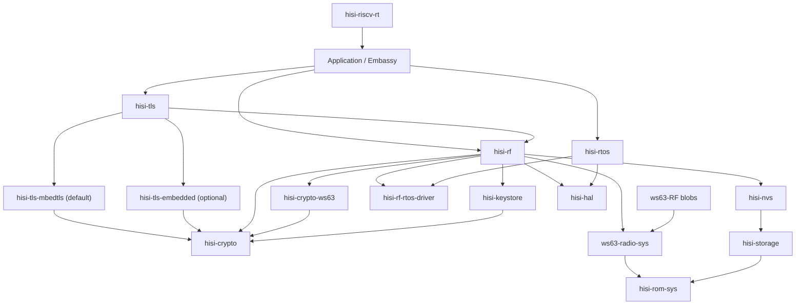

# RF5 之后的 HiSilicon Connectivity 全栈重构计划

## Summary

先沿当前 `ws63-rf-rs` 路径完成 **Wi-Fi connect → ping**，避免架构迁移打断
连接性北极星；ping 通过真机 HIL 后冻结行为基线，再拆成独立 release unit。

目标架构参考 esp-rs 的
`esp-radio → esp-radio-rtos-driver ← esp-rtos`、`esp-rom-sys` 和
`esp-storage` 分层，但增加 HiSilicon 特有的 vendor NVS、SLE 和 post-link
relocation 层。`hisi-rtos` 同时承载 radio blob 所需的线程/IPC 运行环境和
Embassy executor/time 运行环境。

本计划是 RF5 之后的完整执行事实源。Init/Scan 的历史、当前证据和 RF5A-C
入口仍记录在 [WS63 RF Init/Scan 计划](ws63-rf-init-scan.md)；根
[`ROADMAP.md`](../../ROADMAP.md) 只保留优先级和里程碑，不复制本文细节。

更长期的 protection domain、跨芯片 port、host runtime 与 CLI-first observability
架构已作为 deferred outlook 记录在
[`hisi-rtos` 未来架构](hisi-rtos-future-architecture.md)；它不属于当前 A3/A4 gate。

## Target Architecture



依赖方向必须保持单向：RTOS 不依赖 RF；NVS 不知道 RF key；ROM sys 不依赖
HAL；RF 不实现 IP stack；examples 不直接列 vendor archives 或 ROM 地址。

## Component Boundaries

| Component | Responsibility |
| --- | --- |
| `ws63-RF` | Language-neutral blobs、headers、ROM symbol/patch lists；不放 Rust 实现。 |
| `hisi-rom-sys` | 芯片中立的显式 chip-selection facade；统一 re-export ROM facts，并转发 backend Cargo metadata。 |
| `hisi-rom-sys-ws63` | WS63 固定 ROM 地址、生成 symbol/callback/patch metadata 与同步工具；位于 `crates/chips/ws63/`。 |
| `ws63-radio-sys` | WS63 Wi-Fi/BLE/SLE raw FFI、archive selection、ABI/layout assertions 和 relocation 规则。仓库同时发布 host CLI `hisi-rf-link`。 |
| `hisi-rf-rtos-driver` | runtime-neutral scheduler、semaphore、queue、timer、wait 和 ISR-wakeup contract；每个 firmware 只能注册一个实现。 |
| `hisi-rtos` | 默认单-hart、优先级抢占、tickless scheduler，以及 IPC、Embassy executor/time integration；不依赖 RF。 |
| `hisi-alloc` | 用户提供 SRAM arenas、对齐分配，以及可选 C/global allocator adapter；移出 RF heap 所有权。 |
| `hisi-storage` | runtime internal-flash access 和 `embedded-storage` traits；memory-mapped read 优先，erase/write 暂留 unstable。 |
| `hisi-nvs` | WS63 ACPU KV page parser、CRC、partition selection 和 typed read API；RF item IDs 由 RF crate 定义。 |
| `hisi-crypto` | 芯片中立的小粒度密码能力契约、敏感类型和 RustCrypto 软件实现；不承载 TLS、网络状态机或芯片寄存器。 |
| `hisi-crypto-ws63` | WS63 cipher accelerator、ROM UAPI、TRNG、key slot、独占资源、超时和硬件错误；失败时禁止静默回退软件。 |
| `hisi-keystore` | `KeyHandle`、不可导出密钥、用途权限，以及 eFuse/OTP/受保护 Flash 策略；`hisi-nvs` 不拥有密钥策略。 |
| `hisi-tls` | 后端中立的 async TLS facade 和安全字节流入口；拥有 transport/BIO 与 `WANT_READ`/`WANT_WRITE` async 映射，不重写 TLS。 |
| `hisi-tls-mbedtls` | 默认 TLS backend；mbedTLS 作为无 OS 协议库，通过 `hisi-tls` BIO 对接 Rust 网络栈，不依赖 LiteOS socket。 |
| `hisi-tls-embedded` | 可选 `embedded-tls` backend，复用同一 transport、entropy、time 和 allocator contract。 |
| `hisi-rf` | 用户入口和安全的 `wifi`/`ble`/`sle`/`coex` API；拥有 blob adapter，不拥有 scheduler、allocator、NVS format、ROM symbols 或 IP stack。 |
| `hisi-hal` | `hisi-riscv-hal` 在 0.6.0 stable 之后的新 package/repository 名；继续拥有多芯片 peripheral drivers，不吸收 RF/RTOS/storage policy。 |
| `hisi-riscv-rt` | startup/trap/linker mechanism；收集 memory-profile descriptor 和 init hooks，不知道 Wi-Fi/BLE/SLE policy。 |

所有新组件使用独立 Git 仓库、`Cargo.lock`、CI、版本和 release；父仓以 submodule
固定开发版本。`ws63-radio-sys` 与 `hisi-rf-link` 同仓同版本，因为 blob ABI 和
relocation 规则必须原子升级。闭源 archive 未确认 crates.io 重分发边界前，
`ws63-radio-sys` 只通过 GitHub release/submodule 交付。

固定依赖方向为 `Application -> hisi-tls -> hisi-crypto`；WPA、BLE 与 SLE security
从 `hisi-rf` 依赖 `hisi-crypto`，firmware verification 也只依赖 `hisi-crypto`。
WPA supplicant 不属于 TLS；只有 Enterprise 的 EAP-TLS profile 可以依赖 `hisi-tls`。

## Public Contracts

### RTOS And Embassy

- `hisi-rtos::start(config, timer0, soft_interrupt0, resources)` 一次性启动
  tickless、priority-preemptive scheduler。重复启动返回 `AlreadyStarted`。
- 初始 context switch 保存全部整数寄存器、`tp`、`mstatus`、`fcsr` 和全部浮点
  寄存器；只有 HIL 证明 lazy FP save 正确后才允许优化。
- TIMER_INT0 负责最早 deadline/time slice，WS63 software interrupt 负责立即
  reschedule；ISR 只记录/唤醒，调度和用户代码在退出中断后执行。
- `hisi-rtos` 提供 thread-mode Embassy executor 和唯一的 Embassy time driver。
  HAL 现有 time driver 保留一个 minor 的 deprecated 迁移窗；外设 async traits
  继续属于 HAL。
- 原厂 WS63 LiteOS 只作为 task-context、调度和 IRQ 行为 oracle，不进入产品依赖图，
  也不建立或维护 LiteOS backend。`hisi-rtos` 是唯一 native backend；
  `ws63-radio-sys`/WS63 ABI shim 只把 blob 实际引用的 `LOS_`/`osal_` 符号映射到
  `hisi-rf-rtos-driver` 小能力契约。该符号集合由 `nm -u`/link manifest 固定，新增
  未满足符号必须使 CI 失败。
- scheduler/IPC 对 blob 的入口只通过 `hisi-rf-rtos-driver` 注册宏导出的固定
  Rust ABI；链接到零个或多个实现都必须失败。

### Storage And NVS

- `hisi-storage` 稳定面只承诺 memory-mapped read 和边界检查。erase/write 必须在
  RAM/ROM 中执行，并处理 SFC、cache、interrupt 和 XIP 约束；在掉电 HIL 前保持
  `unstable-write`。
- 初始稳定 API 为
  `hisi_nvs::NvReader<S>::read(NvKey, &mut [u8]) -> Result<usize, NvError>`。
  它校验 page header、反码、record bounds、state、encryption flag 和 CRC。

### Crypto, Keys And TLS

- `hisi-crypto` 是“芯片中立的密码能力契约 + RustCrypto 软件实现”，不是统一承包所有
  算法、硬件和协议的 provider。模块边界固定为 `error`、`hash`、`mac`、`cipher`、
  `aead`、`rng`、`kdf`、`signature`、`secret`、`key`、`software`；WS63 寄存器、ROM
  UAPI、key slot 和硬件资源只进入 `hisi-crypto-ws63`。
- `hisi-crypto` 优先直接采用生态 traits：`digest::{Digest, Update, FixedOutput, Mac}`、
  `cipher::{KeyInit, BlockEncrypt, BlockDecrypt}`、`aead::{AeadCore, AeadInPlace, KeyInit}`、
  `rand_core::{TryRng, TryCryptoRng}`、`signature::{Signer, Verifier}`，以及 `zeroize`、
  `subtle`、`pbkdf2`、`hkdf`。具体名称以锁定依赖版本为准；只有错误、阻塞和状态语义
  严格匹配时才直接实现标准 trait。
- 对 busy、clock、DMA/alignment、ROM UAPI、timeout、reset 等可失败能力，提供小粒度
  `TryHash`、`TryMac`、`TryBlockCipher`、`TryAeadInPlace`、`EntropySource`，不继续扩张
  当前单体 `CryptoProvider`。标准 trait 无法表达硬件失败时，不允许用 panic、无限等待或
  隐式状态掩盖错误；可在能力语义严格匹配后，从 `Try*` contract 提供标准 trait adapter。
- 协议层可定义窄的 `Wpa2Crypto`、`TlsCrypto`、`VerifyCrypto` profile，只表达协议最小
  能力集合，不取代底层通用 trait；具体 backend 由显式 `CryptoSuite<H, M, A, R>` 组合。
- 第一阶段硬件契约是有界超时的同步 API：通过独占 token 管理引擎，不在 critical
  section 中等待，不在 IRQ/锁中调用用户逻辑。DMA/IRQ 证据成熟后再增加独立
  `AsyncTry*` 接口。
- `EntropySource` 表示原始 TRNG；CSPRNG/DRBG 负责播种与重播种。TLS 随机请求不能每次
  直接同步读取慢速 TRNG。TRNG 优先实现 `rand_core` 的可失败接口。
- 可导出的 `SecretBytes` 必须 `ZeroizeOnDrop`；不可导出密钥使用包含 slot 与
  `KeyUsage` 的 `KeyHandle`/`KeyRef::Handle`，不提供读取字节的 API。
- backend 只能在构造、feature 或资源注入时显式选择。`hisi-crypto-ws63` 操作失败后
  禁止透明切到 RustCrypto；混合 hash/AES/RNG suite 也必须由类型显式组合。
- 推荐依赖链固定为 `protocol profile -> standard/fallible capability traits ->
  RustCryptoBackend 或 hisi-crypto-ws63 -> ROM/cipher accelerator/TRNG`。协议 crate
  不得越过 backend 直接调用 ROM UAPI，硬件 backend 也不得反向依赖 WPA/TLS。
- `hisi-tls::TlsStream<T>` 对外实现 `embedded_io_async::{Read, Write}`；默认
  `hisi-tls-mbedtls`，可选 `hisi-tls-embedded`。transport 可接 `embassy-net`、
  `smoltcp` 或任意 `embedded-io-async` 流。
- NVS 首版只读。GC、双页切换、磨损管理和中途掉电恢复全部完成后，才讨论稳定
  write API。RF calibration/MAC key newtype 留在 `hisi-rf`。

### Radio

- `hisi_rf::init(RadioConfig, RadioResources)` 返回独占 `RadioController`；所有协议共享
  RF、IRQ、blob、memory profile 和 coexistence resources，禁止分别以 `Wifi::new()`、
  `Ble::new()` 抢占同一硬件。`split()` 返回
  `RadioParts { wifi, ble, sle, runner }`，且只产生编译时启用的协议 handle。
- `RadioRunner` 是必须持续 poll 的长期后台任务，唯一负责推进 blob、处理控制命令、
  ack/wake 和投递事件；协议 handle 不在调用者 task 中直接驱动 vendor scheduler。
- 公共接口分四个平面，不能用一个“万能 Radio trait”抹平协议语义：
  - **配置面**：`RadioConfig`、`ScanConfig`、`StationConfig`、`AdvertisingConfig`、
    `SeekConfig`、`CoexistenceConfig`；使用 validated newtype、enum 与 secret type，
    不接受无约束裸 channel、interval、密码或 key bytes。
  - **控制面**：Wi-Fi、BLE、SLE 各自提供 inherent async API；状态机和错误保持协议语义。
  - **数据面**：只在存在成熟标准时实现 ecosystem trait，不发明自有通用 socket/IP 层。
  - **事件面**：有界队列 + `next_event().await`；后续可选
    `futures_core::Stream` adapter。ISR/blob callback 只复制 bounded event、更新小状态并 wake，
    绝不调用用户 callback。
- Wi-Fi 分离 `WifiController` 与 `WifiDevice`。前者以 `&mut self` 串行化
  `scan/connect/disconnect/wait_for_link`，明确 cancellation 与状态迁移；scan 使用调用者
  提供的固定结果 buffer，返回 `{ count, truncated }`。后者只提供 L2 RX/TX，主要实现
  `embassy_net_driver::Driver`，可选实现 `smoltcp::phy::Device`。
- Wi-Fi 提供 L2 device；按 feature 实现 `smoltcp::phy::Device` 和
  `embassy-net-driver`。DHCP、ICMP、TCP/IP sockets 属于 smoltcp/Embassy Net。
- `embedded-svc::wifi` 仅可作为兼容 adapter，不是核心 API 的事实源。
- BLE 第一阶段封装 vendor GAP/GATT/SMP host 并提供安全自有 API。只有 controller-only
  边界被符号、packet ownership 和 HIL 证明后，才增加实验性 `ble-hci` 并实现
  `bt_hci::controller::Controller` 供 Trouble 使用；不得在 vendor host 上伪造 HCI。
- SLE 使用相同事件模型，提供 announce/seek/connect 和 SSAP client/server。
  SLE 没有可用的通用 Rust 标准，API 必须保持真实 SLE 语义，不伪装成 BLE。
- `coex` 初始始终 unstable；只有 Wi-Fi traffic 与 BLE/SLE 并发 HIL 通过后才允许稳定。
- 所有 blob callback 只把 bounded event 写入队列并 wake task；不得在 ISR、critical
  section 或 scheduler lock 中调用用户 callback。
- Wi-Fi security 采用 `hisi-crypto` provider 边界。当前已验证组合是 WS63
  unified-cipher PBKDF2/TRNG + RustCrypto SHA/HMAC/AES；SPACC hash/SYMC 只有在独立
  clock/IRQ/wait HIL 通过后才能成为默认 backend。RF 不公开密码实现 context。
- 初始稳定候选仅为 WPA2-Personal/CCMP。WPA3-SAE、SoftAP authenticator 和 Enterprise
  分别使用独立 feature 与 HIL gate；编译进完整原厂 archive 不等于 API 已支持。
- `hisi-rf` 的依赖边界固定为 `hisi-rf-rtos-driver`、`hisi-crypto`、`hisi-nvs`、HAL
  和 chip backend（WS63 为 `ws63-radio-sys`）；它不拥有 scheduler、ROM symbols、NVS
  format、通用 crypto、TLS 或 IP stack。WPA supplicant 属于
  `hisi-rf::wifi::security` 并依赖 `hisi-crypto`，不经过 `hisi-tls`。
- `hisi-rf` 的公共概念保持芯片中立；WS63 FFI/blob/ABI 只存在于
  `ws63-radio-sys`。host/QEMU 使用 stub backend。闭源 payload 后续由自建 registry 的
  `ws63-radio-blob` 显式选择，通用 crates.io crate 不得强依赖私有 registry。

### TLS

- `hisi-tls` 默认使用 mbedTLS；`embedded-tls` 是显式 opt-in backend。backend 选择不改变
  上层 async stream contract，应用不得依赖 mbedTLS C context。
- mbedTLS 作为无 OS 协议库使用，不直接调用 LiteOS socket。自有 BIO adapter 接
  `embedded-io-async`/smoltcp/Embassy Net，把 `WANT_READ/WANT_WRITE` 转为 async 等待。
- 每个 TLS context 由单一 Embassy task 独占；跨 task 使用通过 channel/ownership 转移，
  不在 ISR、critical section 或 scheduler lock 内推进握手。
- 熵源来自 `hisi-crypto`，可信时间来自平台 time contract，内存来自 `hisi-alloc` 的
  Rust/C shared allocator 或专用 C arena。硬件加速只存在于 crypto backend，不散落在
  TLS 状态机、BIO 或证书策略中。

### Runtime And Link

- `hisi-riscv-rt` 增加一个 pre-relocation memory-profile descriptor 和一个
  linker-collected post-relocation init registry；重复 memory profile 由 linker
  `ASSERT` 失败。
- `ws63-radio-sys` 贡献 packet-RAM NOBITS input section、BGLE/shared-memory profile、
  ROM patch payload 和 post-relocation hook；RT 只负责收集与执行机制。
- `hisi-rf-link` 负责 stock `rust-lld` layout pass、vendor relocation transform、
  final-layout fail-closed 校验和 ROM patch table。最终 ELF 再交给 `hisi-fwpkg`
  计算 header/hash/body；RF 工具不得复制镜像格式语义。

## Milestones

### RF5A -- TX/RX Closure

- 从 vendor headers 生成 pbuf offset/size assertions，覆盖当前已验证的 80-byte
  zero-copy reserve 以及 TX/RX 实际访问字段。
- 找到真实 transmit symbol，把 `netif_smoltcp` 测试 sink 替换为 blob adapter；
  `driverif_input` 把 RX frame 送入有界队列，并定义满队列 drop counter。
- HIL 先通过 ARP request/reply，证明双向 Ethernet frame 数据面。
- 2026-07-12 已完成：原厂 lwIP 配置/DWARF 驱动的 pbuf/netif ABI 检查、DHCP lease、
  gateway ARP reply 均在真机通过。MTU-sized smoltcp token 曾令 8 KiB 主栈下溢并覆盖
  FRW queue；现改为静态单占用 scratch，并以 token-size host test 防回归。

### RF5B -- Open AP Connect

- 在当前 `ws63-rf-rs` 中增加 typed station config、connection-state event 和
  `Wifi::connect`；第一目标是受控实验室 open AP，不宣称生产安全能力。
- UART marker 固定为 `RF5_CONNECT_BEGIN`、`RF5_CONNECT_OK` 或
  `RF5_CONNECT_ERR:<class>:<vendor-code>`；用户逻辑不在 vendor event callback 中执行。

### RF5C -- Ping And Baseline Freeze

- 第一轮使用静态 IPv4、gateway 和受控 peer，随后补 DHCP；ICMP 必须经过 Rust-visible
  L2 device，而不是 vendor lwIP 隐藏路径。
- HIL 固定 `RF5C_PING_OK rx=N`，保存 UART log、ELF section/layout report、ROM
  patch manifest、image plan 和资源占用，作为迁移前 A0 baseline。
- 2026-07-12 已完成：修复 ICMP frame 实际长度与 IPv4 `total_length` 不一致后，
  `HUAWEI-HLJ_Guest` 上的 DHCP、gateway ARP 和 `1.1.1.1` Echo Reply 均通过
  Rust-visible L2 path；UART 输出 `RF5C_PING_OK rx=0x00000004`。迁移前 A0 已冻结在
  [WS63 RF A0 baseline](evidence/ws63-rf-a0-2026-07-12.md)。

### A0 -- Baseline Freeze

- [x] 固定 init/scan/connect/DHCP/ARP/ping UART marker。
- [x] 固定最终 ELF、rust-lld map、relocation manifest、ROM patch report、canonical image
  和 FlashPlan 的 SHA-256 与资源摘要。
- [x] 保留 `.wifi_pkt_ram` NOBITS、ROM symbol、patch count 与 image body/erase range 证据。
- A1-A4 的每个迁移阶段必须复现该 baseline；不能用仅构建或 QEMU 结果替代 RF 真机证据。

### W0-W4 -- Wi-Fi Security Closure

1. **W0A oracle（已完成）**：完整原厂 supplicant + mbedTLS/security archives 在真机完成
   WPA2-Personal connect、DHCP、ARP、ping；保留 marker、ABI probe 和资源基线。
2. **W0B WPA2-only（已完成）**：从原厂同版本源码/config 生成只含 STA WPA2-PSK/CCMP 的 archive，
   删除 SAE、AP、EAP/TLS/WPS/P2P/WAPI 对象。以 link closure 固定所需 crypto/libc ABI，
   对外 feature 命名为 `wifi-wpa2-personal`。机器可读边界由
   `chips/ws63/rf/tools/wpa2-personal-profile.toml` 定义，并由
   `check-wpa-profile.py` 对原厂 CMake source/define 集执行 fail-closed 检查。
   2026-07-12 真机复现 connect、DHCP、ARP、ping；构建闭包、SDK compatibility define
   陷阱和资源差异见 [WPA2 cropped evidence](evidence/ws63-wpa2-cropped-2026-07-12.md)。
3. **W1 crypto baseline（已完成）**：过渡 `CryptoProvider` 已覆盖 PBKDF2-HMAC-SHA1、
   SHA-1/SHA-256、HMAC-SHA1/HMAC-SHA256、AES 和 TRNG。WS63 当前使用已验证的
   unified-cipher PBKDF2/TRNG，SHA/HMAC/AES 使用 RustCrypto；最终 ELF 无 `mbedtls_*`
   supplicant 符号，并在真机 KAT 后完成 WPA2 connect/DHCP/ARP/ping。SPACC HMAC/SYMC
   因 transitional runtime 下的 calc timeout 保持 experimental，待 `hisi-crypto` 独立
   clock/IRQ/wait HIL 后再启用。该单体 trait 只作为迁移基线，后续由小能力 traits、
   显式 `CryptoSuite` 和 `hisi-crypto-ws63` 取代。证据见
   [WPA2 cropped evidence](evidence/ws63-wpa2-cropped-2026-07-12.md)。
4. **W2 WPA3/SAE**：单独恢复 SAE/H2E、PMF 和所需 ECC/HKDF/AES-SIV primitives；先做
   WPA3-Personal，再做 WPA2/WPA3 transition mode。优先复用 unified-cipher PKE/ECC 与
   hash/HKDF UAPI，RustCrypto 继续作为向量 oracle；不得让 W2 扩大 W0B 的默认体积。
5. **W3 SoftAP**：分别验证 open AP、WPA2-Personal authenticator、WPA3-SAE AP；覆盖
   beacon、STA join/leave、GTK rekey、多客户端和 Wi-Fi/BT coexistence。AP authenticator
   与 STA supplicant 使用独立 feature 和任务资源预算，不能为了 SoftAP 把 hostapd/EAP
   server 对象重新塞入默认 STA archive。
6. **W4 Enterprise**：最后接入 EAP/TLS、证书/私钥存储、可信时间和 server validation；
   WPA2-Enterprise 与 WPA3-Enterprise 分开 gate。TLS provider 独立于 WPA2/WPA3 personal
   crypto provider。默认 backend 固定为 mbedTLS，可选 `embedded-tls`；两者必须复用同一
   async BIO、entropy/time/allocator contract，不得把“能链接 TLS”当作认证证据。

W0-W4 可以在 A1-A4 拆分期间逐项迁移，但每一步必须保留上一阶段 HIL。测试 SSID 和
passphrase 只从 self-hosted runner secret 注入，不进入源码、日志或 evidence artifact。

### H0 -- Rename `hisi-riscv-hal` To `hisi-hal`

**Status: complete (2026-07-13).** Evidence:

- Published migration-only `hisi-riscv-hal 0.6.1` and preserved the
  `release/0.6` maintenance branch without yanking history.
- Renamed the GitHub repository and parent gitlink to `hisi-hal`, published
  `hisi-hal 0.7.0-alpha.1`, and passed the normalized stable API parity gate.
- Migrated and linked WS63/BS20/BS21 examples, RF, stable/unstable HIL ELFs,
  template `v0.7.0-alpha.1`, CI, skills, mdBook metadata, and WS63/BS21 rustdoc.
- The template's three-project GitHub CI matrix passes using the crates.io
  package, proving the happy path does not depend on the old repository redirect.

- H0 只在 `hisi-riscv-hal 0.6.0` 正式发布且 RF5C baseline 已冻结后开始，并在
  A1 新组件建仓前完成。重命名 release 不夹带 API、寄存器行为或 feature 重构。
- 先发布仅补迁移说明的 `hisi-riscv-hal 0.6.1`，保留 `release/0.6` 分支一个
  release train，只接收 critical correctness/security fixes；历史版本不 yank。
- GitHub repository 改名为 `hisi-hal`，父仓 submodule URL 和文档链接随迁；GitHub
  redirect 只作为辅助，CI 不依赖 redirect。
- Cargo 新 package 从 `hisi-hal 0.7.0-alpha.1` 开始，Rust crate path 是
  `hisi_hal`。chip features、stable/unstable policy 和默认公开面与 0.6.0 等价，
  用 rustdoc JSON/semver checks 证明重命名之外没有 surface 漂移。
- 官方模板、examples、HIL、docs、skills、CI 和后续 `hisi-*` crates 全部改用
  `hisi-hal` / `hisi_hal`。迁移期下游若暂时不改源码导入，可使用：

  ```toml
  hisi-riscv-hal = { package = "hisi-hal", version = "0.7.0-alpha.1", features = ["chip-ws63"] }
  ```

- 父仓下一条 `v0.7.0-alpha.1` release train 以 `hisi-hal 0.7.0-alpha.1` 为 anchor；
  `hisi-riscv-rs v0.6.x` 文档快照继续指向旧 package，不回写历史版本。

### A1-A4 -- Decomposition And Wi-Fi Migration

1. A1：在 H0 完成后抽取 `hisi-rom-sys`、`hisi-alloc`、`hisi-crypto`、
   `hisi-crypto-ws63`、`ws63-radio-sys`、`hisi-rf-link`；examples
   不再维护 ROM/link/archive 列表。
2. A2：抽取 `hisi-storage` 和 read-only `hisi-nvs`；移除 RF parser 与 RT 中的 NVS
   partition symbols。主机端 image builder/CLI 的 N0-N5 后续独立按
   [NVS 镜像工具链计划](hisi-nvs-image.md)推进，不阻塞 A2/connectivity。
3. A3：建立 `hisi-rf-rtos-driver`；把现 scheduler/IPC 迁到 `hisi-rtos`，再升级为
   抢占式实现并接管 Embassy time/executor。
4. A4：建立 `hisi-rf` 并迁移 Wi-Fi API/L2 device。每一步复跑 A0；全部等价后
   `ws63-rf-rs` 作为 re-export facade 保留一个 migration release，再删除。
5. W4 Enterprise 前建立 `hisi-tls`、默认 `hisi-tls-mbedtls` 与可选
   `hisi-tls-embedded`；TLS 不阻塞 A1-A4 的 Wi-Fi personal 迁移。密钥句柄策略随后
   独立到 `hisi-keystore`，不塞进 NVS 或 TLS backend。

#### A4 extraction gates

- 在 A2/A3 完成前不启动 `hisi-rf` 大规模迁移；现有 `ws63-rf-rs` 继续承载已经验证的
  init/scan/connect/ping，架构整洁不能中断 connectivity baseline。
- 第一条 A4 vertical slice 必须同时交付 `RadioController`、`RadioParts`、可运行的
  `RadioRunner`、Wi-Fi controller/device 分离和一个 bounded event queue；禁止只创建
  facade/空 trait 后长期双轨维护。
- 每次迁移必须在同一真机镜像复现 A0 marker 和 Rust-visible L2 ping；完成 parity 后
  才迁下一平面。兼容 facade 保留一个 release，并明确弃用窗口。
- `hisi-rf-link` 继续唯一拥有 radio relocation/layout；`hisi-fwpkg` 继续唯一拥有
  header/hash/body/image semantics。任何 backend 或私有 blob 分发都不得复制这两类事实。

#### A1 progress

- [x] `hisi-alloc` 已抽为独立 repository/release unit。通用 crate 只拥有 caller-provided
  arena、对齐/ownership 校验和可选 C allocation mechanics；WS63 linker symbols、RF C ABI
  和诊断仍留在 adapter。
- [x] RF adapter 已移除对 `linked_list_allocator` 的直接依赖，并在 2026-07-13 真机复现
  init、scan、WPA2 connect、DHCP、ARP 和 ping。证据见
  [A1 allocator migration](evidence/ws63-rf-a1-alloc-2026-07-13.md)。
- [x] `hisi-rom-sys` 已进一步收窄为芯片中立 facade；WS63 固定地址、生成 ROM symbol、
  callback ABI、Wi-Fi patch metadata 和同步工具由独立 `hisi-rom-sys-ws63` backend
  拥有。facade 的 Cargo `links` contract 转发 backend metadata，父仓 drift check 保证
  生成 artifact 与语言中立源一致。
- [x] ROM artifact 迁移后再次通过 1,486 section、5,335 relocation、37 patch 的 guarded
  link，并在真机复现完整 connectivity marker。证据见
  [A1 ROM metadata migration](evidence/ws63-rf-a1-rom-sys-2026-07-13.md)。
- [x] `hisi-crypto` 已抽为独立 repository/release unit。当前过渡 trait 覆盖
  PBKDF2/SHA/HMAC/AES/entropy，RustCrypto backend 作为软件实现与 KAT oracle。
- [x] WS63 unified-cipher PBKDF2/TRNG backend 已抽入独立 `hisi-crypto-ws63`；
  `hisi-crypto 0.1.0-alpha.3` 新增小能力 traits 与显式 suite。RF 分别注入硬件
  PBKDF2/TRNG 和软件 SHA/HMAC/AES，禁止失败后静默回退。host、guarded link、硬件
  PBKDF2 KAT 与 WPA2/DHCP/ARP/ping 通过，证据见
  [A1 WS63 crypto backend](evidence/ws63-rf-a1-crypto-ws63-2026-07-13.md)。
- [x] RF 已移除对 `aes`、`hmac`、`sha1`、`sha2`、`pbkdf2` 的直接依赖；迁移后的
  guarded link 与真机 WPA2/DHCP/ARP/ping 均通过。证据见
  [A1 crypto provider migration](evidence/ws63-rf-a1-crypto-2026-07-13.md)。
- [x] `ws63-radio-sys` 已抽为独立 repository，嵌套唯一的语言中立 `ws63-RF`
  payload，并通过 Cargo `links` 元数据拥有 archive order、root symbols、ABI/ROM 路径。
- [x] 同仓 `hisi-rf-link` 已拥有 relocation transform、layout verifier 和 mask-ROM
  patch 工具；父仓删除重复 Python 实现。迁移后 guarded link 与 WPA2/DHCP/ARP/ping
  真机 parity 通过，证据见
  [A1 radio sys/link migration](evidence/ws63-rf-a1-radio-sys-2026-07-13.md)。
- [x] 父仓 example/build/tool scripts 已统一读取 `ws63-radio-sys` machine profile；CI
  drift check 禁止 operational scripts 重新维护 archive 名称、顺序或旧 payload 路径。
- [x] A1 已完成：`hisi-crypto-ws63 0.1.0-alpha.1`、芯片中立
  `hisi-rom-sys 0.1.0-alpha.3` 与 WS63 backend `hisi-rom-sys-ws63 0.1.0-alpha.1`
  均已由 GitHub Actions 发布到 crates.io；父仓 workspace、machine profile 和 drift
  checks 只消费各自 owner 导出的契约。

#### Crypto migration gates

- [x] 通用 crate 已从“大 `CryptoProvider`”方向转为小能力 trait 与显式
  `CryptoSuite`；旧 provider 仅作为迁移兼容面，不再增加算法。
- [x] 当前 WS63 backend 只实现已验证的 PBKDF2/TRNG 能力；SHA/HMAC/AES 保持显式
  RustCrypto backend，不因硬件 timeout 自动回退。
- [ ] 为 `SecretBytes`、`KeyUsage`、`KeyHandle` 和 `KeyRef` 固化 zeroize、不可导出和用途
  权限测试；在此之前不公开稳定硬件 key-slot API。
- [ ] 将 raw `EntropySource` 与 DRBG 分层，补重播种、连续健康检查和故障传播测试；TLS
  backend 不得把每次随机读取直接映射为同步 TRNG 调用。
- [ ] 每个新增硬件 hash/MAC/AES/AEAD 能力必须同时具备标准向量、错误注入、timeout、
  独占冲突和真机 HIL；只有语义严格匹配时才提供对应 RustCrypto trait adapter。

#### A2 progress

- [x] `hisi-storage 0.1.0-alpha.1` 已作为独立 repository/release unit 发布，稳定候选面
  仅包含 bounded memory-mapped/read-only `embedded-storage` contract；erase/write 未暴露。
- [x] `hisi-nvs 0.1.0-alpha.1` 已建立独立 repository、tag、green CI，并发布到 crates.io；
  ACPU KV reader
  覆盖 page complement、duplicate sequence、record bounds/state/encryption length、CRC 与
  integrity-before-buffer-size，共 9/9 host tests。
- [x] RF 已删除内联 NVS format/constants/parser，`uapi_nv_read` 仅保留 vendor C ABI 与
  RF key IDs，通过 `NvReader<MemoryMappedStorage>` 读取。
- [x] `__nv_storage_*` 已从 `hisi-riscv-rt` 移到芯片专属
  `ws63-radio-sys/linker/ws63-nvs.x`；guarded link 的 1,486 section、5,335 relocation、
  37 ROM patch 不变，迁移前后 planned image 逐字节一致。
- [x] WS63 HIL 已复现 init/scan/WPA2 connect/DHCP/ARP/ping；证据见
  [A2 storage/NVS migration](evidence/ws63-rf-a2-nvs-2026-07-13.md)。
- [x] 发布 workflow 已统一使用生态事实源 secret `CARGO_REGISTRY_TOKEN`；crate 与 GitHub
  prerelease 均可从当前 tag 获取。A2 已完成，主机端 image builder/CLI 继续按独立 N0-N5
  计划推进，不反向阻塞只读 runtime reader。

#### A3 progress

- [x] 已建立独立公开 `hisi-rf-rtos-driver 0.1.0-alpha.4` release unit；其 contract
  包含可失败 task/semaphore、validated stack/timeout/wait 类型和 exactly-one runtime
  注册，不依赖 WS63、RF、scheduler、allocator 或网络栈。
- [x] 真实 vendor `osal_kthread_create`、`osal_msleep`、current-task、semaphore、mutex、
  wait/message queue 和 event-group 路径已穿过 driver contract；opaque handle 的销毁也由
  contract 显式完成，不是空 facade。
- [x] 已建立独立 `hisi-rtos 0.1.0-alpha.3` release unit；task slots、task stacks、context
  switch 和 cooperative scheduler ownership 已从 RF crate 移出。应用显式注入 allocator、
  deallocator 和 monotonic clock resources 后启动唯一 runtime。
- [x] scheduler 的 allocation/free 和 monotonic clock 读取已移出 critical section；临界区只
  更新 task state、ready/sleep metadata 和当前 task bookkeeping。
- [x] task priority 已穿过 driver/OSAL contract，退出栈由另一 task 延迟回收。早期仅启用严格
  优先级、尚无 IRQ epilogue 时曾饿死初始化路径；现在 RF smoke 显式选择
  `SchedulingPolicy::Priority`，ISR 唤醒高优先级 task 后由 runtime 在恢复任务栈、弹出 trap
  frame 之前执行 deferred context switch。`Config::default()` 仍为 Cooperative，避免未选择
  Priority 的普通应用隐式改变调度语义。
- [x] scheduler lock/unlock 已穿过 driver/OSAL contract；`hisi-rtos` 按 task 跟踪嵌套深度，
  拒绝不平衡 unlock，host test 覆盖嵌套与错误路径。该能力不冒充抢占或优先级继承。
- [x] Guarded link 仍验证 1,486 section、5,335 relocation 和 37 ROM patch；WS63 HIL
  已复现 init/scan/WPA2 connect/DHCP/ARP/ping。driver contract 的首次证据见
  [A3 driver contract](evidence/ws63-rf-a3-driver-contract-2026-07-13.md)，scheduler ownership
  迁移证据见 [A3 hisi-rtos extraction](evidence/ws63-rf-a3-hisi-rtos-2026-07-13.md)，策略
  收窄与最新真机 parity 见
  [A3 scheduling policy](evidence/ws63-rf-a3-scheduling-policy-2026-07-13.md)。
- [x] `0x1451` 已按原厂定义确认为 `WLAN_AUTH_RSP2_TIMEOUT`，并通过 unchanged-image
  reset matrix 完成归因：同步 vendor UART 开启时 20 次中出现 3 次该超时；关闭 RF 热路径
  同步日志后 Rust 为 20/20、原厂 LiteOS 对照也为 20/20，均无 0x1451。该问题不是“AP
  瞬态”；`rf-vendor-log` 仅保留为显式诊断 feature，统计型连接回归继续作为 HIL gate。
  完整矩阵和 summary hash 见
  [A3 scheduling policy](evidence/ws63-rf-a3-scheduling-policy-2026-07-13.md)。
- [x] `hisi-riscv-rt` 已为 DIRECT/MIE/local IRQ 提供 linker-overridable epilogue hook；
  `hisi-rtos` 的 Priority backend 仅在 outermost IRQ、scheduler unlocked 且更高优先级 task
  ready 时切换。11/11 host tests 通过；真机 RF 全链路通过且
  `irq_preemptions=0x00000289`。证据见
  [A3 IRQ epilogue preemption](evidence/ws63-rf-a3-irq-preemption-2026-07-14.md)。
- [x] WS63 `SYS_CTL1.SOFT_INT0` 已按原厂定义和真机验证为 custom local IRQ 36，而非标准
  RISC-V MachineSoft。SVD/PAC `device.x`、默认与实验 runtime 向量表、命名 handler 均已
  对齐；两次 nRST 都得到 `mcause=0x80000024` 且清中断后状态归零。证据见
  [A3 software interrupt routing](evidence/ws63-rf-a3-software-interrupt-2026-07-14.md)。
- [x] TIMER_INT0 one-shot deadline/time slice 与 SOFT_INT0 deferred reschedule 已使用统一
  272-byte `TaskContext` ABI；interrupt 保存完整 GPR/FPR，cooperative 路径只刷新 ABI
  callee-saved 槽，所有 restore 统一走 `mret`。`rtos_preemption` 连续三次真机得到
  `timer_irqs=101`、`slice_preemptions=101`、`software_irqs=2`、`fp_failures=0`。
  证据见 [A3 unified task-context preemption](evidence/ws63-rf-a3-unified-context-2026-07-14.md)。
- [ ] budget enforcement、priority inheritance、nested-IRQ/timeout stress HIL 与 Embassy
  time/executor integration 尚未完成；这些 gate 全部
  通过前，A3 不得标记完成。

### B0-B3 -- BLE Vendor Host First

1. B0：对 `libbg_common`、`libbt_host`、`libbt_app`、`libbth_sdk` 做 symbol closure、
   archive/version hash、ABI layout 和 memory-profile 清单。
2. B1：完成 controller/host init、transport、NVS identity/bonding 和 RTOS contract。
3. B2：实现 advertising/scanning、bounded event queue 和 HIL marker。
4. B3：实现 GATT client/server、notification/indication 和断连清理。Classic BR/EDR
   不在本轮范围。

### S0-S3 -- SLE

1. S0：对 `libbth_gle` 及共享 BT archives 做 closure，明确 BLE/SLE 共享 transport、
   heap、NVS 和 coex state。
2. S1：announce/seek；S2：connect/disconnect；S3：SSAP client/server。
3. 自动连接与数据收发 HIL 需要第二块 WS63；单板只能作为 init/announce 证据。

### X0 And R0 -- Coexistence And Release

- 先验证 Wi-Fi ping + BLE advertising/connection，再验证 Wi-Fi + SLE；只有并发 RF
  时序、shared RAM profile、heap watermark 和 IRQ latency 都有 HIL 后才公开 `coex`。
- R0 发布 compatibility matrix、RAM/flash/task budget、blob/ROM hashes、known issues、
  examples 和 HIL evidence；之后才把更高层 convenience API 作为稳定候选。

## Verification

- Host：NVS malformed pages/CRC、allocator alignment/ownership、scheduler state model、IPC
  timeout/cancellation、ABI sizes、relocation transforms、WPA crypto known-answer vectors 和
  security feature matrix。
- Link：ROM/blob hash、archive closure、唯一 memory profile、NOBITS regions、final/oracle
  layout、无 unresolved vendor relocation、`hisi-fwpkg` image plan。
- QEMU：RTOS priority/preemption、ISR wake、FP context、Embassy timers、stubbed radio adapter；
  QEMU 结果不得被描述为 RF 证据。
- WS63 HIL：scan/connect/ping、RTOS+Embassy、BLE advertising/scanning/GATT，以及 SLE
  two-board。增加 vendor tasks + Embassy tasks + timed semaphore + nested IRQ wake + repeated
  scan 的 scheduler stress。
- CI drift：禁止 ROM symbols、NVS constants、scheduler implementation 和 direct blob link
  args 出现在各自 owner 之外；检查依赖图无反向边和循环。

## Assumptions And Locked Decisions

- 先完成 Wi-Fi ping，再拆仓；不并行维护新旧两条主路径。
- `hisi-riscv-hal 0.6.0` 是旧名称的最后一个主 release；新名称从
  `hisi-hal 0.7.0-alpha.1` 开始，H0 在 A1 之前完成。
- 每个新底座是独立仓库和 release unit，父仓通过 submodule 集成。
- BLE vendor host 先行；TrouBLE/raw HCI 后置。
- NVS 稳定面只读；写入保持 experimental。
- `hisi-rtos` 只维护抢占式单-hart backend；现 cooperative scheduler 是迁移材料。
- 初期不创建 `hisi-sync` 或 `hisi-phy`：同步继续使用 `critical-section` / 
  `portable-atomic`，PHY policy 在出现可复用、非 blob-owned 行为前留在 radio adapter。
