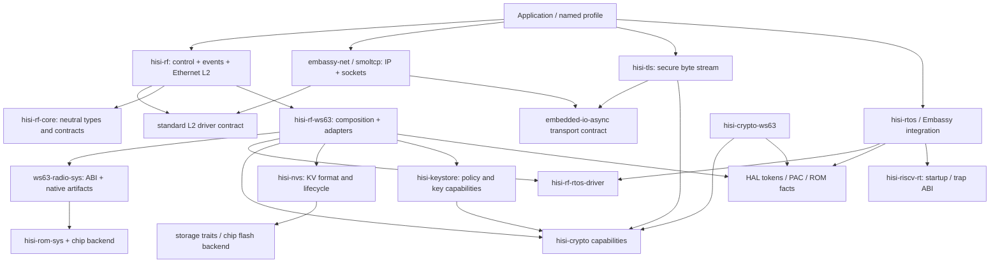

# HiSilicon Rust 生态架构、计划与质量工程评审

日期：2026-09-07。性质：日期化评审与建议，不是新的执行计划。

本报告以父仓 `10bd61f649a1ed410faf2577518bb982a9fcb088` 及其当前 submodule checkout 为
快照，审阅全部 11 份顶层计划的状态、依赖与验收，并抽查关键实现、发布流程、远端 CI
和真机证据。没有重新烧录，也没有把历史 HIL 当成本轮执行结果。

当前执行事实源仍是[计划注册表](../plan/README.md)和
[connectivity 计划](../plan/hisi-connectivity-stack.md)。本报告不自动激活新 WIP，不重开
已完成里程碑，不修改 U8 的 no-go 决定。P1/P2 是本次评审的风险等级，不重定义注册表优先级。

## L0 收口更新

本节记录同日按评审结论完成的“发布与证据可信化”收口。后文 F1-F9 保留发现时的证据、
影响和关闭条件，不能再把 F1-F6 的原始快照解读为当前未处理状态。

| Finding | 当前状态 | 可执行证据 |
| --- | --- | --- |
| F1 release 绕过 | **已关闭** | `hisi-rf` `c120de33` 将 publish 绑定到同 revision candidate gate；[CI 34092745250](https://github.com/hispark-rs/hisi-rf/actions/runs/34092745250)通过 |
| F2 release 镜像旁路 | **已关闭** | parent `3e60622e` 由 FlashPlan 生成并复验 ELF/plan/image/checksums；[CI 34093283204](https://github.com/hispark-rs/hisi-riscv-rs/actions/runs/34093283204)通过 |
| F3 hostap 公告未分类 | **已关闭** | `ws63-radio-sys` `06504cca` 对 2026-4/2026-5 建立 profile applicability 与 fail-closed gate；[CI 34094226717](https://github.com/hispark-rs/ws63-radio-sys/actions/runs/34094226717)通过 |
| F4 计划句式门禁 | **已关闭** | parent `f06cc08d` 引入 `registry.toml`、依赖/evidence schema 和 7 个负测试 |
| F5 proof/evidence 混淆 | **已关闭本轮范围** | `hisi-rtos` `22804841` + `5991896f` 绑定 source/model/config/harness/workflow/tool digest 和完成态 Kani/TLA run manifest；[CI 34096444025](https://github.com/hispark-rs/hisi-rtos/actions/runs/34096444025)通过 |
| F6 计划与 Skill 漂移 | **本报告所在提交关闭** | NVS/IRQ 计划按当前实现改写；`run-ws63-rs` 命令已执行 host tests，不再复制固定 crate/file 数量 |

证据可信化同时暴露了存量债务：7 条 RTOS HIL marker 中只有 2 条绑定精确 firmware ELF，
其余 5 条已显式标为 `legacy-no-firmware-hash`。这是更诚实的证据边界，不是把旧结果重新
认证为当前固件。L0 没有新增板卡 HIL，也没有宣称解决 F7-F9 的长期架构、集成和性能问题。

## 一、评审结论

**生态已经越过单一芯片 bring-up，进入“可复用 alpha 平台向可维护产品平台收敛”的阶段。**
RF、RTOS、密码、存储、镜像格式的主要分层是成立的；真正薄弱的是跨仓发布物与测试对象
的一致性、证据门槛的可执行性，以及长期计划随代码演进后的语义漂移。

不建议现在重建架构、增加一批仓库，或把全部未来功能塞进下一次 stable gate。建议先修复
发布与证据缺口，再选择一个网络产品纵向切片；高级 RTOS、DLI/SLB、BSP 等继续条件触发。

### F1 · P1：发布成功可以绕过同提交的失败 CI

- **事实：**`hisi-rf` 当前提交 `c6812fc8c1115db6cb10b4c8d01b08a71251c35a` 的
  [CI 失败](https://github.com/hispark-rs/hisi-rf/actions/runs/33704789484)，但同提交
  [Publish 成功](https://github.com/hispark-rs/hisi-rf/actions/runs/33704796687)。失败步骤是
  WPA2 dependency/public API boundary；原因是 source 为 alpha.114，外部 fixture 仍 pin alpha.110。
- **定位：**`crates/hisi-rf/.github/fixtures/ws63-consumer/Cargo.toml` 第 21 行；
  `crates/hisi-rf/.github/scripts/check-boundaries.py` 第 65-83 行；
  `crates/hisi-rf/.github/workflows/publish.yml` 第 16-38 行。这些是 submodule 快照内路径，
  不伪装成父仓浅 checkout 下可用的相对链接。
- **影响：**三平台旧 fixture 成功不能证明最新发布 facade 的 consumer 契约；独立 publish
  job 没有依赖完整候选包验收。该失败不证明 alpha.114 功能坏，但证明发布 gate 可以被绕过。
- **建议：**区分 source-graph、packaged-candidate、published-registry 三条验证线。
  发布前从当前 `.crate` 构建隔离 consumer，发布后 exact-pin 新版本再验证；publish 必须
  `needs` 同一 revision 的候选包 gate。不要简单把允许落后两个 alpha 改成更多版本。
- **关闭条件：**故意使 boundary/API 检查失败时发布不执行；当前 alpha.114 的独立 consumer
  三平台补验；后续版本的报告明确记录实际解析的 facade/backend/sys 版本与 lock digest。

### F2 · P1：父仓 release 固件仍绕过镜像事实源

- **事实：**[release.yml](../../.github/workflows/release.yml)第 34-49 行使用普通 build 和
  `rust-objcopy -O binary`，没有调用 `hisi-fwpkg plan`；第 66-78 行先发布固件，再做文档验收。
- **本地复现：**当前 blinky ELF 的非空 LOAD 从 `0x230300` 开始，没有 boot-header segment。
  release 同款 objcopy 输出 **8,872 bytes 裸 body**；`hisi-fwpkg plan` 输出
  **9,640 bytes 完整 image**，base=`0x230000`、body offset=`768`、body len=`8,872`。
  本次不是“header 有但 hash 为零”，而是发布 bin 本身没有 header。
- **影响：**泛称 firmware `.bin` 会让使用者把裸 body 当成完整 app image，按完整镜像入口烧录
  时无法兑现启动契约。校验文件 hash 只能证明下载未损坏，不能证明格式正确。
- **遗漏原因：**[image truth checker](../../scripts/check-image-format-truth.py)扫描范围未覆盖
  release workflow，因此主 smoke 路径收敛后，发布旁路仍能存在。
- **建议：**发布 `ELF + plan.json + image + SHA256SUMS + train manifest`；完整 image 必须由
  `hisi-fwpkg` 产生、解析复验。确需裸 body 时明确命名用途和 base，不称为通用可烧录镜像。
  构建加 `--locked`，先完成 package/docs/contract，再将 release 从 draft 提交为正式状态。
- **关闭条件：**下载 release asset 后在隔离目录验证 body/hash/erase 范围；小/大/有 gap/已有头
  ELF 都覆盖；格式漂移测试能阻止重新引入 objcopy-only 发布路径。

### F3 · P1：hostap 安全雷达发现的公告尚未完成适用性处置

- **事实：**radio-sys 主 CI 成功，但
  [security radar 失败](https://github.com/hispark-rs/ws63-radio-sys/actions/runs/33378748584)；
  [跟踪 issue](https://github.com/hispark-rs/ws63-radio-sys/issues/1)指出 manifest 缺少
  `2026-4`、`2026-5` 两条公告的处置记录。
- **边界：**[原厂上游公告](https://w1.fi/security/)涉及 mesh AMPE 和 RADIUS 路径；本地
  Personal 配置包含裁剪，例如 `CONFIG_NO_RADIUS`。本次没有证明当前固件可利用，不能把
  “尚未分类”写成“产品已存在漏洞”，也不能只因裁剪声明就自动忽略。
- **建议：**逐公告记录 affected source、编译配置、最终可达符号、profile、处置 commit、
  review owner 和复查条件；区分 not-affected、fixed、accepted-risk、under-investigation。
  unresolved 高风险项阻止受影响 profile 发布，不把不相关的 hostap mesh 能力强加到产品。
- **关闭条件：**补齐两条 disposition，重跑 radar；模拟新增公告能生成可行动 issue，并按
  适用性阻止相应发布。安全修复应能独立更新 artifact/backend，不迫使公共 RF API 改版。

### F4 · P2：计划门禁验证的是句式，不是完整状态机

- **定位：**[connectivity checker](../../scripts/check-connectivity-plan-status.py)第 20-44、
  85-91 行硬编码当前文案与 `^- [ ]`；[registry checker](../../scripts/check-plan-registry.py)
  第 63-67 行要求恰好一个执行中计划。
- **本地反例：**向计划注入普通 `- [ ]` 未登记任务，检查失败；改成缩进 `  - [ ]` 或
  `* [ ]`，仍通过。集合化处理也不能发现重复 ID。没有改动真实计划文件。
- **影响：**“只有两个 conditional backlog”并不是完整解析保证。当前没有 active implementation，
  却必须把产品决策占作唯一 WIP，导致“决策待定”和“实现中”概念混用。
- **建议：**用一个小型 TOML/JSON milestone registry 保存稳定 ID、status、owner、depends_on、
  trigger、evidence IDs；允许 active implementation 数为 0 或 1，decision-pending 单列。
  Markdown 只保留解释并引用状态。不需要建设复杂项目管理平台。
- **关闭条件：**重复/未知 ID、循环依赖、无证据完成、多 active、失效 evidence 均有负测试；
  若保留 Markdown 输入，必须支持其合法列表语法并用 mutation tests 验证。

### F5 · P2：证明存在检查与证明执行/适用范围仍是两件事

- **事实：**RTOS 已有 46 个 requirement、真实 Kani/TLA+ job、production helper proof 和
  legacy counterexample；PORT-004 已覆盖 ticket 创建前决策，STATE-004 已覆盖 ready ownership。
  不应重新把历史缺口当成未修复 bug。
- **定位：**`crates/hisi-rtos/scripts/check-requirements.py` 第 47-78 行主要按文本找
  symbol/harness；第 91-137 行校验 immutable evidence 引用。
  本地探针证明：源码仅有 `// missing_production_helper was deleted` 注释，也满足该 symbol 检查。
- **影响：**映射检查通过不等于对应 proof 在指定 bounds 下执行成功；历史 HIL URL 有效也不等于
  当前代码变化仍在原证据范围。当前 manifest 没有完整表达 assumptions、bounds 和 not-covered。
- **建议：**保留现有工具，增加机器可读 proof run manifest、harness 清单和 proof/model/source
  digest；Kani 记录 bounds，TLC 记录 config/constant/fairness/invariant。按变更影响决定是否重跑
  HIL，不能每改注释都清空历史，也不能所有版本永久继承绿色。
- **规划细节：**[T10](../plan/hisi-rtos-semantics-and-verification.md)提出的
  `RTOS-LOCK-001` 已与现有 nested-lock requirement 同号；应链接或扩展已有 bounded-lock
  requirement，不能让同一 ID 随文档改写语义。
- **关闭条件：**缺失 harness、注释冒名、跳过 proof job、修改 model 未重跑、ELF 与 evidence
  不符都能失败；随后单独补 liveness/timing/event 链，而非把 20/20 HIL 称为数学证明。

### F6 · P2：部分未来计划已经落后于实现，另有尚未验证的 API 草案

- [NVS 计划](../plan/hisi-nvs-image.md)第 5、28-39、111-118 行仍写 alpha.1 只读、write/GC
  尚未实现；实际 `crates/hisi-nvs/src/lib.rs` 的 `NvWriter` 已有 append、
  recovery、GC，alpha.3 与 [U5C evidence](../plan/evidence/ws63-radio-u5c-bond-removal-gc-2026-08-20.md)
  已覆盖部分使用场景。应区分“runtime 已实现但成熟度有限”和“host image builder 未开始”。
- [中断改革计划](../plan/hisi-interrupt-handler-reform.md)第 99-169 行同时讨论 closure 和裸
  `extern C fn` 表，并有无所有权的全局注册草案；已有
  `crates/hisi-rtos/src/ws63.rs` 的 `Binding`/`Resources`
  提供类型化端口资源约束。不能不审计现有消费者就再建第二套动态全局 handler 机制。
- [run-ws63-rs skill](../../.agents/skills/run-ws63-rs/SKILL.md)第 63-66 行声称 HAL 不能跑 host
  tests，与 [parent CI](../../.github/workflows/ci.yml)第 354-368 行矛盾。旧 phase、目录和
  外设数量也不宜复制进 agent 指南作为永久事实。
- **建议：**代码/API manifest 记录实现状态，计划只记录剩余差量；技能引用可执行命令契约。
  IRQ 改革先做现有 binding/adapters 的缺口清单，再决定是否需要新机制。

### F7 · P2：架构边界基本正确，但文档和模块体积会推动再次耦合

- [目标图](../plan/hisi-connectivity-stack.md)第 547-578 行画 `TLS -> RF`，容易把 TLS
  transport 锁进无线实现；同页第 606 行要求所有新组件独立仓库，与未来 RTOS 的“先同 workspace
  模块化、出现独立消费者再拆 release unit”原则冲突。
- 同段仍说 blob 重分发未确认，未反映当前 normalized artifact 交付；RTOS start 示例也未跟随
  typed port API。历史决策应标日期，不能留在当前公共契约段。
- 当前 `crates/hisi-rf/src/lib.rs` 为 5,550 行，混合 BLE/SLE/Wi-Fi
  profile composition、资源、生命周期和适配。不是长度本身证明缺陷，但代码审阅和 feature
  矩阵变更的影响范围已过大。
- **建议：**纯结构拆成协议 facade、profile/resource composition、event/error adapter、tests；
  保持 public path 与 API snapshot。抽象只统一 ownership、cancel、bounded event 等机制，
  不把 BLE/SLE/Wi-Fi 强行归成统一协议 trait。不以整洁为由重写已验证 backend。

### F8 · P2：父仓、独立仓和用户依赖图的测试含义不够明确

- **事实：**父仓 [Cargo.toml](../../Cargo.toml)通过 path patch 固定源码集成图；
  [ci.yml](../../.github/workflows/ci.yml)第 327 行附近 host RF lane 仍以 transitional
  `ws63-rf-rs` 为主，另跑 HAL host tests。新 RF core、RTOS、NVS 各有独立测试，但父仓没有
  对当前 patched dependency closure 统一跑这些核心 host suite。
- **影响：**子仓绿色证明各自 lock，父仓编译证明其 patch 图，旧 registry fixture 证明旧发布图；
  三者不能互相替代。本次额外执行该闭包的 146 个 host tests 全通过，但还不是持续 gate。
- **建议：**共享测试定义、分别在 source graph/candidate package/released exact graph 执行；
  parent train manifest 固定所有相关版本、commit、locks、profile 与验证结果。
  无关文档变更可走轻 gate，影响依赖边界的变更必须跑 consumer graph。

### F9 · P2：性能、供应链与上游雷达尚未形成可拒绝退化的契约

- [ci-nightly.yml](../../.github/workflows/ci-nightly.yml)第 35-42 行只测 blinky size，允许
  size 步骤 `|| true`，没有 RF profile 的 RAM/stack/latency baseline 或退化阈值。
  parent dependency audit 也为 advisory。报告存在不等于 release 已有风险裁决。
- 当前 toolchain radar 检查 target/component，canary 主要为 blinky 和 RT；尚不能代表
  HAL/RTOS/RF normalized artifacts/template 的完整 nightly 兼容性。失败时证据仍应上传。
- **建议：**设 profile 预算而不是全生态单一阈值；上游 radar 固定下游 canary commit，只浮动
  toolchain，并输出 rustc -Vv、组件、lock、源码、失败阶段。blob/C sources 同样进入 SBOM、
  license 与 security disposition，不能只依赖 cargo-audit。

## 二、当前成熟度与值得保留的设计

“已有证据”仅指已读取的代码、CI 或归档材料，不表示本次全部重跑。

| 层 / release units | 当前判断 | 下一质量重点 |
| --- | --- | --- |
| WS63 SVD/PAC、BS2X/Hi3322 PAC | SVD/PAC 事实源与生成 gate 已建立；非 WS63 不应继承 WS63 硅片承诺 | SDK/SVD/生成器 provenance、访问语义差异与硅片 fixture |
| `hisi-hal` / `hisi-riscv-rt` / panic handler | 稳定 HAL 子集、typed config、trap/layout 边界已有工程基础 | stable surface HIL 对应、DMA/async 取消与 quiescence、critical-section 上界 |
| `hisi-rtos` / `hisi-rf-rtos-driver` | 已超越简单 OSAL；typed port、resource generation、ready ownership 与形式化体系较强 | 组合进展、时间契约、proof 与发布物绑定；不再创建 LiteOS backend |
| `hisi-alloc` / storage / NVS / keystore | caller-owned arenas、资源准入和 bond lifecycle 已进入真实路径 | power-loss/recovery/endurance、密钥 threat model，read/write 成熟度分开 |
| crypto / WS63 crypto backend | fallible capabilities、显式混合后端、硬件 handshake 路径有实证 | 向量、超时、错误恢复、零化、硬件 keyslot 的真实保证 |
| ROM facade / WS63 ROM backend / radio-sys / rf-link / artifacts | 芯片事实隔离与 normalized archive/plain Cargo 方向正确 | artifact reproducibility、ABI/relocation/ROM patch 原子版本与供应链处置 |
| RF core / WS63 backend / facade | bounded runner、typed profiles、opaque facade 已形成可复用 alpha | U8R 不等于 stable；补 L2 标准 driver 或具体 BLE/SLE 产品生命周期 |
| examples / template / parent docs | 三平台 consumer、snippets、严格 markers 和资源报告已建立 | exact release 消费者、文档与执行对象一致；避免样例成为永久网络框架 |
| fwpkg / hisiflash / probe-rs / flash algorithm | 镜像语义与 transport/reset 分离是正确边界 | 所有发布入口遵守 image plan；通用 probe 能力上游化，性能不牺牲 verify |
| QEMU / HIL / toolchain radar | 具备 host、模型、模拟、双板真机多层证据 | 独立 oracle、cold boot/长稳/故障恢复；专用 lab 方案另行批准 |

特别保留以下成果：WS63 single-hart/no-A 的同步策略；SVD -> PAC -> HAL 的自下而上
访问规范；唯一 RadioController 与 bounded runner；不让 RF 拥有 IP/TLS/RTOS；用户端普通
Cargo 离线构建；对子仓独立发布与父仓 train pin 的分工；失败轮与修复前反例的留存。

U7 的固定双板矩阵、U8R 的 opaque facade 修复都是真实进展。最近的
[U8R evidence](../plan/evidence/hisi-rf-u8r-e3c-facade-hil-2026-09-03.md)记录 WPA2 3/3、20/20
和 200/200 local UDP；它不自动替代其他 profile 的旧证据，也不推翻
[U8 no-go](../plan/evidence/hisi-rf-u8-stable-graduation-review-2026-09-01.md)。

## 三、全部计划的去向

### 3.1 顶层 11 份计划

| 计划 | 建议处置 | 继续执行的最小范围 / 启动条件 |
| --- | --- | --- |
| [Connectivity](../plan/hisi-connectivity-stack.md) | 保留唯一产品主线；压缩首页，历史证据留原链接 | U8R 完成、U8 no-go；先质量收口，再显式选择一个产品方向 |
| [RTOS semantics](../plan/hisi-rtos-semantics-and-verification.md) | 保留唯一 RTOS 规范演进入口 | 先 proof schema + 一条 timer/event/dispatch 进展链；不重做已完成 A5R |
| [WS63 runtime compatibility](../plan/ws63-rf-runtime-compatibility.md) | 配套、按 archive/profile 变化触发 | ABI、有限语义、硅片三层；不让 vendor 行为定义通用 RTOS |
| [cargo-hisi](../plan/cargo-hisi-cli.md) | 继续 deferred | 等 metadata/image/evidence 契约稳定后做薄委托；不是 plain Cargo 前置 |
| [Interrupt reform](../plan/hisi-interrupt-handler-reform.md) | 重评后再排期 | 优先复用 typed Binding/Resources；明确注册、注销、IRQ quiescence 与 capture 生命周期 |
| [NVS image](../plan/hisi-nvs-image.md) | 拆清 runtime 现状与 host builder backlog | N0-N3 仅为脱离 NV generator；现有 write/GC 安全审查不必等 generator 产品需求 |
| [RTOS future](../plan/hisi-rtos-future-architecture.md) | 保留愿景、改为差量 | core/port/Embassy 已有部分基础；PMP/TES/SMP 必须由新芯片/隔离需求触发 |
| [RTOS debugging CLI](../plan/hisi-rtos-debugging-cli.md) | 大 CLI deferred，最小 evidence schema 可先复用 | 先 build-id/snapshot/trace 导出，后交互工具；attach 默认不 reset/flash |
| [Debug memory](../plan/ws63-debug-memory-access.md) | Completed/Historical | AP1 只作为显式 capability 的独立产品化任务，不自动开启 |
| [RF init/scan](../plan/ws63-rf-init-scan.md) | Completed/Historical | 不重跑旧阶段作为新功能；仅校正证据或保留回归 fixture |
| [HAL 0.6.0 release](../plan/hal-0.6.0-release.md) | Completed/Historical | 后续 HAL stable 维护不被 RF/TLS 进度阻塞；不循环复用 0.6.0 计划 |

### 3.2 Connectivity 内嵌计划不能遗漏

| 轨道 | 建议 |
| --- | --- |
| A0-A5 / RF5 / U0-U8R | 保留完成证据；不再把已经修复的 PM、socket burst、ready ownership 写成当前 blocker |
| U8 stable graduation | 保留 no-go；后续按具体 surface/profile 再评，不要求整个生态一次毕业 |
| NET0-NET5 | 推荐下一个产品主线：L2 -> Embassy Net -> 一个真实上层应用；每步单独验收 |
| BLE/SLE UX、TYP0-TYP5 | 与 U2/U3/U4/U6 已交付类型/宏/生命周期做差量比对；优先真实 client/connection gap，避免重复造类型 |
| W2 hostap/native/hardware crypto | 维护 security/ABI/parity；先处置 radar，不重做既有迁移 |
| W3 SoftAP | 双板能力证明不等于多客户端/GTK rekey/长期管理产品；只有配网或 AP 产品需求时补全 |
| W4 Enterprise | 等证书、时间、TLS、信任根、错误恢复闭包；不作为 Personal 稳定前置 |
| B/S vertical slices | 已有真机纵向成果；用户 stable 仍需 lifecycle、取消、security 与独立 peer interoperability |
| X0 coexistence | 固定 workload evidence 保留；公开共享控制器、恢复和资源仲裁没有验收前继续隐藏 |
| DLI/HCI/SLB/BSL | 继续 deferred；WS63 GLE ABI 归 sys，通用协议 codec 与 transport 分离，不能伪造 BLE HCI |
| NVS N0-N5 | host image 由产品触发；runtime 持久化安全按实际消费者维护，不把所有 N5 等同“尚无实现” |
| RTOS quota/reservation/CLI/protection/SMP | Budgeted 是 CPU 上限，不承诺最低服务；Reservation、PMP/SMP 不由已有 RF 成功自动触发 |
| Crypto/TLS/keyslot | TLS 默认 mbedTLS 保持；硬件能力逐项证明；不可导出密钥不是 NVS 保存一串 bytes 的别名 |
| BSP、i18n、Hi3322、AP1 | 保留触发条件；不扩张当前 release gate |

## 四、长期目标架构

### 4.1 运行时依赖与组合

以下是建议边界，不是当前依赖图的自动生成结果。箭头表示依赖能力或接口；具体 backend
由应用 composition 注入，不要求抽象 facade 强依赖全部实现。

关键约束：

1. TLS 不依赖 RF。它接收 byte stream，既可来自 Wi-Fi，也可来自未来 Ethernet/host；
   WPA supplicant 不经过 TLS，只有 EAP-TLS 等实际需求进入 TLS 层。
2. RF 只到 Ethernet L2。IP、DHCP、DNS、TCP/UDP 不迁入 RF；先在 examples/template 组合，
   出现第二个独立消费者后再决定是否抽小型 network adapter，不预先创建 `hisi-net` 框架。
3. RF facade 不启动固定 RTOS。用户选择 runtime，composition 注入所需 capability；
   HAL 提供外设和底层 IRQ/timer，RTOS 提供执行/时间整合，RT 只提供启动与 trap 机制。
4. 所有协议共享一个硬件 owner。公开 coex 之前必须证明 shared init、资源仲裁、
   生命周期、失败恢复；不能把两个独立 `new()` 拼成共存 API。
5. caller-owned storage 是物理能力，不只是 report 常量：同一个 plan 派生 section、
   arena、task slots、异构 stacks、queues 与 admission；总量由子项 checked-sum 产生。
6. WS63 raw ABI、ROM 地址、vendor priorities、时间单位只在 owning chip adapter 转换；
   facade 暴露 validated types 和 actionable errors，不让十六进制渗入正常用户路径。
7. DMA/cache/IRQ/crypto/flash 的 unsafe 所有权需可解释、可测；标准 trait 不表达失败时
   使用 fallible capability，不静默退化、不在 critical section 等待外部进展。

### 4.2 构建、发布与工具的边界

保持 `source -> maintainer normalization -> versioned artifact crate -> Cargo link -> ELF`
与 `ELF -> hisi-fwpkg FlashPlan/image -> transport/reset` 两条流水线分离。

- 普通 `cargo build` 不要求 SDK、Bash、Python、RISC-V GCC，也不在 build.rs 联网。
- normalized archives、ROM patch contract、ABI manifest、normalizer revision 必须原子绑定；
  oracle 是验证输入，不是用户机器前置。
- `hisi-fwpkg` 唯一解释 header/hash/body/erase/write；hisiflash/probe-rs/J-Link 只承担
  各自传输、调试与复位责任。不要通过 probe 格式补丁修复应用布局。
- `cargo-hisi` 将来只做 metadata 驱动的委托。image、flash、RTOS inspect 保留独立库和
  release unit；统一 CLI 不能成为第二套实现或普通 Cargo 构建前置。

### 4.3 仓库和版本治理

保留已形成的独立 release units，不建议本次大规模合仓。也不再强制“一个内部模块一个新仓”。
新 release unit 至少满足独立消费者、独立生命周期或必须隔离的 ABI/分发责任之一。

- `hisi-rf` 内部按协议和 composition 拆模块，保持 public API；不复制 backend 行为。
- 父仓版本继续代表 ecosystem release train，anchor 是本次主要产品/API，不等于所有子仓同号。
- train manifest 包含准确依赖图、各仓 commit/version、locks、toolchain、profile、artifact 和
  evidence；父仓 pin 与用户 registry closure 分别验收。
- stable 按具名 surface/profile 毕业。HAL stable 不等 RF；Wi-Fi 控制/L2 不等 TLS；
  BLE peripheral 不等 central，SLE SSAP server 不等完整 client/coex。
- stable 必须同时满足安全、API/lifecycle、恢复、资源预算、consumer、维护责任和 HIL；
  “有一个具名 HIL”是必要条件，不是充分条件。

## 五、建议长期路线

下列阶段按依赖与交付结果排序，不是日历承诺。仍遵守同一时间一个 major milestone。

| 阶段 | 交付结果 | 入场与出场条件 |
| --- | --- | --- |
| L0：发布与证据可信化 | 修复 F1-F6 的高风险部分，形成 exact-artifact gate | 当前即可进行有限质量收口；红 CI 无法 publish、release image 正确、安全公告完成分类 |
| L1：标准网络 vertical slice | 推荐 NET0/NET1：L2 link/wake/MTU + Embassy Net + DHCP/DNS/TCP/UDP/reconnect | 先确认用户选择该方向；三平台 consumer、断连重连、lease renew、backpressure、双板和独立 peer |
| L2：一个安全应用 | 默认 TLS mbedTLS + 单一 HTTP 或 MQTT 场景 | L1 稳定后；证书/时间/熵/取消/重连、内存预算和失败恢复，不同时铺满协议目录 |
| L3：可恢复设备生命周期 | 配网、bond/config persistence、升级/恢复中的一个产品闭环 | 按产品需要触发 NVS generator/OTA；故障断电恢复与安全策略先于 stable write |
| L4：第二个真实平台 | 用第二芯片或独立板型检验 core/port/资源/工具边界 | 已有 WS63 产品路径可重复；不以新芯片名字存在就承诺 radio/runtime 支持 |
| L5：选择性平台深化 | BLE/SLE client、coex、DLI/SLB、PMP/TES/SMP 等择一 | 具名消费者、硬件、维护者和验收预算齐备；没有需求就保持 deferred |

若近期用户产品是 BLE/SLE 而非网络，L1 可替换为“一个 typed client/peripheral 完整生命周期”，
不是同时增加第二 WIP。推荐网络优先的理由是现有 Ethernet L2 和持续 traffic 已具备基础，
而可复用 IP/TLS 应用链仍缺一段；不是因为 BLE/SLE 成果不重要。

NET1 应先对齐已发布、固定版本的
[embassy-net-driver](https://docs.rs/embassy-net-driver/0.2.0/embassy_net_driver/)，
评估 driver-channel 与直接 Driver 的复制/RAM/wake 成本。driver crate 与网络栈分离，
不要依赖浮动 git 文档假定 API。现有 `incremental-embassy-wait` 不等于 Embassy Net。

工具链上游化作为低成本并行 radar，不变成第二产品 WIP：业务 pin verified nightly，radar
浮动 nightly、固定 canary。按 [Rust target tier policy](https://doc.rust-lang.org/rustc/target-tier-policy.html)
推进维护者、上游 CI、预编译组件和下游证据；Tier 2 的构建保证不能替代 WS63 硅片验证。
移除 build-std 必须以官方实际可安装组件和生态验收为准。

## 六、质量工程整改方案

### 6.1 三种依赖图、五层执行门禁

**三种依赖图：**源码集成图验证跨仓改动；候选 `.crate` 图验证将要发布的包；exact registry
图验证用户下载结果。每条报告都标模式，禁止将旧版本 consumer 的通过率计入新版本验收。

| 执行层 | 必须做什么 | 不代表什么 |
| --- | --- | --- |
| 每个 PR | fmt/clippy、host tests、feature positive/negative、API snapshot、边界/unsafe/metadata drift | 不代表硬件行为已验证 |
| 受影响高风险 PR | production-helper proof、反例、FFI/资源/取消故障注入、RV32 profile build | 不代表模型覆盖所有硬件状态 |
| nightly | fuzz/property、较大 proof bounds、重复/长稳、资源/延迟趋势、security/upstream radar | nightly 红不能静默失去 owner |
| release candidate | immutable source/lock/artifact、隔离 package consumers、三平台 clean/offline、image verify、相关 HIL | package 成功不能绕过完整 CI |
| 发布后 | exact version install/build、artifact verify、docs selector/API 指向、registry propagation retry 有界 | 不通过不能回写“发布完成” |

首次阶段不必把所有长测试塞进每个 PR。按生产 owner/manifest 建影响映射；HIL 脚本、判定器
或公共依赖图变化也会改变证据语义，不能仅按 `src/` path filter 判定。

### 6.2 证据必须能追溯到可重放产物

建议先在现有 JSON/TOML 上增加一个薄 envelope，不另建大型数据库：

| 类别 | 最小字段 |
| --- | --- |
| 源码 | parent/submodule commits、dirty=false 或明确 patch digest、Cargo.lock digest、feature/profile |
| 构建 | rustc -Vv、target、flags、normalizer/schema、upstream C source/patch/archive hashes |
| 产物 | package/ELF/image/FlashPlan/ROM patch/resource-report digests；保留文件或持久 artifact URI |
| 实验 | board/role IDs、transport/reset mode、boot kind、环境 profile、预声明样本数与失败规则 |
| 结果 | marker parser schema、raw-log digests、accepted/processed/dropped/pending、分母和每轮结果 |
| 证明 | requirement ID/revision、production owner、harness/model/config hashes、bounds/assumptions/not-covered |
| 处置 | verdict、首次失败阶段、issue、evidence commit、审批/过期/影响范围 |

证据页里的 `/private/tmp/...` 可作为当时操作记录，但不能是唯一重放入口。上传脱敏且
content-addressed 的 raw bundle，记录保留期限；不可上传密码、真实 key、未授权设备 NV。
失败样本与通过样本同样持久保存。已经是 immutable Git evidence 的成果继续保留。

### 6.3 正确性证明分成四种承诺

1. **Safety：**generation、ownership、queue membership、permit/key conservation；Kani 直接
   调生产 helper，TLA+ 保留旧设计/故障注入反例，host tests 经过生产入口。
2. **Liveness：**从 IRQ/event accepted 到 enqueue/wake/Ready/Running/consume，显式列公平性、
   硬件交付、scheduler-lock 与高优先级干扰假设；无限持续的高优先级负载存在时，fixed-priority
   scheduler 不能无条件保证所有 Ready task 最终运行。Cooperative 不承诺未 yield 时必被抢占，
   Budgeted 不承诺最低服务；模型不能用过强 fairness 偷渡不存在的服务保证。
3. **Timing：**针对 critical/worker/background 分别定义 IRQ-to-dispatch、最长 lock、timer
   latency 和 work-budget。不能把所有 task 最大 ready latency 当成实时任务 SLA。
4. **Integration：**272-byte frame、FPR/FCSR、trap/mret、cache/DMA、silicon RF 用 QEMU/HIL
   sentinel 和固定 artifact 验证，明确模型未覆盖的厂商实现。

近期优先完成 T10 中“一条 timer -> wake -> dispatch -> callback”组合链，而非先投入
Reservation、完整 host IDE 或多核模型。新增 requirement 不能复用已有 ID 的另一含义。

### 6.4 统计 HIL 与根因诊断

- 测试前声明样本数、reset/冷启动/断电方式和 pass 规则，失败不能靠重新开始矩阵消失。
- 3/3 是 shape/smoke gate；20/20 是固定样本回归证据。若假设各轮独立同分布，零失败时
  单侧 95% 失败率上界为 `1 - 0.05^(1/n)`：20 次约 13.9%，100 次约 2.95%，300 次约 0.995%。
  真实 reset、同 AP、同 channel 往往相关，因此这些数字只是统计解释，不是可靠性认证。
- 200/200 packets 不是 200 次独立启动；报告必须同时给 boots、attempts、unique replies、
  retries、loss、per-run min/max、zero-reply、latency 分位和最大值。
- 两 WS63 板便于可控复现，但共享协议实现可能掩盖共模错误。加入一个独立 AP/手机/标准
  host 的互操作对照；QEMU/host mock 不能替代空口与独立实现。
- Wi-Fi 本地 gate、外网 DNS、可选 ICMP 分开；烧录/DMI/串口/硬件连接失败也分开分类。
- 当前不在用户日常 Mac 安装 runner。继续手动脚本与临时进程；专用受控 lab 的设备锁、
  电源控制、隔离网络、固件恢复、runner 安全和维护责任需独立方案与授权。

### 6.5 增补最有价值的对抗测试

| 领域 | 应优先补的反例 |
| --- | --- |
| 计划/发布/evidence checker | 合法 Markdown 变体、重复 ID、失效 artifact、旧版本 fixture、跳过必需 job |
| RF runner / FFI | callback 长度/生命周期、队列满、late completion、cancel-after-grant、stale generation、重复 destroy |
| RTOS | mark/block/wake/priority mutation/ticket 的生产 interleaving、timer stale rearm、bounded ready audit |
| NVS/flash | 每个持久写入前缀失败、torn write、erase failure、page rollover、GC 与 reset；再选代表性物理断电点 |
| Crypto | 标准向量、软件/原厂差分、busy/timeout/reset、zeroize、资源重复 claim、禁止失败后静默 fallback |
| Artifact/ELF | 未知 relocation fail-closed、gap/hash/range、非法 archive/member/section、37 项 ROM patch 契约 |
| 网络 | burst RX、metadata/payload 同时容量约束、backpressure、link flap、DHCP deconfigure/renew、DNS/TCP reconnect |

Rust host 可运行部分用 Miri 检验 ownership/UB；它不执行 MMIO 或证明硅片语义。C shim 可用
host sanitizer/fuzz 与 pinned golden inputs；它也不能证明闭源 blob 内部正确。代码覆盖率
用于找空白，不设一个全生态百分比替代这些契约。

### 6.6 供应链与性能预算

- Rust lockfile 之外，SBOM 必须包含 C hostap、normalized vendor archives、ROM ABI/profile、
  normalizer 与编译器版本。重分发授权、许可证、attribution 与 source hash 单独留存。
- 建议安全响应目标：新公告两个工作日内分类；高影响且适用的路径七天内给出修复或明确
  缓解/暂停发布决定。数字是建议运营目标，不是当前已有 SLA。
- 为 release 创建 provenance/attestation，并在消费端验证。GitHub
  [artifact attestations](https://docs.github.com/en/actions/concepts/security/artifact-attestations)
  证明构建来源，不证明功能正确，也不自动获得某个 SLSA 等级。
- 每个 profile 固定 flash/RAM、stack high-water、largest free block、task/queue peak、
  deadline/lock 上界；初期报警，完成基线校准后对越界 fail。保留“总量足够但连续块不足”诊断。
- 构建时间、下载含 verify 时间和恢复时间都记录；优化 transport 必须 opt-in capability、
  跨芯片默认保守，不能通过关 verify 或缩超时制造性能通过。

### 6.7 文档与计划的治理

保持 Diátaxis：用户手册解释工作流，reference 显示当前事实，review 保存日期化判断，plan
记录剩余行动。三个来源不能各自复制一份 mutable 状态。

- 生成状态只进一个 manifest；ROADMAP、注册表、章节开头引用同一条记录。
- 保留历史 evidence，不用全局替换“当前”去改写旧结果；只整改仍被声明为 current 的段落。
- skills/AGENTS 只写规则和可执行入口，不固定行数、外设数、旧目录或不能运行的旧命令。
- 各 gate 自己也要有负测试。静态扫描是候选发现工具，不是安全或真实性证明。

## 七、原子工作包状态

前五项已经按依赖顺序完成并进入各 release unit；第六项及 F7-F9 仍需按产品方向和 WIP
限制另行激活。完成表示对应关闭条件已有机器可执行 gate，不表示其下所有长期工作结束。

| 顺序 | Owner | 工作包与关闭条件 |
| --- | --- | --- |
| 1 | `hisi-rf` release unit | **Done**：candidate/current consumer 与 publish gate 已绑定 |
| 2 | parent + fwpkg | **Done**：release image 统一到 FlashPlan，并发布 plan/image/checksums |
| 3 | radio-sys security owner | **Done**：hostap 2026-4/5 已做 profile applicability 与安全门禁 |
| 4 | parent docs/quality | **Done**：计划状态结构化并有负测试；NVS/IRQ/Skill 事实同步到当前实现 |
| 5 | RTOS | **Done for L0**：proof/evidence exact-run schema 已落地；liveness/timing/event 后续仍按 T10 独立推进 |
| 6 | RF facade / consumer | **Deferred**：选择 NET0/NET1 或一个 BLE/SLE client 产品切片后再激活，不扩大当前 WIP |

质量改善的衡量不是新增脚本数量，而是：发布物与测试对象一致率、未分类安全公告数、
证据可重放率、旧设计反例检出率、可定位失败占比、每 profile 资源/时延余量，以及用户
从干净机器到运行 demo 的成功率。任何数字都必须有明确分母和执行对象。

## 八、本次验证记录与覆盖限制

### 已执行

| 检查 | 结果 |
| --- | --- |
| RTOS/RF core/NVS/storage host lib tests，`--locked --target aarch64-apple-darwin` | 86 + 41 + 17 + 2 = **146/146**；不是 all-features/UI 全矩阵 |
| blinky release build，官方 pinned nightly + build-std，`--locked` | 通过 |
| connectivity status / plan registry | 当前输入通过，84 evidence links / 11 plans；同时发现上述 mutation false negatives |
| RTOS requirements checker | 46 requirements，15 HIL-required，7 immutable markers；不是本轮重新执行全部 proof |
| release image 差分 | objcopy 8,872 bytes；FlashPlan image 9,640 bytes；无硬件写入 |
| status/reference gate 的内存注入反例 | nested/star checkbox 漏检；仅注释的 symbol 被接受 |
| mdBook 构建 | 提权允许 uv cache 后通过；未把沙盒导致预处理器跳过的首轮输出计为有效通过 |
| Diátaxis audit | 扫描 62 份用户手册，退出成功；仍有 current-claim/placement 候选提示，不表示全无漂移 |

### 远端快照

下表保留评审开始时的远端快照；最新 L0 修复运行见本文开头的“L0 收口更新”。旧红灯是
触发整改的历史证据，不代表当前默认分支状态。

| 仓库 / lane | 查询到的状态 |
| --- | --- |
| parent current CI / docs | [CI success](https://github.com/hispark-rs/hisi-riscv-rs/actions/runs/33741503713) / [docs success](https://github.com/hispark-rs/hisi-riscv-rs/actions/runs/33741503744) |
| parent scheduled | [2026-09-06 success](https://github.com/hispark-rs/hisi-riscv-rs/actions/runs/34023082258) |
| RF current CI / publish | [CI failure](https://github.com/hispark-rs/hisi-rf/actions/runs/33704789484) / [Publish success](https://github.com/hispark-rs/hisi-rf/actions/runs/33704796687) |
| RTOS current CI | [success](https://github.com/hispark-rs/hisi-rtos/actions/runs/33239016975) |
| HAL current CI | [success](https://github.com/hispark-rs/hisi-hal/actions/runs/32351109234) |
| radio-sys current CI / security radar | [CI success](https://github.com/hispark-rs/ws63-radio-sys/actions/runs/33370479704) / [radar failure](https://github.com/hispark-rs/ws63-radio-sys/actions/runs/33378748584) |
| toolchain radar | [2026-09-06 success](https://github.com/hispark-rs/hisi-riscv-rust-toolchain/actions/runs/34020530710) |

关键版本：HAL 0.7.0-alpha.9、RT 0.5.10、WS63 PAC 0.4.6、RTOS 0.1.0-alpha.25、
RF 0.1.0-alpha.114、NVS 0.1.0-alpha.3；详细依赖以该快照的 Cargo manifests/locks 为准。
网页与远端状态会继续变化，本报告不是实时仪表盘。

**未执行：**新的板卡 HIL/断电/空口实验、本轮全部 Kani/TLC、所有 feature/host OS 编译、
全生态每个 unsafe 块和闭源 blob 的安全审计。对 QEMU、probe-rs、hisiflash、fwpkg 与 radar
采用边界/构建流程抽查，不声称逐行审查所有实现。TLS/DLI/SLB 等尚属计划的组件没有被
计入“已实现成熟度”。本次报告未自动提交发布或修改设备状态。
