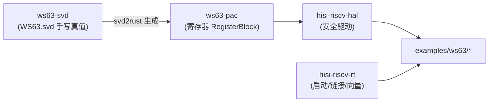

# ws63-svd 架构与评审

> 本文是 ws63-rs 架构文档的一部分。完整评审台账见 [架构评审 2026-05](https://github.com/hispark-rs/hisi-riscv-rs/blob/main/docs/review/architecture-review-2026-05.md)，整改排期见 [ROADMAP](https://github.com/hispark-rs/hisi-riscv-rs/blob/main/ROADMAP.md)。

## 职责与边界

`ws63-svd` 是整个 ws63-rs 寄存器抽象链的**上游真值（source of truth）**。它由一份手写的 CMSIS-SVD 描述文件 `WS63.svd` 加少量 Python 工具构成，负责：

- 用 CMSIS-SVD 1.3 schema 描述 WS63 SoC 的外设、寄存器、字段、枚举值与地址布局（`WS63.svd:2`，`schemaVersion="1.3"`）。
- 提供针对官方 CMSIS XSD 的格式校验脚本（`validate.py`）。
- 承载 svd2rust 目标配置（`ws63-settings.yaml`，RV32IMFC_Zicsr 等 RISC-V 目标参数）。
- **驱动可复现的 SVD→PAC 生成流水线**（`regen.sh` + `postprocess.py`，2026-05-31 起；见“关键设计/生成流水线”）。

它**不负责**：

- 托管 Rust 生成产物（产物 `lib.rs` 落在下游 `ws63-pac`；本组件提供并驱动生成流水线 `regen.sh`，产物归 PAC 仓）。
- 任何运行时逻辑或驱动语义（那是 `hisi-riscv-hal` 的职责）。
- 中断控制器的运行时模型（SVD 仅声明 `<interrupt>` 编号，控制器建模问题归 HAL/RT 层）。

寄存器定义来源为公开的 ws63-guide 文档与 fbb_ws63 HAL 头文件转录（`WS63.svd:5-7` 的 `<licenseText>`），属于手工建模而非厂商官方 SVD。

## 在依赖链中的位置

ws63-svd 处于链条最上游：`WS63.svd` 经 svd2rust 生成 `ws63-pac` 的 `lib.rs`，再由 `hisi-riscv-hal` 封装为安全驱动，最终被 `ws63-examples` 使用。`hisi-riscv-rt` 提供启动代码与链接脚本，是与上述生成链平行的独立分支。

**生成关系（2026-05-31 起可复现）**：`WS63.svd` 经 `regen.sh`（svd2rust 0.37.1 + 确定性后处理 + cargo fix/fmt）生成 `crates/pac/ws63-pac/src/lib.rs`，**幂等**（同 SVD → 字节一致产物），内建 build+clippy 门禁。SVD 与 PAC 之间已是可复现的生成关系，不再“人工对照”。

## 关键设计

### SVD 文件结构与建模质量

`WS63.svd` 约 1.07 万行（精确 10744 行）（`WS63.svd:1-10744`），device 头声明了 CPU 为 `other`、`fpuPresent=true`/`fpuDP=false`、`width/size=32`、`nvicPrioBits=3`（`WS63.svd:9-18`），description 中记录了 ISA `rv32i2p1_m2p0_f2p2_c2p0_zicsr2p0` 与 512KB ITCM / 288KB DTCM / 640KB 共享 SRAM 的内存规格（`WS63.svd:4`）。

建模规模与完整度（实测 2026-06-11）：

- **36 个 `<peripheral>` 元素**（`grep -c "<peripheral"`），覆盖 SYS_CTL1、IO_CONFIG、GPIO0/1/2、UART0/1/2、I2C0/1、PWM、DMA、SFC_CFG、SPI0/1、I2S、LSADC、TSENSOR、TIMER、WDT、RTC、EFUSE、SYS_CTL0、GLB_CTL_M、SPACC、PKE、KM、TRNG、TCXO、CLDO_CRG、SDMA、ULP_GPIO、RF_WB_CTL、SHARE_MEM_CTL、FAMA_REMAP。
- **501 个非派生 `<register>` 定义**（`grep -c "<register>"`；评审时为 497，本轮 eFuse/LSADC 修复 +4：eFuse 数据窗口 +1、LSADC 重写 +3；含 `derivedFrom` 展开后逻辑实例更多）。
- **920 个 `<field>`、44 处 `<enumeratedValues>`、36 个 `<addressBlock>`、2 处 `<writeConstraint>`、190 处 `read-only` 访问限定**。
- **8 处 `derivedFrom`** 复用。

UART/GPIO/KM 等外设建模质量较高：字段拆分、枚举值与访问属性齐全。例如 KM（Key Management，`WS63.svd:9410`，baseAddress `0x44112000`）对 KLAD 派生、keyslot 锁定、RKP 根密钥保护建模到了字段级（`KL_KEY_CFG` 的 `port_sel`/`key_enc`/`key_dec` 等，`flush_hmac_kslot_ind` 字段亦已建模）。

### 校验工具

`validate.py`（`validate.py:1-29`）从 ARM CMSIS_5 仓库下载 `CMSIS-SVD.xsd` 缓存到 `/tmp`，用 `xmlschema` 对 `WS63.svd` 做 XSD 校验，PASS/FAIL 返回码区分。依赖在 `pyproject.toml` 声明为 `xmlschema>=4.3.1`，由 `uv.lock` 锁定。这是目前唯一真实可用的工具。

### 生成流水线（regen.sh，可复现）

`regen.sh` + `postprocess.py`（2026-05-31）把 `WS63.svd` 可复现地生成为 `crates/pac/ws63-pac/src/lib.rs`，固定工具版本 `svd2rust@0.37.1` / `form@0.13.0`。五步：

1. `svd2rust -i WS63.svd --target riscv --settings ws63-settings.yaml`
2. `rustfmt`（svd2rust 原始输出未格式化，后续正则后处理依赖多行格式）
3. `postprocess.py` 两处确定性修补：删除 `dim` 重复生成的 5 个 TIMER 裸访问器（否则与索引访问器重复定义、编译失败）、`#[no_mangle]`→`#[unsafe(no_mangle)]`（edition 2024 硬错误）
4. `cargo fix` 自动套 `unsafe_op_in_unsafe_fn`（`rt`+`critical-section` 特性下 `Peripherals::steal()` 的 unsafe 包裹）
5. `cargo fmt`，随后 build + clippy 作为门禁

流水线**幂等**：同一 SVD 重跑产出字节一致的 lib.rs。`ws63-settings.yaml` 提供 svd2rust 目标设置（RV32IMFC_Zicsr、自定义中断控制器 SYS_CTL1 无标准 CLINT/PLIC、单 hart、240MHz）。`main.py` 仍是 uv 占位入口，实际生成走 `regen.sh`。主仓 PreToolUse hook 拦截对 `crates/pac/ws63-pac/src/lib.rs` 的手改，强制走重生成。

## 评审发现

### 优点

- 建模覆盖广：36 外设 / 497 寄存器，`enumeratedValues`、`derivedFrom`、`writeConstraint`、`addressBlock` 一应俱全，是一份结构完整、可被 svd2rust 直接消费的 1.3 版 SVD。
- 通过 `derivedFrom` 对同构外设（GPIO/UART/I2C/SPI/SDMA）做了正确复用，降低了维护面。
- 提供了针对官方 CMSIS XSD 的格式校验脚本，建模本身有质量门可依。
- UART/GPIO/KM 等关键外设建模到字段+枚举级，下游 HAL 可直接获得类型安全的位域访问。

### 问题

| 严重度 | 类别 | 问题 | 证据(file:line) | 状态 |
| --- | --- | --- | --- | --- |
| 高 | 维护性 | 手补代码曾被手工补进**已格式化的 PAC 生成代码**，而非回填 SVD 后重生成，clean regen 会丢失或冲突。 | 历史提交 df35d69「add missing KM keyslot registers」；该批字段在 `WS63.svd` KM 外设中存在但生成链曾未联动 | ✅ 已修(2026-05-31)：建立 `regen.sh`、停止手补；重生成时 PAC 反而**恢复**了手补遗漏的 KM keyslot 字段（`flush_hmac_kslot_ind`/`tscipher_ind`/`lock_cmd`/`key_slot_num`） |
| 中 | 维护性 | 无可复现生成流水线：`main.py` 是 `print(...)` 桩，无 svd2rust 调用；`ws63-settings.yaml` 在 `base_isa: rv32i` 截断；CI 中无 SVD 引用 | `main.py:1-6`；`ws63-settings.yaml`；`.github/workflows/` 无 SVD 引用 | ✅ 已修(2026-05-31)：`regen.sh`+`postprocess.py` 幂等可复现、build+clippy 门禁；CI 接入（“重生成并 diff”）为剩余小项 |
| 高 | 正确性 | eFuse/LSADC 外设建模错误：eFuse 控制寄存器偏移错位（0x00 段）、`wr_rd` 建成单 bit 而非 16 位魔数、缺 0x800 数据窗口；LSADC 寄存器整块错位（使能/启停/FIFO 寄存器选错） | 评审台账 + 本轮对照 `hal_efuse_v151`/`hal_adc_v154` | ✅ 已修(2026-05-31)：eFuse 控制块移到 base+0x30、16 位魔数、加 0x800 窗口；LSADC 重写为连续 `adc_regs_t`（CTRL_8/9/11、CFG_* @0xDC..0xEC）。偏移已在生成 PAC 中逐一核验 |
| 中 | 正确性 | 覆盖不全：KM 的 `*_FLUSH_BUSY` 状态寄存器（偏移 0xB10–0xB1C）缺失，KM 偏移从 `0x1B0C` 直接跳到 `0x1B30`，存在转录静默缺口 | `WS63.svd` KM 外设；addressOffset 序列断档；`grep FLUSH_BUSY` 无命中 | 已排期(ROADMAP 阶段 2)：`flush_hmac_kslot_ind` 字段已建模，但 BUSY 查询寄存器本身仍未补 |
| 低 | 文档 | `README.md` 为空文件（0 字节），组件无任何使用/维护说明 | `README.md`（0 bytes） | ✅ 已修：README 已补写（含 `regen.sh` 用法、流水线步骤、校验命令、维护约定） |

> 说明：本组件已从“几乎全部已排期”转为**四项中三项已修**（仅 KM `*_FLUSH_BUSY` 转录缺口待补）。这些都是静态对照 fbb_ws63 C SDK 的修复，eFuse/LSADC 驱动**仍未上板验证**（验证归 ROADMAP 阶段 1 门禁）。下游 `ws63-pac` 也已随 `regen.sh` 重生成。

## 改进项与排期

ws63-svd 的整改核心是把 SVD 重新确立为唯一真值。本轮（2026-05-31）已落地大部分：

1. ✅ **建立可复现生成流水线**（已完成）：`regen.sh`（svd2rust 0.37.1 + `postprocess.py` 后处理 + cargo fix/fmt）替代 `main.py` 桩，幂等、build+clippy 门禁。**剩余**：把"从 SVD 重生成并 diff"接入 CI；并加 `validate.py` XSD 校验门（脚本已就绪）。
2. ✅ **以 SVD 为源重生成 PAC**（已完成）：`regen.sh` 即唯一生成路径，手补 lib.rs 被 PreToolUse hook 拦截；重生成恢复了历史手补遗漏的 KM keyslot 字段，消除 SVD↔PAC 漂移。
3. ✅ **eFuse/LSADC 寄存器修复**（已完成）：对照 `hal_efuse_v151`/`hal_adc_v154` 改 SVD 并重生成（详见上表）。**剩余**：KM `*_FLUSH_BUSY`（0xB10–0xB1C）转录缺口仍待补；其它外设逐个对照 fbb_ws63 `*_reg.h` 核覆盖。
4. ✅ **补写 README**（已完成）：含 `regen.sh` 用法、五步流水线、校验命令与"勿手改 lib.rs"约定。

阶段编号参考：阶段 0 为构建完整性修复（2026-05-31 已完成）；阶段 1 为硬件在环 bring-up 与链接脚本集成；阶段 2 为本组件

## 相关架构

**BS2X SVD**: [`bs2x-svd`](https://github.com/hispark-rs/bs2x-svd) 强自前和永久性存搬，两份 SVD 准生政之不同厨特针 PAC。**probe-rs 调试**: hispark-rs fork 各和 RISC-V DM/CoreSight，待板级。**连接**: Wi-Fi 于剖地，BLE 是 blob。主要落点（本轮已完成上述大部分，KM 缺口 + CI 接入为剩余）。详见 [ROADMAP](https://github.com/hispark-rs/hisi-riscv-rs/blob/main/ROADMAP.md)。
