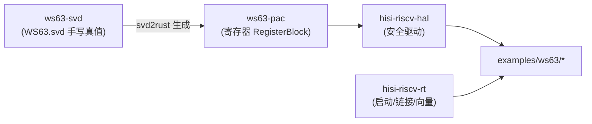

# ws63-svd 架构

> 本文是 ws63-rs 组件深入文档的一部分，聚焦当前架构、职责边界和设计原因。历史评审快照见 [组件评审快照](https://github.com/hispark-rs/hisi-riscv-rs/blob/main/docs/review/component-review-snapshots-2026-05.md)，当前优先级见 [ROADMAP](https://github.com/hispark-rs/hisi-riscv-rs/blob/main/ROADMAP.md)。

## 职责与边界

`ws63-svd` 是整个 ws63-rs 寄存器抽象链的**上游真值（source of truth）**。它由一份手写的 CMSIS-SVD 描述文件 `WS63.svd` 加少量 Python 工具构成，负责：

- 用 CMSIS-SVD 1.3 schema 描述 WS63 SoC 的外设、寄存器、字段、枚举值与地址布局（`WS63.svd:2`，`schemaVersion="1.3"`）。
- 提供针对官方 CMSIS XSD 的格式校验脚本（`validate.py`）。
- 承载 svd2rust 目标配置（`ws63-settings.yaml`，RV32IMFC_Zicsr 等 RISC-V 目标参数）。
- **驱动可复现的 SVD→PAC 生成流水线**（`regen.sh` + `postprocess.py`，2026-05-31 起；见“关键设计/生成流水线”）。

它**不负责**：

- 托管 Rust 生成产物（产物 `lib.rs` 落在下游 `ws63-pac`；本组件提供并驱动生成流水线 `regen.sh`，产物归 PAC 仓）。
- 任何运行时逻辑或驱动语义（那是 `hisi-riscv-hal` 的职责）。
- 中断控制器的运行时模型（SVD 仅声明 `<interrupt>` 编号，控制器建模问题归 HAL/RT 层）。

寄存器定义来源为公开的 ws63-guide 文档与 fbb_ws63 HAL 头文件转录（`WS63.svd:5-7` 的 `<licenseText>`），属于手工建模而非厂商官方 SVD。

## 在依赖链中的位置

```mermaid
flowchart LR
    SVD["ws63-svd<br/>(WS63.svd 手写真值)"] -->|svd2rust 生成| PAC["ws63-pac<br/>(寄存器 RegisterBlock)"]
    PAC --> HAL["hisi-riscv-hal<br/>(安全驱动)"]
    HAL --> EX["examples/ws63/*"]
    RT["hisi-riscv-rt<br/>(启动/链接/向量)"] --> EX
```

ws63-svd 处于链条最上游：`WS63.svd` 经 svd2rust 生成 `ws63-pac` 的 `lib.rs`，再由 `hisi-riscv-hal` 封装为安全驱动，最终被 `ws63-examples` 使用。`hisi-riscv-rt` 提供启动代码与链接脚本，是与上述生成链平行的独立分支。

**生成关系（2026-05-31 起可复现）**：`WS63.svd` 经 `regen.sh`（svd2rust 0.37.1 + 确定性后处理 + cargo fix/fmt）生成 `crates/pac/ws63-pac/src/lib.rs`，**幂等**（同 SVD → 字节一致产物），内建 build+clippy 门禁。SVD 与 PAC 之间已是可复现的生成关系，不再“人工对照”。

## 关键设计

### SVD 文件结构与建模质量

`WS63.svd` 约 1.07 万行（精确 10744 行）（`WS63.svd:1-10744`），device 头声明了 CPU 为 `other`、`fpuPresent=true`/`fpuDP=false`、`width/size=32`、`nvicPrioBits=3`（`WS63.svd:9-18`），description 中记录了 ISA `rv32i2p1_m2p0_f2p2_c2p0_zicsr2p0` 与 512KB ITCM / 288KB DTCM / 640KB 共享 SRAM 的内存规格（`WS63.svd:4`）。

建模规模与完整度（实测 2026-06-11）：

- **36 个 `<peripheral>` 元素**（`grep -c "<peripheral"`），覆盖 SYS_CTL1、IO_CONFIG、GPIO0/1/2、UART0/1/2、I2C0/1、PWM、DMA、SFC_CFG、SPI0/1、I2S、LSADC、TSENSOR、TIMER、WDT、RTC、EFUSE、SYS_CTL0、GLB_CTL_M、SPACC、PKE、KM、TRNG、TCXO、CLDO_CRG、SDMA、ULP_GPIO、RF_WB_CTL、SHARE_MEM_CTL、FAMA_REMAP。
- **501 个非派生 `<register>` 定义**（`grep -c "<register>"`；评审时为 497，本轮 eFuse/LSADC 修复 +4：eFuse 数据窗口 +1、LSADC 重写 +3；含 `derivedFrom` 展开后逻辑实例更多）。
- **920 个 `<field>`、44 处 `<enumeratedValues>`、36 个 `<addressBlock>`、2 处 `<writeConstraint>`、190 处 `read-only` 访问限定**。
- **8 处 `derivedFrom`** 复用。

UART/GPIO/KM 等外设建模质量较高：字段拆分、枚举值与访问属性齐全。例如 KM（Key Management，`WS63.svd:9410`，baseAddress `0x44112000`）对 KLAD 派生、keyslot 锁定、RKP 根密钥保护建模到了字段级（`KL_KEY_CFG` 的 `port_sel`/`key_enc`/`key_dec` 等，`flush_hmac_kslot_ind` 字段亦已建模）。

### 校验工具

`validate.py`（`validate.py:1-29`）从 ARM CMSIS_5 仓库下载 `CMSIS-SVD.xsd` 缓存到 `/tmp`，用 `xmlschema` 对 `WS63.svd` 做 XSD 校验，PASS/FAIL 返回码区分。依赖在 `pyproject.toml` 声明为 `xmlschema>=4.3.1`，由 `uv.lock` 锁定。这是目前唯一真实可用的工具。

### 生成流水线（regen.sh，可复现）

`regen.sh` + `postprocess.py`（2026-05-31）把 `WS63.svd` 可复现地生成为 `crates/pac/ws63-pac/src/lib.rs`，固定工具版本 `svd2rust@0.37.1` / `form@0.13.0`。五步：

1. `svd2rust -i WS63.svd --target riscv --settings ws63-settings.yaml`
2. `rustfmt`（svd2rust 原始输出未格式化，后续正则后处理依赖多行格式）
3. `postprocess.py` 两处确定性修补：删除 `dim` 重复生成的 5 个 TIMER 裸访问器（否则与索引访问器重复定义、编译失败）、`#[no_mangle]`→`#[unsafe(no_mangle)]`（edition 2024 硬错误）
4. `cargo fix` 自动套 `unsafe_op_in_unsafe_fn`（`rt`+`critical-section` 特性下 `Peripherals::steal()` 的 unsafe 包裹）
5. `cargo fmt`，随后 build + clippy 作为门禁

流水线**幂等**：同一 SVD 重跑产出字节一致的 lib.rs。`ws63-settings.yaml` 提供 svd2rust 目标设置（RV32IMFC_Zicsr、自定义中断控制器 SYS_CTL1 无标准 CLINT/PLIC、单 hart、240MHz）。`main.py` 仍是 uv 占位入口，实际生成走 `regen.sh`。主仓 PreToolUse hook 拦截对 `crates/pac/ws63-pac/src/lib.rs` 的手改，强制走重生成。

## 历史评审

本文只保留当前架构解释。2026-05 的逐项评审快照已归档到 [组件评审快照](https://github.com/hispark-rs/hisi-riscv-rs/blob/main/docs/review/component-review-snapshots-2026-05.md)，当前优先级以根目录 [ROADMAP](https://github.com/hispark-rs/hisi-riscv-rs/blob/main/ROADMAP.md) 和对应 reference 页面为准。

## 相关架构

**BS2X SVD**：[`bs2x-svd`](https://github.com/hispark-rs/bs2x-svd) 与 `bs2x-pac` 是 BS2X 路径的寄存器事实源；WS63 与 BS2X 的 SVD/PAC 分仓维护，避免把两个芯片族的寄存器事实混成一份。

**不属于 SVD 的事实源**：probe-rs 调试支持、镜像格式、Wi-Fi/BT/BLE/SLE 连接性状态分别由 probe-rs / `hisi-fwpkg` / RF porting 文档和根 [ROADMAP](https://github.com/hispark-rs/hisi-riscv-rs/blob/main/ROADMAP.md) 维护；本页只解释 WS63 SVD 的建模与生成流水线。
